## Details
### You will learn
  - How to view and test Hyperledger Fabric chaincode API
  - How to access and use the Swagger UI

---

[ACCORDION-BEGIN [Step 1: ](Understand how Applications are Bound to Channels)]

Based on the YAML interface that describes the different chaincode functions, it is possible for the gateway to support a HTTP REST API between the chaincode and the application:

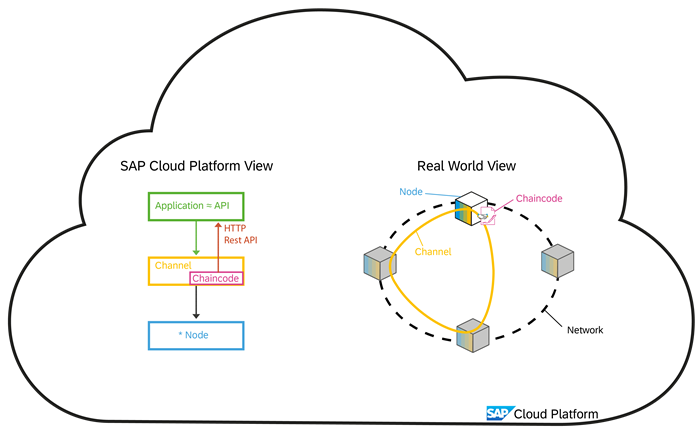

By default, the application is bound to the channel instance, and via the binding have access to the authentication information (in the Cloud Foundry environment) to access the HTTP interface. The alternative is to explicitly create a service key.

In addition, based on the YAML interface, it is possible to generate a Swagger UI that can used to describe and test the different HTTP REST API calls. This Swagger is effectively the proxy for the application. As the Swagger UI is not directly bound to the channel instance, it requires its own service key to have the relevant authentication information to access the HTTP REST API.

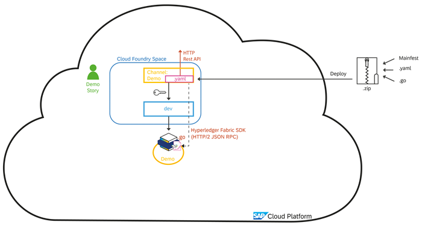

As the final step in the "Hello World" example, we start the Swagger UI, where implicitly a service key is created and passed into the Swagger UI automatically. We authenticate the Swagger UI against the HTTP REST API and can then test the API. Afterwards, any blockchain commits can be viewed with the explorer in the channel dashboard.

[DONE]
[ACCORDION-END]

[ACCORDION-BEGIN [Step 2: ](Access Swagger UI)]

Once on the chaincode area of your channel service instance, locate your chaincode and click the **Test Chaincode** icon.

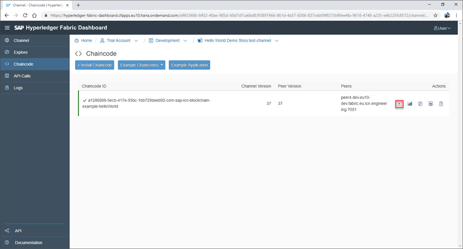

This opens the Swagger UI.

>The first time you access this UI, a service key is automatically created by the Hyperledger Fabric service, granting you OAuth access to the API. This includes the creation of your `client_ID` and `client_secret` values, used in the following step.

[DONE]
[ACCORDION-END]

[ACCORDION-BEGIN [Step 3: ](Authorize Access to Chaincode)]

With the Swagger UI open, click **Authorize**.

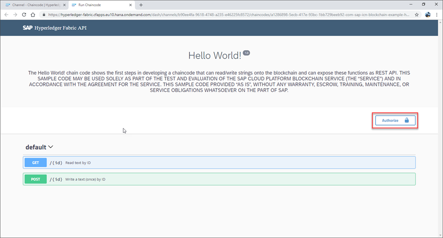

Confirm your `client_ID` and `client_secret`, and click **Authorize** again.

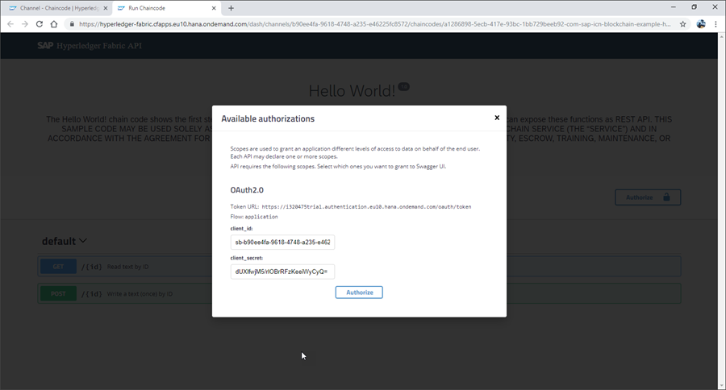

The Swagger UI is now authorized (shown as a closed padlock on the UI), giving you GET and POST access to your chaincode.

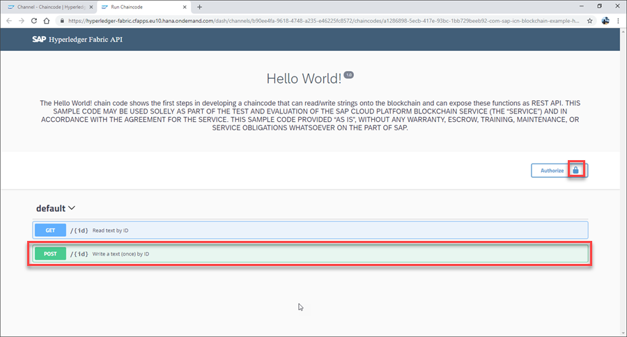

[VALIDATE_1]
[ACCORDION-END]

[ACCORDION-BEGIN [Step 4: ](Invoke a Transaction on Chaincode)]

Once authorized, click and open **POST** and then click **Try It Out**. This allows you to invoke a transaction on your chaincode:

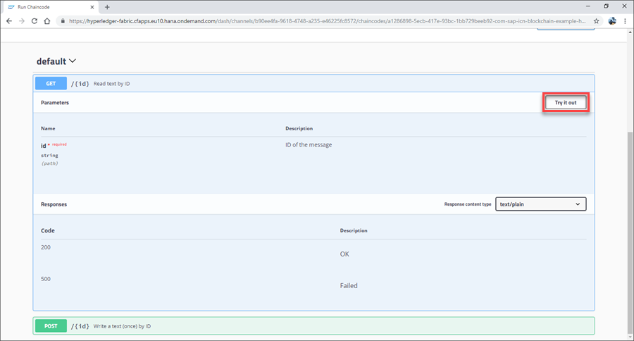

Enter the following here:

Field | Value
-----|------
**id** | `id001`
**text** | `Hello World!`

Click **Execute**.

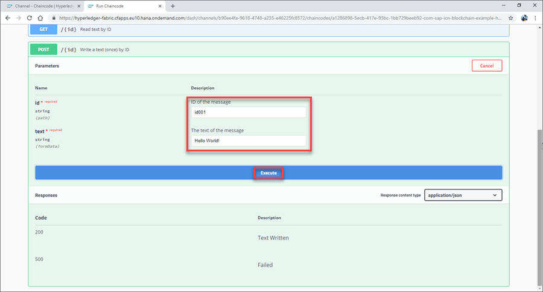

The transaction will now be invoked on the chaincode, with a 200 status code displayed.

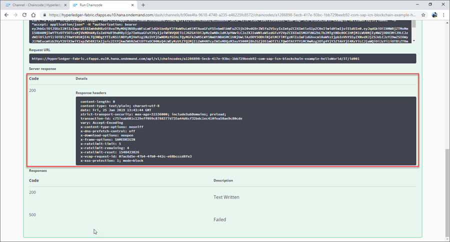

[DONE]
[ACCORDION-END]

[ACCORDION-BEGIN [Step 5: ](Call the Chaincode)]

You can now call the chaincode using the same ID. Click **GET** and then click **Try It Out**. This allows you to call the chaincode.

Enter your ID and then click **Execute**.

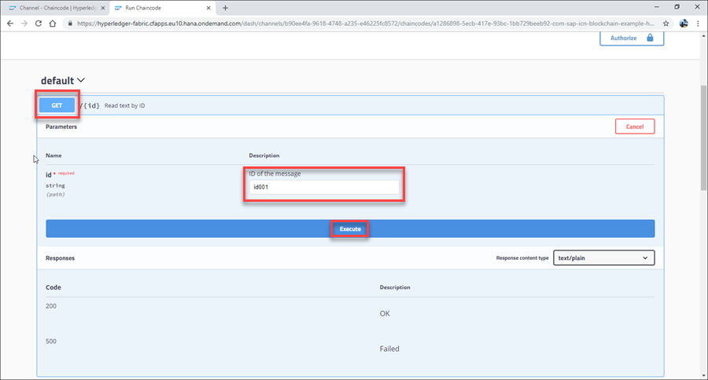

The chaincode is now called and returns the response `Hello World!`, an indication that your test was successful.

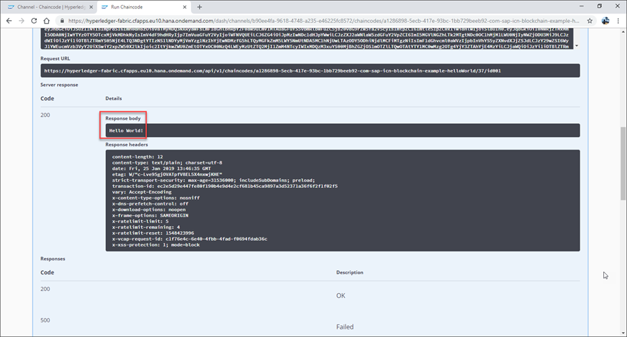

[DONE]
[ACCORDION-END]

[ACCORDION-BEGIN [Step 6: ](Explore the Chaincode)]

After successfully calling your chaincode, you can make use of the **Explore** area provided with your channel service instance.

To access this from your channel service instance dashboard, click **Explore** on the side menu.

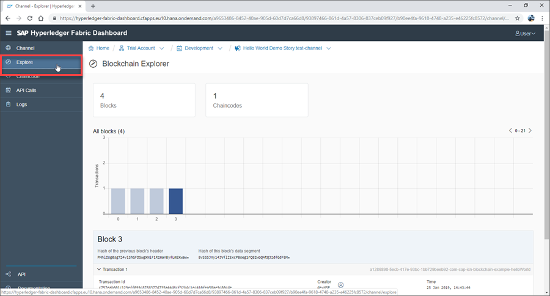

Once in the **Explore** area, click the third transaction block to your recent invoke.

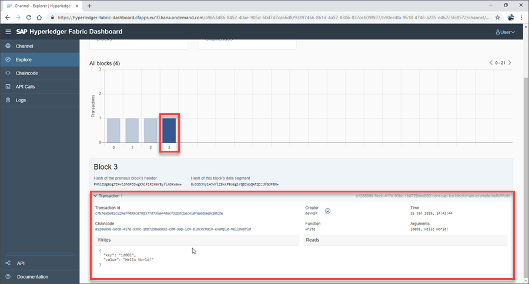

[VALIDATE_2]

Here you can see both your ID and text (`Hello World!`) has been successfully written to the blockchain, completing our `Hello World` example.

[ACCORDION-END]
