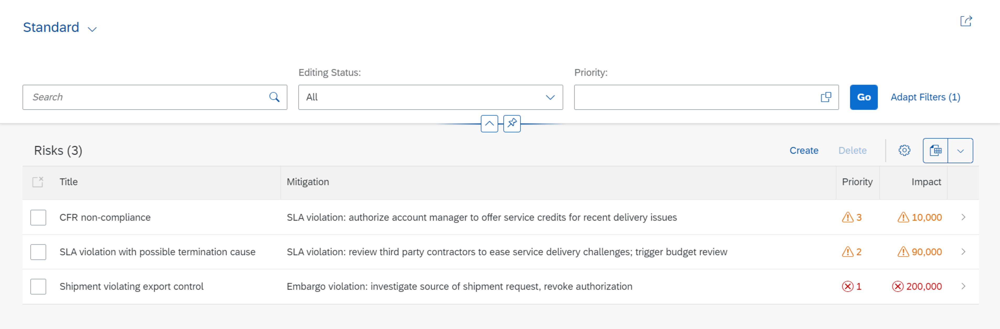

## Prerequisites
 - [Set Up Local Development using VS Code](btp-app-set-up-local-development)
 - [Create a Directory for Development](btp-app-create-directory)
 - [Create a CAP-Based Application](btp-app-create-cap-application)
 - [Create an SAP Fiori Elements-Based UI](btp-app-create-ui-fiori-elements)

## Details
### You will learn
 - How to add custom code to your application


To continue with this tutorial you can find the result of the previous tutorial in the [`cap/fiori-elements-app`](https://github.com/SAP-samples/cloud-cap-risk-management/tree/cap/fiori-elements-app) branch.

---

[ACCORDION-BEGIN [Step 1: ](Add custom code)]

In this tutorial, you add some custom code to the CAP application. Depending on the value of the property `impact`, the custom code changes the value of the property `criticality`. This property is used in OData annotations to control the color of some of the cells in the table of our work list page.

1. Copy the file `risk-service.js` from `templates/cap/business-logic/srv` to the `srv` folder of your app.

2. In your browser, reload the page of the SAP Fiori elements app.

    It now shows our work list with the columns `Priority` and `Impact` with color and an icon, depending on the amount in `Impact`.

    !

[DONE]
[ACCORDION-END]
---
[ACCORDION-BEGIN [Step 2: ](Explanation of the custom code)]

<!-- cpes-file srv/risk-service.js -->
```JavaScript
const cds = require('@sap/cds')
/**
 * Implementation for Risk Management service defined in ./risk-service.cds
 */
module.exports = cds.service.impl(async function() {
    this.after('READ', 'Risks', risksData => {
        const risks = Array.isArray(risksData) ? risksData : [risksData];
        risks.forEach(risk => {
            if (risk.impact >= 100000) {
                risk.criticality = 1;
            } else {
                risk.criticality = 2;
            }
        });
    });
});
```

Because your file is called `risk-service.js` and, therefore, has the same name as your application definition file `risk-service.cds`, CAP automatically treats it as a handler file for the application defined in there. CAP exposes several [events](https://cap.cloud.sap/docs/node.js/requests) and you can easily write handlers like the above.

In this case, the event `after` is triggered after a `READ` was carried out for our `Risks` entity. In your custom handler, you get all the data (in this case, all the risks) that was read according to the query. You can loop over each of them and, if needed, adjust the data of the response. In this case, you change the value of the `criticality` when the `impact` is bigger than 100000. The new values for `criticality` are then part of the response to the read request.

So, this affects the application's response, but how does it translate into a changed UI? For this, you have got to go back to the annotations you created in [Create a CAP-Based Application](btp-app-create-cap-application) where you find your `srv/risks-service-ui.cds` file. There, you had the two columns `prio` and `impact` annotated with an additional `Criticality` annotation. This annotation points to the `criticality` property of your application.

> `Criticality` with an upper case `C` is the annotation, while the property name `criticality` could also be called different opposed to the annotation.

As you now set different values in your custom handler for `criticality`, the SAP Fiori elements app translates them into icons and colors, which you can see in the UI.

```JavaScript
annotate RiskService.Risks with @(
    UI: {
        ...
        ...
        LineItem: [
            ...
            ...
            {
                Value: prio,
                Criticality: criticality
            },
            {
                Value: impact,
                Criticality: criticality
            }
        ],
```

You can find more about the possible values of the `Criticality` annotation in section [UI Vocabulary](https://github.com/SAP/odata-vocabularies/blob/master/vocabularies/UI.md#CriticalityType). This, however, is just one of the many sections of the [OData annotation vocabularies for UI](https://github.com/SAP/odata-vocabularies/blob/master/vocabularies/UI.md) and [Common](https://github.com/SAP/odata-vocabularies/blob/master/vocabularies/Common.md) usage.

[VALIDATE_1]


The result of this tutorial can be found in the [`cap/business-logic`](https://github.com/SAP-samples/cloud-cap-risk-management/tree/cap/business-logic) branch.

[ACCORDION-END]
---