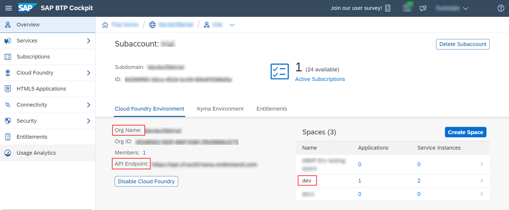
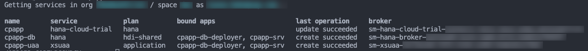
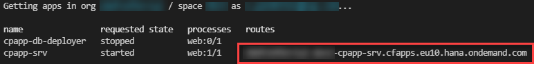
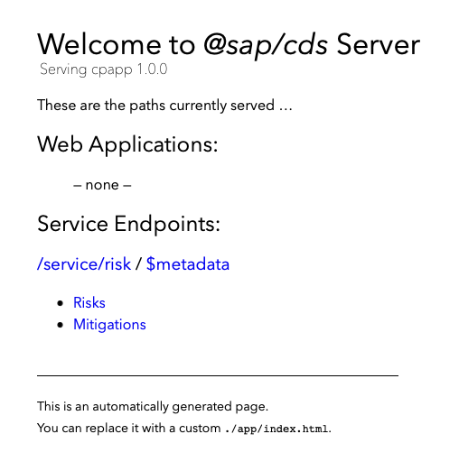
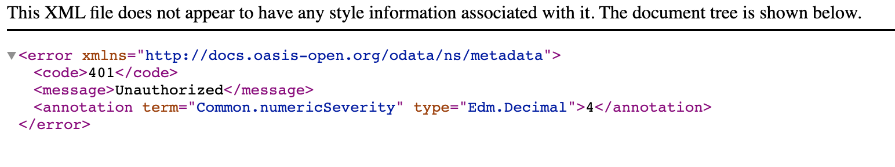

## Prerequisites
 - [Prepare User Authentication and Authorization (XSUAA) Setup](btp-app-prepare-xsuaa)


## Details
### You will learn
 - How to install the required tools
 - How to generate the MTA Deployment Descriptor (mta.yml)
 - How to add Authorization and Trust Management Service (XSUAA)
 - How to deploy your application as Multi-Target Application (MTA) to SAP BTP, Cloud Foundry runtime

---

[ACCORDION-BEGIN [Step 1: ](Install the MTA build tool mbt)]
As a result of this tutorial, you have a running CAP application in the cloud based on SAP HANA. You will deploy the user interface later in the tutorial [Prepare SAP Build Work Zone, Standard Edition Setup](btp-app-work-zone-setup).

The deployment is based on MTA (*Multi-Target Application*, sometimes also called *MultiApps*) technology. The [MTA](https://help.sap.com/viewer/65de2977205c403bbc107264b8eccf4b/Cloud/en-US/d04fc0e2ad894545aebfd7126384307c.html) is a SAP-proprietary way to do deployments consisting of multiple modules that can be implemented in different technologies.

> Advantages compared to the `cf push` method:

> * A build tool
> * Automatically created service instances
> * Service keys
> * Destinations
> * Content deployment (HTML5, workflow, ...)
> * Blue-green deployment

1. Check if you have already installed the [Cloud MTA Build Tool (MBT)](https://sap.github.io/cloud-mta-build-tool/):

    ```Shell/Bash
    mbt --version
    ```

2. If you don't get back a version number, install the **MultiApps Archive Builder**:

    ```Shell/Bash
    npm install --global mbt
    ```

> If you encounter a problem with the installation of the MBT, install it manually by following the instructions in the [MBT documentation](https://sap.github.io/cloud-mta-build-tool/download/).


[VALIDATE_1]
[ACCORDION-END]
---
[ACCORDION-BEGIN [Step 2: ]((For Windows) Install make tool)]
> ### To earn your badge for the whole mission, you will need to mark all steps in a tutorial as done, including any optional ones that you may have skipped because they are not relevant for you.

The `make` tool is required by the `mbt` tool. Linux and macOS are already shipped with `make`. For Windows you can download it from the GNU Make site:

1. Go to <http://gnuwin32.sourceforge.net/packages/make.htm>.
2. Choose the download with the description **Complete package, except sources**.
3. Run the installer.
4. Enter **Edit the System Environment Variables** in the Windows search box (Windows icon in the task bar). The **System Properties** dialog is opened.
5. Choose **Environment Variables...**.
6. Choose your `Path` environment variable under *User Variables for `<your_user_name>`* and choose **Edit**.
7. Choose **Browse** and navigate to *GNU make* (usually `C:\Program Files (x86)\GnuWin32\bin`).
8. Choose **OK** to add *GNU make* to your `Path` environment variable.
9. Restart VS Code to make the change effective.

[DONE]
[ACCORDION-END]
---
[ACCORDION-BEGIN [Step 3: ](Install the MultiApps Cloud Foundry CLI plugin)]
[OPTION BEGIN [Trial]]

The [MultiApps plugin](https://github.com/cloudfoundry-incubator/multiapps-cli-plugin/blob/master/README.md) is required to deploy an MTA archive. It needs to be available in your Cloud Foundry landscape's Cloud Foundry plugin repository. Therefore, you need to log on to your Cloud Foundry landscape.


If you don't know whether you are logged on to Cloud Foundry or if you are wondering to which Cloud Foundry org and space are you logged on, you can always use `cf target` in a command line window to find out. If you aren't logged on already, go to your SAP BTP cockpit by using one of the following links, depending on the landscape you want to deploy to:

[https://cockpit.hanatrial.ondemand.com/](https://cockpit.hanatrial.ondemand.com/)

> Make sure you've installed the Cloud Foundry CLI (as described in [Step 6: Install the Cloud Foundry command line interface](btp-app-#install-the-cloud-foundry-command-line-interface)) before proceeding with the steps below.


1. Enter your **Global Account**. If you are using a trial account, choose **Go To Your Trial Account**.

2. Choose **Account Explorer**.

3. In the **Subaccounts** tab, choose the subaccount to which you want to deploy your service and application.

    !

2. On the subaccount page, gather all the data to log in to Cloud Foundry (CF).

    - `API Endpoint`
    - `Org Name`
    - `Space Name`

    !


3. Open a command line window.

4. Set the Cloud Foundry API endpoint.

    ```Shell/Bash
    cf api <API Endpoint of your landscape>
    ```

5. Log in to your Cloud Foundry account, using your SAP BTP credentials.

    ```Shell/Bash
    cf login
    ```


6. Check if the `multiapps` plugin is already installed:

    ```Shell/Bash
    cf plugins
    ```

7. If the `multiapps` plugin isn't installed, install it now:

    ```Shell/Bash
    cf install-plugin multiapps
    ```

    If the installation fails, do it manually as described in the [MultiApps CF CLI Plugin](https://github.com/cloudfoundry-incubator/multiapps-cli-plugin#manual-installation) documentation.
[OPTION END]
[OPTION BEGIN [Live]]

The [MultiApps plugin](https://github.com/cloudfoundry-incubator/multiapps-cli-plugin/blob/master/README.md) is required to deploy an MTA archive. It needs to be available in your Cloud Foundry landscape's Cloud Foundry plugin repository. Therefore, you need to log on to your Cloud Foundry landscape.


If you don't know whether you are logged on to Cloud Foundry or if you are wondering to which Cloud Foundry org and space are you logged on, you can always use `cf target` in a command line window to find out. If you aren't logged on already, go to your SAP BTP cockpit by using one of the following links, depending on the landscape you want to deploy to:

[https://account.hana.ondemand.com/](https://account.hana.ondemand.com/)


> Make sure you've installed the Cloud Foundry CLI (as described in [Step 6: Install the Cloud Foundry command line interface](btp-app-#install-the-cloud-foundry-command-line-interface)) before proceeding with the steps below.


1. Enter your **Global Account**. If you are using a trial account, choose **Go To Your Trial Account**.

2. Choose **Account Explorer**.

3. In the **Subaccounts** tab, choose the subaccount to which you want to deploy your service and application.

    !

2. On the subaccount page, gather all the data to log in to Cloud Foundry (CF).

    - `API Endpoint`
    - `Org Name`
    - `Space Name`

    !


3. Open a command line window.

4. Set the Cloud Foundry API endpoint.

    ```Shell/Bash
    cf api <API Endpoint of your landscape>
    ```

5. Log in to your Cloud Foundry account, using your SAP BTP credentials.

    ```Shell/Bash
    cf login
    ```


6. Check if the `multiapps` plugin is already installed:

    ```Shell/Bash
    cf plugins
    ```

7. If the `multiapps` plugin isn't installed, install it now:

    ```Shell/Bash
    cf install-plugin multiapps
    ```

    If the installation fails, do it manually as described in the [MultiApps CF CLI Plugin](https://github.com/cloudfoundry-incubator/multiapps-cli-plugin#manual-installation) documentation.
[OPTION END]


[DONE]
[ACCORDION-END]
---
[ACCORDION-BEGIN [Step 4: ](Declare required Node.js version)]
When you run your CAP application, your locally installed Node.js version is used. Cloud Foundry supports multiple Node.js major versions (like 14 and 16) and usually uses the lowest available by default. Therefore, it is important to declare which Node.js version should be used.

> Node.js v16 is sufficient for this tutorial.

Open the file `package.json` and add the following snippet:

<!-- snippet package.json engines -->
```JSON[6-9]
{
  ...
  "devDependencies": {
    ...
  },
  "engines": {
    "node": "^16"
  },
```

[DONE]
[ACCORDION-END]
---
[ACCORDION-BEGIN [Step 5: ](Generate MTA deployment descriptor (mta.yaml))]
The MTA deployment is described in the MTA Deployment Descriptor, a file called  `mta.yaml`.
As the first step, you let the CAP server generate an initial `mta.yaml` file.

Run the following command from the project root folder:

```Shell/Bash
cds add mta
```

The file is generated based on your previously created settings in the `package.json` file.

The `mta.yaml` file consists of different modules (Cloud Foundry apps) and resources (Cloud Foundry services).

*modules:*

* `cpapp-srv` - OData service
* `cpapp-db-deployer` - Deploy CAP schema and data (CSV files) to database

*resources:*

The resources are generated from the `requires` section of `cds` in the `package.json`.

* `cpapp-db` - SAP HANA DB HDMI container
* `cpapp-auth` - XSUAA service

The resources are Cloud Foundry service instances that are automatically created and updated during the MTA deployment.

> Additional Documentation:

> [Assigning Role Collections](https://help.sap.com/viewer/65de2977205c403bbc107264b8eccf4b/Cloud/en-US/9e1bf57130ef466e8017eab298b40e5e.html) in SAP BTP documentation

[DONE]
[ACCORDION-END]
---
[ACCORDION-BEGIN [Step 6: ](Exclude CSV files from deployment)]
In one of the first steps creating the CAP application, you have added two CSV files with test data. These files are required to pre-fill local testing with the SQLite memory. Without the files, the database would be empty after each restart.

> Test files should never be deployed to an SAP HANA database as table data.

>  This can cause the deletion of all files of the affected database table with a change of a data file, even if the data file for the affected table has been removed before. SAP HANA remembers all data files that have ever been deployed to the table and might restore it. Only data files that contain data, which are defined by the application developer and can't be changed by the application should be delivered in this way. Delivering files for tables with customer data already caused data loss in productive scenarios! See section [Providing Initial Data](https://cap.cloud.sap/docs/guides/databases#providing-initial-data) in the CAP documentation for more details.

You change the MTA build parameters to:

- install all the dependencies with production profiles.
- remove all the DB data (`CSV` files and the `hdbtabledata`) that is generated by the CAP server out of the `CSV` files.

Add the following line to the `mta.yaml` file:

<!-- snippet mta.yaml build-parameters -->
```YAML[5,7]
build-parameters:
  before-all:
   - builder: custom
     commands:
      - npm install --production
      - npx -p @sap/cds-dk cds build --production
      - npx rimraf gen/db/src/gen/data
```

[DONE]
[ACCORDION-END]
---
[ACCORDION-BEGIN [Step 7: ](Add Authorization and Trust Management service (XSUAA))]
The next step is to add the Authorization and Trust Management service to `mta.yaml` to allow user login, authorization, and authentication checks. Update the name (from `cpapp-auth` to `cpapp-uaa`) and resource as shown.

<!-- snippet mta.yaml resources: cpapp-uaa -->
```YAML[6,9,18-27]
modules:
      - name: cpapp-srv
      ...
      requires:
        - name: cpapp-db
        - name: cpapp-uaa
resources:
   ...
 - name: cpapp-uaa
   type: org.cloudfoundry.managed-service
   parameters:
     service: xsuaa
     service-plan: application
     path: ./xs-security.json
     config:
       xsappname: cpapp-${space}    #  name + space dependency
       tenant-mode: dedicated
       role-collections:
         - name: 'RiskManager-${space}'
           description: Manage Risks
           role-template-references:
             - $XSAPPNAME.RiskManager
         - name: 'RiskViewer-${space}'
           description: View Risks
           role-template-references:
             - $XSAPPNAME.RiskViewer
```

For a productive application, the configuration for XSUAA is read from the `xs-security.json` file. You've already created this file in the tutorial [Prepare User Authentication and Authorization (XSUAA) Setup](btp-app-prepare-xsuaa). 

However, the XSUAA configuration that is read from the`xs-security.json` file can be overwritten in the `config` element of the `mta.yaml` file. For example, in the snippet above, a space-dependent value `cpapp-${space}` overwrites the value `xsappname`. Note that the name has to be unique within a subaccount. Within the scope of this tutorial, this approach allows multiple deployments in different spaces of the same subaccount. This way, different people of a team can try the tutorial without creating a new subaccount for each team member.

Further, you can add role collections using the `xs-security.json` file. Since role collections need to be unique in a subaccount like the `xsappname`, you can add it here and use the `${space}` variable to make them unique like for the `xsappname`.

Alternatively, role collections can be manually assigned in the SAP BTP cockpit.

> Additional Documentation:

> [Assigning Role Collections](https://help.sap.com/viewer/65de2977205c403bbc107264b8eccf4b/Cloud/en-US/9e1bf57130ef466e8017eab298b40e5e.html) in SAP BTP documentation

[DONE]
[ACCORDION-END]
---
[ACCORDION-BEGIN [Step 8: ](Build, deploy, and test mtar file)]
> `NPM` uses a file called `package-lock.json` to remember which actual version of package was installed and later installs these exact versions and ignores any updates in minor releases not explicitly specified in the `package.json` file. Maintaining this is important for production applications for consistency. For the purposes of this tutorial, use the latest versions of the packages. To ensure this, delete your older `package-lock.json` and run `npm install --package-lock-only` to generate it again to avoid errors due to use of older versions.

1. Build the MTA module from your project root folder:

    ```Shell/Bash
    mbt build -t ./
    ```

    This creates a `mtar` file `cpapp_1.0.0.mtar` in the current folder (option: `-t ./`).

    > In case you get the error `On Windows, this driver only supports the x64 architecture. You node process is: ia32`, check if you have installed the right version of Node.js for your operating system.

2. Deploy the module to your current Cloud Foundry space:

    ```Shell/Bash
    cf deploy cpapp_1.0.0.mtar
    ```
    > Your SAP HANA Cloud service instance will be automatically stopped overnight, according to the server region time zone. That means you need to restart your instance every day before you start working with it.

3. The deployment can take some minutes. After successful deployment, check if all the services have been created:

    ```Shell/Bash
    cf services
    ```

    You should see the following services in your space:

    

4. Check if the apps are running:

    ```Shell/Bash
    cf apps
    ```

    

    > You can also deploy a single module using `-m <module-name>` command line parameter.


5. Enter the route displayed for `cpapp-srv` in your browser.

    

    You see the CAP start page, like this:

    !

6. When you choose the **Mitigation** or **Risk** service entity, you will see an error message:

    !

The service expects a so called `JWT` (JSON Web Token) in the HTTP `Authorization` header that contains the required authentication and authorization information to access the service. In the next tutorial, you will deploy the SAP Fiori UIs, so that you can access your UIs from SAP Build Work Zone, standard edition. The SAP Build Work Zone, standard edition will trigger the authentication flow to provide the required token to access the service.

[DONE]
The result of this tutorial can be found in the [`cap-mta-deployment`](https://github.com/SAP-samples/cloud-cap-risk-management/tree/cap-mta-deployment) branch.


[ACCORDION-END]
---