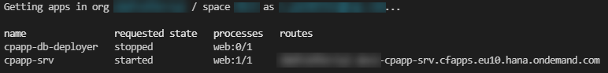

## Prerequisites
 - [Prepare User Authentication and Authorization (XSUAA) Setup](btp-app-prepare-xsuaa)

## Details
### You will learn
 - How to install the required tools
 - How to generate the MTA Deployment Descriptor (mta.yml)
 - How to add Authorization and Trust Management Service (XSUAA)
 - How to deploy your application as Multi-Target Application (MTA) to SAP BTP, Cloud Foundry runtime

As a result of this tutorial, you have a running CAP application in the cloud based on SAP HANA. You will deploy the user interface in the tutorial [Add the SAP Launchpad Service](btp-app-launchpad-service).

The deployment is based on MTA ( *Multi-Target Application*, sometimes also called *MultiApps*) technology. The MTA is a SAP-proprietary way to do deployments consisting of multiple modules that can be implemented in different technologies.

> _Advantages compared to the `cf push` method:_

> * A build tool
> * Automatically created service instances
> * Service keys
> * Destinations
> * Content deployment (HTML5, workflow, ...)
> * Blue-green deployment

### See Also
 - [Multi-target Applications in the Cloud Foundry Environment](https://help.sap.com/viewer/65de2977205c403bbc107264b8eccf4b/Cloud/en-US/d04fc0e2ad894545aebfd7126384307c.html)
 - [Create the Multi-target Application (MTA) Description Files](https://help.sap.com/viewer/4505d0bdaf4948449b7f7379d24d0f0d/latest/en-US/ebb42efc880c4276a5f2294063fae0c3.html)

To continue with this tutorial you can find the result of the previous tutorial in the [`deployment/mta-generated`](https://github.com/SAP-samples/cloud-cap-risk-management/tree/deployment/mta-generated) branch.

---

[ACCORDION-BEGIN [Step 1: ](Install the MTA Build Tool mbt)]

1. Check if you have already installed the [Cloud MTA Build Tool (MBT)](https://sap.github.io/cloud-mta-build-tool/):

    ```bash
    mbt --version
    ```

2. If you don't get back a version number, install the **MultiApps Archive Builder**:

    ```bash
    npm install -g mbt
    ```

[VALIDATE_1]

[ACCORDION-END]
[ACCORDION-BEGIN [Step 2: ]((For Windows users only): Install make Tool)]

> _Linux and macOS are already shipped with `make`. This is only relevant for Windows users._

The `make` tool is required by the `mbt` tool. You can download it from the GNU Make site:

1. Go to <http://gnuwin32.sourceforge.net/packages/make.htm>.
2. Choose the download with the description **Complete package, except sources**.
3. Run the installer.
4. Enter **Edit the System Environment Variables** in the Windows search box (Windows icon in the task bar). The **System Properties** dialog is opened.
5. Choose **Environment Variables...**.
6. Choose your `Path` environment variable under *User Variables for `<your_user_name>`* and choose **Edit**.
7. Choose **Browse** and navigate to *GNU make* (usually `C:\Program Files (x86)\GnuWin32\bin`).
8. Click **OK** to add *GNU make* to your `Path` environment variable.
9. Restart VS Code to make the change effective.

[DONE]
[ACCORDION-END]
[ACCORDION-BEGIN [Step 3: ](Install the MultiApps Cloud Foundry CLI Plugin)]

[OPTION BEGIN [Trial]]

The [MultiApps plugin](https://github.com/cloudfoundry-incubator/multiapps-cli-plugin/blob/master/README.md) is required to deploy an MTA archive. It needs to be available in your Cloud Foundry landscape's Cloud Foundry plugin repository. Therefore, you need to log on to your Cloud Foundry landscape.


If you don't know whether you're logged on to Cloud Foundry or if you're wondering to which Cloud Foundry org and space are you logged on, you can always use `cf target` in a terminal to find out. If you aren't logged on already, go to your SAP BTP Cockpit by using one of the following links, depending on the landscape you want to deploy to:

[https://cockpit.hanatrial.ondemand.com/](https://cockpit.hanatrial.ondemand.com/)

1. Select your **Global Account** and then the **Subaccount** to which you want to deploy your service and application.

2. On the subaccount page, gather all the data to log in to Cloud Foundry (CF):

    - `API Endpoint`
    - `Org Name`
    - `Space Name`

    !


    For your convenience, this is the API endpoint for your landscape:

    [https://api.cf.eu10.hana.ondemand.com](https://api.cf.eu10.hana.ondemand.com)
3. Open a terminal.

4. Set the Cloud Foundry API endpoint:

    ```bash
    cf api <API Endpoint of your landscape>
    ```

5. Log in to your Cloud Foundry account, using your SAP BTP credentials:

    ```bash        
    cf login
    ```


2. Check if the `MultiApps` plugin is already installed:

    ```bash
    cf plugins
    ```

3. If the `MultiApps` plugin isn't installed, install it now:

    ```bash
    cf install-plugin multiapps
    ```

    If the installation fails, do it manually as described [here](https://github.com/cloudfoundry-incubator/multiapps-cli-plugin#manual-installation).
[OPTION END]
[OPTION BEGIN [Live]]

The [MultiApps plugin](https://github.com/cloudfoundry-incubator/multiapps-cli-plugin/blob/master/README.md) is required to deploy an MTA archive. It needs to be available in your Cloud Foundry landscape's Cloud Foundry plugin repository. Therefore, you need to log on to your Cloud Foundry landscape.


If you don't know whether you're logged on to Cloud Foundry or if you're wondering to which Cloud Foundry org and space are you logged on, you can always use `cf target` in a terminal to find out. If you aren't logged on already, go to your SAP BTP Cockpit by using one of the following links, depending on the landscape you want to deploy to:

[https://account.hana.ondemand.com/](https://account.hana.ondemand.com/)


1. Select your **Global Account** and then the **Subaccount** to which you want to deploy your service and application.

2. On the subaccount page, gather all the data to log in to Cloud Foundry (CF):

    - `API Endpoint`
    - `Org Name`
    - `Space Name`

    !


    For your convenience, this is the API endpoint for your landscape:

    [https://api.cf.eu10.hana.ondemand.com ](https://api.cf.eu10.hana.ondemand.com)


3. Open a terminal.

4. Set the Cloud Foundry API endpoint:

    ```bash
    cf api <API Endpoint of your landscape>
    ```

5. Log in to your Cloud Foundry account, using your SAP BTP credentials:

    ```bash        
    cf login
    ```


2. Check if the `MultiApps` plugin is already installed:

    ```bash
    cf plugins
    ```

3. If the `MultiApps` plugin isn't installed, install it now:

    ```bash
    cf install-plugin multiapps
    ```

    If the installation fails, do it manually as described [here](https://github.com/cloudfoundry-incubator/multiapps-cli-plugin#manual-installation).
[OPTION END]


[DONE]
[ACCORDION-END]
[ACCORDION-BEGIN [Step 4: ](Declare Required Node.js Version)]

When you run your CAP application, your locally installed Node.js version is used. Cloud Foundry supports multiple Node.js major versions (like 12 and 14) and usually uses the lowest available by default. Therefore, it is important to declare which Node.js version should be used.

Node.js 14 is sufficient for this tutorial.

Open the file `package.json` and add the following snippet:

<!-- snippet package.json engines -->
```json [6-9]
{
  ...
  "devDependencies": {
    ...
  },
  "engines": {
    "node": ">=14"
  },
```

[DONE]
[ACCORDION-END]
[ACCORDION-BEGIN [Step 5: ](Generate MTA Deployment Descriptor (mta.yaml))]

The MTA deployment is described in the MTA Deployment Descriptor, a file called  `mta.yaml`.
As the first step, you let the CAP server generate an initial `mta.yaml` file. Run the following command from the project root folder:

```bash
cds add mta
```

The file is generated based on your previously created settings in the `package.json` file.

The `mta.yaml` file consists of different modules (Cloud Foundry apps) and resources (Cloud Foundry services).

*modules:*

* `cpapp-srv` - OData service
* `cpapp-db-deployer` - Deploy CAP schema and data (CSV files) to database

*resources:*

The resources are generated from the `requires` section of `cds` in the `package.json`.

* `cpapp-db` - SAP HANA DB HDMI container
* `cpapp-uaa` - XSUAA service

The resources are Cloud Foundry service instances that are automatically created and updated during the MTA deployment.

[DONE]
[ACCORDION-END]
[ACCORDION-BEGIN [Step 6: ](Exclude CSV Files from Deployment)]

In one of the first steps creating the CAP application, you have added two CSV files with test data. These files are required to pre-fill local testing with the SQLite memory. Without the files, the database would be empty after each restart.

> _Test files should never be deployed to an SAP HANA database as table data._

>  This can cause the deletion of all files of the affected database table with a change of a data file, even if the data file for the affected table has been removed before. SAP HANA remembers all data files that have ever been deployed to the table and might restore it. Only data files that contain data, which are defined by the application developer and can't be changed by the application should be delivered in this way. Delivering files for tables with customer data already caused data loss in productive scenarios! See section [Providing Initial Data](https://cap.cloud.sap/docs/guides/databases#providing-initial-data) in the CAP documentation for more details.

To avoid any loss of data, you change the MTA build parameters to remove all the `CSV` files and the `hdbtabledata` that is generated by the CAP server out of the `CSV` files. Add the following line to the `mta.yaml` file:

<!-- snippet mta.yaml build-parameters -->
```yaml [6-7]
build-parameters:
  before-all:
   - builder: custom
     commands:
      - npm install --production
      - npx -p @sap/cds-dk cds build --production
      - npx rimraf gen/db/src/gen/data
```

[DONE]
[ACCORDION-END]
[ACCORDION-BEGIN [Step 7: ](Add Authorization and Trust Management Service (XSUAA))]

The next step is to add the Authorization and Trust Management service to `mta.yaml` to allow user login, authorization, and authentication checks.

<!-- snippet mta.yaml resources: cpapp-uaa -->
```yaml [8-9,13-21]
resources:
   ...
 - name: cpapp-uaa
   type: org.cloudfoundry.managed-service
   parameters:
     service: xsuaa
     service-plan: application
     path: ./xs-security.json
     config:
       xsappname: cpapp-${space}    #  name + space dependency
       tenant-mode: dedicated
       role-collections:
         - name: 'RiskManager-${space}'
           description: Manage Risks
           role-template-references:
             - $XSAPPNAME.RiskManager
         - name: 'RiskViewer-${space}'
           description: View Risks
           role-template-references:
             - $XSAPPNAME.RiskViewer
```

The configuration for XSUAA is read from the `xs-security.json` file that was created in [XSUAA Security Configuration](btp-app-prepare-xsuaa#xsuaa-security-configuration).

But in the `config` element, values can be added and overwritten.

The value `xsappname` gets overwritten with a space-dependent value. The name has to be unique within a subaccount.

This allows multiple deployments of this tutorial in different spaces of the same subaccount. For example, different people of a team that want to try it out and don't want to create a new subaccount for each team member.

For a productive application, the `xsappname` should be explicitly set to the desired value.

Further, you can add role collections using the `xs-security.json` file. Since role collections need to be unique in a subaccount like the `xsappname`, you can add it here and use the `${space}` variable to make them unique like for the `xsappname`.

Alternatively, role collections can be manually assigned in the SAP BTP cockpit.

> _Additional Documentation_

> [Assigning Role Collections](https://help.sap.com/viewer/65de2977205c403bbc107264b8eccf4b/Cloud/en-US/9e1bf57130ef466e8017eab298b40e5e.html)

[DONE]
[ACCORDION-END]
[ACCORDION-BEGIN [Step 8: ](Build, Deploy, and Test mtar File)]

1. Build the MTA module from the project root folder:

    ```bash
    mbt build -t ./
    ```

    This creates a `mtar` file `cpapp_1.0.0.mtar` in the current folder (option: `-t ./`).

2. Deploy the module to your current Cloud Foundry space:

    ```bash
    cf deploy cpapp_1.0.0.mtar
    ```

3. The deployment can take some minutes. After successful deployment, check if all the services have been created:

    ```bash
    cf services
    ```

    You should see the following services in your space:

    

4. Check if the apps are running:

    ```
    cf apps
    ```

    

    > _You can also deploy a single module using `-m <module-name>` command line parameter._


5. Enter the CAP application URL in your browser using the hostname displayed for `cpapp-srv` in the previous steps.

    You see the CAP start page, like this:

    !

6. When you choose the **Mitigation** or **Risk** service entity, you will see an error message:

    !

The service expects a so called `JWT` (JSON Web Token) in the HTTP `Authorization` header that contains the required authentication and authorization information to access the service. In the next tutorial, you will deploy the SAP Fiori UIs, so that you can access your UIs from SAP Fiori Launchpad. The Launchpad will trigger the authentication flow to provide the required token to access the service.

[DONE]

The result of this tutorial can be found in the [`mta`](https://github.com/SAP-samples/cloud-cap-risk-management/tree/mta) branch.

[ACCORDION-END]
---
