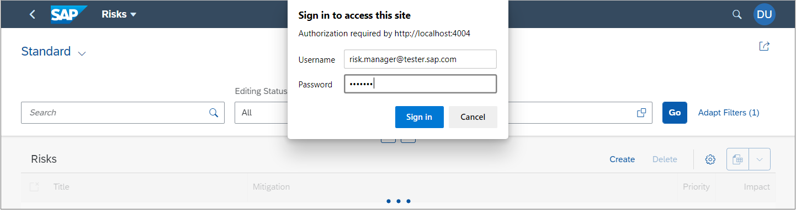
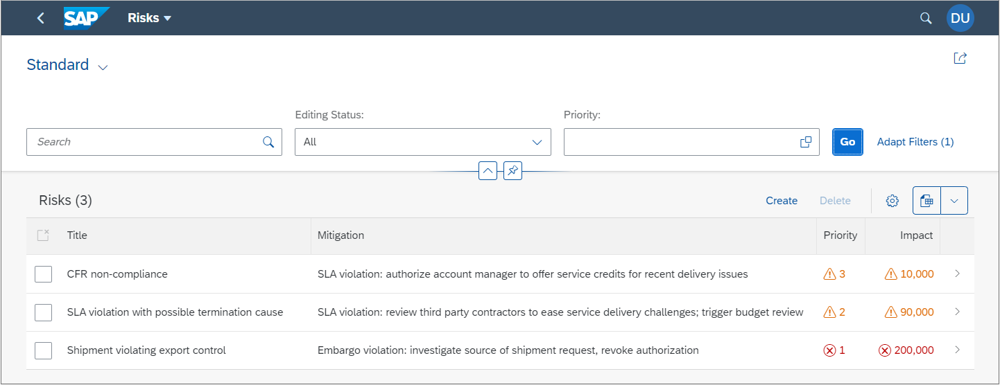

## Prerequisites
 - [Set Up Local Development using VS Code](btp-app-set-up-local-development)
 - [Create a Directory for Development](btp-app-create-directory)
 - [Create a CAP-Based Application](btp-app-create-cap-application)
 - [Create an SAP Fiori Elements-Based UI](btp-app-create-ui-fiori-elements)
 - [Add Business Logic to Your Application](btp-app-cap-business-logic)
 - [Create a UI Using Freestyle SAPUI5](btp-app-create-ui-freestyle-sapui5)
 - [Add More Than One Application to the Launch Page](btp-app-launchpage)
 - You need to install [passport](http://www.passportjs.org/)

## Details
### You will learn
 - How to enable authentication support
 - How to add role restrictions to entities
 - How to add a local user for testing
 - How to access the application with a user and password


To continue with this tutorial you can find the result of the previous tutorial in the [`cap/launchpage`](https://github.com/SAP-samples/cloud-cap-risk-management/tree/cap/launchpage) branch.

---

[ACCORDION-BEGIN [Step 1: ](Enable authentication support)]

To enable authentication support in CAP, the [passport](http://www.passportjs.org/) module needs to be installed. Passport is Express-compatible authentication middleware for Node.js.

> Additional Documentation:

>    [Authentication for CAP Node.js SDK](https://cap.cloud.sap/docs/node.js/authentication#mocked)

1. Navigate to your project folder.

2. Install the `passport` module.

    ```Shell/Bash
    npm install passport
    ```


[VALIDATE_1]

[ACCORDION-END]
---
[ACCORDION-BEGIN [Step 2: ](Adding CAP role restrictions to entities)]

1. Open the file `srv/risk-service.cds`.

2. Add the following restrictions block (`@(...)`) to your `Risks` and `Mitigations` entities.

<!-- cpes-file srv/risk-service.cds -->
```[4-13,15-24]
using { sap.ui.riskmanagement as my } from '../db/schema';
@path: 'service/risk'
service RiskService {
  entity Risks @(restrict : [
            {
                grant : [ 'READ' ],
                to : [ 'RiskViewer' ]
            },
            {
                grant : [ '*' ],
                to : [ 'RiskManager' ]
            }
        ]) as projection on my.Risks;
    annotate Risks with @odata.draft.enabled;
  entity Mitigations @(restrict : [
            {
                grant : [ 'READ' ],
                to : [ 'RiskViewer' ]
            },
            {
                grant : [ '*' ],
                to : [ 'RiskManager' ]
            }
        ]) as projection on my.Mitigations;
    annotate Mitigations with @odata.draft.enabled;
}
```

With this change, a user with the role `RiskViewer` can view risks and mitigations, and a user with role `RiskManager` can view and change risks and mitigations.

[DONE]
[ACCORDION-END]
---
[ACCORDION-BEGIN [Step 3: ](Add Users for local testing)]

Since the authorization checks have been added to the CAP model, they apply not only when deployed to the cloud but also for local testing. Therefore, we need a way to log in to the application locally.

CAP offers a possibility to add local users for testing as part of the `cds` configuration. In this tutorial, we use the `.cdsrc.json` file to add the users.

1. Copy the file `templates/cap/roles/.cdsrc.json` to your project directory `cpapp`. If you're asked to replace an existing file with the same name, confirm.

    > You have to make hidden files visible in your operating system in order to see the file.

    The file defines two users `risk.viewer@tester.sap.com` and `risk.manager@tester.sap.com`.

2. Let's look at the `risk.manager@tester.sap.com` example:

    <!-- cpes-file .cdsrc.json:$.*.*.*.users[?(@.ID=="risk.manager@tester.sap.com")] -->
    ```JSON[7-14]
    {
      "[development]": {
        "auth": {
          "passport": {
            ...
            "users": {
              "risk.viewer@tester.sap.com": "...",
              "risk.manager@tester.sap.com": {
                "password": "initial",
                "ID": "risk.manager@tester.sap.com",
                "roles": [
                  "RiskManager"
                ]
              }
            }
          }
        }
      }
    }
    ```

    The user is defined by their `ID`, which happens to be the email address here, but it could also be a user ID. The user has an `email`, a `password` parameter, and a `roles` parameter. Keep in mind that the CAP roles and the Cloud Foundry roles and scopes are not the same thing.

[DONE]
[ACCORDION-END]
---
[ACCORDION-BEGIN [Step 4: ](Access the Risks application with password)]

When accessing the `Risks` service in your browser, you get a basic auth popup now, asking for your user and password. You can use the two users to log in and see that it works.

1. With `cds watch` running, go to <http://localhost:4004/launchpage.html>.

2. Choose **Risks** and choose **Go**.

3. Enter **Username**: `risk.manager@tester.sap.com`

4. Enter **Password**: `initial`

!

  You can now access the `Risks` application.

!

> Currently there's no logout functionality. You can clear your browser's cache or simply close all browser windows to get rid of the basic auth login data in your browser. For Chrome restart your browser (complete shutdown and restart) by entering `chrome: // restart` in the address line.


[DONE]

The result of this tutorial can be found in the [`cap/roles`](https://github.com/SAP-samples/cloud-cap-risk-management/tree/cap/roles) branch.

[ACCORDION-END]
---