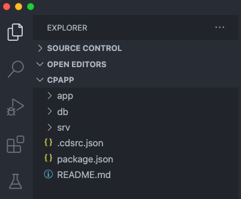
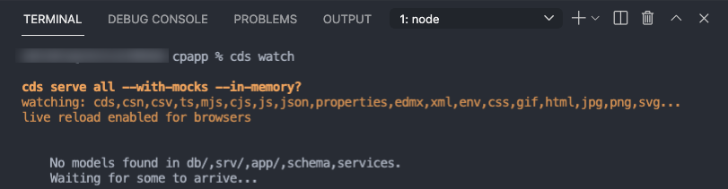
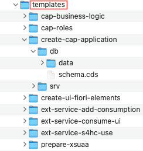

## Prerequisites
 - [Set Up Local Development using VS Code](btp-app-set-up-local-development)
 - [Create a Directory for Development](btp-app-create-directory)

## Details
### You will learn
 - How to use the CAP's tooling `cds init` to create your project
 - How to use the CAP's tooling `cds watch` to launch your project
 - How to add files to your project

---

[ACCORDION-BEGIN [Step 1: ](Create and initialize the project)]

1. Open a terminal.

2. Navigate to your tutorial root directory:

    ```Shell/Bash
    cd <tutorial root directory>
    ```

3. Switch to your tutorial app directory:

    ```Shell/Bash
    cd cpapp
    ```

4. Create an initial CAP project by executing the command `cds init`:

    ```Shell/Bash
    cds init
    ```

5. Open the project in VS Code:

    ```Shell/Bash
    code .
    ```

    The project looks like this in VS Code:

    

6. In VS Code choose **Terminal** **&rarr;** **New Terminal** from its menu.

    A new terminal opens in the lower right part of the VS Code screen.

7. In the VS Code terminal, run:

    ```Shell/Bash
    npm install
    ```

8. In the VS Code terminal, start a CAP server:

    ```Shell/Bash
    cds watch
    ```

    > In case you get the error: `cds : File <npmIstallDirectory>\cds.ps1 cannot be loaded because running scripts is disabled on this system.`

    > If you get the error `cds : File <npmIstallDirectory>\cds.ps1 cannot be loaded because running scripts is disabled on this system.` after you run `cds watch`, you can run the command:

    > ```bash
    > Set-ExecutionPolicy -ExecutionPolicy Bypass -Scope CurrentUser
    > ```

    > This will change the script execution policy for your user to `Bypass` directly from the VS Code terminal. To learn more about execution policies, see [About Execution Policies](https://docs.microsoft.com/en-us/powershell/module/microsoft.powershell.core/about/about_execution_policies?view=powershell-7.1).

    The CAP server serves all the CAP sources from your project. It also "watches" all the files in your projects and conveniently restarts whenever you save a file. Changes you have made will immediately be served without you having to do anything.

    The screen now looks like this:

    

    The CAP server tells you that there's no model yet that it can serve. You add one in the next steps.

[VALIDATE_1]

[ACCORDION-END]
---
[ACCORDION-BEGIN [Step 2: ](Add Files to the project)]

1. Open the Finder on Mac or the Explorer on Windows and navigate to the `tutorial` directory created in tutorial [Create Directory](btp-app-create-directory).

2. Open the folder `templates` and keep it open as you copy a number of files from there. For this part of the tutorial and others, it's probably best if you place it next to your VS Code instance like this:

    

    Alternatively, you can open it as a second folder in your VS Code project: **File** **&rarr;** **Add Folder to Workspace...**.

3. Copy the file `schema.cds` from `templates/cap/create-service/db` to the `db` folder of your app.

    This is the code:

    <!-- cpes-file db/schema.cds -->
    ```JavaScript
    namespace sap.ui.riskmanagement;
    using { managed } from '@sap/cds/common';
      entity Risks : managed {
        key ID      : UUID  @(Core.Computed : true);
        title       : String(100);
        prio        : String(5);
        descr       : String;
        miti        : Association to Mitigations;
        impact      : Integer;
        criticality : Integer;
      }
      entity Mitigations : managed {
        key ID       : UUID  @(Core.Computed : true);
        description  : String;
        owner        : String;
        timeline     : String;
        risks        : Association to many Risks on risks.miti = $self;
      }
    ```


    It creates two entities in the namespace `sap.ui.riskmanagement`: `Risks` and `Mitigations`. Each of them has a key called `ID` and several other properties. A Risk has a Mitigation and, therefore, the property `miti` has an association to exactly one Mitigation. A Mitigation in turn can be used for many Risks, so it has a "to many" association. They key is automatically filled by the CAP server, which is exposed to the user of the service with the annotation `@(Core.Computed : true)`.

    Notice how the CAP server reacted to dropping the file. It now tells you that it has a model but there are no service definitions yet and, thus, it still can't serve anything. Next, you add a service definition.

4. Copy the file `risk-service.cds` from `templates/cap/create-service/srv` to the `srv` folder of your app.

    The content of the file looks like this:

    <!-- cpes-file srv/risk-service.cds -->
    ```JavaScript
    using { sap.ui.riskmanagement as my } from '../db/schema';
    @path: 'service/risk'
    service RiskService {
      entity Risks as projection on my.Risks;
        annotate Risks with @odata.draft.enabled;
      entity Mitigations as projection on my.Mitigations;
        annotate Mitigations with @odata.draft.enabled;
    }
    ```

    It creates a new service `RiskService` in the namespace `sap.ui.riskmanagement`. This service exposes two entities: `Risks` and `Mitigations`, which are exposing the entities of the database schema you've created in the step before.

    If you again look at the terminal, you see that the CAP server has noticed the new file and now tells us that it serves something under <http://localhost:4004>.

5. In your browser open the link <http://localhost:4004> and you see:

    !

    > You may have to stop and restart the `cds watch` command with **Ctrl** + **C**.

6. Choose the `$metadata` link.

    You see the OData metadata document of your new service. So, with just the two files for the database schema and the service exposure you added to your project, you have already got a running OData service! You might wonder why the service itself is called `risk` even though in the file it's called `RiskService`. This is a convention in CAP, the service suffix is subtracted from the name.

    If you now choose the `Risks` link, you only get this:

    ```JavaScript
    {
        @odata.context: "$metadata#Risks",
        value: [ ]
    }
    ```

    So, there's no data yet. This is because so far, your model doesn't contain any data. You add some now.

7. Copy the folder `data` from `templates/cap/create-service/db` to the `db` folder of your app. If VS Code asks you whether to copy the folder, confirm.

    You have now added two comma-separated value (CSV) files that contain local data for both the `Risks` and the `Mitigations` entities. A quick look into the `sap.ui.riskmanagement-Risks.csv` (the name consists of your namespace and the name of your database entity from the `schema.cds` file) file shows data like this:

    ```csv
    ID;createdAt;createdBy;title;prio;descr;miti_id;impact
    20466922-7d57-4e76-b14c-e53fd97dcb11;2021-04-27;max.mustermann@muster.com;CFR non-compliance;Fred Fish;3;Recent restructuring might violate CFR code 71;20466921-7d57-4e76-b14c-e53fd97dcb11;10000
    ...
    ```

    The first line contains all the properties from your `Risks` entity. While the other ones are straight forward, consider the `miti_id` property. In your entity, you only have a `miti` property, so where does it come from? `miti` is an association to `Mitigations`, as `Mitigations` could have several key properties, the association on the database needs to point to all of these, therefore the CAP server creates a property `<AssociationProperty>_<AssociatedEntityKey>` for each key.

    As always, the CAP server has noticed the change.

    > You may have to stop and restart the `cds watch` command with **Ctrl** + **C**.

8. Revisit the `Risks` entity <http://localhost:4004/service/risk/Risks> in your browser. You now see the data exposed:

    !

And that's it: You have now got a full blown OData service, which complies to the OData standard and supports the respective queries without having to code anything but the data model and exposing the service itself.

> The service is completely exposed without any authentication or authorization check. You extend the service later in the tutorial [Implement Roles and Authorization Checks In CAP](btp-app-cap-roles) with such checks.


[DONE]

The result of this tutorial can be found in the [`cap/create-service`](https://github.com/SAP-samples/cloud-cap-risk-management/tree/cap/create-service) branch.

[ACCORDION-END]
---