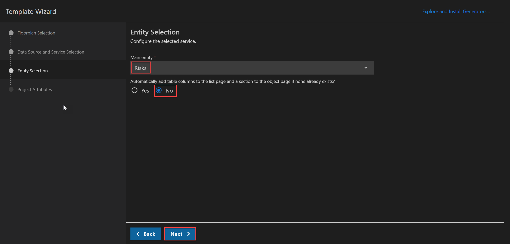
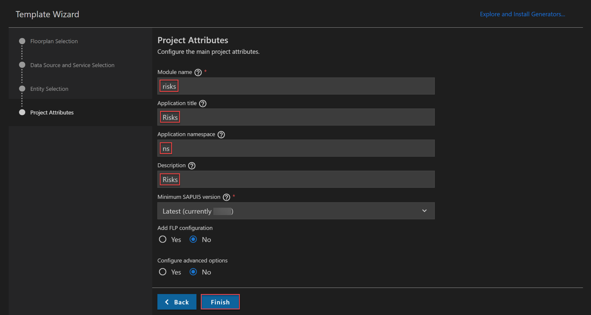
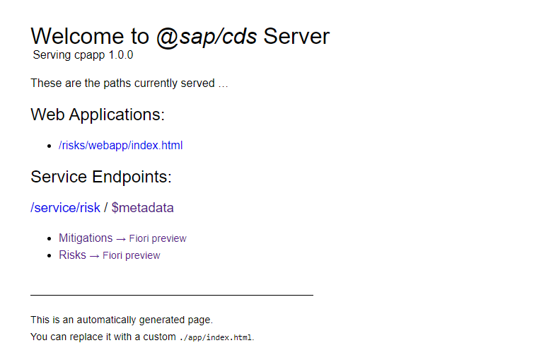
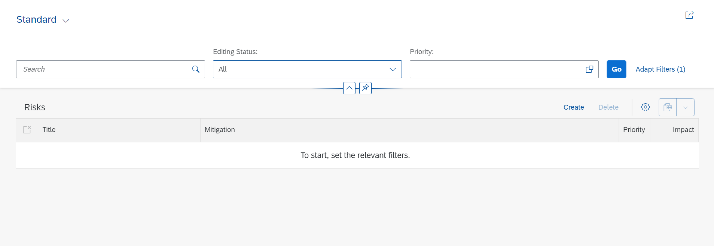
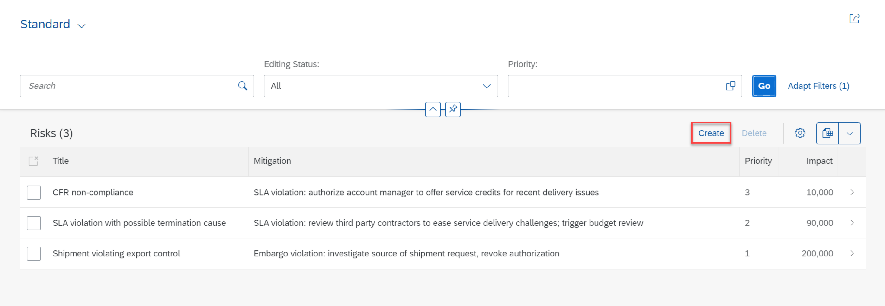
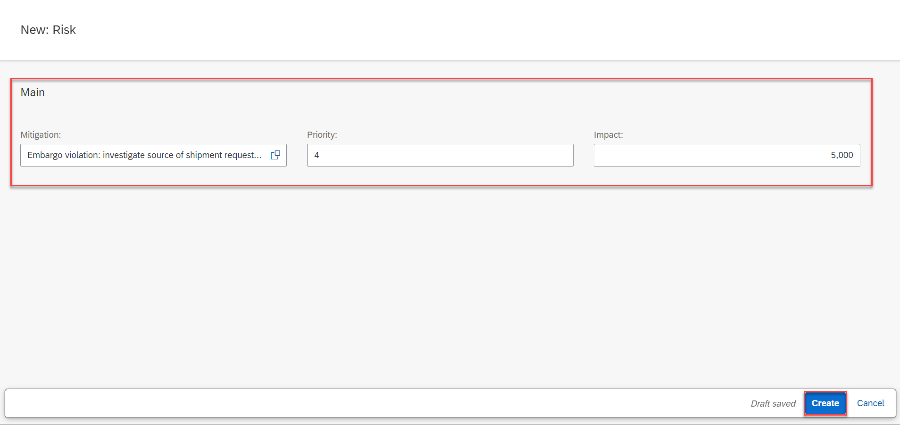
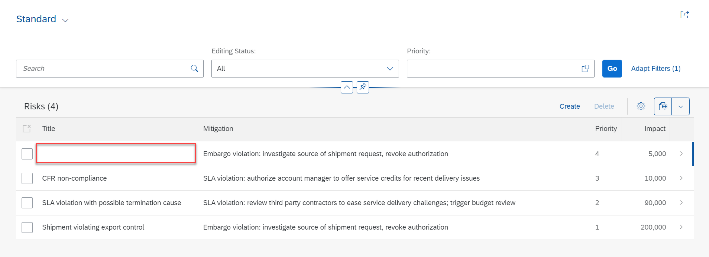
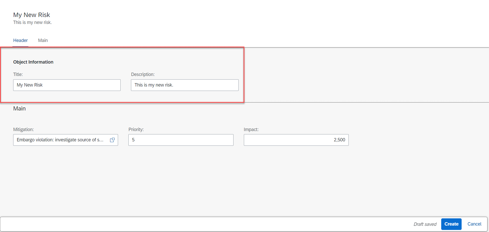
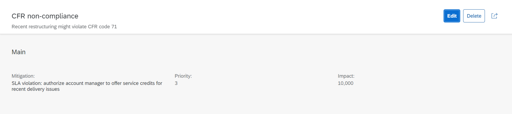

## Prerequisites
 - Before you start with this tutorial, you have two options:
    - Follow the instructions in **Step 16: Start from an example branch** of [Prepare Your Development Environment for CAP](btp-app-prepare-dev-environment-cap) to checkout the [`create-cap-application`](https://github.com/SAP-samples/cloud-cap-risk-management/tree/create-cap-application) branch.
    - Complete the previous tutorial [Create a CAP-Based Application](btp-app-create-cap-application) with all its prerequisites.


## Details
### You will learn
 - How to create an SAP Fiori elements app on top of your previously created CAP application
 - How to modify the UI with OData annotations
 - How to make header info editable
 - How to check the annotation files

---

[ACCORDION-BEGIN [Step 1: ](Overview)]
An SAP Fiori elements app is an application that leverages SAPUI5, SAPUI5 controls, and SAPUI5 model view controller (MVC) concepts. In a plain SAPUI5 or a freestyle SAPUI5 app, all the views and controllers are part of your project. In contrast, in an SAP Fiori elements app most of the code is outside of the project, managed centrally by the SAP Fiori elements team. The code inside your project only references these central components. They take care of creating the UI according to the latest SAP Fiori design guidelines and cover all the controller logic for you out of the box. The UI can be influenced by OData annotations. They determine, for example, which properties of an OData service make up the columns of a table that displays the content of the service.

[DONE]
[ACCORDION-END]
---
[ACCORDION-BEGIN [Step 2: ](Generate the UI with an SAP Fiori elements template)]
1. In VS Code, invoke the Command Palette ( **View** &rarr; **Command Palette** or <kbd>Shift</kbd> + <kbd>Command</kbd> + <kbd>P</kbd> for macOS / <kbd>Ctrl</kbd> + <kbd>Shift</kbd> + <kbd>P</kbd> for Windows) and choose **Fiori: Open Application Generator**.

    > VS Code will automatically install `@sap/generator-fiori` if missing and open the **Template Wizard**.

    > In case you get an error launching the SAP Fiori application generator, refer to the [FAQ](https://help.sap.com/viewer/42532dbd1ebb434a80506113970f96e9/Latest/en-US) to find a solution.

2. Choose template type **SAP Fiori** and template **List Report Page**.

       

3. Choose **Next**.

4. In the next dialog, choose `Use a Local CAP Project` and choose your current `cpapp` project.

    > In case you get the error: `Node module @sap/cds isn't found. Please install it and try again.`

    > This is an issue with the SAP Fiori application generator not finding the corresponding CAP modules, due to different repositories. This should be a temporary issue. For the meantime you can work around it by opening a command line and running the following command:

    > ```bash
    > npm install --global @sap/cds-dk --@sap:registry=https://npmjs.org/
    > ```

    > See the [CAP Troubleshooting guide](https://cap.cloud.sap/docs/advanced/troubleshooting#npm-installation) for more details.

5. Select `RiskService(Node.js)` as the OData service and choose **Next**.

    

6. Select `Risks` as the main entity, choose the option **No** to avoid adding table columns automatically. Choose **Next**.

    

7. Enter `risks` as the module name and `Risks` as the application title.

8. Enter `ns` as the namespace and `Risks` as the description for the application.

9. Leave the default values for all other settings. 

9. Choose **Finish** to generate the application.

    

The application is now generated and in a few seconds you can see it in the `app` folder of your project. It contains a `risks` and a `webapp` folder with a `Component.js` file that is characteristic for an SAPUI5 app.

> However, the code there's minimal and it basically inherits its logic from the `sap/fe/core/AppComponent`. The `sap/fe/core/AppComponent` is the base class for SAP Fiori elements. This class is managed centrally by SAP Fiori elements, so you don't need to modify it yourself.


[VALIDATE_1]
[ACCORDION-END]
---
[ACCORDION-BEGIN [Step 3: ](Modify the UI with OData annotations)]
1. If it's not still running from the previous tutorial, execute `cds watch` in a VS Code terminal and switch to <http://localhost:4004> in your browser.

    You can now see that the CAP server has discovered an HTML page in your `app` folder:

       !

2. Choose the link [http://localhost:4004/risks/webapp/index.html](http://localhost:4004/risks/webapp/index.html) for the HTML page.

3. You can now see the application without any data.

    !

    There are no visible columns because the application is currently missing UI annotations. You add them in the next step.

4. To add the OData annotations, copy the file `risks-service-ui.cds` from `templates/create-ui-fiori-elements/srv` to the `srv` folder of your app.

    As in the steps before, the CAP server has noticed the new file and compiled the service again, so now it contains the additional annotations.

5. In your browser, reload the page of the empty SAP Fiori elements app.

6. Choose **Go**.

    It now shows a work list with some columns and the data from the service.

       !

    > If the work list doesn't show, you might have to clear your cache.

You've now already finished a full blown service and a UI application on top running locally.

[DONE]
[ACCORDION-END]
---
[ACCORDION-BEGIN [Step 4: ](Make header info editable)]
Let's say that at this point you'd like to edit some of the data or create a new risk in the table. By default, the header info is not editable. Hence, you'll be able to fill in data in the main group fields `Mitigation`, `Priority`, and `Impact`, but won't be able to fill data in any of the header fields `Title` or `Description`. Let's try it out.

1. Choose **Create**.

    !

2. To add a `Mitigation`, click on the value help icon in the input field and select a mitigation.

    !

3. Try and fill in data in the main group fields `Priority` and `Impact` and choose **Create**.

    !

4. Click on the browser's back button, the new risk is created but it has no title.

    !

To make also the header fields editable, you have to change the default setting for this in the `manifest.json` file on the `Risks` application.

1. Open `app/risks/webapp/manifest.json` file.

2. Change the value of the setting `editableHeaderContent` to `true`:

    ```JSON[15]
    {
        "_version": "1.32.0",
        "sap.app": {
        ...
        "sap.ui5": {
            ...
            "routing": {
                ...
                "targets": {
                    ...
                    "RisksObjectPage": {
                        ...
                        "options": {
                            "settings": {
                                "editableHeaderContent": true,
                                "entitySet": "Risks"
                            }
                        }
                    }
                }
            },
            ...
    }
    ```

3. Create another risk with a title and description.

    !

[DONE]
[ACCORDION-END]
---
[ACCORDION-BEGIN [Step 5: ](Check the annotation files)]
Let's have a look at the new `risk-service-ui.cds` file and the annotations in there. At the beginning you see:

```JavaScript
using RiskService from './risk-service';

annotate RiskService.Risks with {
    title       @title: 'Title';
    prio        @title: 'Priority';
    descr       @title: 'Description';
    miti        @title: 'Mitigation';
    impact      @title: 'Impact';
}
```

It's referring to the definitions of the earlier `cds` file that exposes the service and its `Risks` and `Mitigations` entities. Then it annotates the `Risks` entity with a number of texts. These should be in a translatable file normally but for now we keep them here. These texts are used as labels in form fields and column headers by SAP Fiori elements.

The following section is needed for the value help of the **Mitigation** field that is visible when you are editing the object page of the `Risks` app.

```JavaScript
annotate RiskService.Mitigations with {
ID @(
    UI.Hidden,
    Common: {
    Text: description
    }
);
description  @title: 'Description';
owner        @title: 'Owner';
timeline     @title: 'Timeline';
risks        @title: 'Risks';
}
```

Next up:

```JavaScript
annotate RiskService.Risks with @(
    UI: {
        HeaderInfo: {
            TypeName: 'Risk',
            TypeNamePlural: 'Risks',
            Title          : {
                $Type : 'UI.DataField',
                Value : title
            },
            Description : {
                $Type: 'UI.DataField',
                Value: descr
            }
        },
        SelectionFields: [prio],
        LineItem: [
            {Value: title},
            {
                Value: miti_ID,
                ![@HTML5.CssDefaults] : {width : '100%'}
            },
            {
                Value: prio,
                Criticality: criticality
            },
            {
                Value: impact,
                Criticality: criticality
            }
        ],
        Facets: [
            {$Type: 'UI.ReferenceFacet', Label: 'Main', Target: '@UI.FieldGroup#Main'}
        ],
        FieldGroup#Main: {
            Data: [
                {Value: miti_ID},
                {
                    Value: prio,
                    Criticality: criticality
                },
                {
                    Value: impact,
                    Criticality: criticality
                }
            ]
        }
    },
) {

};
```

This defines the content of the work list page and the object page that you navigate to when you click on a line in the work list.

The `HeaderInfo` describes the key information of the object, which will make the object page to display `title` of the risk as title and the `descr` as subtitle in its header area.

The `SelectionFields` section defines which of the properties are exposed as search fields in the header bar above the list. In this case, `prio` is the only explicit search field.

The columns and their order in the work list are derived from the `LineItem` section. While in most cases the columns are defined by `Value:` followed by the property name of the entity, in the case of `prio` and `impact` there's also `Criticality`. For now, you can neglect it but keep it in mind in case you go to the later modules.

Next up is the `Facets` section. In this case, it defines the content of the object page. It contains only a single facet, a `ReferenceFacet`, of the field group `FieldGroup#Main`. This field group just shows up as a form. The properties of the `Data` array within `FieldGroup#Main` determine the fields in the form.

At the end of the file you see:

```JavaScript
annotate RiskService.Risks with {
    miti @(
        Common: {
            //show text, not id for mitigation in the context of risks
            Text: miti.description  , TextArrangement: #TextOnly,
            ValueList: {
                Label: 'Mitigations',
                CollectionPath: 'Mitigations',
                Parameters: [
                    { $Type: 'Common.ValueListParameterInOut',
                        LocalDataProperty: miti_ID,
                        ValueListProperty: 'ID'
                    },
                    { $Type: 'Common.ValueListParameterDisplayOnly',
                        ValueListProperty: 'description'
                    }
                ]
            }
        }
    );
}
```

The line `Text: miti.description , TextArrangement: #TextOnly,` declares that the text from the description property is displayed for the `miti` association. Then it adds a value help (`ValueList`) for that association, so the user can pick one of the available mitigations when editing the object page.

!

[DONE]
The result of this tutorial can be found in the [`create-ui-fiori-elements`](https://github.com/SAP-samples/cloud-cap-risk-management/tree/create-ui-fiori-elements) branch.


[ACCORDION-END]
---