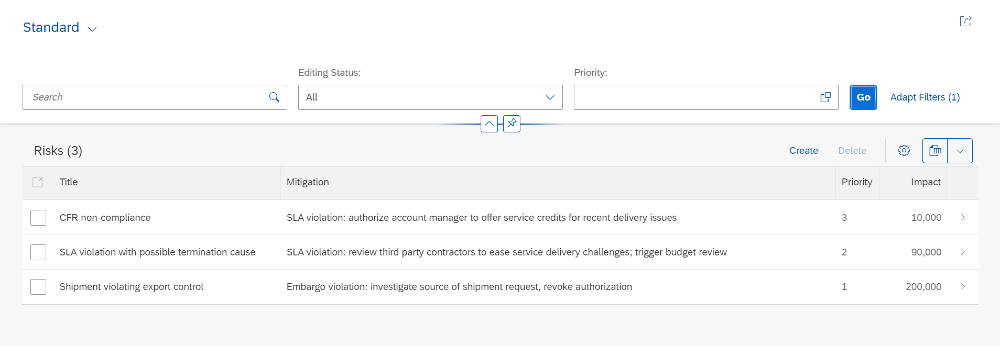

## Prerequisites
 - [Set Up Local Development using VS Code](btp-app-set-up-local-development)
 - [Create a Directory for Development](btp-app-create-directory)
 - [Create a CAP-Based Application](btp-app-create-cap-application)

## Details
### You will learn
 - How to create an SAP Fiori elements app on top of your previously created CAP application
 - Hot to modify the UI with OData annotations
 - How to check the annotation files


To continue with this tutorial you can find the result of the previous tutorial in the [`cap/create-service`](https://github.com/SAP-samples/cloud-cap-risk-management/tree/cap/create-service) branch.

---

[ACCORDION-BEGIN [Step 1: ](Overview)]

An SAP Fiori elements app is an application that leverages SAPUI5, SAPUI5 controls, and SAPUI5 model view controller (MVC) concepts. In a plain SAPUI5 or a freestyle SAPUI5 app, all the views and controllers are part of your project. In contrast, in an SAP Fiori elements app most of the code is outside of the project, managed centrally by the SAP Fiori elements team. The code inside your project only references these central components. They take care of creating the UI according to the latest SAP Fiori design guidelines and cover all the controller logic for you out of the box. The UI can be influenced by OData annotations. They determine, for example, which properties of an OData service make up the columns of a table that displays the content of the service.

[DONE]
[ACCORDION-END]
---
[ACCORDION-BEGIN [Step 2: ](Generate the UI with an SAP Fiori elements template)]

1. In VS Code, invoke the Command Palette ( **View** **&rarr;** **Command Palette** or **⇧⌘P** for macOS / **Ctrl** + **Shift** + **P** for Windows) and choose **Fiori: Open Application Generator**.

2. Choose application type **SAP Fiori elements** and floor plan **List Report Object Page**.

       

3. Choose **Next**.

4. In the next dialog, choose **Use a Local CAP Project** and point to the folder of your current **`cpapp`** project.

    > In case you get the error: `Node module @sap/cds isn't found. Please install it and try again.`

    > You might get the error `Node module @sap/cds is not found. Please install it and try again.` after you have chosen your CAP project. This is an issue with the App Generator not finding the corresponding CAP modules, due to different repositories. This should be a temporary issue. For the meantime you can work around it by opening a command line and running the following command:

    > ```bash
    > npm i -g @sap/cds-dk --@sap:registry=https://npmjs.org/
    > ```

    > See the [CAP Troubleshooting guide](https://cap.cloud.sap/docs/advanced/troubleshooting#npm-installation) for more details.

5.    Select the **`RiskService`** as the OData service and choose **Next**.

    

6.    Select **Risks** as the main entity and choose **Next**.

    

7. Enter `risks` as the module name and `Risks` as the application title.

8. Enter `ns` as the namespace and `Risks` as the description for the application.

9. Choose **Finish** to generate the application.

    

The application is now generated and in a few seconds you can see it in the `app` folder of your project. It contains a `risks` and a `webapp` folder with a `Component.js` file that is characteristic for an SAPUI5 app.

> However, the code there's minimal and it basically inherits its logic from the `sap/fe/core/AppComponent`. The `sap/fe/core/AppComponent` is the base class for SAP Fiori elements. This class is managed centrally by SAP Fiori elements, so you don't need to modify it yourself.


[VALIDATE_1]

[ACCORDION-END]
---
[ACCORDION-BEGIN [Step 3: ](Modify the UI with OData annotations)]

1. If it's not still running from the previous tutorial, execute `cds watch` in a VS Code terminal and switch to <http://localhost:4004> in your browser.

    You can now see that the CAP server has discovered an HTML page in your `app` folder:

       !

2. Choose the link [http://localhost:4004/risks/webapp/index.html](http://localhost:4004/risks/webapp/index.html) for the HTML page.

3. On the launch page that now comes up, choose the **Risks** tile.

    !

    You can now see the application without any data.

    !

    The table is empty because the application is currently missing UI annotations. You add them in the next step.

4. To add the OData annotations, copy the file `risks-service-ui.cds` from `templates/cap/fiori-elements-app/srv` to the `srv` folder of your app.

    As in the steps before, the CAP server has noticed the new file and compiled the service again, so now it contains the additional annotations.

5. In your browser, reload the page of the empty SAP Fiori elements app.

6. Choose **Go**.

    It now shows a work list with some columns and the data from the service.

       !

    > If the work list doesn't show, you might have to clear your cache.

You've now already finished a full blown service and a UI application on top running locally.

[DONE]
[ACCORDION-END]
---
[ACCORDION-BEGIN [Step 4: ](Check the annotation files)]

Let's have a look at the new `risk-service-ui.cds` file and the annotations in there. At the beginning we see:

```JavaScript
using RiskService from './risk-service';

annotate RiskService.Risks with {
    title       @title: 'Title';
    prio        @title: 'Priority';
    descr       @title: 'Description';
    miti        @title: 'Mitigation';
    impact      @title: 'Impact';
}
```

It's referring to the definitions of the earlier `cds` file that exposes the service and its `Risks` and `Mitigations` entities. Then it annotates the `Risks` entity with a number of texts. These should be in a translatable file normally but for now we keep them here. These texts are used as labels in form fields and column headers by SAP Fiori elements.

The following section is needed for the value help of the **Mitigation** field that is visible when you're editing the object page of the `Risks` app.

```JavaScript
annotate RiskService.Mitigations with {
ID @(
    UI.Hidden,
    Common: {
    Text: description
    }
);
description  @title: 'Description';
owner        @title: 'Owner';
timeline     @title: 'Timeline';
risks        @title: 'Risks';
}
```

Next up:

```JavaScript
annotate RiskService.Risks with @(
    UI: {
        HeaderInfo: {
            TypeName: 'Risk',
            TypeNamePlural: 'Risks',
            Title          : {
                $Type : 'UI.DataField',
                Value : title
            },
            Description : {
                $Type: 'UI.DataField',
                Value: descr
            }
        },
        SelectionFields: [prio],
        LineItem: [
            {Value: title},
            {Value: miti_ID},
            {
                Value: prio,
                Criticality: criticality
            },
            {
                Value: impact,
                Criticality: criticality
            }
        ],
        Facets: [
            {$Type: 'UI.ReferenceFacet', Label: 'Main', Target: '@UI.FieldGroup#Main'}
        ],
        FieldGroup#Main: {
            Data: [
                {Value: miti_ID},
                {
                    Value: prio,
                    Criticality: criticality
                },
                {
                    Value: impact,
                    Criticality: criticality
                }
            ]
        }
    },
) {

};
```

This defines the content of the work list page and the object page that you navigate to when you click on a line in the work list.

The `HeaderInfo` describes the key information of the object, which will make the object page to display `title` of the risk as title and the `descr` as subtitle in its header area.

The `SelectionFields` section defines which of the properties are exposed as search fields in the header bar above the list. In this case, `prio` is the only explicit search field.

The columns and their order in the work list are derived from the `LineItem` section. While in most cases the columns are defined by `Value:` followed by the property name of the entity, in the case of `prio` and `impact` there's also `Criticality`. For now, you can neglect it but keep it in mind in case you go to the later modules.

Next up is the `Facets` section. In this case, it defines the content of the object page. It contains only a single facet, a `ReferenceFacet`, of the field group `FieldGroup#Main`. This field group just shows up as a form. The properties of the `Data` array within `FieldGroup#Main` determine the fields in the form.

At the end of the file we have:

```JavaScript
annotate RiskService.Risks with {
    miti @(
        Common: {
            //show text, not id for mitigation in the context of risks
            Text: miti.description  , TextArrangement: #TextOnly,
            ValueList: {
                Label: 'Mitigations',
                CollectionPath: 'Mitigations',
                Parameters: [
                    { $Type: 'Common.ValueListParameterInOut',
                        LocalDataProperty: miti_ID,
                        ValueListProperty: 'ID'
                    },
                    { $Type: 'Common.ValueListParameterDisplayOnly',
                        ValueListProperty: 'description'
                    }
                ]
            }
        }
    );
}
```

The line `Text: miti.description , TextArrangement: #TextOnly,` declares that the text from the description property is displayed for the `miti` association. Then it adds a value help (`ValueList`) for that association, so the user can pick one of the available mitigations when editing the object page.

!

[DONE]

The result of this tutorial can be found in the [`cap/fiori-elements-app`](https://github.com/SAP-samples/cloud-cap-risk-management/tree/cap/fiori-elements-app) branch.

[ACCORDION-END]
---