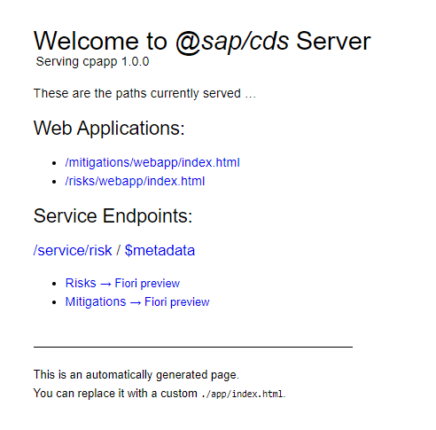
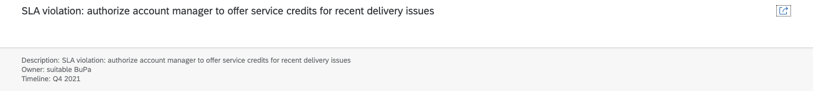

## Prerequisites
 - [Set Up Local Development using VS Code](btp-app-set-up-local-development)
 - [Create a Directory for Development](btp-app-create-directory)
 - [Create a CAP-Based Application](btp-app-create-cap-application)
 - [Create an SAP Fiori Elements-Based UI](btp-app-create-ui-fiori-elements)
 - [Add Business Logic to Your Application](btp-app-cap-business-logic)

## Details
### You will learn
 - How to create a Freestyle SAPUI5 app on top of your CAP application
 - How to start the application


To continue with this tutorial you can find the result of the previous tutorial in the [`cap/business-logic`](https://github.com/SAP-samples/cloud-cap-risk-management/tree/cap/business-logic) branch.

---

[ACCORDION-BEGIN [Step 1: ](SAP Fiori elements application vs. freestyle UI5 application)]

What is the difference to an SAP Fiori elements based application that you have already built in the [Create an SAP Fiori Elements-Based UI](btp-app-create-ui-fiori-elements) section? As mentioned, both the freestyle app and the SAP Fiori elements app are based on SAPUI5.

An SAP Fiori elements app can be thought of like a giant player built with SAPUI5 where most of the code resides outside your own development project in central components. Much of its logic comes out of the box and is controlled by metadata from your OData service.

A freestyle UI5 application, on the other hand, lives mainly in your own project - all the views and controllers are in it. It still comes with all the features of SAPUI5 (super rich SAP Fiori compliant [set of UI controls](https://sapui5.hana.ondemand.com/#/controls), [data binding](https://sapui5.hana.ondemand.com/#/topic/e5310932a71f42daa41f3a6143efca9c), [model view controller](https://sapui5.hana.ondemand.com/#/topic/91f233476f4d1014b6dd926db0e91070), and so on), but if you want to, for example, program a screen where a user can edit data, you've got to program it yourself. In SAP Fiori elements, this functionality is available out of the box. With the greater amount of work for standard use cases, however, also comes a greater freedom. In a freestyle app, you can do what you need to do using SAPUI5 or even using third party / open-source components. While there are also options in SAP Fiori elements to adjust your application outside of the possibilities given you via metadata (annotations) using the so-called "Flexible Programming Model", in a freestyle UI5 app, the sky is the limit with respect to freedom and optimization.

Fortunately, you have also got a choice of several templates that get your application kick started for freestyle UI5. They copy the initial code into your project and any change necessary for the app can be done manually by you in the code.

[VALIDATE_1]

[ACCORDION-END]
---
[ACCORDION-BEGIN [Step 2: ](Creating the application)]

In the next steps, you build an application using the `mitigations` part of our CAP-based service.

1. Make sure that you've installed the SAPUI5 templates as described in section [Set Up Local Development using VS Code](btp-app-set-up-local-development).

2. Open a terminal in VS Code via **Terminal** **&rarr;** **New Terminal**.

3. Navigate to your project folder.

4. Navigate to the `app` folder:

    ```Shell/Bash
    cd app
    ```

5. Create a new `mitigations` folder for the new app:

    ```Shell/Bash
    mkdir mitigations
    ```

6. Navigate to the `mitigations` folder:

    ```Shell/Bash
    cd mitigations
    ```

7. Create a freestyle UI5 application:

    ```Shell/Bash
    yo @sapui5/sapui5-templates
    ```
    A creation wizard starts.

8. Follow the creation wizard and use the following values:

    ```JavaScript
    - "Provide the module name" mitigations
    - "Provide the module namespace" ns
    - "Select a template" SAP Fiori Worklist Application OData V4
    - "Title" Mitigations
    - "Description" Mitigations
    - "Choose if your app should run in SAP Fiori Launchpad or standalone" Standalone App (optimized for individual deployment)
    - "Select batch mode corresponding to selected OData Service" Auto: Requests are grouped in one batch request
    - "Service Base URI" http://localhost:4004/service/risk
    - "Datasource URL" /service/risk
    - "Object Collection" Mitigations
    - "Object Collection ID" ID
    - "Object Title" ID
    - "Object Numeric Attribute": <leave empty>
    - "Object Unit of Measure": <leave empty>
    ```

9. Open the newly created file `manifest.json` in your `cpapp/app/mitigations/webapp` folder.

10. Add a `/` to the beginning of the value of the `uri` parameter:

```JavaScript[7]
{
    ...
    "sap.app": {
        ...
        "dataSources": {
            "mainService": {
                "uri": "/service/risk/",
                "type": "OData",
                "settings": {
                    "odataVersion": "4.0",
                    "localUri": "localService/metadata.xml"
                }
            }
        }
        ,
```

[DONE]
[ACCORDION-END]
---
[ACCORDION-BEGIN [Step 3: ](Summary)]

What happened here? (You can skip this and carry on with the next step **Starting the Application** if you aren't keen to know.)

First, you created a new application from the work list template with a detail page based on a V4 OData service (the CAP service is V4). The result is a similar application layout like the one you have already chosen in the [Create a SAP Fiori Elements-Based UI](btp-app-create-ui-fiori-elements) section. There are other templates available (a Worklist Application and a Master Detail one, both for V2 services).

You chose to be able to run this app standalone, so without necessarily having to have an SAP Fiori launchpad to host it. On a technical level, you chose to send all the OData requests from the app using batches. A batch is a kind of a wrapper for requests. You can wrap multiple requests into one with a batch. Even when there's only one request, a batch is better for security reasons, as not all the data of the request is exposed in the URL. So, in essence, for performance and security reasons, it's always a good idea to choose batch.

Then there's the section about the service base URI and the data source URL. It prepares your project for the optional use of more [SAPUI5 Tooling](https://sap.github.io/ui5-tooling/) for development. It ensures that the requests for the OData service from the application (all for our `risk` service, so starting with `/risk`) are mapped to the backend service, which is our CAP service, running under `http://localhost:4004/service/risk`.

> Why is a mapping needed?

> You might ask yourself why you have got to specify this here, when in the [Create a SAP Fiori Elements-Based UI](btp-app-create-ui-fiori-elements) section you didn't. The answer is that the SAP Fiori elements case was streamlined to a CAP service already (you even told the app generator to get the service from a CAP project). Freestyle SAPUI5 templates don't have the special treatment of CAP yet and instead make no assumption where the OData service comes from, it could be a remote one based on another framework. To make the connection, the above mapping is needed. SAPUI5 has a so-called middleware that proxies to the remote service. You can see this by opening the `ui5.yaml` file under `cpapp/app/mitigations`:

> ```yaml
> ...
> server:
>     customMiddleware:
>     - name: ui5-middleware-simpleproxy
>         mountPath: /risk
>         afterMiddleware: compression
>         configuration:
>         baseUri: http://localhost:4004/service/risk
> ```

The change in the `manifest.json` is to make sure that the data requests are used with an absolute URL at `/risk`. The original entry for the URI was `risk`. This would have triggered SAPUI5 to issue any data request relative to the path of the application itself, but we want the requests to be absolute to risk.

[DONE]
[ACCORDION-END]
---
[ACCORDION-BEGIN [Step 4: ](Starting the application)]

1. Make sure `cds watch` is still running in the project root folder:

    ```Shell/Bash
    cds watch
    ```

2. Open the URL <http://localhost:4004/>.

    You now see two new HTML pages.

    !

3. Choose the `/mitigations/webapp/index.html` entry.

    !

    As a result, you can see a list but you can only see the IDs of the mitigations both in the list view and on the detail page. This is because the freestyle template only got the information from you that the `Object Collection ID` is the `ID` property of the `mitigations` service. You now need to add additional SAPUI5 controls that are bound to additional properties of the `mitigations` service.

4. Open the view of the work list `cpapp/app/mitigations/webapp/view/Worklist.view.xml`  and add the following code, removing the `ID` column and instead adding `Description`, `Owner` and `Timeline` columns:

    ```XML[2-10,19-23]
        <columns>
            <Column id="DescriptionColumn">
                <Text text="Description" id="DescriptionColumnTitle"/>
            </Column>
            <Column id="OwnerColumn">
                <Text text="Owner" id="OwnerColumnTitle"/>
            </Column>
            <Column id="TimelineColumn">
                <Text text="Timeline" id="TimelineColumnTitle"/>
            </Column>
        </columns>

        <items>
            <ColumnListItem
                type="Navigation"
                press=".onPress">
                <cells>
                    <ObjectIdentifier
                        text="{description}" />
                    <Text
                        text="{owner}" />
                    <Text
                        text="{timeline}" />
                </cells>
            </ColumnListItem>
        </items>
    ```

5. Open the view of the object `cpapp/app/mitigations/webapp/view/Object.view.xml` and also replace `ID` and add `Description`, `Owner`, and `Timeline` using SAPUI5 controls like `ObjectStatus` (you can copy the whole code and replace the existing code in the file):

    ```XML[4,16,28-34]
    <mvc:View
        controllerName="ns.mitigations.controller.Object"
        xmlns="sap.m"
        xmlns:l="sap.ui.layout"
        xmlns:mvc="sap.ui.core.mvc"
        xmlns:semantic="sap.f.semantic">

        <semantic:SemanticPage
            id="page"
            headerPinnable="false"
            toggleHeaderOnTitleClick="false"
            busy="{objectView>/busy}"
            busyIndicatorDelay="{objectView>/delay}">

            <semantic:titleHeading>
                <Title text="{description}" />
            </semantic:titleHeading>

            <semantic:headerContent>
                <ObjectNumber
                />
            </semantic:headerContent>

            <semantic:sendEmailAction>
                <semantic:SendEmailAction id="shareEmail" press=".onShareEmailPress"/>
            </semantic:sendEmailAction>

            <semantic:content>
                <l:VerticalLayout>
                    <ObjectStatus title="Description" text="{description}"/>
                    <ObjectStatus title="Owner" text="{owner}"/>
                    <ObjectStatus title="Timeline" text="{timeline}"/>
                </l:VerticalLayout>
            </semantic:content>


        </semantic:SemanticPage>

    </mvc:View>
    ```

6. Refresh the `mitigations` application in your browser.

    You can now see the new content in the work list ...

    !

    ... as well as in the detail object page.

    !

[DONE]
[ACCORDION-END]
---
[ACCORDION-BEGIN [Step 5: ]((Optional) SAPUI5 serve)]

[OPTION BEGIN [macOS/Linux]]

> ### To earn your badge for the whole mission, you'll need to mark all steps in a tutorial as done, including any optional ones that you may have skipped because they are not relevant for you.

While `cds watch` comes in handy for serving even the SAPUI5 based apps directly in your CAP projects, there's also an additional alternative, again from the SAPUI5 tools. They also provide a development server that can be used in any pure SAPUI5 project. So, you can use the SAPUI5 development server when there's no CAP service around and/or the service is provided by a different technology. Here are some advantages of the SAPUI5 development server compared to `cds watch`, depending on how deep you want to be involved in SAPUI5 freestyle programming.

- You can run multiple servers at a time (`cds watch` can only run once).
- A live reload (that is, automatic browser refresh on saving) of all the UI changes.
- Loading local SAPUI5 resources from dependencies.
- Serve middleware.
    - Proxy for backend service
    - Cache behavior for SAPUI5 resources
    - Theme Build on-the-fly for library development
    - Transpiling middleware

    > If you are not interested in the previous listed pros, you can go on using `cds watch` and skip the rest of the section.

You now add the capability of live reloading to the configuration of the SAPUI5 tools. After enabling it, every time you save a file in your `mitigations` app, the browser window will automatically reload the new sources and show them.

1. Open the `package.json` file in your `cpapp/app/mitigations` folder.

2. Add the following lines to add the live reload module:

    ```JSON[6,11]
    {
        ...
        "devDependencies": {
            "@ui5/cli": "^1.14.0",
            "ui5-middleware-simpleproxy": "^0.2.1",
            "ui5-middleware-livereload": "^0.1.10"
        },
        "ui5": {
            "dependencies": [
                "ui5-middleware-simpleproxy",
                "ui5-middleware-livereload"
            ]
        }
    }
    ```

3. Open the `ui5.yaml` file in your `cpapp/app/mitigations` folder.

4. Add the following lines to configure SAPUI5 tools to use the live reload module:

    ```YAML[9-15]
        ...
        server:
          customMiddleware:
          - name: ui5-middleware-simpleproxy
            mountPath: /service/risk
            afterMiddleware: compression
            configuration:
              baseUri: http://localhost:4004/service/risk
          - name: ui5-middleware-livereload
            afterMiddleware: compression
            configuration:
              debug: true
              ext: "xml,json,properties"
              port: 35729
              path: "webapp"

    ```
    
    > Make sure you have added the lines with the correct indentation so you don't have to deal with unexpected errors in the next steps.


5. From your `cpapp` folder, navigate to your `mitigations` folder:

    ```Shell/Bash
    cd app/mitigations/
    ```

6. Check if a (hidden) file called `.npmrc` exists:

    ```Shell/Bash
    ls -a
    ```
6. Delete the file `.npmrc` if it exists:

    ```Shell/Bash
    rm .npmrc
    ```
7. Install the npm packages:

    ```Shell/Bash
    npm install
    ```

8. Start the application. Make sure that `cds watch` is running in another terminal:

    ```Shell/Bash
    ui5 serve
    ```

9. Open the new URL <http://localhost:8080/index.html>.

    You now see the mitigations.

    !
[OPTION END]
[OPTION BEGIN [Windows]]

> ### To earn your badge for the whole mission, you'll need to mark all steps in a tutorial as done, including any optional ones that you may have skipped because they are not relevant for you.

While `cds watch` comes in handy for serving even the SAPUI5 based apps directly in your CAP projects, there's also an additional alternative, again from the SAPUI5 tools. They also provide a development server that can be used in any pure SAPUI5 project. So, you can use the SAPUI5 development server when there's no CAP service around and/or the service is provided by a different technology. Here are some advantages of the SAPUI5 development server compared to `cds watch`, depending on how deep you want to be involved in SAPUI5 freestyle programming.

- You can run multiple servers at a time (`cds watch` can only run once).
- A live reload (that is, automatic browser refresh on saving) of all the UI changes.
- Loading local SAPUI5 resources from dependencies.
- Serve middleware.
    - Proxy for backend service
    - Cache behavior for SAPUI5 resources
    - Theme Build on-the-fly for library development
    - Transpiling middleware

    > If you are not interested in the previous listed pros, you can go on using `cds watch` and skip the rest of the section.

You now add the capability of live reloading to the configuration of the SAPUI5 tools. After enabling it, every time you save a file in your `mitigations` app, the browser window will automatically reload the new sources and show them.

1. Open the `package.json` file in your `cpapp/app/mitigations` folder.

2. Add the following lines to add the live reload module:

    ```JSON[6,11]
    {
        ...
        "devDependencies": {
            "@ui5/cli": "^1.14.0",
            "ui5-middleware-simpleproxy": "^0.2.1",
            "ui5-middleware-livereload": "^0.1.10"
        },
        "ui5": {
            "dependencies": [
                "ui5-middleware-simpleproxy",
                "ui5-middleware-livereload"
            ]
        }
    }
    ```

3. Open the `ui5.yaml` file in your `cpapp/app/mitigations` folder.

4. Add the following lines to configure SAPUI5 tools to use the live reload module:

    ```YAML[9-15]
        ...
        server:
          customMiddleware:
          - name: ui5-middleware-simpleproxy
            mountPath: /service/risk
            afterMiddleware: compression
            configuration:
              baseUri: http://localhost:4004/service/risk
          - name: ui5-middleware-livereload
            afterMiddleware: compression
            configuration:
              debug: true
              ext: "xml,json,properties"
              port: 35729
              path: "webapp"

    ```
    
    > Make sure you have added the lines with the correct indentation so you don't have to deal with unexpected errors in the next steps.


5. From your `cpapp` folder, navigate to your `mitigations` folder:

    ```Shell/Bash
    cd app/mitigations/
    ```

6. Check if a (hidden) file called `.npmrc` exists:

    ```Shell/Bash
    Get-ChildItem -Hidden
    ```
    ```Shell/Bash
    dir
    ```


6. Delete the file `.npmrc` if it exists:

    ```Shell/Bash
    del .npmrc
    ```

7. Install the npm packages:

    ```Shell/Bash
    npm install
    ```

8. Start the application. Make sure that `cds watch` is running in another terminal:

    ```Shell/Bash
    ui5 serve
    ```

9. Open the new URL <http://localhost:8080/index.html>.

    You now see the mitigations.

    !
[OPTION END]


[DONE]

The result of this tutorial can be found in the [`cap/freestyle-ui5-app`](https://github.com/SAP-samples/cloud-cap-risk-management/tree/cap/freestyle-ui5-app) branch.

[ACCORDION-END]
---