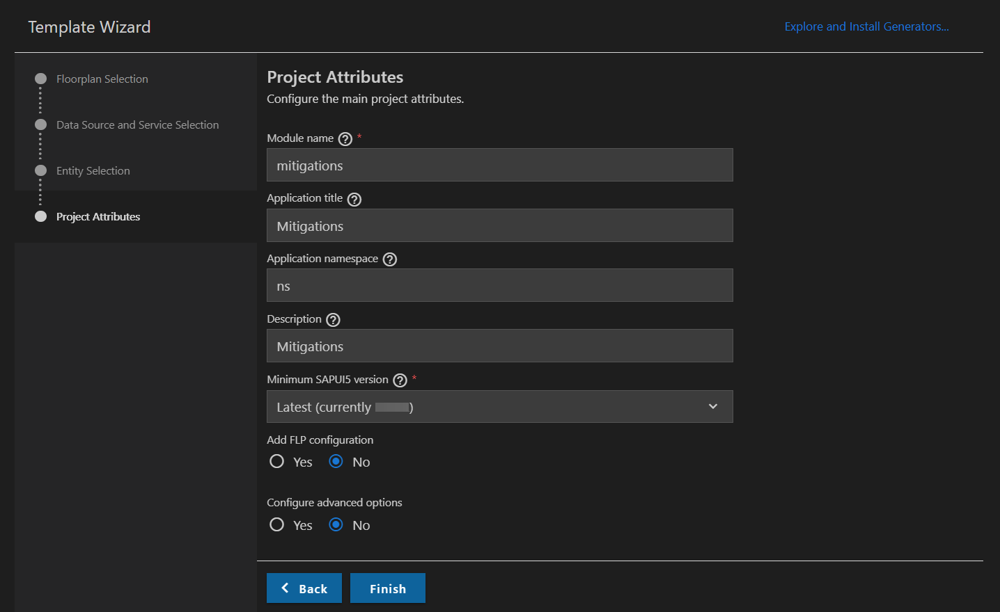

## Prerequisites
 - Before you start with this tutorial, you have two options:
    - Follow the instructions in **Step 16: Start from an example branch** of [Prepare Your Development Environment for CAP](btp-app-prepare-dev-environment-cap) to checkout the [`cap-business-logic`](https://github.com/SAP-samples/cloud-cap-risk-management/tree/cap-business-logic) branch.
    - Complete the previous tutorial [Add Business Logic to Your Application](btp-app-cap-business-logic) with all its prerequisites.


## Details
### You will learn
 - How to create a Freestyle SAPUI5 app on top of your CAP application
 - How to start the application

---

[ACCORDION-BEGIN [Step 1: ](SAP Fiori elements application vs. freestyle UI5 application)]
What is the difference between a freestyle SAPUI5 app and the SAP Fiori elements based application that you have already built in the tutorial [Create an SAP Fiori Elements-Based UI](btp-app-create-ui-fiori-elements)? As mentioned, both the freestyle app and the SAP Fiori elements app are based on SAPUI5.

SAP Fiori elements app:

- is built with SAPUI5 where most of the code resides outside your own development project in central components
- much of its logic is controlled by metadata from your OData service
- standard use cases available out of the box
- there are options to adjust your application outside of the possibilities given you via metadata with the so-called "Flexible Programming Model"

Freestyle UI5 app:

- lives mainly in your own project - all the views and controllers are in it
- still comes with all the features of SAPUI5 (super rich SAP Fiori compliant [set of UI controls](https://sapui5.hana.ondemand.com/#/controls), [data binding](https://sapui5.hana.ondemand.com/#/topic/e5310932a71f42daa41f3a6143efca9c), [model view controller](https://sapui5.hana.ondemand.com/#/topic/91f233476f4d1014b6dd926db0e91070), and so on)
- you can do what you need to do using SAPUI5, third party, and open-source components
- greater amount of work for standard use cases because you have to program them yourself but also greater freedom and optimization

Fortunately, you also have a choice of several templates that get your application kick started for freestyle UI5. They copy the initial code into your project and any change necessary for the app can be done manually by you in the code.

[VALIDATE_1]
[ACCORDION-END]
---
[ACCORDION-BEGIN [Step 2: ](Creating the application)]
1. In VS Code, invoke the Command Palette ( **View** &rarr; **Command Palette** or **⇧⌘P** for macOS / <kbd>Ctrl</kbd> + <kbd>Shift</kbd> + <kbd>P</kbd> for Windows) and choose **Fiori: Open Application Generator**.


    > In case you get an error launching the SAP Fiori application generator, refer to the [FAQ](https://help.sap.com/viewer/42532dbd1ebb434a80506113970f96e9/Latest/en-US) to find a solution.

2. Choose template type **Deprecated Templates** and template **SAP Fiori Worklist Application**.

       


4. Choose **Next**.

5. In the next dialog, choose **Use a Local CAP Project** and choose your current **`cpapp`** project.

    > In case you get the error: `Node module @sap/cds isn't found. Please install it and try again.`

    > This is an issue with the SAP Fiori application generator not finding the corresponding CAP modules, due to different repositories. This should be a temporary issue. For the meantime you can work around it by opening a command line and running the following command:

    > ```bash
    > npm install --global @sap/cds-dk --@sap:registry=https://npmjs.org/
    > ```

    > See the [CAP Troubleshooting guide](https://cap.cloud.sap/docs/advanced/troubleshooting#npm-installation) for more details.

5. Select the **`RiskService (Node.js)`** as the OData service and choose **Next**.

    

6. On the **Entity Selection** screen, select the following values and choose **Next**.

    

7. Enter `mitigations` as the module name and `Mitigations` as the application title.

8. Enter `ns` as the namespace and `Mitigations` as the description for the application.

9. Leave the default values for all other settings. 

9. Choose **Finish** to generate the application.

    

[DONE]
[ACCORDION-END]
---
[ACCORDION-BEGIN [Step 3: ](Starting the application)]
1. Make sure `cds watch` is still running in the project root folder:

    ```Shell/Bash
    cds watch
    ```

2. Open the URL <http://localhost:4004/>.

    You now see a new HTML page.

    !

3. Choose the `/mitigations/webapp/index.html` entry.

    !

    As a result, you can see a list but you can only see the IDs of the mitigations both in the list view and on the detail page. This is because the freestyle template only got the information from you that the `Object Collection ID` is the `ID` property of the `mitigations` service. You now need to add additional SAPUI5 controls that are bound to additional properties of the `mitigations` service.

4. Open the view of the work list `app/mitigations/webapp/view/Worklist.view.xml`  and add the following code, removing the `ID` and `tableUnitNumberColumnTitle` columns and instead adding `Description`, `Owner` and `Timeline` columns:

    ```XML[2-10,19-23]
        <columns>
            <Column id="DescriptionColumn">
                <Text text="Description" id="DescriptionColumnTitle"/>
            </Column>
            <Column id="OwnerColumn">
                <Text text="Owner" id="OwnerColumnTitle"/>
            </Column>
            <Column id="TimelineColumn">
                <Text text="Timeline" id="TimelineColumnTitle"/>
            </Column>
        </columns>

        <items>
            <ColumnListItem
                type="Navigation"
                press=".onPress">
                <cells>
                    <ObjectIdentifier
                        text="{description}" />
                    <Text
                        text="{owner}" />
                    <Text
                        text="{timeline}" />
                </cells>
            </ColumnListItem>
        </items>
    ```

5. Open the view of the object `app/mitigations/webapp/view/Object.view.xml` and also replace `ID` and add `Description`, `Owner`, and `Timeline` using SAPUI5 controls like `ObjectStatus` (you can copy the whole code and replace the existing code in the file):

    ```XML[4,16,28-34]
    <mvc:View
        controllerName="ns.mitigations.controller.Object"
        xmlns="sap.m"
        xmlns:l="sap.ui.layout"
        xmlns:mvc="sap.ui.core.mvc"
        xmlns:semantic="sap.f.semantic">

        <semantic:SemanticPage
            id="page"
            headerPinnable="false"
            toggleHeaderOnTitleClick="false"
            busy="{objectView>/busy}"
            busyIndicatorDelay="{objectView>/delay}">

            <semantic:titleHeading>
                <Title text="{description}" />
            </semantic:titleHeading>

            <semantic:headerContent>
                <ObjectNumber
                />
            </semantic:headerContent>

            <semantic:sendEmailAction>
                <semantic:SendEmailAction id="shareEmail" press=".onShareEmailPress"/>
            </semantic:sendEmailAction>

            <semantic:content>
                <l:VerticalLayout>
                    <ObjectStatus title="Description" text="{description}"/>
                    <ObjectStatus title="Owner" text="{owner}"/>
                    <ObjectStatus title="Timeline" text="{timeline}"/>
                </l:VerticalLayout>
            </semantic:content>


        </semantic:SemanticPage>

    </mvc:View>
    ```

6. Refresh the `mitigations` application in your browser.

    You can now see the new content in the work list ...

    !

    ... as well as in the detail object page.

    !

[DONE]
The result of this tutorial can be found in the [`create-ui-freestyle-sapui5`](https://github.com/SAP-samples/cloud-cap-risk-management/tree/create-ui-freestyle-sapui5) branch.


[ACCORDION-END]
---