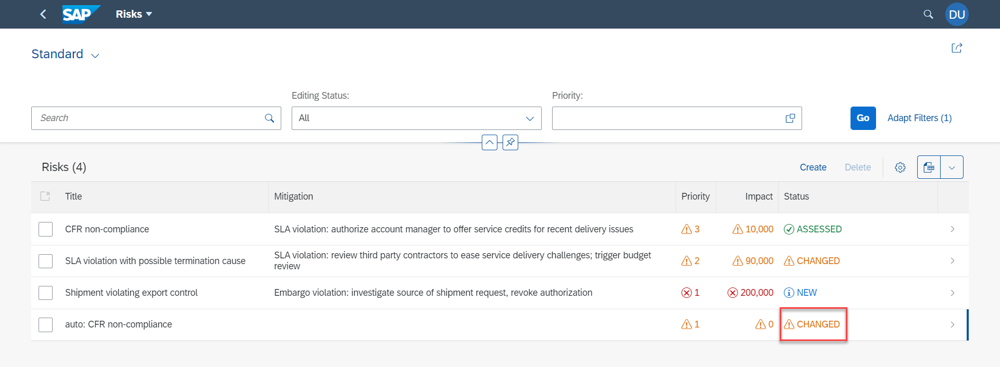

## Prerequisites
 - [Prepare Your Development Environment for CAP](btp-app-prepare-dev-environment-cap)
 - Before you start with this tutorial, you have two options:
    - Follow the instructions in **Step 16: Start from an example branch** of [Prepare Your Development Environment for CAP](btp-app-prepare-dev-environment-cap) to checkout the [`ext-service-s4hc-use`](https://github.com/SAP-samples/cloud-cap-risk-management/tree/ext-service-s4hc-use) branch.
    - Complete the mission [Consume Remote Services from SAP S/4HANA Cloud Using CAP](mission.btp-consume-external-service-cap).
 - On SAP BTP side:
    - You have an [enterprise](https://help.sap.com/viewer/65de2977205c403bbc107264b8eccf4b/Cloud/en-US/171511cc425c4e079d0684936486eee6.html) global account in SAP BTP.
    - You must be an administrator of the SAP BTP global account where you want to register your SAP S/4HANA Cloud system.
    - Your SAP BTP subaccount has quota for the services `SAP Build Work Zone, standard edition` and `SAP HTML5 Applications Repository service` as described in [Prepare for SAP BTP Development](btp-app-prepare-btp).
    - You have to [Use an existing SAP HANA Cloud service instance](https://developers.sap.com/tutorials/btp-app-hana-cloud-setup.html#42a0e8d7-8593-48f1-9a0e-67ef7ee4df18) or [Set up a new SAP HANA Cloud service instance](https://developers.sap.com/tutorials/btp-app-hana-cloud-setup.html#3b20e31c-e9eb-44f7-98ed-ceabfd9e586e) for the deployment. After the deployment, you need to [Subscribe to the SAP Build Work Zone, Standard Edition](btp-app-work-zone-subscribe).
 - On SAP S/4HANA Cloud side:
    - You have a dedicated SAP S/4HANA Cloud tenant.
    - You must be an administrator of the SAP S/4HANA Cloud system.
    - You need to connect this system to your SAP BTP global account, if you'd like to build extension applications for your SAP S/4HANA Cloud system.

## Details
### You will learn
 - How to configure your CAP application for eventing
 - How to locally test your changes
 - How to deploy your CAP application

---

[ACCORDION-BEGIN [Step 1: ](Configure your CAP application for eventing)]
> ### To earn your badge for the whole mission, you will need to mark all steps in a tutorial as done, including any optional ones that you may have skipped because they are not relevant for you.

CAP provides native support for emitting and receiving events. Hence, CAP applications can receive events for changes in remote systems. In CAP, the messaging follows a publish subscribe (pub/sub) model. Pub/sub means that sources publish messages and interested consumers can subscribe to receive them. This helps with scalability, decoupling of services, and robustness.

Using the Business Partner service that you added in `Step 1: Get the Business Partner service definition` from the tutorial [Add the Consumption of an External Service to Your CAP Application](btp-app-ext-service-add-consumption), you will configure the CAP application to listen and react to events from your SAP S/4HANA Cloud system. As in the previous tutorials, let's again use the example of business partners that are suppliers. So, you will use suppliers when referring to business partners. First you will add event definitions for the SAP S/4HANA events.

1. Copy the files `API_BUSINESS_PARTNER.js` and `API_BUSINESS_PARTNER-extended.cds` from `tutorial/templates/events-s4hc-use/srv/external` to the `srv/external` folder of your app.

    `API_BUSINESS_PARTNER.js` extends the default behavior of the Business Partner service to also emit events. This allows you to test the events-related behaviors locally.

    Let's look at the `API_BUSINESS_PARTNER-extended.cds` file.

    ```JavaScript
      using { API_BUSINESS_PARTNER } from './API_BUSINESS_PARTNER';

      extend service API_BUSINESS_PARTNER {

      @topic: 'sap.s4.beh.businesspartner.v1.BusinessPartner.Created.v1'
      event Created : {
        BusinessPartner : API_BUSINESS_PARTNER.A_BusinessPartner:BusinessPartner
      }

      @topic: 'sap.s4.beh.businesspartner.v1.BusinessPartner.Changed.v1'
      event Changed : {
          BusinessPartner : API_BUSINESS_PARTNER.A_BusinessPartner:BusinessPartner
      }
    }
    ```

    For event `Created`, there's a `@topic` annotation with content `sap.s4.beh.businesspartner.v1.BusinessPartner.Created.v1`. This is specific to the outbound topic `sap/s4/beh/businesspartner/v1/BusinessPartner/Created/v1` in the SAP S/4HANA Cloud system that you will configure in [Enable Events from SAP S/4HANA Cloud to SAP BTP](btp-app-events-enable-s4hc). Similarly, event `Changed` also has a topic annotation with content `sap.s4.beh.businesspartner.v1.BusinessPartner.Changed.v1`.

2. Open the `package.json` file and add the `model` and `messaging` configurations:

    <!-- cpes-file package.json:$.cds -->
    ```JSON[8,10-18]
    {
      ...
      "cds": {
        "requires": {
          ...
          "API_BUSINESS_PARTNER": {
            "kind": "odata-v2",
            "model": "srv/external/API_BUSINESS_PARTNER-extended",
            ...
          },
          "messaging": {
            "kind": "local-messaging",
            "[production]": {
                "kind": "enterprise-messaging-shared",
                "format": "cloudevents",
                "publishPrefix": "$namespace/ce/",
                "subscribePrefix": "+/+/+/ce/"
            }
          }
        },
        ...
    ```

    What happens here?

    * `"model": "srv/external/API_BUSINESS_PARTNER-extended"` specifies the model that is extended with event declarations for business partners with the respective SAP S4/HANA topic annotations.
    * `"kind": "local-messaging"` Allows services running in the same process to send and receive messages locally. Other options for local testing are [`file` for services running in different processes](https://cap.cloud.sap/docs/guides/messaging/#1-use-file-based-messaging-in-development) and [connecting to an event mesh instance on BTP](https://cap.cloud.sap/docs/guides/messaging/event-mesh#run-tests-in-hybrid-setup).
    * In production you will use the [SAP Event Mesh service](https://help.sap.com/docs/SAP_EM?locale=en-US), hence the line `"kind": "enterprise-messaging-shared"`.
    * `"format": "cloudevents"` configures the format of the event data, which allows [CAP to fill in required fields](https://cap.cloud.sap/docs/guides/messaging/#cloudevents) behind the scenes.
    * The `publishPrefix` is specified for all events emitted from the application (`$namespace/ce/`). This is not used in this application as you don't emit any events.
    * `subscribePrefix` is specified to match all the Cloud Events sent to the subaccount. The `ce/` part in the expression `+/+/+/ce/` refers to the cloud events.

    > Namespace info for `subscribePrefix` and `publishPrefix`

    >   The `$namespace` of the event topic name will be generated for SAP S/4HANA when deploying the `cpapp-bupa-messaging` service where you specify the client name, for example, `sap/S4HANAOD/RISK/`. To match the namespace you are specifying the pattern with 3 `+`'s separated by `/`.

3. Since SAP S/4HANA integrates SAP Event Mesh for messaging, you need an AMQP (Advanced Message Queuing Protocol) client so our app can communicate with SAP Event Mesh. Run the following command to install it:

    ```Shell/Bash
    npm install @sap/xb-msg-amqp-v100
    ```

[VALIDATE_1]
[ACCORDION-END]
---
[ACCORDION-BEGIN [Step 2: ](Add a status field)]
Currently, business partner (that is, supplier) data is stored only in the SAP S/4HANA Cloud system and it would be slow to call the Business Partner API every time you want to show the status. To keep it fast, you will add a `status` field to reflect the assessment status of the supplier and update the application logic with event handling to keep this value updated as it changes in the remote SAP S/4HANA Cloud system.

1. Add the following properties and persistence for `BusinessPartners` entity to the `db/schema.cds` file:

    <!-- cpes-file db/schema.cds -->
    ```JavaScript[13,16-20]
    namespace sap.ui.riskmanagement;
    using { managed } from '@sap/cds/common';

      entity Risks : managed {
        key ID      : UUID  @(Core.Computed : true);
        title       : String(100);
        prio        : String(5);
        descr       : String;
        miti        : Association to Mitigations;
        impact      : Integer;
        criticality : Integer;
        supplier    : Association to Suppliers;
        status      : Association to StatusValues;
      }

      @cds.autoexpose
      entity StatusValues {
        key value:String;
        criticality: Integer;
      }
      ...
    ```

2. Create a `csv` folder within the `db` directory of your project.

3. Copy the file `sap.ui.riskmanagement-StatusValues.csv` from `templates/events-s4hc-use/db/csv` to the `db/csv` folder. The `csv` file contains the data for the new status column that needs to be deployed to SAP BTP.

4. Copy the file `tutorial/templates/events-s4hc-use/db/data/sap.ui.riskmanagement-Risks.csv` to the `db/data` folder. When prompted whether to replace the already existing file and confirm.

5. Next, you have to configure the CAP application to process incoming events. When a new supplier is created in the SAP S/4HANA Cloud system, a corresponding risk will be created in the CAP application. Add the following code to the `srv/risk-service.js` file:

    <!-- cpes-file srv/risk-service.js -->
    ```JavaScript[2-3,14-44]
    const cds = require('@sap/cds');
    const { Risks } = cds.entities;
    const LOG = cds.log('risk-service');

    /**
     * Implementation for Risk Management service defined in ./risk-service.cds
    */
    module.exports = cds.service.impl(async function() {
      ...
          // Risks?$expand=supplier
        this.on("READ", 'Risks', async (req, next) => {
            ...
        });
        this.after('UPDATE', 'Risks', async (riskData) => {
            if(riskData.impact > 1000) return;
            riskData.status_value = 'ASSESSED';
            await UPDATE(Risks).set({status_value: 'ASSESSED'}).where({ID: riskData.ID});
        });

        bupa.on( 'Created', async (msg) => {
            const { BusinessPartner } = msg.data;
            LOG.info('Received created! BusinessPartner=' + BusinessPartner);
            await createRisk(BusinessPartner);
        });

        bupa.on( 'Changed', async (msg) => {
            const { BusinessPartner } = msg.data;
            LOG.info('Received changed! BusinessPartner=' + BusinessPartner);
            if((await SELECT.one.from(Risks).where({supplier_ID: BusinessPartner})).status_value === 'NEW') return;
            await UPDATE(Risks).set({status_value: 'CHANGED'}).where({'supplier_ID' : BusinessPartner});
        });

        async function createRisk(businessPartner) {
            const payload = {
                title: 'auto: CFR non-compliance',
                descr: 'New Business Partner might violate CFR code',
                prio: '1',
                impact: 200000,
                supplier_ID: businessPartner,
                status_value: 'NEW'
            }
            LOG.info("Creating auto risk with", payload);
            await INSERT.into(Risks).entries(payload);
        }
    });
    ```

6. To add the new status column to the table in the work list page and the object page, open the `srv/risks-service-ui.cds` file and add the following lines:

    ```JavaScript[9,25-28,36]
    using RiskService from './risk-service';

    annotate RiskService.Risks with {
      title       @title: 'Title';
      prio        @title: 'Priority';
      descr       @title: 'Description';
      miti        @title: 'Mitigation';
      impact      @title: 'Impact';
      status      @readonly @title: 'Status';
      supplier    @(
            title: 'Supplier',
            Common.Text: supplier.fullName,
            Common.TextArrangement: #TextOnly
        )
    }
    ...
    annotate RiskService.Risks with @(
      UI: {
        ...
        LineItem: [
          ...
          {
            Value: impact,
            Criticality: criticality
          },
          {
            Value:          status_value,
            Criticality: status.criticality
          }
        ]
        ...
        FieldGroup#Main: {
          Data: [
            ...
            {Value: supplier.isBlocked},
            {Value: status_value, Criticality: status.criticality},
          ]
    ...
    ```

[DONE]
[ACCORDION-END]
---
[ACCORDION-BEGIN [Step 3: ](Test your changes locally)]
So, you have added logic to create a new risk when an event for a newly created supplier is received. You have also added logic to update our risks when an event for an updated supplier is received from our SAP HANA Cloud system. This is achieved by listening to events from the SAP S/4HANA Cloud system.

Now simulate locally business partner creation and update, and see the results:

1. Run `cds watch` and open the **Risks** application: [http://localhost:4004/launchpage.html#risks-app](http://localhost:4004/launchpage.html#risks-app).

2. Choose **Go** and login to see the new **Status** column.

      - **Username**: `risk.manager@tester.sap.com`
      - **Password**: `initial`

      !

    > See tutorial [Implement Roles and Authorization Checks In CAP](btp-app-cap-roles) to learn more about authentication and role restrictions in CAP.

3. With `cds watch` running, open another terminal and execute the following command to locally simulate a business partner creation event:

    ```Shell/Bash
    curl -H 'Content-Type: application/json' -X POST "http://localhost:4004/api-business-partner/A_BusinessPartner" --data '{"BusinessPartner": "123","BusinessPartnerFullName": "New"}'
    ```

    > Can't run the `curl` command?

    > * If you encounter any errors running the `curl` command, make sure you are using the `Git BASH` command line interpreter, as advised in `Step 2: Command Line Interpreters` in this [tutorial](btp-app-set-up-local-development).
    > * If you still like to use a different command line interpreter, you can use cURL. For MacOS cURL should already be available, for Windows see the instructions on how to install [cURL](https://chocolatey.org/packages/Curl).


4. Refresh the page and choose **Go** again. You will see a new risk in the table.

    !

5. Open the new risk's object page and change the value in the **Impact** field to 0.

    !

6. The status of the new risk is updated.

    !

7. With `cds watch` running, open another terminal and execute the following command to locally simulate a business partner update event:

    ```Shell/Bash
    curl -H 'Content-Type: application/json' -X PATCH "http://localhost:4004/api-business-partner/A_BusinessPartner(BusinessPartner='123')" --data '{"BusinessPartnerFullName": "Changed"}'
    ```

8. Refresh the page and choose **Go**. The status of the new risk is updated again.

    !

The results of these steps can be found in the [eventing](https://github.tools.sap/CPES/CPAppDevelopment/tree/s4h/eventing) branch.

[DONE]
[ACCORDION-END]
---
[ACCORDION-BEGIN [Step 4: ](Deploy your CAP application)]
The SAP Event Mesh service is the messaging service that helps applications running on the SAP BTP to send and receive events. To work with events from SAP S/4HANA Cloud, you need an instance of the messaging service, which will act as a client to the SAP Event Mesh service.

1. Add the following lines to the `mta.yaml` file:

    ```YAML[11,15-31]
    ...
    modules:
    - name: cpapp-srv
      type: nodejs
      path: gen/srv
      requires:
      - name: cpapp-db
      - name: cpapp-uaa
      - name: cpapp-logs
      - name: cpapp-destination
      - name: cpapp-em
    ...
    resources:
    ...
    - name: cpapp-em
      type: org.cloudfoundry.managed-service
      parameters:
        path: ./enterprise-messaging.json
        service: enterprise-messaging
        service-plan: default
    - name: cpapp-bupa-messaging
      type: org.cloudfoundry.managed-service
      parameters:
        skip-service-updates:
            plan: true
            parameters: true
            tags: true
        path: ./bupa-messaging.json
        service: s4-hana-cloud
        service-plan: messaging
        system-name: CPAPP_S4HANA_CLOUD
    parameters:
    ...
    ```

2. Copy the configuration files for the messaging services `bupa-messaging.json` and `enterprise-messaging.json` from `tutorial/templates/events-s4hc-use/` to your project folder.

    * The `bupa-messaging.json` file has the name of the SAP S/4HANA Cloud system that was configured in [Register Your SAP S/4HANA Cloud System](btp-app-ext-service-s4hc-register) and the client ID, which will be used to generate the communications arrangement and channel with the SAP S/4HANA Cloud system. In this tutorial, you use the ID `RISK` and the corresponding channel for event binding is `SAP_CP_XF_RISK`.

    * The `enterprise-messaging.json` file has the SAP Event Mesh service instance name and the application namespace for publishing events. Since you are consuming events from SAP S/4HANA Cloud, the subscribe filter is set as `*` allowing all the received events. The publishing filter adds the application namespace for all events that maybe emitted from our `cpapp` application.

3. Build the MTA module:

    ```Shell/Bash
    mbt build -t ./
    ```

    This creates a `mtar` file `cpapp_1.0.0.mtar` in the current folder (option: `-t ./`).

4. Deploy the module to your current Cloud Foundry space.

    ```Shell/Bash
    cf deploy cpapp_1.0.0.mtar
    ```

    In the next tutorial, you will continue with connecting our CAP application to the SAP S/4HANA Cloud system.

[DONE]
The result of this tutorial can be found in the [`events-s4hc-use`](https://github.com/SAP-samples/cloud-cap-risk-management/tree/events-s4hc-use) branch.


[ACCORDION-END]
---