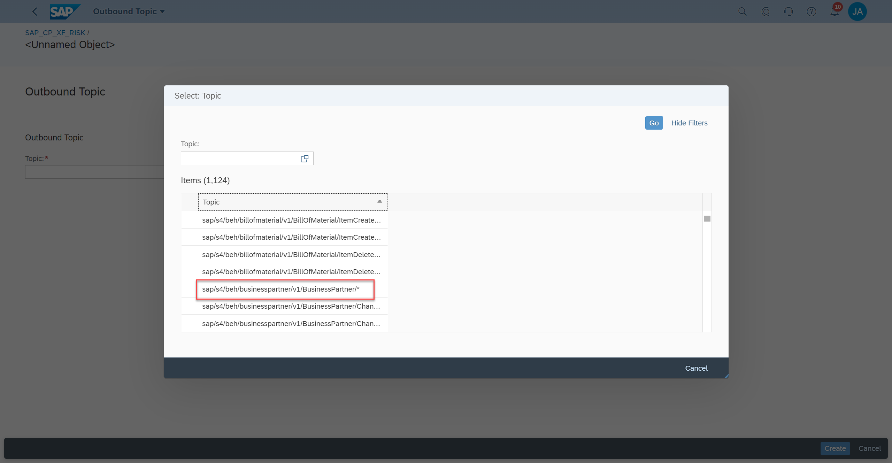
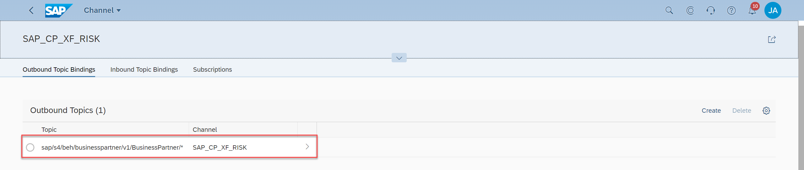

## Prerequisites
 - [Set Up Your CAP Application for Eventing](btp-app-events-app-setup-s4hc)

## Details
### You will learn
 - How to add an event topic to your event channel

---

[ACCORDION-BEGIN [Step 1: ](Add the Business Partner topic to your event channel)]
1. Log on to your SAP S/4HANA Cloud system.

2. Go to **Enterprise Event Enablement**.

      !

      If you can't find **Enterprise Event Enablement**, you can also use the **Search** field:
         !

3. To start, you have to set relevant filters. Open the value help for the **Channel** field.

      !

4. In the dialog **Define Conditions: Channel**, add a `RISK` condition and choose **OK**.

      !

5. Choose **Go**. You will see the `SAP_CF_XF_RISK` channel in the filtered list.

      !

4. Choose the channel and then choose **Create** in section **Outbound Topics**.

      !

5. Open the value help of the **Topic** field.

      !

6. Select the topic `sap/s4/beh/businesspartner/v1/BusinessPartner/*`.

      !

7. Choose **Create**.

      !

8. Once creation is done, the selected topic will be visible in the channel.

      !

> You can also bind multiple topics for the same active channel.

[VALIDATE_1]
[ACCORDION-END]
---