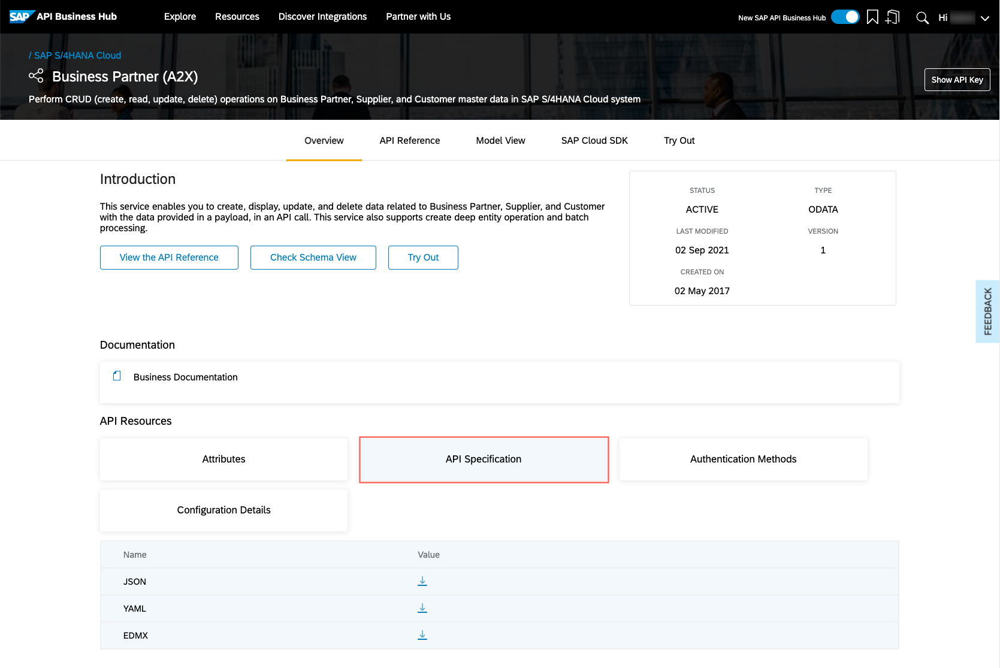
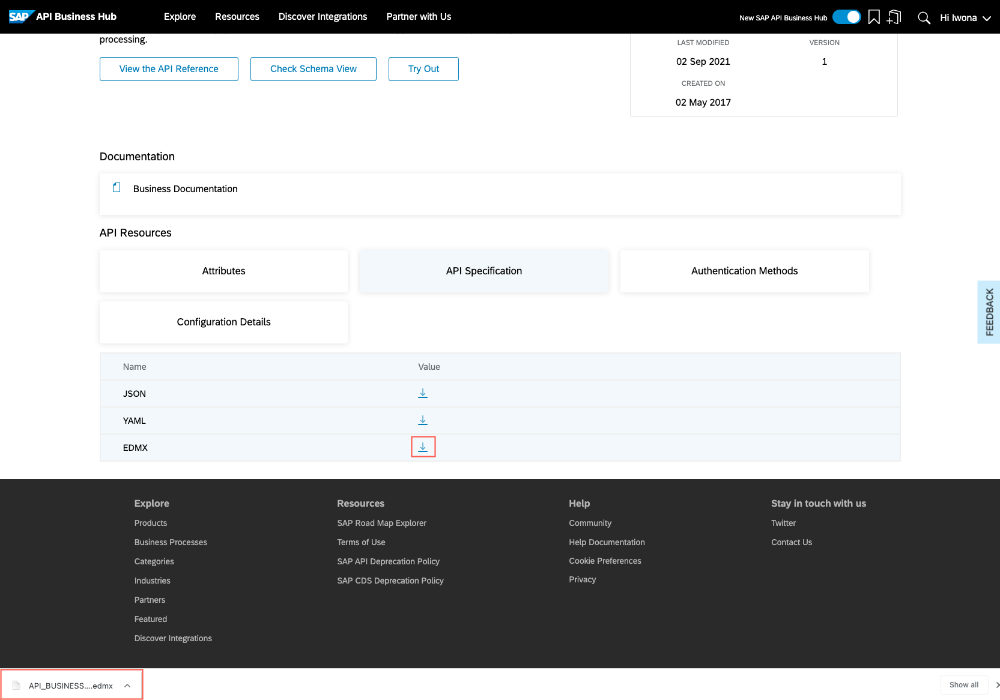
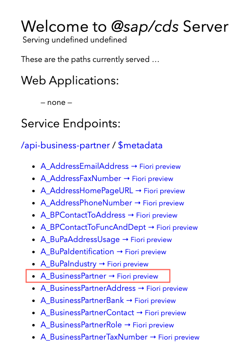
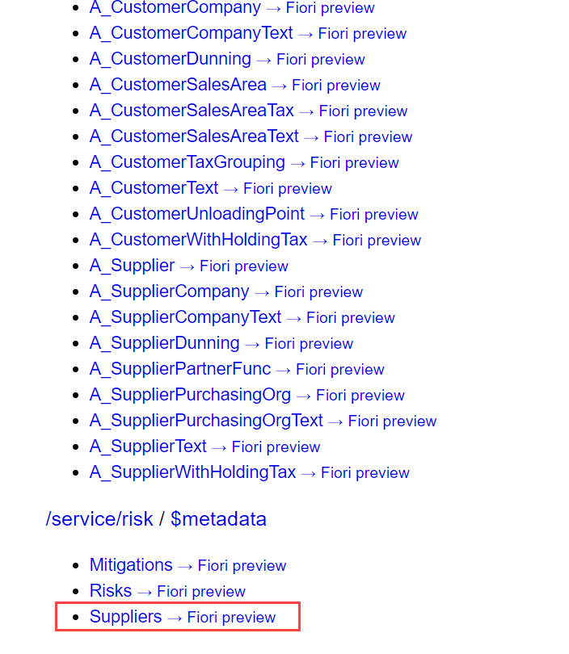
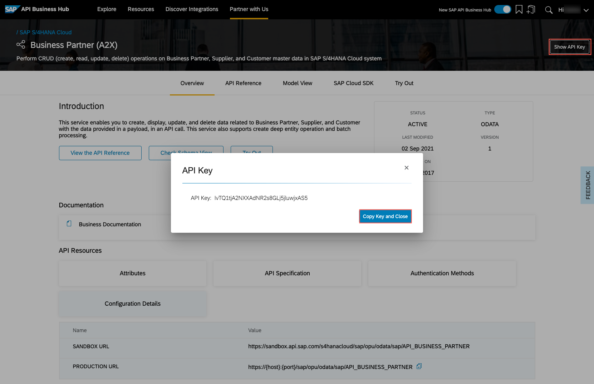
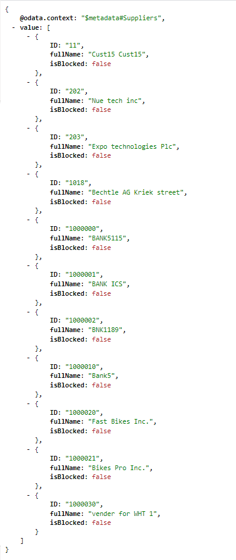

## Prerequisites
 - [Prepare Your Development Environment for CAP](btp-app-prepare-dev-environment-cap)
 - Before you start with this tutorial, you have two options:
    - Follow the instructions in **Step 16: Start from an example branch** of [Prepare Your Development Environment for CAP](btp-app-prepare-dev-environment-cap) to checkout the [`logging`](https://github.com/SAP-samples/cloud-cap-risk-management/tree/logging) branch.
    - Complete the group of tutorials [Deploy Your CAP Application on SAP BTP Cloud Foundry Environment](group.btp-app-cap-deploy).

## Details
### You will learn
 - How to get service definition
 - How to add a service to your project
 - How to add mock data
 - How to connect to the sandbox service
 - How to delegate requests to external services
 - How to add the API key

---

[ACCORDION-BEGIN [Step 1: ](Get the Business Partner service definition)]
SAP publishes service definitions for its major products on **SAP API Business Hub**. These service definitions are required to use remote services in CAP. For example, to call a remote service, build projections upon them, and to mesh-up with them.

1. Open [**SAP API Business Hub**](https://api.sap.com/).

2. Choose the tile **S/4HANA Cloud**.

3. Navigate to tab **APIs**.

4. Navigate to tab **ODATA V2**.

5. Search for `Business Partner (A2X)`.

6. Choose **Business Partner (A2X)**.

7. Choose **API Specification**.

    !

8.  Choose the download button for `EDMX` option in the **Value** column. Log on to SAP API Business Hub if you have to.

    If you are using Google Chrome as a browser, you now see the downloaded EDMX file in the footer bar:

    !

    > In case you have problems downloading the file, you can also find `API_BUSINESS_PARTNER.edmx` within your Finder/File Explorer in the directory `tutorial/templates/ext-service-add/srv/external`.


[DONE]
[ACCORDION-END]
---
[ACCORDION-BEGIN [Step 2: ](Add the Business Partner service to your project)]
From your project's root folder, run the `cds import` command with the path of your downloaded `API_BUSSINESS_PARTNER.edmx` file.

For example:

```Shell/Bash
cds import ~/Downloads/API_BUSINESS_PARTNER.edmx
```

Output:

```Shell/Bash
[cds] - imported API to srv/external/API_BUSINESS_PARTNER.csn
> use it in your CDS models through the like of:

using { API_BUSINESS_PARTNER as external } from './external/API_BUSINESS_PARTNER';

[cds] - updated ./package.json
```

The command will copy the EDMX file to the `srv/external` folder of your project and convert it to CAP's format CSN, which will be placed there as well (`srv/external/API_BUSINESS_PARTNER.csn`).

Additionally, the file will be registered as service definition in the `package.json` file:

<!-- snippet package.json API_BUSINESS_PARTNER -->
```JSON[4-8]
  "cds": {
    "requires": {
       ...
       "API_BUSINESS_PARTNER": {
        "kind": "odata-v2",
        "model": "srv/external/API_BUSINESS_PARTNER"
      }
```

[DONE]
[ACCORDION-END]
---
[ACCORDION-BEGIN [Step 3: ](Add mock data for Business Partner)]
In this step, you add some mock data for the business partner service. This allows you to perform tests using the service without the need to connect to an actual remote service.

1. Copy the folder `data` from `tutorial/templates/ext-service-add/srv/external` to the `srv/external` folder of your app. If VS Code asks you whether to copy the folder, confirm.

    The folder contains a CSV file `API_BUSINESS_PARTNER-A_BusinessPartner.csv` with some business partner data.

2. Start your CAP application, if it's not still running:

    ```Shell/Bash
    cds watch
    ```

    In the `cds watch` output, you find the information about the two services:

    ```Shell/Bash
    ...
    > init from ./srv/external/data/API_BUSINESS_PARTNER-A_BusinessPartner.csv
    ...
    [cds] - mocking API_BUSINESS_PARTNER { at: '/api-business-partner' }
    [cds] - serving RiskService { at: '/service/risk', impl: './srv/risk-service.js' }
    ```

    Because the external `API_BUSINESS_PARTNER` service isn't connected to a real remote service, it get's mocked with your mock data.

3. Open the CAP application in your browser: [http://localhost:4004/](http://localhost:4004/)

    You can now see the `api-business-partner` service with all its entities under `Service Endpoints`.

4. Choose `A_BusinessPartner`:

    !


    For this application, you need only a few fields from the `A_BusinessPartner` entity. To do this, you create a projection on the external service. Since in this example, you are only interested in the business partners that are suppliers, you use the name `Suppliers` for your projection.

5. Open the `db/schema.cds` file and add the following entity at the end of the file:

    ```JavaScript
    using {  API_BUSINESS_PARTNER as bupa } from '../srv/external/API_BUSINESS_PARTNER';

        entity Suppliers as projection on bupa.A_BusinessPartner {
            key BusinessPartner as ID,
            BusinessPartnerFullName as fullName,
            BusinessPartnerIsBlocked as isBlocked,
    }
    ```

    In the projection, the fields are also given more appealing names. It is much easier to work with your own projection and by this you also avoid requesting data that you are not interested in.

6. Expose supplier information through your service by adding the following lines to your `srv/risk-service.cds` file:

    ```JavaScript[7-13]
    service RiskService {
        entity Risks @(restrict : [
        ...
              ]) as projection on my.Risks;
          annotate Risks with @odata.draft.enabled;
        ...
        @readonly
        entity Suppliers @(restrict : [
                  {
                      grant : [ 'READ' ],
                      to : [ 'RiskViewer', 'RiskManager' ]
                  }
              ]) as projection on my.Suppliers;
    }
    ```

    The service is limited to read accesses using `@readonly` and the read permission is given to the roles `RiskViewer` and `RiskManager`.

7. Open the CAP application in your browser: [http://localhost:4004/](http://localhost:4004/)

8. Choose `Suppliers` under `Risks` service:

    !

    Now, you can see just the supplier information.

[DONE]
[ACCORDION-END]
---
[ACCORDION-BEGIN [Step 4: ](Connect to the sandbox service)]
Later in the tutorial [Use SAP S/4HANA Cloud Service](btp-app-ext-service-s4hc-use), you will learn how to connect the business partner service with a real SAP S/4HANA system. In this tutorial here, you use the sandbox system to try out your application with a real remote system.

1. Install the node packages to mock the external services:

    ```Shell/Bash
    npm install @sap-cloud-sdk/http-client @sap-cloud-sdk/util
    ```

1. Open again the [**Business Partner (A2X)**](https://api.sap.com/api/API_BUSINESS_PARTNER/overview) page on the **SAP API Business Hub**.

2. Under **Overview** &rarr; **Configuration Details**, you find the **Sandbox URL**. Keep the page open, you'll need it later again.

    !

3. Add a new profile `sandbox` that uses the URL of the sandbox in your `package.json` file:

    ```JSON[4-8]
        "API_BUSINESS_PARTNER": {
          "kind": "odata-v2",
          "model": "srv/external/API_BUSINESS_PARTNER",
          "[sandbox]": {
            "credentials": {
                "url": "https://sandbox.api.sap.com/s4hanacloud/sap/opu/odata/sap/API_BUSINESS_PARTNER/"
            }
          }
        }
    ```

4. Run `cds watch` with the sandbox profile:

    ```Shell/Bash
    cds watch --profile sandbox
    ```

    With the `--profile` parameter all settings enclosed in `[sandbox]` will be added to the default development settings for `cds watch`.

5. Open the CAP application's URL and try to access your `Suppliers` service entity again: [http://localhost:4004/service/risk/Suppliers](http://localhost:4004/service/risk/Suppliers)

6. You will see an error message:

    ```
    <error xmlns="http://docs.oasis-open.org/odata/ns/metadata">
    <code>500</code>
    <message>SQLITE_ERROR: no such table: RiskService_BusinessPartners in: SELECT ID, businessPartnerFullName, businessPartnerIsBlocked, searchTerm1 FROM RiskService_BusinessPartners ALIAS_1 ORDER BY ID COLLATE NOCASE ASC LIMIT 11</message>
    </error>
    ```

    The `API_BUSINESS_PARTNER` service is now configured as a remote service. Service requests will not be automatically delegated to remote services. This delegation happens only for services based on database entities and mock services. For that reason, it worked in the local mocking mode before.

[DONE]
[ACCORDION-END]
---
[ACCORDION-BEGIN [Step 5: ](Delegate requests to external services)]
To solve this issue, you add some handler code to delegate the call from the `Suppliers` service entity to the remote `API_BUSINESS_PARTNER` service.

1. Open the file `srv/risk-service.js` and add the following lines:

    ```JavaScript[8-12]
    const cds = require('@sap/cds');

    /**
    * Implementation for Risk Management service defined in ./risk-service.cds
    */
    module.exports = cds.service.impl(async function() {

        const bupa = await cds.connect.to('API_BUSINESS_PARTNER');

        this.on('READ', 'Suppliers', async req => {
            return bupa.run(req.query);
        });

        this.after('READ', 'Risks', risksData => {
            ...
        });
    });
    ```

    First, the code connects to the remote service. The new handler for `Risks` delegates all read requests to the remote service.

    The CAP server maps the request for the `Suppliers` projection to the remote service. The result is mapped back. For example, field names need to be mapped between the `ID` field of `Suppliers` and the `BusinessPartner` field that the remote service knows. The CAP server does this based on your defined projection. This works for multiple levels of projections as well.

2. Run `cds watch` with the sandbox profile:

    ```Shell/Bash
    cds watch --profile sandbox
    ```

3. Open the CAP application's URL and try to access your `Suppliers` service again: [http://localhost:4004/service/risk/Suppliers?$top=11](http://localhost:4004/service/risk/Suppliers?$top=11)

4. You will see another error message:

    ```
    <error xmlns="http://docs.oasis-open.org/odata/ns/metadata">
    <code>502</code>
    <message>Error during request to remote service: Request failed with status code 401</message>
    </error>
    ```

    The request is sent to the remote service. But it fails, because the sandbox requires an API Key for authentication.

[DONE]
[ACCORDION-END]
---
[ACCORDION-BEGIN [Step 6: ](Add the API key)]
You take an API key from **SAP API Business Hub**, put it in an environment variable and add it to all requests for the business partner (`bupa`) service.

This code is required for the sandbox only. The authentication for SAP S/4HANA systems works without custom code.

1. Go back to your open [**Business Partner (A2X)**](https://api.sap.com/api/API_BUSINESS_PARTNER/overview) API page.

2. Choose **Show API Key** on the right.

3. Choose **Copy Key and Close**.

    !

4. Create a new file `.env` in your project folder and add an environment variable in the file with the copied API Key:

    ```env
    cds.requires.API_BUSINESS_PARTNER.[sandbox].credentials.headers.APIKey=<Copied API Key>
    ```

    The `.env` file is used to add additional environment variables for local testing. By setting environment variables starting with `cds.` or `cds_`, you can add settings to your CAP configuration.

    In this example, it has the same effect as the following configuration in the `package.json` file:

    ```JSON
    {
        "cds": {
            "API_BUSINESS_PARTNER": {
                "[sandbox]": {
                    "credentials": {
                        "headers": {
                            "APIKey": "<Copied API Key>"
                        }
                    }
                }
            }
        }
    }
    ```

    But by putting it in a separate file, you can exclude it from being pushed to the git repository as described in the next step.

5. Add the `.env` file to `.gitignore`:

    ```gitignore
    ...

    .env
    ```

6. Run `cds watch` with the sandbox profile:

    ```Shell/Bash
    cds watch --profile sandbox
    ```

7. Open the CAP application's URL and try to access your `Suppliers` service again: [http://localhost:4004/service/risk/Suppliers?$top=11](http://localhost:4004/service/risk/Suppliers?$top=11)

8. Now, you can see the Business Partner data from the sandbox transformed to your projection.

    !

[VALIDATE_1]
The result of this tutorial can be found in the [`ext-service-add-consumption`](https://github.com/SAP-samples/cloud-cap-risk-management/tree/ext-service-add-consumption) branch.


[ACCORDION-END]
---