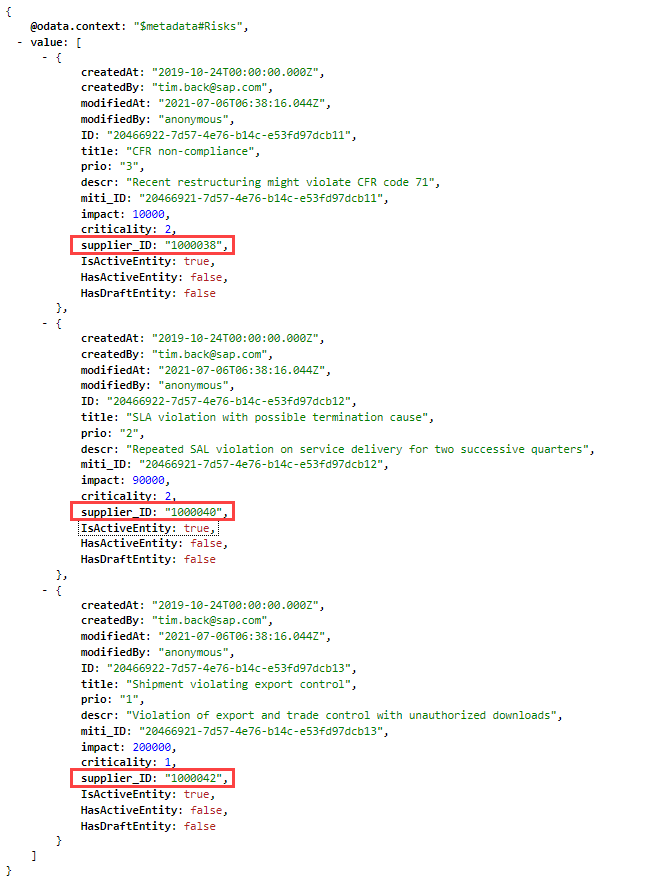
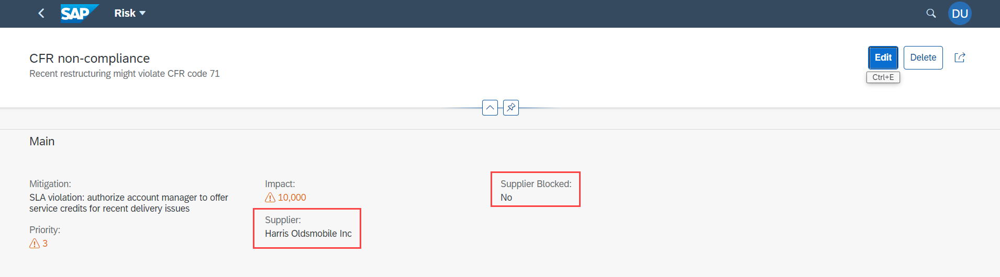
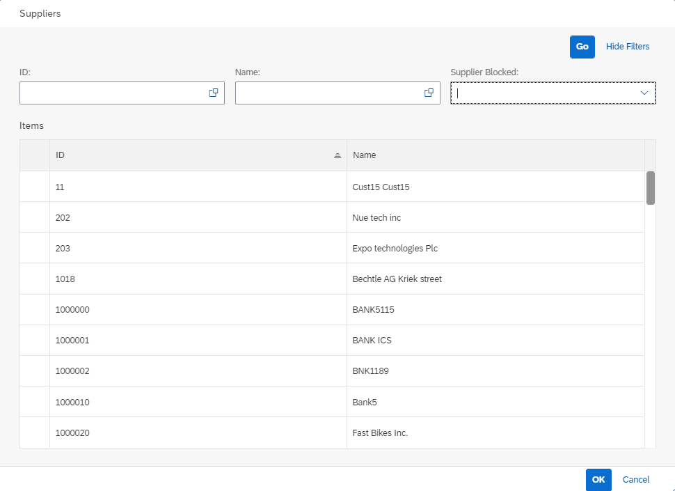

## Prerequisites
 - [Add the Consumption of an External Service to Your CAP Application](btp-app-ext-service-add-consumption)

## Details
### You will learn
 - How to add supplier to `Risks` entity
 - How to handle expands to remote entities
 - How to add supplier information to the Risks UI
 - How to add value help to select a supplier

---

[ACCORDION-BEGIN [Step 1: ](Add Supplier to Risks entity)]
1. Open `db/schema.cds` and add the supplier to the `Risks` entity using an association to the `Suppliers` entity:

    ```JavaScript[9-9]
    entity Risks : managed {
        key ID      : UUID  @(Core.Computed : true);
        title       : String(100);
        prio        : String(5);
        descr       : String;
        miti        : Association to Mitigations;
        impact      : Integer;
        criticality : Integer;
        supplier    : Association to Suppliers;
    }
    ```

    This managed association adds a property `supplier_ID` to the `Risks` entity under the hood, so that the key and the ID field of the supplier can be stored.

2. Copy the file `tutorial/templates/ext-service-consume-ui/db/data/sap.ui.riskmanagement-Risks.csv` to `db/data` folder of your app, overwriting the existing file.

3. Run `cds watch` with the sandbox profile:

    ```Shell/Bash
    cds watch --profile sandbox
    ```

4. Open the CAP application's URL and access the `Risks` service: [http://localhost:4004/service/risk/Risks?$top=11](http://localhost:4004/service/risk/Risks?$top=11)

    You can see the new field `supplier_ID` filled from the updated mock data file:

    !

5. Try to show additional supplier information as well by expanding the `supplier` association: [http://localhost:4004/service/risk/Risks?$top=11&$expand=supplier](http://localhost:4004/service/risk/Risks?$top=11&$expand=supplier).

    You can see that this is not possible, although the property `&$expand=supplier` is part of the URL above. The reason for this is you now have a mixture of local and remote entities. Such requests can be sent by a UI to access supplier data for a risk. The code introduced in the previous tutorial doesn't help here. You need to implement additional code for it.

[VALIDATE_1]
[ACCORDION-END]
---
[ACCORDION-BEGIN [Step 2: ](Handle expands to remote entities)]
Add the following code to your `srv/risk-service.js` file to handle the expands for supplier data of `Risks`:

```JavaScript[11-49]
    this.after('READ', 'Risks', risksData => {
        const risks = Array.isArray(risksData) ? risksData : [risksData];
        risks.forEach(risk => {
            if (risk.impact >= 100000) {
                risk.criticality = 1;
            } else {
                risk.criticality = 2;
            }
        });
    });
    // Risks?$expand=supplier
    this.on("READ", 'Risks', async (req, next) => {
        if (!req.query.SELECT.columns) return next();
        const expandIndex = req.query.SELECT.columns.findIndex(
            ({ expand, ref }) => expand && ref[0] === "supplier"
        );
        if (expandIndex < 0) return next();

        // Remove expand from query
        req.query.SELECT.columns.splice(expandIndex, 1);

        // Make sure supplier_ID will be returned
        if (!req.query.SELECT.columns.indexOf('*') >= 0 &&
            !req.query.SELECT.columns.find(
                column => column.ref && column.ref.find((ref) => ref == "supplier_ID"))
        ) {
            req.query.SELECT.columns.push({ ref: ["supplier_ID"] });
        }

        const risks = await next();

        const asArray = x => Array.isArray(x) ? x : [ x ];

        // Request all associated suppliers
        const supplierIds = asArray(risks).map(risk => risk.supplier_ID);
        const suppliers = await bupa.run(SELECT.from('RiskService.Suppliers').where({ ID: supplierIds }));

        // Convert in a map for easier lookup
        const suppliersMap = {};
        for (const supplier of suppliers)
            suppliersMap[supplier.ID] = supplier;

        // Add suppliers to result
        for (const note of asArray(risks)) {
            note.supplier = suppliersMap[note.supplier_ID];
        }

        return risks;
    });
});
```

The code first makes sure an expand for a supplier is requested. Then, the expand is removed from the query because it can't be handled by the CAP server generically.

To identify the suppliers that are needed, the risks are read by calling `next()`. This way, all following handlers are called, including the built-in CAP handler that reads the risks from the database and returns them. The code makes sure that the required `supplier_ID` field is returned.

All the required suppliers are read with one request from `API_BUSINESS_PARTNER` service and added to the respective risks.

> The code would not work for a large number of risks at the same time, because the URL produced to read the suppliers might get too long.


[DONE]
[ACCORDION-END]
---
[ACCORDION-BEGIN [Step 3: ](Add supplier information to the Risks UI)]
Next, you add the name of the supplier and the blocked status to the `Risks` UI.

1. Open the `srv/risks-service-ui.cds` file.

2. Add the `supplier` annotations:

    <!--  -->
    ```JavaScript[7-11]
    annotate RiskService.Risks with {
        title       @title: 'Title';
        prio        @title: 'Priority';
        descr       @title: 'Description';
        miti        @title: 'Mitigation';
        impact      @title: 'Impact';
        supplier    @(
            title: 'Supplier',
            Common.Text: supplier.fullName,
            Common.TextArrangement: #TextOnly
        )
    }
    ```

3. Add the `supplier` fields to the `Risks` object page:

    ```JavaScript[15-16]
    annotate RiskService.Risks with @(
        UI: {
            ...
            FieldGroup#Main: {
                Data: [
                    {Value: miti_ID},
                    {
                        Value: prio,
                        Criticality: criticality
                    },
                    {
                        Value: impact,
                        Criticality: criticality
                    },
                    {Value: supplier_ID},
                    {Value: supplier.isBlocked},
                ]
            }
        },
    ) {

    };
    ```

4. Add the annotation for the `Suppliers` entity:

    ```JavaScript
    annotate RiskService.Suppliers with {
        isBlocked   @title: 'Supplier Blocked';
    }
    ```

5. Run `cds watch` with the sandbox profile:

    ```Shell/Bash
    cds watch --profile sandbox
    ```

6. Open the **Risks** application: [http://localhost:4004/launchpage.html#risks-app](http://localhost:4004/launchpage.html#risks-app)

7. Choose **Go**.

8. Choose the first entry.

    You see now the name of the supplier and its blocked status.

    !

    In business terms, suppliers can receive status **Supplier Blocked** in case of high risks associated with them. When a supplier is blocked, it cannot be used in any purchasing requests.

[DONE]
[ACCORDION-END]
---
[ACCORDION-BEGIN [Step 4: ](Add value help to select a supplier)]
The last thing you add is the value help to select a supplier from the remote system.

1. Open the `srv/risks-service-ui.cds` file.

2. Add the following annotations to the end of the file:

    ```JavaScript
    // Annotations for value help

    annotate RiskService.Risks with {
        supplier @(
            Common.ValueList: {
                Label: 'Suppliers',
                CollectionPath: 'Suppliers',
                Parameters: [
                    { $Type: 'Common.ValueListParameterInOut',
                        LocalDataProperty: supplier_ID,
                        ValueListProperty: 'ID'
                    },
                    { $Type: 'Common.ValueListParameterDisplayOnly',
                        ValueListProperty: 'fullName'
                    }
                ]
            }
        );
    }

    annotate RiskService.Suppliers with {
        ID          @(
            title: 'ID',
            Common.Text: fullName
        );
        fullName    @title: 'Name';
    }

    annotate RiskService.Suppliers with @Capabilities.SearchRestrictions.Searchable : false;
    ```

3. Run `cds watch` with the sandbox profile:

    ```Shell/Bash
    cds watch --profile sandbox
    ```

4. Open the **Risks** application: [http://localhost:4004/launchpage.html#risks-app](http://localhost:4004/launchpage.html#risks-app)

5. Choose **Go**.

6. Choose the first entry.

7. Choose **Edit**.

8. Choose the value list icon for the **Supplier** field.

    You can select another value for the **Supplier** from the value list.

    !

[DONE]
The result of this tutorial can be found in the [`ext-service-consume-ui`](https://github.com/SAP-samples/cloud-cap-risk-management/tree/ext-service-consume-ui) branch.


[ACCORDION-END]
---