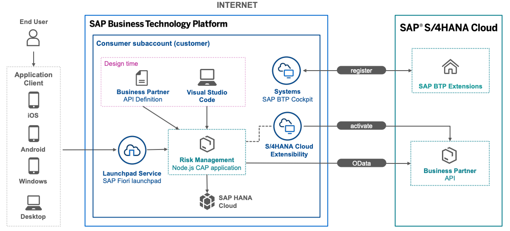
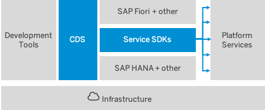
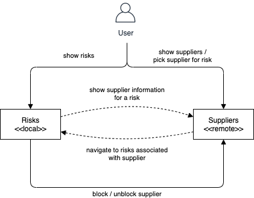

## Prerequisites
 - There are none, this is the very beginning

## Details
### You will learn
 - What is the SAP Cloud Application Programming Model (CAP)
 - What are remote services

---

[ACCORDION-BEGIN [Step 1: ](Overview)]
> ### To earn your badge for the whole mission, you will need to mark all steps in a tutorial as done, including any optional ones that you may have skipped because they are not relevant for you.

Welcome to this collection of tutorials for application development on SAP Business Technology Platform (SAP BTP). In the following tutorials, we provide information and examples on how to consume external services step by step.

The tutorials are suitable for new or experienced developers. The purpose of these tutorials is to help application developers to get a quick start on development, provide best practices, solve common issues, use common services, identify areas that need to be improved, and have an end-to-end scenario for validation. In the tutorials, you get to know, step by step, the development process.

If you can't complete a certain tutorial, there's the possibility of cloning a completed version of the tutorial from GitHub at the beginning of the next tutorial. You can find the links in the prerequisites section or at the end of the tutorial.

The tutorials cover a variety of topics and the tasks are bundled in step-by-step tutorials featuring the following topics:

- Introduction to Application Development Using CAP and Node.js
- Add the Consumption of an External Service Exposed to Your Service
- Consume the External Service in Your UI Application
- Register Your SAP S/4HANA Cloud System
- Use Your SAP S/4HANA Cloud Service

!

> You can also have a look at the [demo](https://youtu.be/OQVUkCs7mzY?t=1819) presented during the SAP Community Call focusing on CAP.

[DONE]
[ACCORDION-END]
---
[ACCORDION-BEGIN [Step 2: ](What is CAP)]
CAP is a framework of languages, libraries, and tools for building enterprise-grade services and applications. It guides developers along a 'golden path' of proven best practices and a great wealth of out-of-the-box solutions to recurring tasks.

CAP-based projects benefit from a primary focus on domain. Instead of delving into overly technical disciplines, CAP focuses on accelerated development and safeguarding investments in a world of rapidly changing cloud technologies.

The CAP framework features a mix of proven and broadly adopted open-source and SAP technologies, as highlighted in the following figure.

!

On top of open source technologies, CAP mainly adds:

- Core Data Services (CDS) as our universal modeling language for both domain models and service definitions.

- Service SDK and runtime for Node.js and Java, offering libraries to implement and consume services as well as generic provider implementations serving many requests automatically.

[VALIDATE_1]
[ACCORDION-END]
---
[ACCORDION-BEGIN [Step 3: ](Sample scenario)]
If you want to use data from other services or you want to split your application into multiple micro services, you need to reach out to remote services. As everything in CAP is a service, remote services are modelled the same way as internal services using CDS.

CAP supports the service consumption with dedicated APIs to import service definitions, query remote services, mash up services, and work locally as long as possible.

The use case of the tutorial mission [Build an Application End-to-End Using CAP, Node.js and VS Code](mission.btp-application-cap-e2e) shows you the scenario.

!

[DONE]
[ACCORDION-END]
---