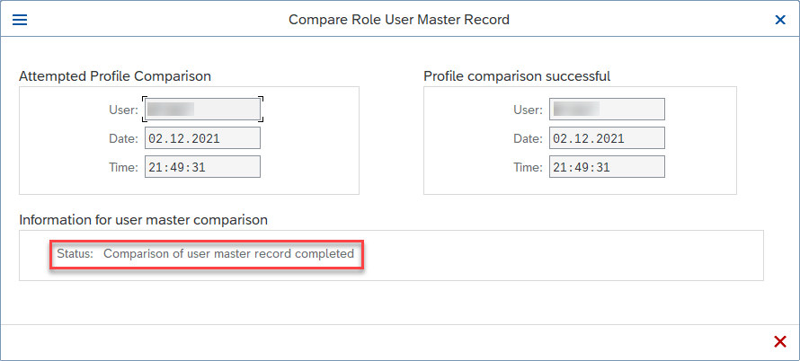

## Prerequisites
 - [Consume the External Service in the UI of Your Application](btp-app-ext-service-consume-ui)
 - On SAP BTP side:
    - You have an [enterprise](https://help.sap.com/viewer/65de2977205c403bbc107264b8eccf4b/Cloud/en-US/171511cc425c4e079d0684936486eee6.html) global account in SAP BTP.
    - You must be an administrator of the SAP BTP global account where you want to register your SAP S/4HANA system.
    - Your SAP BTP subaccount has quota for the services `SAP Build Work Zone, standard edition` and `SAP HTML5 Applications Repository service` as described in [Prepare for SAP BTP Development](btp-app-prepare-btp).
    - You have to [Use an existing SAP HANA Cloud service instance](https://developers.sap.com/tutorials/btp-app-hana-cloud-setup.html#42a0e8d7-8593-48f1-9a0e-67ef7ee4df18) or [Set up a new SAP HANA Cloud service instance](https://developers.sap.com/tutorials/btp-app-hana-cloud-setup.html#3b20e31c-e9eb-44f7-98ed-ceabfd9e586e) for the deployment. After the deployment, you need to [Subscribe to the SAP Build Work Zone, Standard Edition](btp-app-work-zone-subscribe).
- On SAP S/4HANA side:
    - You have a dedicated SAP S/4HANA system.
    - You must be an administrator of the SAP S/4HANA system.

## Details
### You will learn
- How to activate your Business Partner OData service
- How to create a technical user in your SAP S/4HANA system
- How to assign a role to your technical user

---

[ACCORDION-BEGIN [Step 1: ](Introduction)]
> ### To earn your badge for the whole mission, you will need to mark all steps in a tutorial as done, including any optional ones that you may have skipped because they are not relevant for you.

Welcome to this collection of tutorials for application development on SAP Business Technology Platform (SAP BTP). In the following tutorials, we provide information and examples on how to consume external services step by step using SAP S/4HANA. To get an overview about what is CAP, see [Introduction to Consuming Remote Services using CAP](btp-app-ext-service-intro) for more details.

[DONE]
[ACCORDION-END]
---
[ACCORDION-BEGIN [Step 2: ](Activate Business Partner OData service in SAP S/4HANA)]
With this tutorial, you expose the Business Partner service as an OData service and create a technical user with the required permissions to maintain business partners and to access the service. This user is later used to access the Business Partner service from the cloud.

1. Open your SAP S/4HANA system and log in as an administrator.

2. Enter `/n/IWFND/MAINT_SERVICE` in the command field and hit <kbd>Enter</kbd> to start transaction **Activate and Maintain Services**. The Service Catalog of the transaction is opened.

    !

3. Choose **Add Service** in the Service Catalog.

    !

4. Type in `LOCAL` for **System Alias** and `API_BUSINESS_PARTNER` for **External Service Name**, and hit <kbd>Enter</kbd> to search for all matching services.

    !

5. Select the `API_BUSINESS_PARTNER` service from the results and choose **Add Selected Services**.

    !

6. On the next screen, choose **Local Object**. This will automatically fill in `$TMP` in the **Package Assignment** field.

    !

7. Click the checkbox to **Enable OAuth for Service** and choose **&#x2611;**.

    !

8. Acknowledge the confirmation message and choose **&#x2611;**. You have successfully activated Business Partner OData service in your SAP S/4HANA system.

    !

Now, let's create a user in your SAP S/4HANA system and assign the required authorizations.

[VALIDATE_1]
[ACCORDION-END]
---
[ACCORDION-BEGIN [Step 3: ](Create a technical user)]
1. Choose **Exit** to go back to the initial screen.

2. Enter `SU01` in the command field and hit <kbd>Enter</kbd> to start transaction **User Management**.

    !

3.    Enter a name for the user in the **User** field and choose **Technical User** to create.

    !

4.    Set the **User Type** to `Dialog` from the dropdown list.

    !

5.    Generate a new password for your user by copying it from the message and choosing **Save**.

    !

    > Useful password tips:

    > - This is an initial password that has to be changed at first user login.
    > - Note down this password so you have it at hand later when you'll have to log in with your newly created user.

[DONE]
[ACCORDION-END]
---
[ACCORDION-BEGIN [Step 4: ](Assign a role to your technical user)]
1.    On your initial screen, type in transaction name `/nPFCG` and hit <kbd>Enter</kbd>.

    !

2.    Enter `ENTERPRISEMESSAGING` in the **Role** field and choose **Single Role**.

    !

3.    On the next screen, enter a **Description** for the role and choose **Save**.

    !

4.    In the **Menu** tab, choose **Transaction**.

    !

5. In the **Assign Transactions** dialog, type in `BP` under **Transaction Code** and hit <kbd>Enter</kbd> to find the Business Partner transaction.

6. Click the checkbox to select the transaction and choose **Assign Transactions**.

    !

7.    In the **Menu** tab, choose **Authorization Default**.

    !

    > Can't see `Authorization Default`?

    > Expand the dropdown list under **Transaction** to find the option **Authorization Default**.

    > !

8.    A **Service** dialog opens. Choose `SAP Gateway: Service Groups Metadata` from dropdown list in the **Authorization Default** field.

    !

9.    Open the value help in the **TADIR Service** column.

    !

10. Find the Business Partner API and choose **&#x2611;**.

    !

11. Choose **Copy**.

    !

12.    Switch to the **Authorizations** tab and choose **Change Authorization Data**. Save the role if prompted.

    !

13.    Choose **Edit** &rarr; **Insert authorization(s)** &rarr; **From template...**.

    !

14.    In the **Choose Template** dialog, select `/IWFND/RT_GW_USER` and choose **&#x2611;**.

    !

15.    Choose **Status** and confirm assignment of full authorizations to the role in the **Assign Full Authorization for Subtree** dialog by choosing **&#x2611;**.

    !

16. Choose **Generate** and confirm in the **Assign Profile Name for Generated Authorization Profile** dialog by choosing **&#x2611;**.

    !

17.    Go back and switch to the **User** tab.

18. Under **User Assignments**, type in the name of your technical user (in this case, `CPAPP`) and hit <kbd>Enter</kbd> to select it.

    !

19. Choose **User Comparison** and save the role if prompted.

    !

20. Choose **Full Comparison** in the **Compare Role User Master Record** dialog.

    !

21. Close the **Compare Role User Master Record** dialog when you see the updated status message.

    !

22.    Choose **System** &rarr; **Log Off** from the menu.

23.    Log in to your SAP S/4HANA system using your newly created technical user (CPAPP) and the password you generated in sub-step 2.5 [Create a technical user](#create-a-technical-user). Change the initial password when prompted.

    > For the purposes of the tutorial, we're going to set the password to `Welcome1`. You can set your own password, but make sure you note it because you'll need it in the upcoming tutorials.

    !

    You have successfully logged in with your new technical user.

    !

[DONE]
[ACCORDION-END]
---