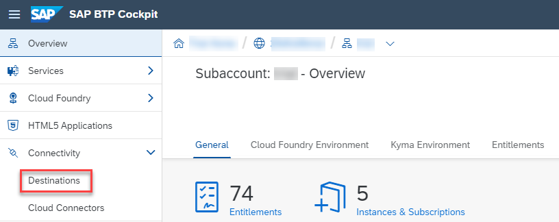
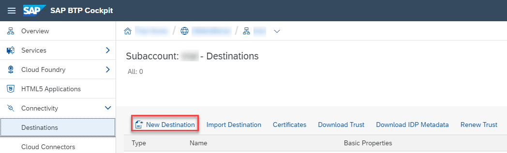
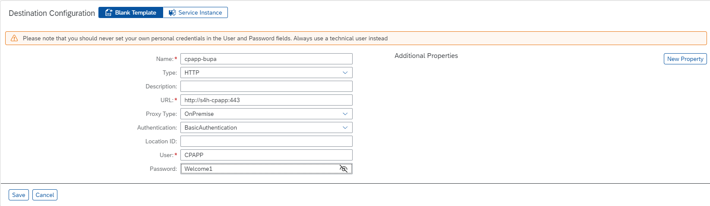
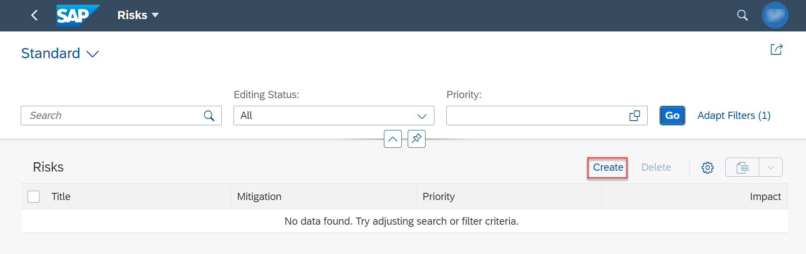
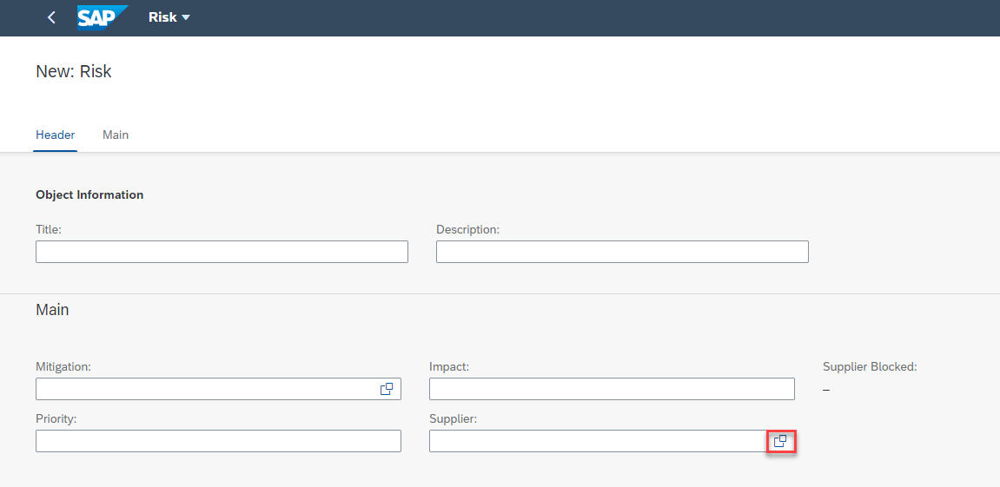
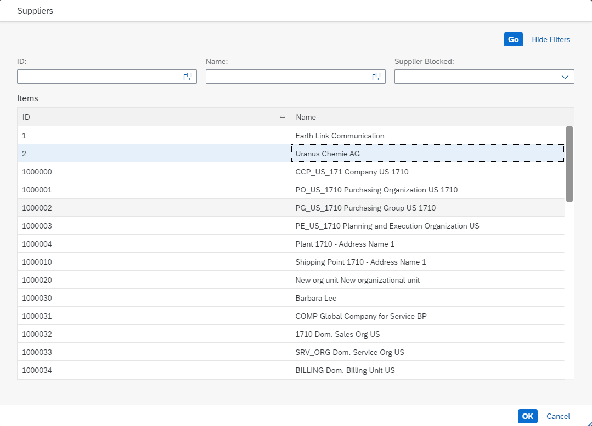

## Prerequisites
 - [Configure Systems in Cloud Connector](btp-app-ext-service-cloud-connector)

## Details
### You will learn
 - How to prepare your CAP application
 - How to deploy your CAP application
 - How to test your CAP application with SAP S/4HANA connectivity

---

[ACCORDION-BEGIN [Step 1: ](Add the Connectivity service)]
In this tutorial, you do the final steps to use the external service in the CAP application on SAP BTP. You create an on-premise destination with your technical user's name and password. By binding the Connectivity and the Destination services to your CAP service, it can access the service using the destination.

Add the following lines to your `mta.yaml` file:

<!-- snippet mta.yaml resources: cpapp-connectivity -->
```YAML[3-7]
resources:
   ...
 - name: cpapp-connectivity
   type: org.cloudfoundry.managed-service
   parameters:
     service: connectivity
     service-plan: lite
```

> The Destination service is already added to the `mta.yaml`. If you look at the resources that already exist in the `mta.yaml`, you'll see that the Destination service is already there, so you don't have to add it yourself.

```YAML[3-19]
resources:
    ...
  - name: cpapp-destination
  type: org.cloudfoundry.managed-service
  parameters:
    config:
      HTML5Runtime_enabled: true
      init_data:
        instance:
          destinations:
          - Authentication: NoAuthentication
            Name: ui5
            ProxyType: Internet
            Type: HTTP
            URL: https://ui5.sap.com
          existing_destinations_policy: update
      version: 1.0.0
    service: destination
    service-plan: lite
```

[DONE]
[ACCORDION-END]
---
[ACCORDION-BEGIN [Step 2: ](Bind the Connectivity and Destination services to your CAP service)]
Add the following lines to the `cpapp-srv` module in your `mta.yaml` file:

<!-- snippet mta.yaml modules: cpapp-srv -->
```YAML[12-13]
modules:
   ...
 - name: cpapp-srv
 # ------------------------------------------------------------
   type: nodejs
   path: gen/srv
   requires:
    # Resources extracted from CAP configuration
    - name: cpapp-db
    - name: cpapp-uaa
    - name: cpapp-logs
    - name: cpapp-connectivity
    - name: cpapp-destination
   provides:
    - name: srv-api      # required by consumers of CAP services (e.g. approuter)
      properties:
        srv-url: ${default-url}
 # -------------------- SIDECAR MODULE ------------------------
```


The Destination service lets you find the destination information that is required to access a remote service or system from your Cloud Foundry application.
To consume the external service from our cloud deployed application, you will create a Destination and a Destination Service.

[VALIDATE_1]
[ACCORDION-END]
---
[ACCORDION-BEGIN [Step 3: ](Create a Destination in SAP BTP cockpit)]
1. Enter your **Global Account**. If you are using a trial account, choose **Go To Your Trial Account**.

2. Choose **Account Explorer**.

3. Choose your subaccount in the **Subaccounts** tab.

4. Choose **Connectivity** &rarr; **Destinations**.

    !

5. Choose **New Destination**.

    !

6. Configure the following settings:

    | Property | Value |
    |--|--|
    | Name | cpapp-bupa
    | Type | HTTP
    | URL  | http://{Virtual host}:{Virtual port}
    | Proxy Type | On Premise
    | Authentication | `BasicAuthentication`
    | User | `CPAPP` (as defined in `Step 3: Create a technical user` [from this tutorial](btp-app-ext-service-odata-service))
    | Password | `Welcome1` (as defined in `Step 3: Create a technical user` [from this tutorial](btp-app-ext-service-odata-service))

    > Replace `{Virtual host}` and `{Virtual port}` in the URL with the values that you defined in `Step 3: Add system mapping` [from this tutorial](btp-app-ext-service-cloud-connector).

    !

7. Choose **Save**.

[DONE]
[ACCORDION-END]
---
[ACCORDION-BEGIN [Step 4: ](Set Destination)]
To set the destination for `API_BUSINESS_PARTNER` service, add the following lines for productive profile to your `package.json` file:

```JSON[5-10]
    "API_BUSINESS_PARTNER": {
        ...
        "[sandbox]": {
        ...
        },
        "[production]": {
            "credentials": {
                "path": "/sap/opu/odata/sap/API_BUSINESS_PARTNER",
                "destination": "cpapp-bupa"
            }
        }
```

[DONE]
[ACCORDION-END]
---
[ACCORDION-BEGIN [Step 5: ](Deploy your CAP application)]
If you use the [SAP Continuous Integration and Delivery (CI/CD) service on SAP Business Technology Platform](btp-app-ci-cd-btp), you just need to push the commit to your **main** branch and wait for the deployment to be completed.

Otherwise, deploy your application as [Multi-Target Application (MTA)](btp-app-cap-mta-deployment).

1. Build the MTA module from your project root folder:

    ```Shell/Bash
    mbt build -t ./
    ```

    This creates a `mtar` file `cpapp_1.0.0.mtar` in the current folder (option: `-t ./`).

    > In case you get the error `On Windows, this driver only supports the x64 architecture. You node process is: ia32`, check if you have installed the right version of Node.js for your operating system.

2. Deploy the module to your current Cloud Foundry space:

    ```Shell/Bash
    cf deploy cpapp_1.0.0.mtar
    ```

[DONE]
[ACCORDION-END]
---
[ACCORDION-BEGIN [Step 6: ](Test your CAP application with SAP S/4HANA connectivity)]
When creating new entries in the **Risks** application, you should be able to use the value help for **Supplier** to see all the values from the remote SAP S/4HANA system.

> Don't forget to perform the steps from the tutorial [Subscribe to the SAP Build Work Zone, Standard Edition](btp-app-work-zone-subscribe) before you continue with this step to be able to create entries in the **Risks** application.

1. Open your **SAP BTP Launchpad Service** site as described in [Subscribe to the SAP Build Work Zone, Standard Edition](btp-app-work-zone-subscribe).

2. Choose the **Risks** application.

3. Choose **Go**.

    You'll see a message `No data found. Try adjusting filter or search criteria.`

    > Why there's no data in the `Risks` application?

    > As explained in **Step 6 Exclude CSV files from deployment** of [Deploy Your Multi-Target Application (MTA)](btp-app-cap-mta-deployment), test files should never be deployed to an SAP HANA database as table data. For this reason, there's no test files in the deployment archive.

4. Choose **Create**.

    !

5. Open the value help for the **Supplier** field.

    !

6. You should see a list of suppliers.

    !

Congratulations! You have completed all tutorials.

[DONE]
The result of this tutorial can be found in the [`ext-service-s4hana-consume`](https://github.com/SAP-samples/cloud-cap-risk-management/tree/ext-service-s4hana-consume) branch.


[ACCORDION-END]
---