## Prerequisites
 - [Consume the External Service in the UI of Your Application](btp-app-ext-service-consume-ui)
 - On SAP BTP side:
    - You have an [enterprise](https://help.sap.com/viewer/65de2977205c403bbc107264b8eccf4b/Cloud/en-US/171511cc425c4e079d0684936486eee6.html) global account in SAP BTP.
    - You must be an administrator of the SAP BTP global account where you want to register your SAP S/4HANA Cloud system.
    - Your SAP BTP subaccount has quota for the services `SAP Build Work Zone, standard edition` and `SAP HTML5 Applications Repository service` as described in [Prepare for SAP BTP Development](btp-app-prepare-btp).
    - You have to [Use an existing SAP HANA Cloud service instance](https://developers.sap.com/tutorials/btp-app-hana-cloud-setup.html#42a0e8d7-8593-48f1-9a0e-67ef7ee4df18) or [Set up a new SAP HANA Cloud service instance](https://developers.sap.com/tutorials/btp-app-hana-cloud-setup.html#3b20e31c-e9eb-44f7-98ed-ceabfd9e586e) for the deployment. After the deployment, you need to [Subscribe to the SAP Build Work Zone, Standard Edition](btp-app-work-zone-subscribe).
 - On SAP S/4HANA Cloud side:
    - You have a dedicated SAP S/4HANA Cloud tenant.
    - You must be an administrator of the SAP S/4HANA Cloud system.
    - You need to connect this system to your SAP BTP global account, if you'd like to build extension applications for your SAP S/4HANA Cloud system.

## Details
### You will learn
 - How to acquire an SAP BTP integration token
 - How to add integration token to SAP S/4HANA Cloud system
 - How to set up entitlements for your SAP BTP subaccount

---

[ACCORDION-BEGIN [Step 1: ](Acquire an SAP BTP integration token for registration)]
1. In your SAP BTP cockpit, navigate to **System Landscape**.

2. In the **System Landscape** panel, choose **Add System**.

3. In the **Add System** popup, enter the **System Name** for the SAP S/4HANA Cloud system `CPAPP_S4HANA_CLOUD`.

4. In the dropdown list for **Type**, choose `SAP S/4HANA Cloud`.

5. Choose **Add**.

      !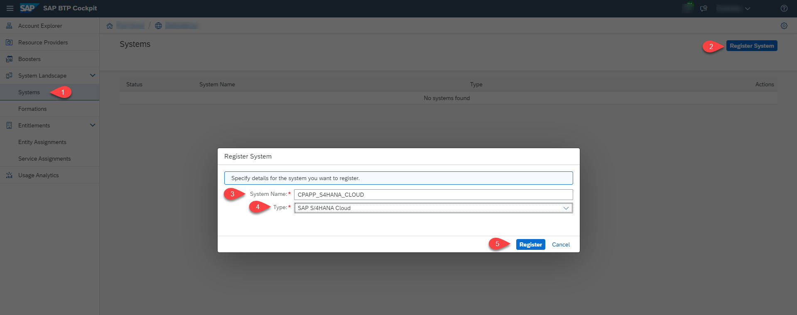

6. Choose **Get Token**.

      !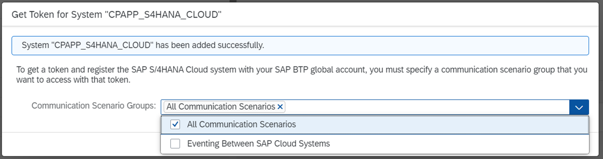

7. Copy the generated token and keep this page open.

      !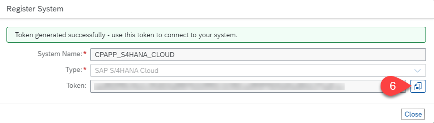

[DONE]
[ACCORDION-END]
---
[ACCORDION-BEGIN [Step 2: ](Add integration token to SAP S/4HANA Cloud system)]
1. Log on to your SAP S/4HANA Cloud tenant.

2. Navigate from **Home** &rarr; **Communication Management** tab and choose the tile **Maintain Extensions on SAP BTP**.

      !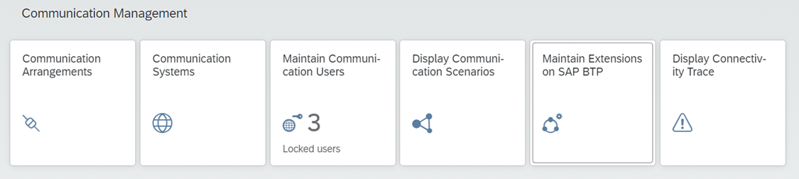

3. On **Maintain Extensions on SAP BTP** screen in the **Extensions** section, choose **New**.

      !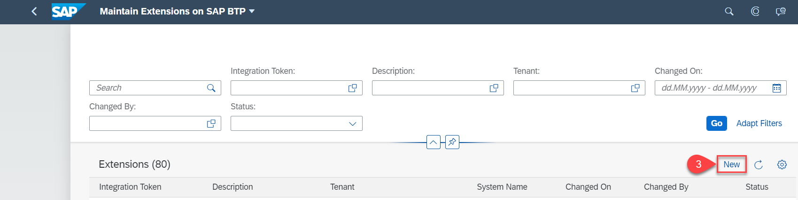

4. In the **Integration Token** field, paste in the integration token generated from SAP BTP (see previous steps 5 and 7).

5. Enter a **Description** for your system integration token: `SAP S/4HANA Cloud for Risk Management`.

      !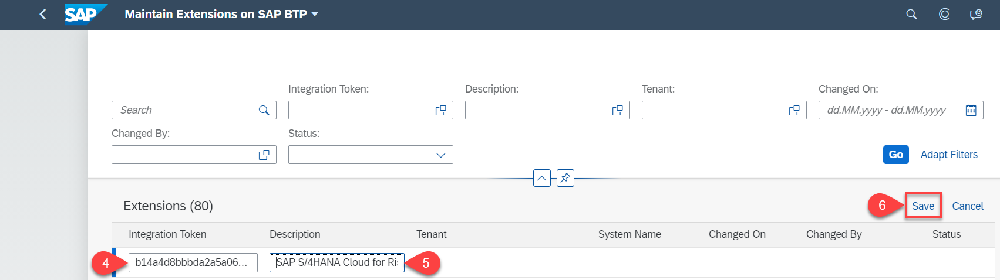

6. Choose **Save** and wait until the status displayed for your newly registered system switches to **Enabled** – potentially you need to refresh your page.

      !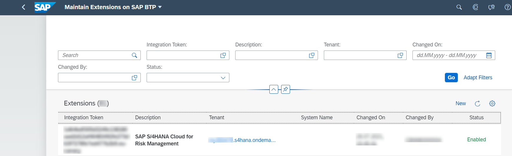

7. Switch back to the **System Landscape** page in SAP BTP cockpit.

8. Close the dialog with the integration token.

9. You may need to refresh your page, the new system will be as an entry in the list of **Systems**.

      !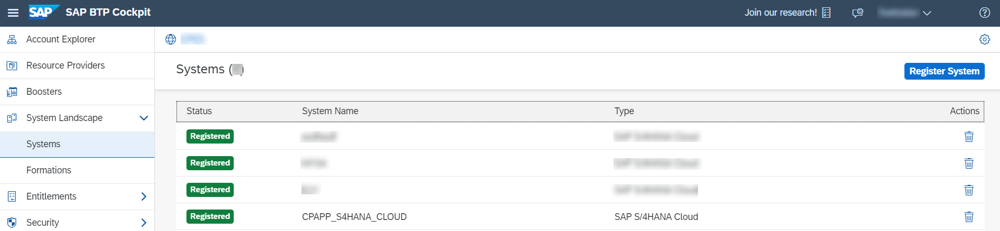

   Now, the system is registered with your SAP BTP Global account.

[DONE]
[ACCORDION-END]
---
[ACCORDION-BEGIN [Step 3: ](Set up entitlements for your SAP BTP subaccount)]
After you have connected the SAP S/4HANA Cloud system to SAP BTP (with status **Enabled** in your SAP S/4HANA Cloud tenant), you need to configure entitlements to make this system accessible in the SAP BTP subaccount in which you want to build your extension application. You configure the entitlements and assign the corresponding quota and service plans to the subaccount in which the extension application will reside.

1. Enter your **Global Account**.

2. Choose **Entitlements** &rarr; **Entity Assignments**.

      !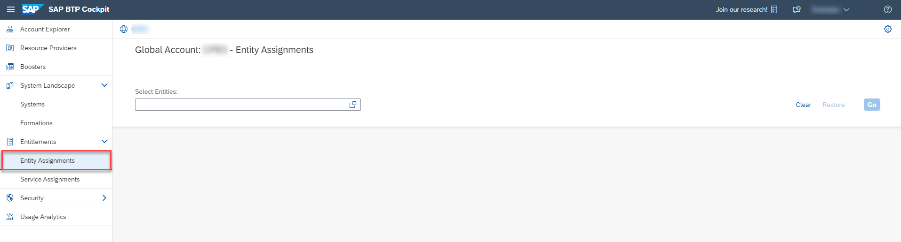

3. Search for your subaccount in the **Select Entities** field.

4. Select your subaccount.

      !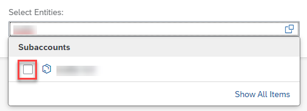

5. Choose **Configure Entitlements** &rarr; **Add Service Plans**.

      !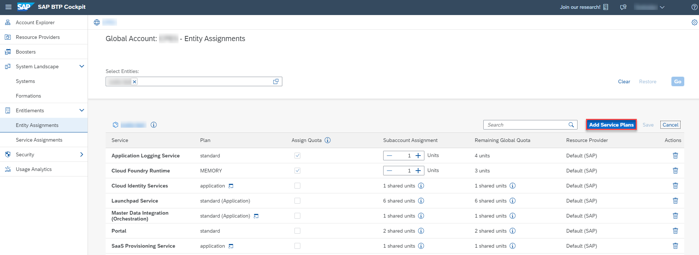

6. In the **Subaccount `<your-subaccount-name>` Entitlements** dialog box, select the service **SAP S/4HANA Cloud Extensibility**.

7. In the **Service Details: SAP S/4HANA Cloud Extensibility** screen area, select your newly registered system name from the dropdown help to list the **Available Plans**.

      - **messaging** – to consume SAP S/4HANA Cloud events and create event-based extensions using the event bus from SAP Event Mesh Integration

      - **api-access** – for generic access for SAP S/4HANA Cloud APIs

8. Select both service plans.

9. Choose **Add 2 Service Plans** to add these entitlements for the SAP S/4HANA Cloud Extensibility service for your SAP S/4HANA Cloud system registered to your subaccount.

      !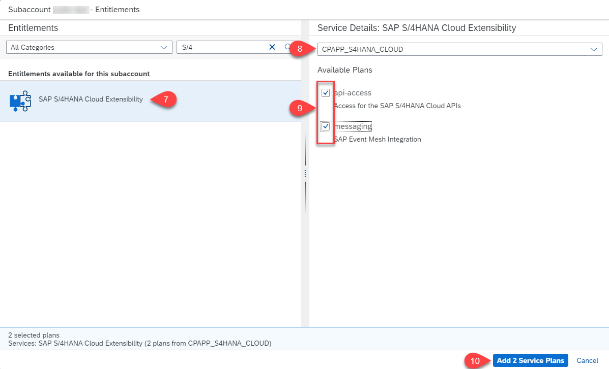

10. Choose **Save**.

      !

[VALIDATE_1]
[ACCORDION-END]
---