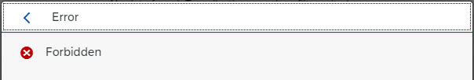
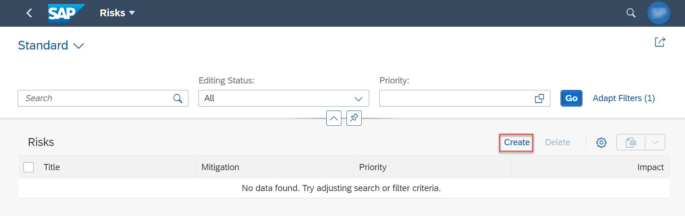
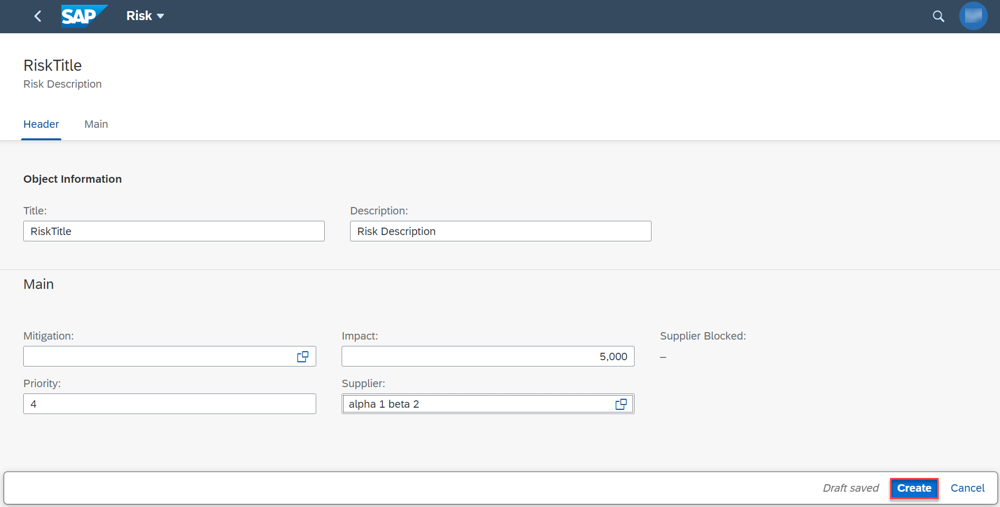
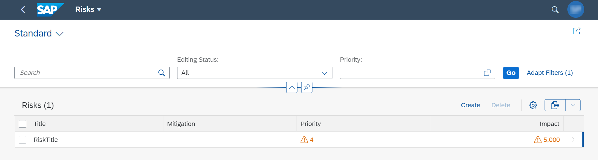

## Prerequisites
 - [Register Your SAP S/4HANA Cloud System](btp-app-ext-service-s4hc-register)

## Details
### You will learn
 - How to prepare your CAP application
 - How to deploy your CAP application
 - How to test your CAP application with SAP S/4HANA Cloud connectivity

---

[ACCORDION-BEGIN [Step 1: ](Connect to the business partner service on your SAP S/4HANA Cloud system)]
Earlier in the tutorial you used a sandbox system to use the business partner service in your application. In this tutorial, you will connect to your SAP S/4HANA Cloud system.

First, you create a service instance for the SAP S/4HANA Cloud Extensibility service with plan `api-access`. The SAP S/4HANA system provides pre-defined communication scenarios that contain one or multiple APIs. When creating the service instance, the communication scenario needs to be specified along with some configuration. Under the hood, a communication arrangement based on the given scenario is created in the SAP S/4HANA Cloud system.

1. Go back to the **SAP API Business Hub** page for the **Business Partner (A2X)** API that you use: [Business Partner (A2X)](https://api.sap.com/api/API_BUSINESS_PARTNER/overview).

2. Check the list of **Communication Scenarios**.

    You can see four different **Communication Scenarios** that expose the **Business Partner (A2X)** API. You can check the details of those scenarios in the SAP S/4HANA Cloud system.

    In this tutorial, you use the scenario **`SAP_COM_0008`**.

    > Further information about how to configure communication scenarios

    > - [Communication Arrangement JSON File - Properties](https://help.sap.com/viewer/65de2977205c403bbc107264b8eccf4b/Cloud/en-US/553a4c6b98be4c1ba7d1dfa0e9df8669.html)
    > - [Communication Arrangement JSON File - Examples](https://help.sap.com/viewer/65de2977205c403bbc107264b8eccf4b/Cloud/en-US/80a7613a0d2346b6ac93fcdbb2489de8.html)

3. Copy the file `tutorial/templates/ext-service-s4hc-use-service/bupa-service-config.json` with the communication scenario configuration into your project root folder:

    `bupa-service-config.json`:

    ```JSON
    {
        "systemName": "<set in mta.yaml>",
        "communicationArrangement": {
            "communicationArrangementName": "CPAPP_COM_0008",
            "scenarioId": "SAP_COM_0008",
            "inboundAuthentication": "BasicAuthentication",
            "outboundAuthentication": "BasicAuthentication",
            "outboundServices": [
                ...
            ],
            "communicationSystem": {
                "communicationSystemHostname": "default.com",
                "outboundCommunicationUser": {
                    "username": "DefaultUser",
                    "password": "DefaultPassword"
                }
            }
        }
    }
    ```

    The configuration for the communication arrangement contains the name under which your SAP S/4HANA Cloud system (`systemName`) was registered, the used scenario, the name for the to be created communication arrangement and some specific configuration.

    The `systemName` is left out here, because it will be set in the `mta.yaml` file, which will allow you to oversteer it for a deployment in a productive environment.

    The `communicationArrangementName` is the name for this arrangement that is created in the S/4HANA Cloud system. It needs to be unique within the system.

    By setting `inboundAuthentication` to `BasicAuthentication`, a technical user and a password is automatically created with the permissions defined in the communication scenario.

    Some communication scenarios support outbound communication. The scenario `SAP_COM_0008` has some outbound configuration. Although you don't want to use it, you need to give some configuration to switch it off. Otherwise, the service instance creation fails.

4. Add the SAP S/4HANA Cloud Extensibility service to your `mta.yaml` file by adding the following lines to the `resources` section:

    ```YAML[5-17]
    _schema-version: '3.1'

    resources:
    ...
    - name: cpapp-bupa
      type: org.cloudfoundry.managed-service
      parameters:
        skip-service-updates:
            plan: true
            parameters: true
            tags: true
        service: s4-hana-cloud
        service-plan: api-access
        system-name: CPAPP_S4HANA_CLOUD
        path: ./bupa-service-config.json
        config:
            systemName: CPAPP_S4HANA_CLOUD
    ...
    ```

    The system name, that is specified two times here, is the name you gave when creating the system in SAP BTP cockpit.

    The service doesn't support updates, to avoid errors in subsequent deployments the  `skip-service-updates` option is activated. This means if you want to change the service settings, that you need to delete and newly create the service instance manually.

    Alternatively, you can create the service instance in SAP BTP cockpit. This would be the better choice if you want to share the instance between different applications. When doing it SAP BTP cockpit, you don't need to add the previous mentioned lines to the `mta.yaml` file.

5. The SAP S/4HANA Cloud Extensibility service creates a destination with the same name as the service instance. To set destination for `API_BUSINESS_PARTNER` service add the following lines for productive profile to your `package.json` file:

    ```JSON[5-10]
        "API_BUSINESS_PARTNER": {
            ...
            "[sandbox]": {
            ...
            },
            "[production]": {
                "credentials": {
                    "path": "/sap/opu/odata/sap/API_BUSINESS_PARTNER",
                    "destination": "cpapp-bupa"
                }
            }
        }
    ```

    The `path` property is important as well, because the destination contains only the URL of the system.

    You can find the path on the [Business Partner (A2X)](https://api.sap.com/api/API_BUSINESS_PARTNER/overview) page in the **SAP API Business Hub**. Choose **Configuration Details** and take note of the sandbox URL.

    For example:
    `https://sandbox.api.sap.com/s4hanacloud/sap/opu/odata/sap/API_BUSINESS_PARTNER/A_AddressEmailAddress`

    The path is the part between `https://sandbox.api.sap.com/s4hanacloud` and the last path segment (`A_AddressEmailAddress` here).

6. Add the **Destination** service to the `requires` section for the `cpapp-srv` module in `mta.yaml` file:

    ```YAML[6]
    modules:
    - name: cpapp-srv
      ...
      requires:
      ...
      - name: cpapp-destination
    ```

    The CAP server needs the destination service to access the `CPAPP_S4HANA_CLOUD` destination and get the required credentials to call the SAP S/4HANA Cloud system.

> Additional Documentation:

> CAP documentation about [Consuming Services](https://cap.cloud.sap/docs/guides/consuming-services)

[DONE]
[ACCORDION-END]
---
[ACCORDION-BEGIN [Step 2: ](Deploy your CAP application)]
If you use the [SAP Continuous Integration and Delivery (CI/CD) service on SAP Business Technology Platform](btp-app-ci-cd-btp), you just need to push the commit to your **main** branch and wait for the deployment to be completed.

Otherwise, deploy your application as described in the tutorial [Multi-Target Application (MTA)](btp-app-cap-mta-deployment).

1. Build the MTA module from your project root folder:

    ```Shell/Bash
    mbt build -t ./
    ```

    This creates a `mtar` file `cpapp_1.0.0.mtar` in the current folder (option: `-t ./`).

    > In case you get the error `On Windows, this driver only supports the x64 architecture. You node process is: ia32`, check if you have installed the right version of Node.js for your operating system.

2. Deploy the module to your current Cloud Foundry space:

    ```Shell/Bash
    cf deploy cpapp_1.0.0.mtar
    ```

[DONE]
[ACCORDION-END]
---
[ACCORDION-BEGIN [Step 3: ](Test your CAP application with SAP S/4HANA Cloud connectivity)]
When creating new entries in the **Risks** application, you should be able to use the value help for **Supplier** to see all the values from the remote S/4HANA system.

> Don't forget to perform the steps from the tutorial [Subscribe to the SAP Build Work Zone, Standard Edition](btp-app-work-zone-subscribe) before you continue with this step to be able to create entries in the **Risks** application.

1. Open your **SAP Build Work Zone, standard edition** site as described in the tutorial [Subscribe to the SAP Build Work Zone, Standard Edition](btp-app-work-zone-subscribe).

2. Choose the **Risks** application.

3. Choose **Go**.

    You'll see a message `No data found. Try adjusting filter or search criteria.`

    > In case you get an error `Forbidden`. 

    > The following error is displayed when you haven't assigned your user to the `RiskManager-<your space>` role:

    > !

    > Follow the instructions in [Assign a Role Collection to a User](btp-app-role-assignment) to do it.

    > Why there's no data in the `Risks` application?

    > As explained in **Step 6 Exclude CSV files from deployment** of [Deploy Your Multi-Target Application (MTA)](btp-app-cap-mta-deployment), test files should never be deployed to an SAP HANA database as table data. For this reason, there's no test files in the deployment archive.

4. Choose **Create**.

    !

5. Fill in information for the new risk in the object page and choose **Create**.

    !

    > You can leave the **Mitigation** field empty, since there's no available mitigations to choose from.

6. Check if the new risk is visible.

    !

Congratulations! You have completed all tutorials.

[VALIDATE_1]
The result of this tutorial can be found in the [`ext-service-s4hc-use`](https://github.com/SAP-samples/cloud-cap-risk-management/tree/ext-service-s4hc-use) branch.


[ACCORDION-END]
---