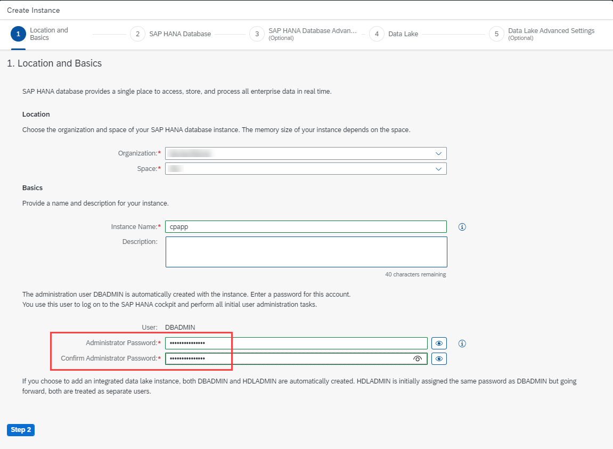
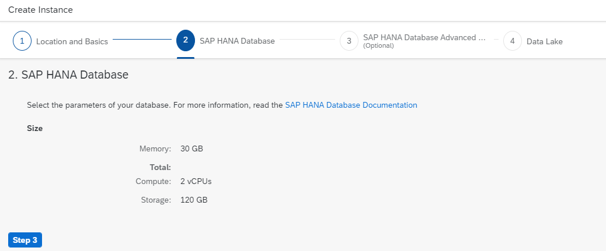

## Prerequisites
 - [Set Up Local Development using VS Code](btp-app-set-up-local-development)
 - [Create a Directory for Development](btp-app-create-directory)
 - [Create a CAP-Based Application](btp-app-create-cap-application)
 - [Create an SAP Fiori Elements-Based UI](btp-app-create-ui-fiori-elements)
 - [Add Business Logic to Your Application](btp-app-cap-business-logic)
 - [Create a UI Using Freestyle SAPUI5](btp-app-create-ui-freestyle-sapui5)
 - [Add More Than One Application to the Launch Page](btp-app-launchpage)
 - [Implement Roles and Authorization Checks in CAP](btp-app-cap-roles)
 - [Prepare for SAP BTP Development](btp-app-prepare-btp)

## Details
### You will learn
 - How to set up the SAP HANA cloud service
 - How to add SAP HANA Client to your project


To continue with this tutorial you can find the result of the previous tutorial in the [`cap/roles`](https://github.com/SAP-samples/cloud-cap-risk-management/tree/cap/roles) branch.

---

[ACCORDION-BEGIN [Step 1: ](Add SAP HANA client and configuration to your project)]
1. Add SAP HANA support to your project by running.

    ```Shell/Bash
    cds add hana
    ```

    This adds the `hdb` module for SAP HANA access to your `package.json` file and will configure kind `sql` as the database service.

    Changes in the `package.json` file done by `cds add hana`:

    <!-- cpes-file package.json:$.cds -->
    ```JSON[4-13]
    {
        "name": "cpapp",
        ...
        "cds": {
        "requires": {
            "db": {
            "kind": "sql"
            }
        },
        "hana": {
            "deploy-format": "hdbtable"
        }
        }
    }
    ```

    Different to CAP default behavior, kind `sql` uses the SQLite in-memory database for local testing and the SAP HANA database for productive usage in the cloud.

    The `deploy-format` setting is required to create the required artifacts for SAP HANA Cloud in the build which are different from the artifacts for the previous SAP HANA offering.

    > Additional Documentation:

    > - [Using Databases](https://cap.cloud.sap/docs/guides/databases#get-hana)
    > - [CAP Configuration](https://cap.cloud.sap/docs/node.js/cds-env)

2. Run `cds watch` in your project folder and check that your app still works locally as it used to work before at <http://localhost:4004/>.

[VALIDATE_1]
[ACCORDION-END]
---
[ACCORDION-BEGIN [Step 2: ](Prepare using SAP HANA Cloud)]
> ### To earn your badge for the whole mission, you will need to mark all steps in a tutorial as done, including any optional ones that you may have skipped because they are not relevant for you.

SAP HANA Cloud service instances are not created automatically for any type of account. Therefore, you will have to create a SAP HANA Cloud instance first, if you don't have one yet.

If you already have an SAP HANA Cloud service instance in your Cloud Foundry space **&rarr;** continue with **Use an Existing SAP HANA Cloud Service Instance**.

If you need to create a SAP HANA Cloud service instance first **&rarr;** continue with **Create an SAP HANA Cloud Service Instance**.

> Additional Documentation:

>   - [SAP HANA Cloud Getting Started Guide](https://help.sap.com/viewer/db19c7071e5f4101837e23f06e576495/cloud/en-US/d0aa0ec935c1401e8deb3be35d49730b.html)
>   - [SAP HANA Cloud Administrator DBADMIN](https://help.sap.com/viewer/f9c5015e72e04fffa14d7d4f7267d897/cloud/en-US/5b35402c47b344d882ac13c661aff1c0.html)

[DONE]
[ACCORDION-END]
---
[ACCORDION-BEGIN [Step 3: ](Use an existing SAP HANA Cloud service instance)]
[OPTION BEGIN [Trial]]

1. Go to your SAP BTP cockpit by using one of the following links, depending on the landscape you want to use.

    [https://cockpit.hanatrial.ondemand.com/](https://cockpit.hanatrial.ondemand.com/)

2. Enter your **Global Account**.

2. Choose **Account Explorer**.

3. In the **Subaccounts** tab, choose the subaccount to which you want to deploy your service and application.

    !

4. Choose **Cloud Foundry** **&rarr;** **Spaces** in the left-hand pane.

5. Choose the space where you already have the SAP HANA Cloud service instance.

6. Choose **SAP HANA Cloud** in the left-hand pane.

7. Choose **Manage SAP HANA Cloud** in the upper right corner.

8. Sign in with your SAP BTP Cockpit username/email.

    The **SAP HANA Cloud Central** cockpit opens.

9. Choose an organization and again choose the space where you have the SAP HANA Cloud service instance.

    !

10. Choose your service instance.

11. Choose **Create Mapping**.

12. Choose the **Org ID** and **Space ID** where you want to deploy the application.

13. Choose **Add**.
[OPTION END]
[OPTION BEGIN [Live]]

1. Go to your SAP BTP cockpit by using one of the following links, depending on the landscape you want to use.

    [https://account.hana.ondemand.com/](https://account.hana.ondemand.com/)

2. Enter your **Global Account**.

2. Choose **Account Explorer**.

3. In the **Subaccounts** tab, choose the subaccount to which you want to deploy your service and application.

    !

4. Choose **Cloud Foundry** **&rarr;** **Spaces** in the left-hand pane.

5. Choose the space where you already have the SAP HANA Cloud service instance.

6. Choose **SAP HANA Cloud** in the left-hand pane.

7. Choose **Manage SAP HANA Cloud** in the upper right corner.

8. Sign in with your SAP BTP Cockpit username/email.

    The **SAP HANA Cloud Central** cockpit opens.

9. Choose an organization and again choose the space where you have the SAP HANA Cloud service instance.

    !

10. Choose your service instance.

11. Choose **Create Mapping**.

12. Choose the **Org ID** and **Space ID** where you want to deploy the application.

13. Choose **Add**.
[OPTION END]


[DONE]
[ACCORDION-END]
---
[ACCORDION-BEGIN [Step 4: ](Create an SAP HANA Cloud service instance)]
[OPTION BEGIN [Trial]]

1. Go to your SAP BTP cockpit by using one of the following links, depending on the landscape you want to use.

    [https://cockpit.hanatrial.ondemand.com/](https://cockpit.hanatrial.ondemand.com/)

2. Enter your **Global Account**.

2. Choose **Account Explorer**.

3. In the **Subaccounts** tab, choose the subaccount to which you want to deploy your service and application.

    !

4. Choose **Cloud Foundry** **&rarr;** **Spaces** in the left-hand pane.

5. Choose the **Space** that you want to deploy to.

    !

6. Choose **SAP HANA Cloud** in the left-hand pane.

    !

7. Choose **Create** **&rarr;** **SAP HANA database**.

8. Sign in with your SAP BTP Cockpit username/email.

9. The **Organization** and **Space** will be selected.

10. Enter the **Instance Name**: `cpapp`.

    !

11. Enter a password for _DBADMIN_ in **Administrator Password** and **Confirm Administrator Password**.

    !

12. Choose **Step 2**. The default settings should be sufficient for the tutorial application.

    !

13. Choose **Step 3**.

14. Choose `Allow only BTP IP addresses`.

    !

    > In case you get error `[APP/TASK/deploy/0] ERR Error: Connection failed (RTE:[xxx] Socket closed by peer (<your-instance-ID>.hana.trial-<your-ladscape>.hanacloud.ondemand.com:443))`, change the setting to `Allow all IP addresses`.

15. Choose **Create Instance**.

    The creation of the database instance can take some minutes to complete. The final result looks like this in SAP BTP cockpit:

    !

    > Your SAP HANA Cloud instance will be automatically stopped overnight, according to the server region time zone. That means you need to restart your instance every day before you start working with it.


[OPTION END]
[OPTION BEGIN [Live]]

1. Go to your SAP BTP cockpit by using one of the following links, depending on the landscape you want to use.

    [https://account.hana.ondemand.com/](https://account.hana.ondemand.com/)

2. Enter your **Global Account**.

2. Choose **Account Explorer**.

3. In the **Subaccounts** tab, choose the subaccount to which you want to deploy your service and application.

    !

4. Choose **Cloud Foundry** **&rarr;** **Spaces** in the left-hand pane.

5. Choose the **Space** that you want to deploy to.

    !

6. Choose **SAP HANA Cloud** in the left-hand pane.

    !

7. Choose **Create** **&rarr;** **SAP HANA database**.

8. Sign in with your SAP BTP Cockpit username/email.

9. The **Organization** and **Space** will be selected.

10. Enter the **Instance Name**: `cpapp`.

    !

11. Enter a password for _DBADMIN_ in **Administrator Password** and **Confirm Administrator Password**.

    !

12. Choose **Step 2**. The default settings should be sufficient for the tutorial application.

    !

13. Choose **Step 3**.

14. Choose `Allow only BTP IP addresses`.

    !

    > In case you get error `[APP/TASK/deploy/0] ERR Error: Connection failed (RTE:[xxx] Socket closed by peer (<your-instance-ID>.hana.trial-<your-ladscape>.hanacloud.ondemand.com:443))`, change the setting to `Allow all IP addresses`.

15. Choose **Create Instance**.

    The creation of the database instance can take some minutes to complete. The final result looks like this in SAP BTP cockpit:

    !

    > Your SAP HANA Cloud instance will be automatically stopped overnight, according to the server region time zone. That means you need to restart your instance every day before you start working with it.


[OPTION END]


[DONE]
The result of this tutorial can be found in the [`cp/hana`](https://github.com/SAP-samples/cloud-cap-risk-management/tree/cp/hana) branch.


[ACCORDION-END]
---