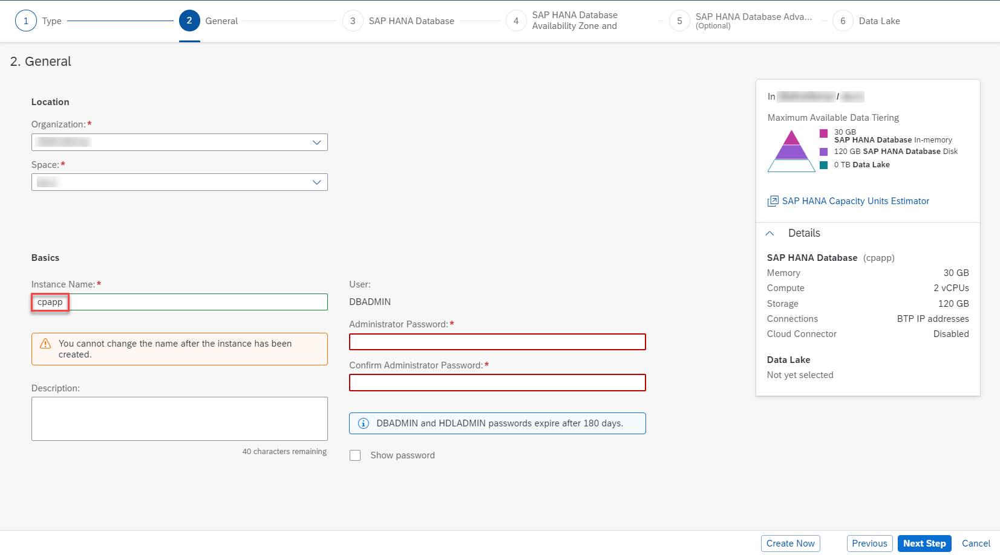
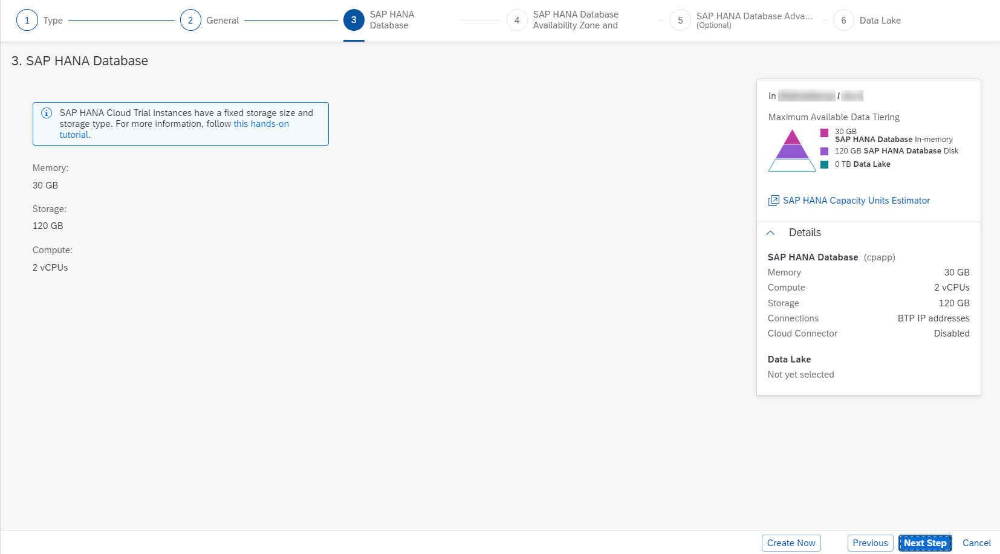
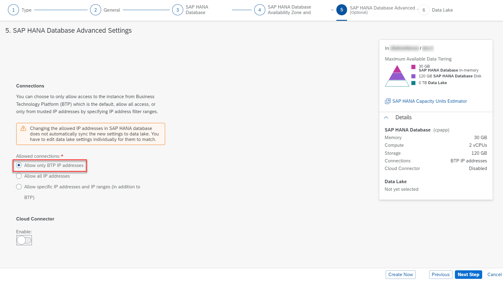

## Prerequisites
 - [Add SAP HANA Support to Your Project](btp-app-hana-app-setup)


## Details
### You will learn
 - How to set up the SAP HANA Cloud service instance


---
> This tutorial will soon be phased out. 
> 
> For more tutorials about how to develop and deploy a full stack CAP application on SAP BTP, see:
>
> - [Develop a Full-Stack CAP Application Following SAP BTP Developer’s Guide](https://developers.sap.com/group.cap-application-full-stack.html)
> - [Deploy a Full-Stack CAP Application in SAP BTP, Cloud Foundry Runtime Following SAP BTP Developer’s Guide](https://developers.sap.com/group.deploy-full-stack-cap-application.html)
> - [Deploy a Full-Stack CAP Application in SAP BTP, Kyma Runtime Following SAP BTP Developer’s Guide](https://developers.sap.com/group.deploy-full-stack-cap-kyma-runtime.html)
>
> To continue learning how to implement business applications on SAP BTP, see:
>
> - [SAP BTP Developer’s Guide](https://help.sap.com/docs/btp/btp-developers-guide/what-is-btp-developers-guide?version=Cloud&locale=en-US)
> - [Related Hands-On Experience](https://help.sap.com/docs/btp/btp-developers-guide/related-hands-on-experience?version=Cloud&locale=en-US)
> - [Tutorials for ABAP Cloud](https://help.sap.com/docs/btp/btp-developers-guide/tutorials-for-abap-cloud?version=Cloud&locale=en-US)
> - [Tutorials for SAP Cloud Application Programming Model](https://help.sap.com/docs/btp/btp-developers-guide/tutorials-for-sap-cloud-application-programming-model?version=Cloud&locale=en-US)

[ACCORDION-BEGIN [Step 1: ](Prepare to use SAP HANA Cloud service)]
> ### To earn your badge for the whole mission, you will need to mark all steps in a tutorial as done, including any optional ones that you may have skipped because they are not relevant for you.

SAP HANA Cloud service instances are not created automatically for any type of account. Therefore, you will have to create an SAP HANA Cloud service instance first, if you don't have one yet.

If you already have an SAP HANA Cloud service instance in your Cloud Foundry space &rarr; continue with **Use an Existing SAP HANA Cloud service instance**.

If you need to create an SAP HANA Cloud service instance first &rarr; continue with **Create an SAP HANA Cloud service instance**.

> Additional Documentation:

>   - [SAP HANA Cloud Getting Started Guide](https://help.sap.com/viewer/db19c7071e5f4101837e23f06e576495/cloud/en-US/d0aa0ec935c1401e8deb3be35d49730b.html)
>   - [SAP HANA Cloud Administrator DBADMIN](https://help.sap.com/viewer/f9c5015e72e04fffa14d7d4f7267d897/cloud/en-US/5b35402c47b344d882ac13c661aff1c0.html)

[DONE]
[ACCORDION-END]
---
[ACCORDION-BEGIN [Step 2: ]((Optional) Create an SAP HANA Cloud service instance)]
[OPTION BEGIN [Trial]]

> Follow this step only when you don't have an instance, if you do then continue with **Use an Existing SAP HANA Cloud service instance**

1. Go to your SAP BTP cockpit by using one of the following links, depending on the landscape you want to use.

    [https://cockpit.hanatrial.ondemand.com/](https://cockpit.hanatrial.ondemand.com/)

2. Enter your **Global Account**.

3. Choose **Account Explorer** in the left-hand pane.

4. In the **Subaccounts** tab, choose the subaccount to which you want to deploy your service and application.

    !

5. Choose **Cloud Foundry** &rarr; **Spaces** in the left-hand pane.

6. Choose the **Space** that you want to deploy to.

    !

7. Choose **SAP HANA Cloud** in the left-hand pane.

    !

8. Choose **Create** &rarr; **SAP HANA database**.

9. Sign in with your SAP BTP cockpit username/e-mail.

10. Choose **SAP HANA Cloud, SAP HANA Database** and choose **Next Step**.

    !

11. The **Organization** and **Space** will be selected. Enter the **Instance Name** `cpapp`.

    !

12. Enter a password for _DBADMIN_ in **Administrator Password** and **Confirm Administrator Password**.

    !

13. Choose **Next Step**. The default settings should be sufficient for the tutorial application.

    !

14. Choose **Next Step**.

15. At **SAP HANA Database Availability Zone and Replicas**, choose again **Next Step**.

16. Choose `Allow All IP addresses`, choose again **Next Step**.

    !

    > Do not use this setting for productive use, we use it here for convenience but in production you should find a secure alternative like explicitly configuring the allowed IP addresses.

    > Do not create a Data Lake. It's useful for ingesting, storing, and analyzing high volumes of data but you don't need it for the tutorial application.

17. Choose **Review and Create** to review your HANA Cloud instance configuration and choose **Create Instance**.

    > You can also copy the configuration so you can create a similar instance or cancel the creation and start from the beginning.

    The creation of the database instance can take some minutes to complete. The final result looks like this in SAP BTP cockpit:

    !

    > If you are following this tutorial for Kyma, then follow the steps in this note. Please ignore this note when you are only working on the Cloud Foundry mission.

    > 13. Choose "Kyma" as the environment type.
    > 14. Find your Kyma cluster ID as described next.
    > 15. Navigate to the Kyma dashboard, choose, Namespaces then choose kyma-system, Choose Secrets in the sidebar, choose Decode finally copy your cluster ID from here.
    > 16. Add your cluser ID in SAP HANA Cloud mapping section.
    > 17. Enter the Namespace which is the same as you created in Kyma dashboard.

    > Your SAP HANA Cloud service instance will be automatically stopped overnight, according to the server region time zone. That means you need to restart your instance every day before you start working with it.

    > You can either use SAP BTP cockpit or the Cloud Foundry CLI to restart the stopped instance:
    > ```bash
    > cf update-service cpapp -c '{"data":{"serviceStopped":false}}'
    > ```
[OPTION END]
[OPTION BEGIN [Live]]

> Follow this step only when you don't have an instance, if you do then continue with **Use an Existing SAP HANA Cloud service instance**

1. Go to your SAP BTP cockpit by using one of the following links, depending on the landscape you want to use.

    [https://account.hana.ondemand.com/](https://account.hana.ondemand.com/)

2. Enter your **Global Account**.

3. Choose **Account Explorer** in the left-hand pane.

4. In the **Subaccounts** tab, choose the subaccount to which you want to deploy your service and application.

    !

5. Choose **Cloud Foundry** &rarr; **Spaces** in the left-hand pane.

6. Choose the **Space** that you want to deploy to.

    !

7. Choose **SAP HANA Cloud** in the left-hand pane.

    !

8. Choose **Create** &rarr; **SAP HANA database**.

9. Sign in with your SAP BTP cockpit username/e-mail.

10. Choose **SAP HANA Cloud, SAP HANA Database** and choose **Next Step**.

    !

11. The **Organization** and **Space** will be selected. Enter the **Instance Name** `cpapp`.

    !

12. Enter a password for _DBADMIN_ in **Administrator Password** and **Confirm Administrator Password**.

    !

13. Choose **Next Step**. The default settings should be sufficient for the tutorial application.

    !

14. Choose **Next Step**.

15. At **SAP HANA Database Availability Zone and Replicas**, choose again **Next Step**.

16. Choose `Allow All IP addresses`, choose again **Next Step**.

    !

    > Do not use this setting for productive use, we use it here for convenience but in production you should find a secure alternative like explicitly configuring the allowed IP addresses.

    > Do not create a Data Lake. It's useful for ingesting, storing, and analyzing high volumes of data but you don't need it for the tutorial application.

17. Choose **Review and Create** to review your HANA Cloud instance configuration and choose **Create Instance**.

    > You can also copy the configuration so you can create a similar instance or cancel the creation and start from the beginning.

    The creation of the database instance can take some minutes to complete. The final result looks like this in SAP BTP cockpit:

    !

    > If you are following this tutorial for Kyma, then follow the steps in this note. Please ignore this note when you are only working on the Cloud Foundry mission.

    > 13. Choose "Kyma" as the environment type.
    > 14. Find your Kyma cluster ID as described next.
    > 15. Navigate to the Kyma dashboard, choose, Namespaces then choose kyma-system, Choose Secrets in the sidebar, choose Decode finally copy your cluster ID from here.
    > 16. Add your cluser ID in SAP HANA Cloud mapping section.
    > 17. Enter the Namespace which is the same as you created in Kyma dashboard.

    > Your SAP HANA Cloud service instance will be automatically stopped overnight, according to the server region time zone. That means you need to restart your instance every day before you start working with it.

    > You can either use SAP BTP cockpit or the Cloud Foundry CLI to restart the stopped instance:
    > ```bash
    > cf update-service cpapp -c '{"data":{"serviceStopped":false}}'
    > ```
[OPTION END]


[DONE]
[ACCORDION-END]
---
[ACCORDION-BEGIN [Step 3: ]((Optional) Use an existing SAP HANA Cloud service instance)]
[OPTION BEGIN [Trial]]

> Follow this step only if you have an instance created already, if you don't then continue with **Create an SAP HANA Cloud service instance**

1. Go to your SAP BTP cockpit by using one of the following links, depending on the landscape you want to use.

    [https://cockpit.hanatrial.ondemand.com/](https://cockpit.hanatrial.ondemand.com/)

2. Enter your **Global Account**.

3. Choose **Account Explorer** in the left-hand pane.

4. In the **Subaccounts** tab, choose the subaccount to which you want to deploy your service and application.

    !

5. Choose **Cloud Foundry** &rarr; **Spaces** in the left-hand pane.

6. Choose the space where you already have the SAP HANA Cloud service instance.

7. Choose **SAP HANA Cloud** in the left-hand pane.

8. Choose **Manage SAP HANA Cloud** in the upper right corner.

9. Sign in with your SAP BTP Cockpit username and email.

    The **SAP HANA Cloud Central** cockpit opens.

10. Choose an organization and again choose the space where you have the SAP HANA Cloud service instance.

    !

11. Choose your service instance.

12. Choose **Create Mapping**.


> If you are following this tutorial for Kyma, then follow the steps in this note. Please ignore this note when you are only working on the Cloud Foundry mission.

> 13. Choose "Kyma" as the environment type.
> 14. Find your Kyma cluster ID as described next.
> 15. Navigate to the Kyma dashboard, choose, Namespaces then choose kyma-system, Choose Secrets in the sidebar, choose Decode finally copy your cluster ID from here.
> 16. Add your cluser ID in SAP HANA Cloud mapping section.
> 17. Enter the Namespace which is the same as you created in Kyma dashboard.

13. Choose the **Org ID** and **Space ID** where you want to deploy the application.

14. Choose **Add**.


[OPTION END]
[OPTION BEGIN [Live]]

> Follow this step only if you have an instance created already, if you don't then continue with **Create an SAP HANA Cloud service instance**

1. Go to your SAP BTP cockpit by using one of the following links, depending on the landscape you want to use.

    [https://account.hana.ondemand.com/](https://account.hana.ondemand.com/)

2. Enter your **Global Account**.

3. Choose **Account Explorer** in the left-hand pane.

4. In the **Subaccounts** tab, choose the subaccount to which you want to deploy your service and application.

    !

5. Choose **Cloud Foundry** &rarr; **Spaces** in the left-hand pane.

6. Choose the space where you already have the SAP HANA Cloud service instance.

7. Choose **SAP HANA Cloud** in the left-hand pane.

8. Choose **Manage SAP HANA Cloud** in the upper right corner.

9. Sign in with your SAP BTP Cockpit username and email.

    The **SAP HANA Cloud Central** cockpit opens.

10. Choose an organization and again choose the space where you have the SAP HANA Cloud service instance.

    !

11. Choose your service instance.

12. Choose **Create Mapping**.


> If you are following this tutorial for Kyma, then follow the steps in this note. Please ignore this note when you are only working on the Cloud Foundry mission.

> 13. Choose "Kyma" as the environment type.
> 14. Find your Kyma cluster ID as described next.
> 15. Navigate to the Kyma dashboard, choose, Namespaces then choose kyma-system, Choose Secrets in the sidebar, choose Decode finally copy your cluster ID from here.
> 16. Add your cluser ID in SAP HANA Cloud mapping section.
> 17. Enter the Namespace which is the same as you created in Kyma dashboard.

13. Choose the **Org ID** and **Space ID** where you want to deploy the application.

14. Choose **Add**.


[OPTION END]

[VALIDATE_1]
The result of this tutorial can be found in the [`hana-cloud-setup`](https://github.com/SAP-samples/cloud-cap-risk-management/tree/hana-cloud-setup) branch.


[ACCORDION-END]
---