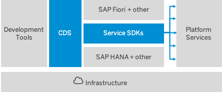

## Prerequisites
 - There are none. If you want to start learning about SAP BTP Application Development and CAP, this is the very beginning.

## Details
### You will learn
  - What is the SAP Cloud Application Programming Model (CAP)
  - What is SAP BTP

---

[ACCORDION-BEGIN [Step 1: ](Overview)]

Welcome to this collection of tutorials for application development on SAP Business Technology Platform (SAP BTP). In the following tutorials we provide information and examples on how to develop and deploy [SAP Cloud Application Programming Model (CAP)](https://cap.cloud.sap/) applications on [SAP BTP](cp-explore-cloud-platform) using different tools and services step by step.

The tutorials are suitable for new or experienced developers on SAP BTP. The purpose of these tutorials is to help application developers to get a quick start on development, provide best practices, solve common issues, use common services, identify areas that need to be improved, and have an end-to-end scenario for validation. In the tutorials, you get to know, step by step, the development process on SAP BTP.

If you can't complete a certain tutorial, there's the possibility of cloning a completed version of the tutorial from GitHub at the beginning of the next tutorial. You can find the links in the prerequisites section or at the end of the tutorial.

The tutorials cover a variety of topics starting from basic onboarding tasks to creating development pipelines. The tasks are bundled in step-by-step tutorials featuring the following topics:

- Setting up the development environment
- Developing an CAP application including UI
- Implementing authorization checks
- Creating a SAP BTP trial account
- Deployment on SAP BTP

[DONE]
[ACCORDION-END]
---
[ACCORDION-BEGIN [Step 2: ](What is CAP)]

CAP is a framework of languages, libraries, and tools for building enterprise-grade services and applications. It guides developers along a 'golden path' of proven best practices and a great wealth of out-of-the-box solutions to recurring tasks.

CAP-based projects benefit from a primary focus on domain. Instead of delving into overly technical disciplines, we focus on accelerated development and safeguarding investments in a world of rapidly changing cloud technologies.

The CAP framework features a mix of proven and broadly adopted open-source and SAP technologies, as highlighted in the figure below.

!

On top of open source technologies, CAP mainly adds:

- Core Data Services (CDS) as our universal modeling language for both domain models and service definitions.

- Service SDK and runtimes for Node.js and Java, offering libraries to implement and consume services as well as generic provider implementations serving many requests automatically.

[DONE]
[ACCORDION-END]
---
[ACCORDION-BEGIN [Step 3: ](What is SAP BTP)]

SAP BTP is an open set of Software, Platform, and Infrastructure as a Service systems that delivers in-memory capabilities, core platform services, and unique micro-services for building and extending intelligent, mobile and browser enabled applications. SAP BTP is multi-lingual, with support for most major languages (now including ABAP) and support for development, testing, and production systems both inside an organization and to the larger public.

SAP BTP is also constantly evolving. SAP continuously updates the services we provide, the platforms that run the custom code, and the infrastructure that supports everything. This allows developers to focus on the custom code, and not worry about hardware maintenance or software upgrades. SAP BTP offers you the ability to turn data into business value, compose end-to-end business processes, and build and extend SAP applications quickly.

The central point of entry to the cloud platform is the SAP BTP cockpit, where you can access your accounts and applications and manage all activities associated with them.

[DONE]
[ACCORDION-END]
---
[ACCORDION-BEGIN [Step 4: ](Test yourself)]

[VALIDATE_1]

[ACCORDION-END]
---