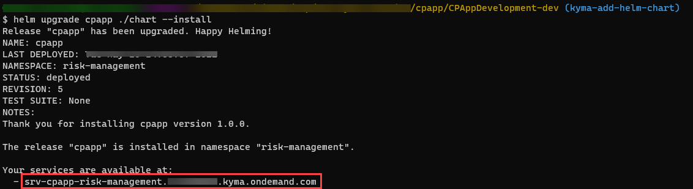
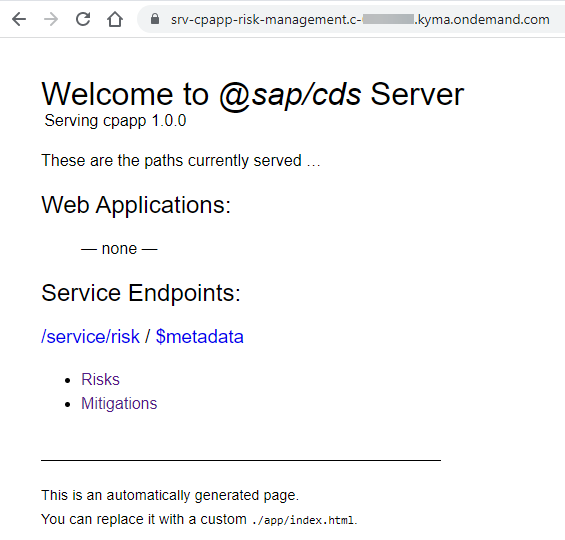
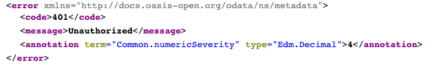
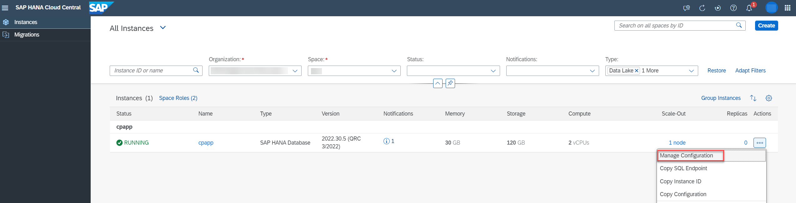
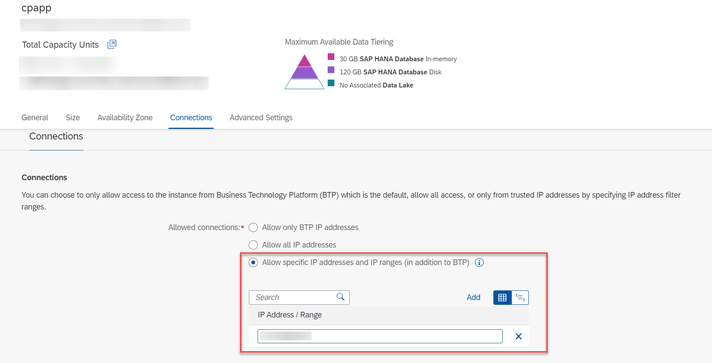

## Prerequisites
 - [Add Helm Chart](btp-app-kyma-add-helm-chart)
 - You have created a DB secret as specified in `Step 3: Setup SAP HANA Cloud` in [Set Up SAP HANA Cloud for Kyma](btp-app-kyma-hana-cloud-setup).

## Details
### You will learn
 - How to add the Authorization and Trust Management service (XSUAA) to your project
 - How to build docker images for your CAP service and database deployer
 - How to push the docker images to your container registry
 - How to deploy your app to your Kyma cluster


---

[ACCORDION-BEGIN [Step 1: ](Add Authorization and Trust Management service (XSUAA))]
The next step is to add the Authorization and Trust Management service which will allow user login, authorization, and authentication checks. Add the following snippet to the `chart/values.yaml` file:


```YAML[9-17]
srv:
  ...
xsuaa:
  serviceOfferingName: xsuaa
  servicePlanName: application
  parameters:
    xsappname: cpapp
    tenant-mode: dedicated
    role-collections:
      - description: Manage Risks
        name: RiskManager
        role-template-references:
          - '$XSAPPNAME.RiskManager'
      - description: View Risks
        name: RiskViewer
        role-template-references:
          - '$XSAPPNAME.RiskViewer'
```

The configuration for XSUAA is read from the `xs-security.json` file that was created in the tutorial [Prepare User Authentication and Authorization (XSUAA) Setup](btp-app-kyma-prepare-xsuaa). But in the `config` element, values can be added and overwritten. The value `xsappname` gets overwritten with a space-dependent value. The name has to be unique within a subaccount. This allows multiple deployments of this tutorial in different spaces of the same subaccount. For example, different people of a team that want to try it out and don't want to create a new subaccount for each team member. For a productive application, the `xsappname` should be explicitly set to the desired value. Alternatively, role collections can be manually assigned in the SAP BTP cockpit.

> Additional Documentation:

> See section [Assigning Role Collections](https://help.sap.com/viewer/65de2977205c403bbc107264b8eccf4b/Cloud/en-US/9e1bf57130ef466e8017eab298b40e5e.html) in SAP BTP documentation for more details.

[DONE]
[ACCORDION-END]
---
[ACCORDION-BEGIN [Step 2: ](Build docker images)]
Let's first set the environment variable for the container registry in your terminal. This will set a temporary environment variable for the current terminal session. At the same time, it will be easier to use the environment variable as a shorter alternative of the container registry URL when building and pushing the docker images later in the tutorial. Open a terminal and run the following command:

```Shell/Bash
CONTAINER_REGISTRY=<your-container-registry>
```

> Looking for `<your-container-registry>`?

> Value for `<your-container-registry>` is the same as the docker server URL and the path used for docker login. You can quickly check it by running the following command in your terminal:

> ```json
> cat ~/.docker/config.json
> ```

[DONE]
[ACCORDION-END]
---
[ACCORDION-BEGIN [Step 3: ](CAP build)]
> `NPM` uses a file called `package-lock.json` to remember which versions of packages were installed. `NPM` installs the same versions and ignores any updates in minor releases not explicitly specified in the `package.json` file. Maintaining this consistency is important for production applications. For the purposes of this tutorial, you'll be using the latest versions of the packages.

1. Remove `node_modules ` and `package-lock.json` from your project folder because they can cause errors later when building the CAP service:

    ```Shell/Bash
    rm -rf node_modules package-lock.json
    ```

2. Execute the following command in your project folder:

    ```Shell/Bash
    cds build --production
    ```

    You should get an output like: `[cds] - build completed in XXX ms`.

3. (Optional) Run the following command to remove the test data:

    ```Shell/Bash
    rm -rf gen/db/data
    ```

    > Although the app will work with the test data, usually test data should be removed before deployment.

    > Test files should never be deployed to an SAP HANA database as table data. This can cause the deletion of all files of the affected database table with a change of a data file. You can find more details in `Step 6: Exclude CSV files from deployment` of [Deploy Your Multi-Target Application (MTA)](btp-app-cap-mta-deployment).

[DONE]
[ACCORDION-END]
---
[ACCORDION-BEGIN [Step 4: ](Build CAP service)]
1. Run the following command:

    ```Shell/Bash
    pack build $CONTAINER_REGISTRY/cpapp-srv --path gen/srv \
    --buildpack gcr.io/paketo-buildpacks/nodejs \
    --builder paketobuildpacks/builder:base \
    --env BP_NODE_RUN_SCRIPTS=""
    ```


2. You should get an output like:

    ```Shell/Bash
    Successfully built image <Container Registry>/cpapp-srv
    ```

[DONE]
[ACCORDION-END]
---
[ACCORDION-BEGIN [Step 5: ](Build database deployer)]
1. Run the following command:

    ```Shell/Bash
    pack build $CONTAINER_REGISTRY/cpapp-hana-deployer --path gen/db \
        --buildpack gcr.io/paketo-buildpacks/nodejs \
        --builder paketobuildpacks/builder:base \
        --env BP_NODE_RUN_SCRIPTS=""
    ```

2. You should get an output like:

    ```Shell/Bash
    Successfully built image <Container Registry>/cpapp-hana-deployer
    ```

[DONE]
[ACCORDION-END]
---
[ACCORDION-BEGIN [Step 6: ](Push docker images)]
Now that we've build the docker images, let's push them to the container registry.

1. Make sure you're logged in to your container registry:

    ```Shell/Bash
    docker login
    ```

2. Push the images to container registry:

    ```Shell/Bash
    docker push $CONTAINER_REGISTRY/cpapp-srv
    docker push $CONTAINER_REGISTRY/cpapp-hana-deployer
    ```

[DONE]
[ACCORDION-END]
---
[ACCORDION-BEGIN [Step 7: ](Deploy)]
1. Deploy your app:

    ```Shell/Bash
    helm upgrade cpapp ./chart --install --set-file xsuaa.jsonParameters=xs-security.json
    ```


    > In case you get an error message about the CPU limits, increase the values for CPU in the file `chart/values.yaml`.

    > ```yaml hl_lines="5 9"
    > global:
    > ...
    >     resources:
    >         limits:
    >             cpu: 100m
    >             ephemeral-storage: 1G
    >             memory: 500M
    >         requests:
    >             cpu: 100m
    > ...
    > ```

2. Copy the app URL when done and paste it into a new browser window:

     

3. Now, you can access the CAP server:

     !

     If the error message `No healthy upstream.` is shown, wait a few seconds and try again.

4. When you choose the **Mitigation** or **Risk** service entity, you will see an error message:

     !


     The service expects a so called `JWT` (JSON Web Token) in the HTTP `Authorization` header that contains the required authentication and authorization information to access the service. In the next tutorial, you will deploy the SAP Fiori UIs, so that you can access your UIs from SAP Build Work Zone, standard edition. The SAP Build Work Zone, standard edition will trigger the authentication flow to provide the required token to access the service.

5. List installed helm charts:

    ```Shell/Bash
    helm list
    ```

    The installed helm chart should be displayed:

    ```Shell/Bash
    NAME    NAMESPACE       REVISION        UPDATED                                 STATUS          CHART           APP VERSION
    cpapp   risk-management 5               yyyy-mm-dd time timezone                deployed        cpapp-1.0.0     1.0.0
    ```

[DONE]
[ACCORDION-END]
---
[ACCORDION-BEGIN [Step 8: ](Troubleshooting)]
The Helm chart starts a deployment with the CAP service and a job that deploys the database content. After successful execution, the job is deleted. In case you encounter an error during the deployment process, follow the instructions in the sections below to troubleshoot.

[DONE]
[ACCORDION-END]
---
[ACCORDION-BEGIN [Step 9: ](Update your container management app)]
On macOS, if you get the error `ERROR: failed to build: failed to fetch builder image '<DOCKER-IMAGE>': Cannot connect to the Docker daemon at unix:///var/run/docker.sock. Is the docker daemon running?` when running the `pack build` command, try updating your container management app, as detailed in section **Install a container management app** of [Prepare Your Kyma Development Environment](btp-app-kyma-prepare-dev-environment).

[DONE]
[ACCORDION-END]
---
[ACCORDION-BEGIN [Step 10: ](Check your database deployment)]
1. Run the following command to check your database deployment:

    ```Shell/Bash
    kubectl get jobs
    ```

    If the job fails or if it's still in progress, the job is displayed as incomplete (completions `0/1`) like in this example:

    ```Shell/Bash
    NAME                 COMPLETIONS   DURATION   AGE
    cpapp-hana-deployer  0/1           3m7s       3m7s
    ```

2. In case the job is not completed, you can check the deployer's logs. Let's first print the pods:

    ```Shell/Bash
    kubectl get pods
    ```

    You should see a list of pods that run on error because of failed deployment attempts:

    ```Shell/Bash
    NAME                           READY   STATUS    RESTARTS   AGE
    cpapp-hana-deployer-6s7fl      0/1     Error     0          6m16s
    cpapp-hana-deployer-n5fnq      0/1     Error     0          7m46s
    cpapp-hana-deployer-plfmh      0/1     Error     0          7m16s
    cpapp-hana-deployer-z2nxh      0/1     Error     0          8m8s
    cpapp-hana-deployer-zc9c2      0/1     Error     0          6m56s
    ```

3. Pick one of the pods and check its logs. For example:

    ```Shell/Bash
    kubectl logs cpapp-hana-deployer-6s7fl
    ```

    The logs will give you more details about the deployment including error code and description.

4. With the `describe` command you can inspect the state of the pod even further:

    ```Shell/Bash
    kubectl describe pod cpapp-hana-deployer-6s7fl
    ```

    The `describe` command returns a handy list of the pod parameters including `Name`, `Namespace`, `Service Account`, `Status`, `IP`, `Containers`, and `Events` among others.

You can use the `logs` and `describe` commands as described above to inspect the pods. You can find further information about debugging pods in the [Kubernetes documentation](https://kubernetes.io/docs/tasks/debug/debug-application/debug-pods/).

[DONE]
[ACCORDION-END]
---
[ACCORDION-BEGIN [Step 11: ](Check SAP HANA Cloud trusted IP addresses)]
If you see the error `Connection failed (RTE:[89013] Socket closed by peer`, it's possible that your SAP HANA Cloud instance doesn't allow your Kyma cluster's IP address. You can find more info in [SAP HANA Database Connections](https://help.sap.com/docs/HANA_CLOUD/9ae9104a46f74a6583ce5182e7fb20cb/0610e4440c7643b48d869a6376ccaecd.html).

To specify trusted source IP addresses for your SAP HANA Cloud instance:

1. Get your Kyma cluster's outbound IP address with the following command:

    ```Shell/Bash
    kubectl run -it --rm --restart=Never --image alpine/curl nat-ip-probe --overrides='{ "apiVersion": "v1", "metadata": {"annotations": { "sidecar.istio.io/inject":"false" } } }' -- curl https://httpbin.org/ip
    ```

    The command creates a temporary container that runs a command to return your Kyma cluster's outbound IP address and then deletes the container. It takes a few seconds to execute and will print a JSON object with the IP address.

2. Go to your Cloud Foundry space where you already have the SAP HANA Cloud service instance.

3. Choose **SAP HANA Cloud** in the left-hand pane.

4. Choose **Manage SAP HANA Cloud** in the upper right corner.

5. Sign in with your SAP BTP Cockpit username and email. You should see your SAP HANA Cloud instance in the **SAP HANA Cloud Central** cockpit.

6. Choose **Manage Configuration** from the **Actions** menu for your SAP HANA Cloud instance.

    !

7. Change the **Allowed Connections** selection to `Allow specific IP addresses and IP ranges (in addition to BTP)` and add your Kyma cluster's outbound IP address.

    !

8. Your SAP HANA Cloud instance will automatically restart when you save your changes. Once the instance is running, try to deploy your app again:

    ```Shell/Bash
    helm upgrade cpapp ./chart --install
    ```

[DONE]
[ACCORDION-END]
---
[ACCORDION-BEGIN [Step 12: ](Check your CAP service)]
1. If the deployment was successful, you should see the running CAP service in the list of pods:

    ```Shell/Bash
    kubectl get pods
    ```

    ```Shell/Bash
    NAME                         READY   STATUS    RESTARTS   AGE
    cpapp-srv-84964965cd-5mwtm   2/2     Running   0          13m
    ```

2. Your service is made externally available using the `VirtualService` resource from `Istio`. You can check your externally exposed hostname:

    ```Shell/Bash
    kubectl get virtualservice
    ```

    It should look like this:

    ```Shell/Bash
    NAME              GATEWAYS                                         HOSTS                                                         AGE
    cpapp-srv-bsbj8   ["kyma-gateway.kyma-system.svc.cluster.local"]   ["srv-cpapp-risk-management.c-abc.stage.kyma.ondemand.com"]   2d15h
    ```


[VALIDATE_1]
[ACCORDION-END]
---