## Prerequisites
 - [Set Up Local Development using VS Code](btp-app-set-up-local-development)
 - [Create a Directory for Development](btp-app-create-directory)
 - [Create a CAP-Based Application](btp-app-create-cap-application)
 - [Create an SAP Fiori Elements-Based UI](btp-app-create-ui-fiori-elements)
 - [Add Business Logic to Your Application](btp-app-cap-business-logic)
 - [Create a UI Using Freestyle SAPUI5](btp-app-create-ui-freestyle-sapui5)
 - [Use a Local Launch Page](btp-app-launchpage)
 - [Implement Roles and Authorization Checks in CAP](btp-app-cap-roles)
 - [Prepare for SAP BTP Development](btp-app-kyma-prepare-btp)
 - [Prepare Your K... Development Environment](btp-app-kyma-prepare-dev-environment)
 - [Setup HANA Cloud for K...](btp-app-kyma-hana-cloud-setup)
 - [Prepare User Authentication and Authorization (XSUAA) Setup](btp-app-kyma-prepare-xsuaa)
 - [Add Helm Chart](btp-app-kyma-add-helm-chart)
 - [Deploy Your Application to K...](btp-app-kyma-deploy-application)

## Details
### You will learn
 - How to add navigation targets and prepare your UI applications.
 - How to build and push the docker image for HTML5 application `deployer`.
 - How to configure your Helm chart for HTML5 application deployment.
 - How to subscribe to SAP Launchpad service.
 - How to test your SAP Launchpad site.


To start with this tutorial use the result in the [`kyma-add-helm-chart`](https://github.com/SAP-samples/cloud-cap-risk-management/tree/kyma-add-helm-chart) branch.

---

[ACCORDION-BEGIN [Step 1: ](Prepare UI Applications)]

In this tutorial, you will use the SAP Launchpad service to access your CAP service and its UI. Additionally, the SAP Launchpad service provides features like personalization, role-based visibility, theming, and more. You can add multiple applications to one launchpad, including subscribed ones and applications from SAP S/4HANA or SAP BTP.

Navigation targets are required to navigate between applications, but also to start the applications from SAP Launchpad service. In the next steps, you add the navigation targets `Risks-display` and `Mitigations-display` to the application manifest (`manifest.json`) file.

[DONE]
[ACCORDION-END]
---
[ACCORDION-BEGIN [Step 2: ](Add navigation target for Risks UI)]
1. Open the file `app/risks/webapp/manifest.json`.

2. Add the external navigation target to the `sap.app` JSON object. You can add it right behind the `sourceTemplate` object:

<!-- cpes-file app/risks/webapp/manifest.json:$["sap.app"].crossNavigation -->
```JSON[8-20]
{
  ...
  "sap.app": {
    "id": "ns.risks",
    ...
    "sourceTemplate": {
      ...
    },
    "crossNavigation": {
      "inbounds": {
        "Risks-display": {
          "signature": {
            "parameters": {},
            "additionalParameters": "allowed"
          },
          "semanticObject": "Risks",
          "action": "display"
        }
      }
    }
  }
}
```

[DONE]
[ACCORDION-END]
---
[ACCORDION-BEGIN [Step 3: ](Add navigation target for Mitigations UI)]
Do the same with the mitigations manifest file `app/mitigations/webapp/manifest.json`, but with the `semanticObject` name `Mitigations`.

<!-- cpes-file app/mitigations/webapp/manifest.json:$["sap.app"].crossNavigation -->
```JSON[8-20]
{
  ...
  "sap.app": {
    "id": "ns.mitigations",
    ...
    "dataSources": {
      ...
    },
    "crossNavigation": {
      "inbounds": {
        "Mitigations-display": {
          "signature": {
            "parameters": {},
            "additionalParameters": "allowed"
          },
          "semanticObject": "Mitigations",
          "action": "display"
        }
      }
    }
  }
}
```

[DONE]
[ACCORDION-END]
---
[ACCORDION-BEGIN [Step 4: ](Install required UI tools)]
1. Install [SAPUI5 tooling](https://www.npmjs.com/package/@sap/ux-ui5-tooling) package as global module in the root folder of your project:

    ```Shell/Bash
    npm install --global @sap/ux-ui5-tooling
    ```

2. Install [SAP Fiori application generator](https://www.npmjs.com/package/@sap/generator-fiori) package as global module:

    ```Shell/Bash
    npm install --global @sap/generator-fiori
    ```

[DONE]
[ACCORDION-END]
---
[ACCORDION-BEGIN [Step 5: ](Add deployment config for HTML5 applications)]

[DONE]
[ACCORDION-END]
---
[ACCORDION-BEGIN [Step 6: ](Add SAP Fiori elements Risks application)]
1. Switch to `app/risks` folder:

    ```Shell/Bash
    cd app/risks
    ```

2. Add deployment configuration:

    ```Shell/Bash
    fiori add deploy-config cf
    ```

    > If the SAP Fiori generator fails, make sure to remove other `.yo-rc.json` files you might have in any of your project's directories and try again.

3. Enter the following settings:

    - ```Destination name ()```: **`cpapp-srv`**
    - ```Add application to managed application router? (Y/n)```: **`y`**

> On Windows, you might get an error when executing this command.

> The CDS development kit that we use in this tutorial series includes a batch executable file. Since it's not a binary, executing it on Windows might return an error similar to this one:

> ```
> Error @sap/fiori:deploy-config cf --base ui5.yaml --config ui5-deploy.yaml
> spawnSync cds ENOENT
> ```

> The issues is currently being fixed but here a workaround you can use for the time being:

> 1. Open the file `C:\Users\<Your-User>\AppData\Roaming\npm\node_modules\@sap\generator-fiori\generators\deployment-generator\cf\index.js`.
> 2. Search for `cwd:this.destinationPath()`.
> 3. Add `, shell:true` after `cwd:this.destinationPath()` within the curly brackets.
> 4. Save and close the file.
> 5. The `fiori add deploy-config cf` command should run without errors now.

[DONE]
[ACCORDION-END]
---
[ACCORDION-BEGIN [Step 7: ](Add SAP Fiori elements Mitigations application)]
1. Switch to the `app/mitigations` folder

    ```Shell/Bash
    cd ../../app/mitigations/
    ```

2. Add the deployment configuration:

    ```Shell/Bash
    fiori add deploy-config cf
    ```

3. Enter the following settings:

    - ```Destination name ()```: **`cpapp-srv`**
    - ```Add application to managed application router? (Y/n)```: **`y`**

[DONE]
[ACCORDION-END]
---
[ACCORDION-BEGIN [Step 8: ](Change cloud service)]
The `fiori` command automatically sets some value to the SAP Cloud service property in both  `app/risks/webapp/manifest.json` and `app/mitigations/webapp/manifest.json` files. Change the `sap.cloud.service` property in `app/risks/webapp/manifest.json` and `app/mitigations/webapp/manifest.json`:

```JSON[3]
"sap.cloud": {
    "public": true,
    "service": "cpapp.service"
}
```

[DONE]
[ACCORDION-END]
---
[ACCORDION-BEGIN [Step 9: ](Create package.json and build script for app deployer)]
1. Create a file `app/package.json` for the HTML5 application `deployer` application and add the following code to it:

    ```JSON
    {
        "name": "html5-deployer",
        "scripts": {
            "start": "node node_modules/@sap/html5-app-deployer/index.js",
            "build": "bash build.sh"
        },
        "workspaces": [
            "risks",
            "mitigations"
        ]
    }
    ```

    The `build` script triggers the build of the Fiori applications for deployment in the HTML5 application repository. The two UI applications are referred as sub packages ("workspaces") which is required for the build.

    The deployer is run with the `start` script.

2. Add a file `app/build.sh` for the Fiori application build and add the following code to it:

    ```Shell/Bash
    #!/bin/bash

    set -e

    npm run build:cf --prefix risks
    npm run build:cf --prefix mitigations

    rm -rf resources
    mkdir -p resources

    mv risks/dist/nsrisks.zip resources
    mv mitigations/dist/nsmitigations.zip resources

    if [ "$CNB_STACK_ID" != "" ]; then
        # Delete directories if running in CNB build to avoid them getting packaged
        rm -rf risks
        rm -rf mitigations
    fi
    ```

    This script calls the UI5 build for the two SAP Fiori applications and copies the result into the `resources` directory.

3. Navigate back to your project root folder:

    ```Shell/Bash
    cd ../..
    ```

4. Add the HTML5 application `deployer` package `@sap/html5-app-deployer` to the `app/package.json` file:

    ```Shell/Bash
    npm install --prefix app @sap/html5-app-deployer
    ```

3. Delete `node_modules` and `package-lock.json` files within `app` folder and its subfolders.

    When switching to the `npm` workspace feature old `package-lock.json` and `node_modules` cause problems. Therefore, execute the following command:

    ```Shell/Bash
    rm -rf {app,app/risks,app/mitigations}/{node_modules,package-lock.json}
    ```

[DONE]
[ACCORDION-END]
---
[ACCORDION-BEGIN [Step 10: ](Build HTML5 application deployer image)]
1. Set container registry environment variable:

    ```Shell/Bash
    CONTAINER_REGISTRY=<your-container-registry>
    ```

2. Build docker image:

    ```Shell/Bash
    pack build $CONTAINER_REGISTRY/cpapp-html5-deployer \
         --env BP_NODE_RUN_SCRIPTS=build \
         --path app \
         --buildpack gcr.io/paketo-buildpacks/nodejs \
         --builder paketobuildpacks/builder:base
    ```

    The parameter `--env BP_NODE_RUN_SCRIPTS=build` triggers the build script in the `app/package.json`, which runs the UI5 build for the SAP Fiori applications as it is defined in the `app/build.sh` file. The build result appears in the docker image only. It's not on your file system.

3. Push docker image:

    ```Shell/Bash
    docker push $CONTAINER_REGISTRY/cpapp-html5-deployer
    ```

[DONE]
[ACCORDION-END]
---
[ACCORDION-BEGIN [Step 11: ](Configure Helm chart for HTML5 application deployment)]
1. Add the HTML5 Application `deployer` to your Helm chart:

    ```
    cds add helm:html5_apps_deployer
    ```

    This adds three new sections `html5_apps_deployer` and `html5_apps_repo_host`  and `destinations` to the `chart/values.yaml` file and also copies a few additional files in the `chart/templates` folder. It deploys your HTML5 applications using the `cpapp-html5-deployer` image and creates the required destinations to access the CAP service. The `HTML5Runtime_enabled` option makes the destinations accessible for the Launchpad Service.

2. Replace `<your-container-registry>` with your container registry in the `html5_apps_deployer` section of your `chart/values.yaml` file:

    ```YAML[5]
    html5_apps_deployer:
      cloudService: null
      backendDestinations: {}
      image:
        repository: <your-container-registry>/cpapp-html5-deployer
        tag: latest
    ```

3.  Add the destination and the cloud service to your backend service:

    ```YAML[2-5]
    html5_apps_deployer:
      cloudService: cpapp.service
      backendDestinations:
        cpapp-srv:
          service: srv
      image:
        ...
    ```

     You've already configured the same destination ([Add Deployment Config for HTML5 Applications](#add-deployment-config-for-html5-applications)) and cloud service ([Change Cloud Service](#change-cloud-service)) values for your SAP Fiori applications, so with this step the configurations are also reflected in the `values.yaml` file.

     The backend destination configuration creates a destination with the name `cpapp-srv` pointing to the URL for your CAP service `srv`.

[VALIDATE 1]
[ACCORDION-END]
---
[ACCORDION-BEGIN [Step 12: ](Re-Deploy your application)]
```Shell/Bash
helm upgrade cpapp ./chart --install
```
[DONE]
[ACCORDION-END]
---
[ACCORDION-BEGIN [Step 13: ](Subscribe to SAP Launchpad service)]

1. Enter your **Global Account**. If you are using a trial account, choose **Go To Your Trial Account**.

2. Choose **Account Explorer**.

3. In the **Subaccounts** tab, choose the subaccount where you have deployed your service and application.

    !

2. Choose **Services** **&rarr;** **Service Marketplace** on the left.

3. Search for the **Launchpad Service** tile and choose **Create**.

    !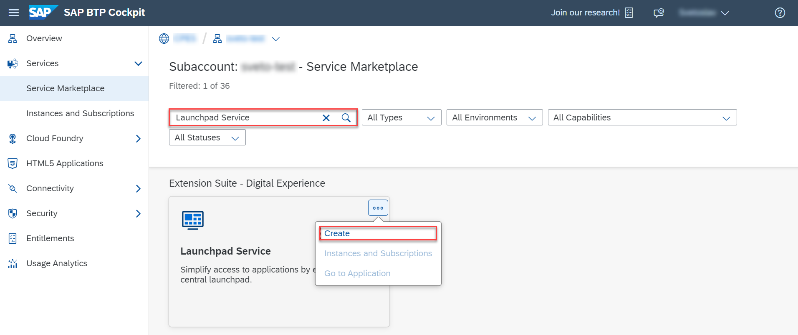

4. Keep the default settings for **Service** and **Plan** and choose **Create**.

    !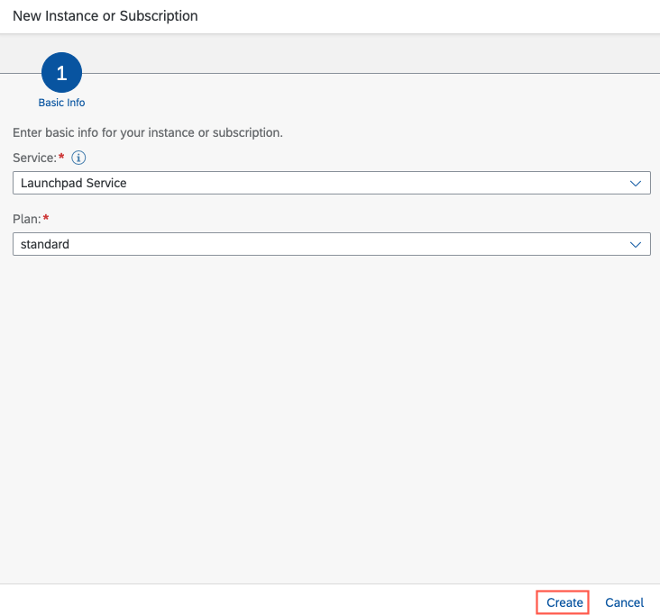

You have now subscribed to the SAP Launchpad service.
[DONE]
[ACCORDION-END]
---
[ACCORDION-BEGIN [Step 14: ](Assign SAP Launchpad role collection)]

You need to assign your user to the `Launchpad_Admin` role collection, so you don't get an error accessing the **Launchpad Service** site later on.

1. Choose **Security** **&rarr;** **Users** on the left.

2. Choose your user.

3. Under **Role Collections** on the right, choose **Assign Role Collection** and assign the `Launchpad_Admin` role collection to your user.

    !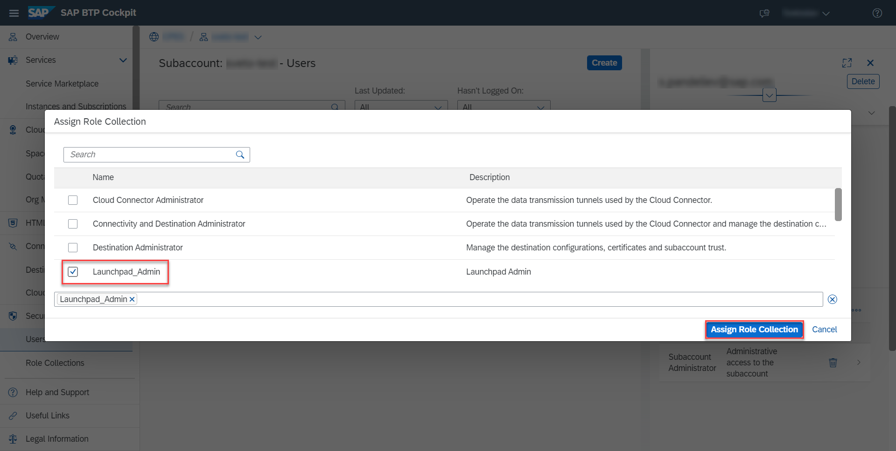

4. Open another browser or clear your browser's cache.

> See section [Initial Setup](https://help.sap.com/viewer/8c8e1958338140699bd4811b37b82ece/Cloud/en-US/fd79b232967545569d1ae4d8f691016b.html) in the SAP Launchpad service's documentation for more details.
> [DONE]
[ACCORDION-END]
---
[ACCORDION-BEGIN [Step 15: ](Create your SAP Launchpad site)]

1. Choose **Services** **&rarr;** **Instances and Subscriptions** on the left.

2. Locate the **Launchpad Service** under **Subscriptions** and choose **Go to Application**.

    !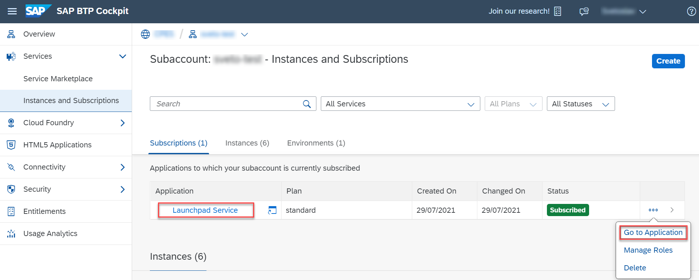

3. Choose **Provider Manager** on the left and refresh the `HTML5 Apps` entry there.

    !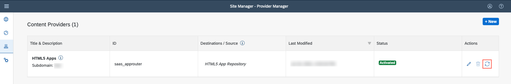

    > Content providers aren't reloaded automatically when you push an app, so it's important to manually refresh.

4. Choose **Content Manager** **&rarr;** **Content Explorer** and open the content provider `HTML5 Apps`.

    !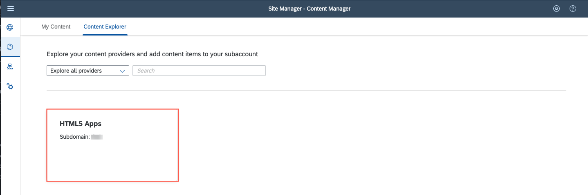

5. Add the `Risks` and `Mitigations` to **My Content**.

    !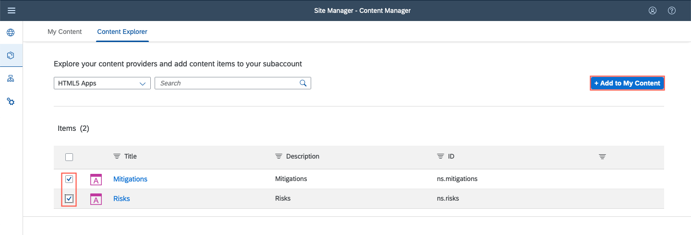

6. Choose **Content Manager** **&rarr;** **My Content**.

7. In the item list, choose the item `Everyone`.

    !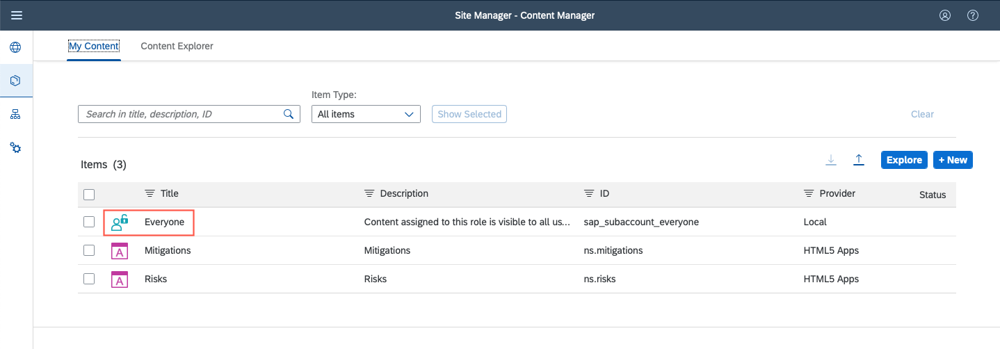

    > `Everyone` is a role that has to be assigned to the `Risks` and `Mitigations` apps so all users can access them.

8. Choose **Edit**, click on the search field, assign the `Risks` and `Mitigations` apps to the role, and choose **Save**.

    !

9. Navigate back to **My Content**.

10. Choose **New** **&rarr;** **Group**.

    !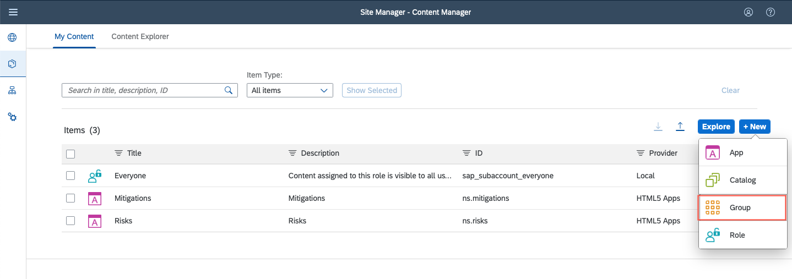

11. Type in `Risk Management` as the title of the group and assign the `Risks` and `Mitigations` apps to it.

    !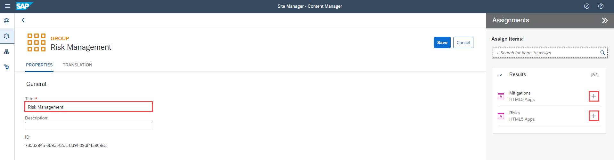

    > This way, you are telling the SAP Launchpad service to display the `Risks` and `Mitigations` apps in a group called `Risk Management`.

12. Choose **Site Directory** **&rarr;** **Create Site**.

    !

13. Type in `Risk Management Site` for the site name and choose **Create**.

    > The new site gets the `Everyone` role by default, so you don't have to assign it explicitly. The default site properties are sufficient for the purposes of this tutorial.
[DONE]
[ACCORDION-END]
---
[ACCORDION-BEGIN [Step 16: ](Test your SAP Launchpad site)]

1. Choose **Go to site**.

    !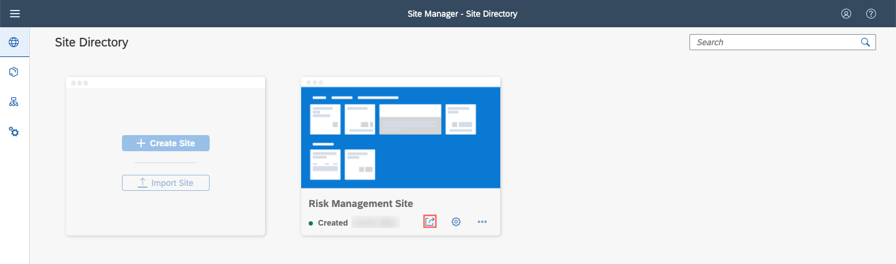

    You can see the `Risk Management` group that includes the `Mitigations` and `Risks` apps.

2. Open the `Risks` app.

    !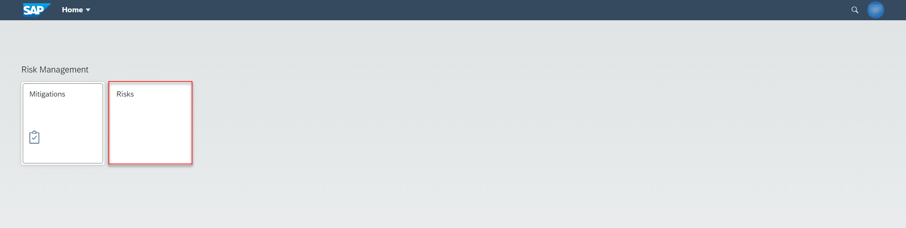

You have launched your `Risks` app through the SAP Launchpad service.

  !

> If you choose **Go**, you will get an error because you haven't assigned a role collection to your user yet. We'll do it in the next tutorial.

[DONE]
The result of this tutorial can be found in the [`kyma-launchpad-service`](https://github.com/SAP-samples/cloud-cap-risk-management/tree/kyma-launchpad-service) branch.


[ACCORDION-END]
---
