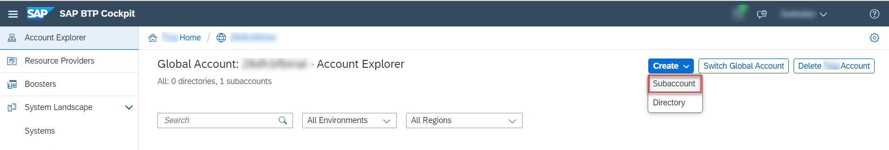
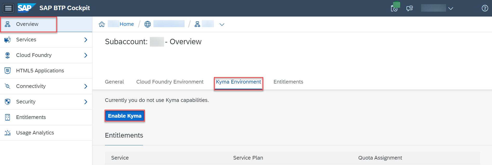
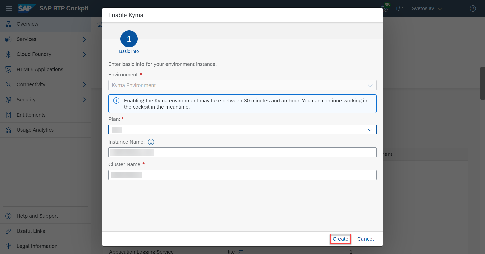
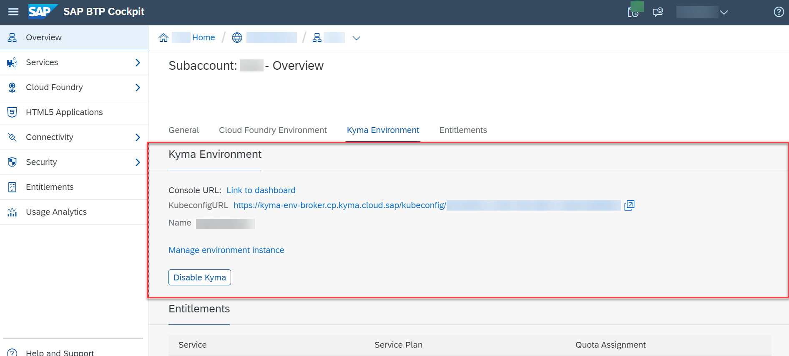

## Prerequisites
 - [Prepare Your Development Environment for CAP](btp-app-prepare-dev-environment-cap)
 - Before you start with this tutorial, you have two options:
    - Follow the instructions in **Step 16: Start from an example branch** of [Prepare Your Development Environment for CAP](btp-app-prepare-dev-environment-cap) to checkout the [`cap-roles`](https://github.com/SAP-samples/cloud-cap-risk-management/tree/cap-roles) branch.
    - Complete the group of tutorials [Create a CAP Application and SAP Fiori UI](group.btp-app-cap-create).

## Details
### You will learn
 - How to create an account for SAP BTP
 - How to check and assign entitlements
 - How to configure Kyma in your SAP BTP subaccount

---

[ACCORDION-BEGIN [Step 1: ](Overview)]
> ### To earn your badge for the whole mission, you will need to mark all steps in a tutorial as done, including any optional ones that you may have skipped because they are not relevant for you.

You need an SAP BTP account to deploy the services and applications.
In general, you have a choice of the following options:

**Trial:** *(recommended)* Use a trial account if you just want to try out things and don't want to use any of the parts of this tutorial productively. The usage is free of cost and all the services that you need for this tutorial get automatically assigned to your trial account.

> When running the tutorial with a trial account, please have in mind the following considerations:

> * Choose host region `cf-us10` when creating a new trial account. This will ensure that all services required throughout the tutorial are available to your account.
> * If you use an existing trial account, make sure the host region is different from `cf-ap21`. Otherwise, some services required throughout the tutorial might be missing from your account. To check the host region for your account, choose **About** from the dropdown under your user in the top right corner of the SAP BTP cockpit.

**Live:** There are multiple live landscapes available in different data centers around the globe. Live landscapes are intended for productive usage and development projects.

[DONE]
[ACCORDION-END]
---
[ACCORDION-BEGIN [Step 2: ](Create a Trial account)]
You can [register for a trial account](https://www.sap.com/cmp/td/sap-cloud-platform-trial.html) and access it in [SAP BTP Cockpit](https://cockpit.hanatrial.ondemand.com/cockpit#/home/trial).

A global account, a subaccount, a Cloud Foundry org, and space with some entitlements that should be sufficient to do this tutorial are set up for you. You'll only need to enable Kyma as described in the following steps. Nevertheless, let's first double check the entitlements to avoid any problems later in the tutorial. Continue with **Step 5: Check and assign entitlements** below.

[DONE]
[ACCORDION-END]
---
[ACCORDION-BEGIN [Step 3: ](Create a Live account)]
If you choose to create an account on Live, you have to select a number of services that you need to subscribe to, for example, an SAP HANA database. For each service, there are so-called `entitlements`, which are basically the service plans and the number of units that you want from each service. When you create an account, you need to provide these also.

[DONE]
[ACCORDION-END]
---
[ACCORDION-BEGIN [Step 4: ](Create a subaccount)]
1. Enter your **Global Account**. If you are using a trial account, choose **Go To Your Trial Account**.

2. Choose **Account Explorer** in the left navigation pane.

3. Choose **Create** &rarr; **Subaccount**.

    !

4. In the **New Subaccount** dialog, enter a **Display Name**.

    > Use a short name for your project and add the prefix for the landscape, for example: `<project name>-cf-us10`. Don't select the checkbox **Neo**!

5. Enter a subdomain.

    > Only valid HTTP domain characters are allowed.

6. Choose **Create**.

7. Wait for the completion of the subaccount creation.

8. Choose the tile with your new subaccount.

[DONE]
[ACCORDION-END]
---
[ACCORDION-BEGIN [Step 5: ](Check and assign entitlements)]
In this section, you assign a portion of the entitlements that you've bought for your global account to the individual subaccounts. In this example, you have only one subaccount. However, if you have 3 subaccounts, for example, and have bought 100 units of the HTML5 service, you could assign 50 units to the first subaccount, 20 to the second, and the remaining 30 to the third subaccount.

The following services with their service plans and entitlements are required for the different tutorial modules and will be needed throughout the tutorial.

| Service                           | Plan       | Amount | Unit         | Tutorial                                |
| --------------------------------- | ---------- | ------ | ------------ | --------------------------------------- |
| Kyma runtime             | `Kyma Runtime Trial`     | 1      | GB           | Step 6: Configure Kyma in your subaccount|
| SAP HANA Schemas & HDI Containers | `hdi-shared` | 1      | instances    | [Set Up SAP HANA Cloud for Kyma](btp-app-kyma-hana-cloud-setup)   |
| SAP HANA Cloud                    | `hana`       | 1      | instances    | [Set Up SAP HANA Cloud for Kyma](btp-app-kyma-hana-cloud-setup)     |
| SAP Build Work Zone, standard edition             | `standard`   | 1      | active users | [Subscribe to the SAP Build Work Zone, Standard Edition](btp-app-kyma-work-zone-subscribe) |

> The following services are Utility Services, no entitlement needed:

| Service                          | Plan        | Amount | Unit         | Tutorial                                |
| -------------------------------- | ----------- | ------ | ------------ | --------------------------------------- |
| SAP HTML5 Application Repository service  | `app-host`    | 100    | MB        | [Subscribe to the SAP Build Work Zone, Standard Edition](btp-app-kyma-work-zone-subscribe)   |
| SAP Authorization and Trust Management service | `application` | 1      | instances    | [Deploy Your Application to Kyma](btp-app-kyma-deploy-application)   |

1. In your subaccount, choose **Entitlements** in the left-hand pane.

2. Choose **Configure Entitlements**.

3. Choose **Add Service Plans**.

4. Go through the entitlements according to the table above and check/add the required plans for each of them.

5. Choose the **+** or **-** symbol to change the quota for the services according to the table.

6. Choose **Save**.

> In case you face a problem when creating a service instance or subscribing to an application later in the tutorial, please make sure you've added all entitlements listed in the table above.

[DONE]
[ACCORDION-END]
---
[ACCORDION-BEGIN [Step 6: ](Configure Kyma in your subaccount)]
This creates in your subaccount a Kyma instance that is a complete Kubernetes cluster with Kyma on top.

1. In your subaccount's **Overview** page, choose the **Kyma Environment** tab and choose **Enable Kyma**.

    !

2. In the **Enable Kyma** dialog, a plan, an instance name, and a cluster name are automatically filled for you. You can keep the default settings and choose **Create**.

    !

    > Prefer to use a different instance name?

    > We recommend you use a CLI-friendly name to enable the managing of your instances with the SAP BTP command line interface as well.

    > A CLI-friendly name is a short string (up to 32 characters) that contains only alphanumeric characters (A-Z, a-z, 0-9), periods, underscores, and hyphens. It can't contain white spaces.

    > As mentioned above, when you create an environment instance that enables an environment you want to use, the name is generated automatically for you. You can use that name or replace it with the name of your choice.

3. The creation of the cluster takes some time. When done, you should see a `Console URL`, a `KubeconfigURL`, and the name of your cluster.

    !

[VALIDATE_1]
[ACCORDION-END]
---