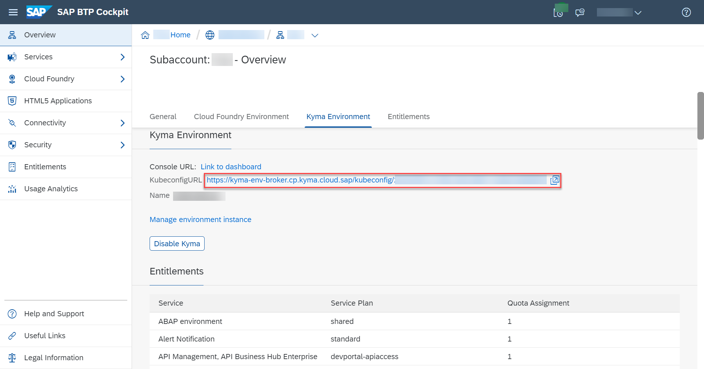
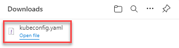
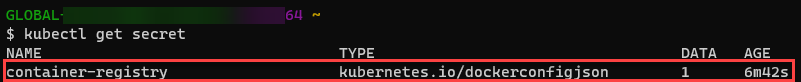

## Prerequisites
 - [Prepare for SAP BTP Development](btp-app-kyma-prepare-btp)
 - For Windows, you'll need Chocolatey. This is a package manager that will speed up and ease installation of the tools in this tutorial. See how to install Chocolatey in [Setup/Install](https://docs.chocolatey.org/en-us/choco/setup).
 - You have prepared a container registry and you've logged in to the container registry through your CLI. A container registry is a repo where you can push your docker images. SAP BTP doesn't currently provide a container registry. You can use any container registry offering as long as it can be reached from public Internet.


## Details

### You will learn
 - How to prepare your Kyma development environment


---

[ACCORDION-BEGIN [Step 1: ](Verify your @sap/cds and @sap/cds-dk versions)]
> ### To earn your badge for the whole mission, you will need to mark all steps in a tutorial as done, including any optional ones that you may have skipped because they are not relevant for you.

Make sure you're using the latest CAP tooling version.

Delete any outdated `package-lock.json` files in your project directory and run the following commands:

1. `npm install --global @sap/cds-dk` to install globally the latest `@sap/cds-dk` version.

1. `npm install` to install your local package.

2. `cds version` to double check that the globally installed `@sap/cds-dk` version and your locally installed `@sap/cds` version match.

[DONE]
[ACCORDION-END]
---
[ACCORDION-BEGIN [Step 2: ](Install kubectl)]
[OPTION BEGIN [macOS]]

1. To install kubectl, run the following command:
```Shell/Bash
brew install kubectl
```
2. Check if the installation is successful:
```Shell/Bash
kubectl version --client
```
You should see a version number.

[OPTION END]
[OPTION BEGIN [Windows]]

You can install kubectl using chocolatey.

1. To install kubectl, run the following command:
```Shell/Bash
choco install kubernetes-cli
```
2. Check if the installation is successful:
```Shell/Bash
kubectl version --client
```
You should see something like:
`Client Version: version.Info{Major:"1", Minor:"19", GitVersion:"v1.19.3", GitCommit:"1e11e4a2108024935ecfcb2912226cedeafd99df", GitTreeState:"clean", BuildDate:"2020-10-14T12:50:19Z", GoVersion:"go1.15.2", Compiler:"gc", Platform:"windows/amd64"}`


[OPTION END]
[OPTION BEGIN [Linux]]

Follow the instructions for your preferred way of installing kubectl at [Install and Set Up kubectl on Linux](https://kubernetes.io/docs/tasks/tools/install-kubectl-linux/).

[OPTION END]


[DONE]
[ACCORDION-END]
---
[ACCORDION-BEGIN [Step 3: ](Install kubelogin)]
[OPTION BEGIN [macOS]]

To install `kubelogin`, run the following command:
```Shell/Bash
brew install int128/kubelogin/kubelogin
```
See [`kubelogin` docs](https://github.com/int128/kubelogin#setup) for more details.
[OPTION END]
[OPTION BEGIN [Windows]]

You can install `kubelogin` using chocolatey:

```Shell/Bash
choco install kubelogin
```

See [`kubelogin` docs](https://github.com/int128/kubelogin#setup) for more details.
[OPTION END]
[OPTION BEGIN [Linux]]

To install `kubelogin`, run the following command:
```Shell/Bash
brew install int128/kubelogin/kubelogin
```

See [`kubelogin` docs](https://github.com/int128/kubelogin#setup) for more details.
[OPTION END]


[DONE]
[ACCORDION-END]
---
[ACCORDION-BEGIN [Step 4: ](Log in to your Kyma cluster)]
1. Choose `KubeconfigURL` under the **Kyma Environment** tab in your subaccount.

    !

    A file `kubeconfig.yaml` is downloaded.

    !

2. Copy the `kubeconfig.yaml` file to the `~/.kube/` directory and rename it to `config`. Replace or rename any existing file with the same name.

> You can also move and rename the `kubeconfig.yaml` file from the CLI.

> 1. Rename or remove any existing file named `config` from the `~/.kube/` directory.

> 2. Run the following commands:

>     ```
>     KUBECONFIG="$HOME/.kube/config:$HOME/Downloads/kubeconfig.yaml" kubectl config view --raw >$HOME/.kube/config-new
>     mv $HOME/.kube/config-new $HOME/.kube/config
>     chmod 600 $HOME/.kube/config
>     ```
>     In case you experience problems running the commands, check Step 2: `Command Line Interpreters` from [Set Up Local Development Using VS Code](btp-app-set-up-local-development) for more details on recommended CLIs.


There are two additional steps for Windows users only:

3. Go to `C:\ProgramData\chocolatey\bin`.

4. Rename `kubelogin.exe` to `kubectl-oidc_login.exe`.

[DONE]
[ACCORDION-END]
---
[ACCORDION-BEGIN [Step 5: ](Create a namespace for your app)]
1. Run the following command to create a namespace `risk-management`:

    ```Shell/Bash
    kubectl create namespace risk-management
    ```
    You should get a message `namespace/risk-management created`.
   
> Error messages on macOS

> There might be some messages that look like an error but check if you get the message `namespace/risk-management created` at the end.

2. Switch context to the namespace:

    ```Shell/Bash
    kubectl config set-context --current --namespace risk-management
    ```
   You should get a message `Context "shoot--kyma--X-XXXXXXX" modified.`

[DONE]
[ACCORDION-END]
---
[ACCORDION-BEGIN [Step 6: ](Create container registry secret)]
You need the container registry secret to access docker container images in your registry from your Kyma cluster.

Kubernetes has a special type of secret for container registries and its `kubectl` command line supports it with the required options:

```Shell/Bash
kubectl create secret docker-registry container-registry \
        "--docker-server=..." \
        "--docker-username=..." \
        "--docker-email=..." \
        "--docker-password=..."
```

1. Copy the folder `scripts` from `templates/Kyma-Prepare-Dev-Environment` to your project directory.


1. Run the script to create the secret. In your project directory, execute:

    ```Shell/Bash
    ./scripts/create-container-registry-secret.sh
    ```
    Running this script will prompt you for the required inputs. By using the script, you avoid storing your password in your command line interpreter's history.

    > Can't run the `kubectl create secret docker-registry container-registry \` command?

    > If you encounter any errors running this command, make sure you are using the `Git BASH` command line interpreter, as advised in `Step 2: Command Line Interpreters` in this [tutorial](btp-app-set-up-local-development).


3. When prompted, provide the required details.

    - `Docker Server` - Use the full qualified hostname for the docker server.
    - `User` and `Email` - provide your username and e-mail that you used to create your container registry.
    - `API Key` - as part of the authentication settings of your container registry, you should be able to generate an API key and provide it here.

    > Looking for your docker server URL?

    > The docker server URL is the path used for docker login, so you can quickly check it by running the following command in your terminal:

    > ```json
    > cat ~/.docker/config.json
    > ```

4. Check if the secret was successfully created:

    ```Shell/Bash
    kubectl get secret
    ```
    You should be able to see the newly created secret.

    


[VALIDATE_1]
[ACCORDION-END]
---
[ACCORDION-BEGIN [Step 7: ](Install helm)]
[OPTION BEGIN [macOS]]

There's a multitude of options to install helm. You can see the full list at [Installing Helm](https://helm.sh/docs/intro/install/). We have also listed some options:

To install helm, run the following command:
```Shell/Bash
brew install helm
```

[OPTION END]
[OPTION BEGIN [Windows]]

There's a multitude of options to install helm. You can see the full list at [Installing Helm](https://helm.sh/docs/intro/install/). We have also listed some options:

You can install helm using chocolatey.

1. To install helm run the following command:
```Shell/Bash
choco install kubernetes-helm
```
2. Check if the installation is successful:
```Shell/Bash
helm version
```
You should see something like `version.BuildInfo{Version:"v3.8.0", GitCommit:"d14138609b01886f544b2025f5000351c9eb092e", GitTreeState:"clean", GoVersion:"go1.17.5"}`.

[OPTION END]


[DONE]
[ACCORDION-END]
---
[ACCORDION-BEGIN [Step 8: ](Install Paketo (pack))]
[OPTION BEGIN [macOS]]

Pack lets you build container images, which are collaboratively maintained making it easier to maintain and update.

Install the [pack CLI](https://buildpacks.io/docs/tools/pack/#install).

```Shell/Bash
brew install buildpacks/tap/pack
```

[OPTION END]
[OPTION BEGIN [Windows]]

Pack lets you build container images, which are collaboratively maintained making it easier to maintain and update.

Install the [pack CLI](https://buildpacks.io/docs/tools/pack/#install).

You can install pack using chocolatey with the command:
```Shell/Bash
choco install pack
```
As an alternative, you can install `pack` manually:

1. Download `pack` for your platform from [GitHub](https://github.com/buildpacks/pack/releases).
2. Extract the `pack` binary.
3. Enter **Edit the System Environment Variables** in the Windows search box (Windows icon in the task bar). The **System Properties** dialog is opened.
4. Choose **Environment Variables...**.
5. Choose your `Path` environment variable under *User Variables for `<your_user_name>`* and choose **Edit**.
6. Choose **Browse** and navigate to the folder where you extracted the `pack` binary.
7. Choose **OK** to add `pack` to your `Path` environment variable.


[OPTION END]
[OPTION BEGIN [Linux]]

Pack lets you build container images, which are collaboratively maintained making it easier to maintain and update.

Install the [pack CLI](https://buildpacks.io/docs/tools/pack/#install).

Follow the instructions to install the [pack CLI](https://buildpacks.io/docs/tools/pack/#install).

[OPTION END]


[DONE]
[ACCORDION-END]
---
[ACCORDION-BEGIN [Step 9: ](Install a container management app)]
[OPTION BEGIN [Docker Desktop]]

Kyma runs on containers. Hence, for this tutorial, you'll need an application that enables you to manage (build, push, pull, and run) container images on your desktop and a docker-compatible command line interface. We provide two examples below - Docker Desktop and Rancher Desktop. You can pick one of them or any other app suitable for the purpose.


* **macOS**: Download the installer from [Install Docker Desktop on Mac](https://docs.docker.com/desktop/mac/install/) and follow the instructions to install and set up Docker Desktop.

* **Windows**: Download the installer from [Install Docker Desktop on Windows](https://docs.docker.com/desktop/windows/install/) and follow the instructions to install and set up Docker Desktop.

[OPTION END]
[OPTION BEGIN [Rancher Desktop]]

Kyma runs on containers. Hence, for this tutorial, you'll need an application that enables you to manage (build, push, pull, and run) container images on your desktop and a docker-compatible command line interface. We provide two examples below - Docker Desktop and Rancher Desktop. You can pick one of them or any other app suitable for the purpose.


* **macOS**:

    1. Go to the [releases](https://github.com/rancher-sandbox/rancher-desktop/releases) page.
    2. Download the Rancher Desktop installer for macOS.

        > The macOS installer is called `Rancher.Desktop-<version.architecture>.dmg`. Here's an example with the current latest version: `Rancher.Desktop-1.2.1.x86_64.dmg`.

    3. Run the installer. When the installation is complete, drag the Rancher Desktop icon to the **Applications** folder.

        > You can find details about installation requirements and install/uninstall steps in [macOS](https://docs.rancherdesktop.io/getting-started/installation#macos).

* **Windows**:

    1. Go to the [releases](https://github.com/rancher-sandbox/rancher-desktop/releases) page.
    2. Download the Rancher Desktop installer for Windows.

        > The Windows installer is called `Rancher.Desktop.Setup.<version>.exe`. Here's an example with the current latest version: `Rancher.Desktop.Setup.1.2.1.exe`.

    3. Run the installer. When the installation is complete, choose **Finish**.

        > You can find details about installation requirements and install/uninstall steps in [Windows](https://docs.rancherdesktop.io/getting-started/installation#windows).

* **Linux**: There are several different ways to install Rancher Desktop on Linux. You can find details about installation requirements and steps to install or uninstall steps in [Linux](https://docs.rancherdesktop.io/getting-started/installation#linux).

[OPTION END]


[DONE]
[ACCORDION-END]
---