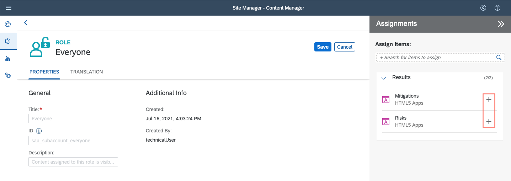

## Prerequisites
 - [Set Up Local Development using VS Code](btp-app-set-up-local-development)
 - [Create a Directory for Development](btp-app-create-directory)
 - [Create a CAP-Based Application](btp-app-create-cap-application)
 - [Create an SAP Fiori Elements-Based UI](btp-app-create-ui-fiori-elements)
 - [Add Business Logic to Your Application](btp-app-cap-business-logic)
 - [Create a UI Using Freestyle SAPUI5](btp-app-create-ui-freestyle-sapui5)
 - [Add More Than One Application to the Launch Page](btp-app-launchpage)
 - [Implement Roles and Authorization Checks in CAP](btp-app-cap-roles)
 - [Prepare for SAP BTP Development](btp-app-prepare-btp)
 - [Set Up the SAP HANA Cloud Service](btp-app-hana-cloud-setup)
 - [Prepare User Authentication and Authorization (XSUAA) Setup](btp-app-prepare-xsuaa)
 - [Deploy Your Multi-Target Application (MTA)](btp-app-cap-mta-deployment)
 - Your subaccount has quota for the services `SAP Launchpad service` and `SAP HTML5 Applications Repository service` as described in [Prepare for SAP BTP Development](btp-app-prepare-btp)

## Details
### You will learn
 - How to add Navigation Targets
 - How to add SAP Cloud Service
 - How to add the Destination Service and destinations
 - How to subscribe to SAP Launchpad service
 - How to test your SAP Launchpad site


To continue with this tutorial you can find the result of the previous tutorial in the [`mta`](https://github.com/SAP-samples/cloud-cap-risk-management/tree/mta) branch.

---

[ACCORDION-BEGIN [Step 1: ](Add navigation targets)]

In this tutorial, you will use the SAP Launchpad service to access your CAP service and its UI. Additionally, the SAP Launchpad service provides features like personalization, role-based visibility, theming, and more. You can add multiple applications to one launchpad, including subscribed ones and applications from SAP S/4HANA or SAP BTP.

Navigation targets are required to navigate between applications, but also to start the applications from SAP Launchpad service. In the next steps, you add the navigation targets `Risks-display` and `Mitigations-display` to the application manifest (`manifest.json`) file.

[DONE]
[ACCORDION-END]
---
[ACCORDION-BEGIN [Step 2: ](Add navigation target for Risks UI)]

1. Open the file `app/risks/webapp/manifest.json`.

2. Add the external navigation target to the `sap.app` JSON object. You can add it right behind the `sourceTemplate` object:

<!-- cpes-file app/risks/webapp/manifest.json:$["sap.app"].crossNavigation -->
```JSON[8-19]
{
  ...
  "sap.app": {
    "id": "ns.risks",
    ...
    "sourceTemplate": {
      ...
    },
    "crossNavigation": {
      "inbounds": {
        "Risks-display": {
          "signature": {
            "parameters": {},
            "additionalParameters": "allowed"
          },
          "semanticObject": "Risks",
          "action": "display"
        }
      }
    }
  }
}
```

[VALIDATE_1]

[ACCORDION-END]
---
[ACCORDION-BEGIN [Step 3: ](Add navigation target for Mitigations UI)]

Do the same with the mitigations manifest file `app/mitigations/webapp/manifest.json`, but with the `semanticObject` name `Mitigations`:

<!-- cpes-file app/mitigations/webapp/manifest.json:$["sap.app"].crossNavigation -->
```JSON[8-19]
{
  ...
  "sap.app": {
    "id": "ns.mitigations",
    ...
    "dataSources": {
      ...
    },
    "crossNavigation": {
      "inbounds": {
        "Mitigations-display": {
          "signature": {
            "parameters": {},
            "additionalParameters": "allowed"
          },
          "semanticObject": "Mitigations",
          "action": "display"
        }
      }
    }
  }
}
```

[DONE]
[ACCORDION-END]
---
[ACCORDION-BEGIN [Step 4: ](Add SAP Cloud service)]

Add your SAP Cloud service at the end of `app/risks/webapp/manifest.json` and `app/mitigations/webapp/manifest.json` files:

<!-- cpes-file app/risks/webapp/manifest.json:$["sap.cloud"] -->
```JSON[6-9]
{
  "_version": "",
  ...
  "sap.fiori": {
    ...
  },
  "sap.cloud": {
    "public": true,
    "service": "cpapp.service"
  }
}
```

The name of your SAP Cloud service (`cpapp` in this case) should be unique within an SAP BTP region. It is used to identify the resources that belong to one UI in the SAP Launchpad service.

[DONE]
[ACCORDION-END]
---
[ACCORDION-BEGIN [Step 5: ](Add the SAP Destination service)]

Add the following lines to the `resources` section of the `mta.yaml` file:

<!-- snippet mta.yaml resources: cpapp-destination -->
```YAML[2-9]
resources:
   ...
 - name: cpapp-destination
   type: org.cloudfoundry.managed-service
   parameters:
     service: destination
     service-plan: lite
     config:
       HTML5Runtime_enabled: true
```

The SAP Destination service stores URLs and credentials (so called "destinations") to access applications and services.

The service configuration option `HTML5Runtime_enabled: true` is required to make the destinations available to the SAP Launchpad service.

[DONE]
[ACCORDION-END]
---
[ACCORDION-BEGIN [Step 6: ](Add SAP HTML5 Application Repository service)]

Add the following lines to the `resources` section of the `mta.yaml` file:

<!-- snippet mta.yaml resources: cpapp-html5-repo-host -->
```YAML[2-7]
resources:
   ...
 - name: cpapp-html5-repo-host
   type: org.cloudfoundry.managed-service
   parameters:
     service: html5-apps-repo
     service-plan: app-host
```

The SAP HTML5 Application Repository service stores static UI files. In the deployment, the SAP Fiori UI applications are uploaded to this service and the SAP Launchpad service serves the UIs from there.

[DONE]
[ACCORDION-END]
---
[ACCORDION-BEGIN [Step 7: ](Add destinations)]

You add three destinations for the SAP Destination service that are used by the SAP Launchpad service:

1. `cpapp-app-srv` - The destination to the CAP service. It is required by your UIs running in SAP Launchpad service to access your service.

2. `cpapp-html5-repo-host` - The destination to your SAP HTML5 Application Repository service instance. It allows the SAP Launchpad service to access your UI applications.

3. `cpapp-uaa` - The destination to your XSUAA service instance. The SAP Launchpad service needs it to convert OAuth tokens for use with your CAP service.

Add the following lines to the `mta.yaml` file:

<!-- snippet mta.yaml modules: cpapp-destinations -->
```YAML[2-39]
modules:
   ...
 - name: cpapp-destinations
   type: com.sap.application.content
   requires:
     - name: cpapp-uaa
       parameters:
         service-key:
           name: cpapp-uaa-key
     - name: cpapp-html5-repo-host
       parameters:
         service-key:
           name: cpapp-html5-repo-host-key
     - name: srv-api
     - name: cpapp-destination
       parameters:
         content-target: true
   parameters:
     content:
       instance:
         destinations:
           - Authentication: OAuth2UserTokenExchange
             Name: cpapp-app-srv
             TokenServiceInstanceName: cpapp-uaa
             TokenServiceKeyName: cpapp-uaa-key
             URL: '~{srv-api/srv-url}'
             sap.cloud.service: cpapp.service
           - Name: cpapp-html5-repo-host
             ServiceInstanceName: cpapp-html5-repo-host
             ServiceKeyName: cpapp-html5-repo-host-key
             sap.cloud.service: cpapp.service
           - Authentication: OAuth2UserTokenExchange
             Name: cpapp-uaa
             ServiceInstanceName: cpapp-uaa
             ServiceKeyName: cpapp-uaa-key
             sap.cloud.service: cpapp.service
         existing_destinations_policy: update
   build-parameters:
     no-source: true
```

What happens now? The `cpapp-app-srv` destination uses the URL exported from the `cpapp-srv` module. Besides exporting the CAP service's URL as `srv-url` property, the XSUAA service instance that is required for authentication and authorization checks is added here.

<!-- snippet mta.yaml cpapp-srv srv-api -->
```YAML
modules:
   ...
   provides:
    - name: srv-api      # required by consumers of CAP services (for example, approuter)
      properties:
        srv-url: ${default-url}
 # -------------------- SIDECAR MODULE ------------------------
```

[DONE]
[ACCORDION-END]
---
[ACCORDION-BEGIN [Step 8: ](Install required UI tools and MTA)]

1. Install [SAPUI5 tooling](https://www.npmjs.com/package/@sap/ux-ui5-tooling) package as global module:

    ```Shell/Bash
    npm install -g @sap/ux-ui5-tooling
    ```

2. Install [SAP Fiori application generator](https://www.npmjs.com/package/@sap/generator-fiori) package as global module:

    ```Shell/Bash
    npm install -g @sap/generator-fiori
    ```

3. Install [MTA](https://www.npmjs.com/package/mta) package as global module:

    ```Shell/Bash
    npm i -g mta
    ```

4. Delete the file `app/mitigations/.yo-rc.json`, because this makes the SAP Fiori application generator fail.

    ```Shell/Bash
    rm app/mitigations/.yo-rc.json
    ```

[DONE]
[ACCORDION-END]
---
[ACCORDION-BEGIN [Step 9: ](Remove broken dependency from Risks application)]

Remove the following two lines from `app/risks/package.json`, because they produce build issues and are not needed:

```JSON[3-4]
    "devDependencies": {
      ...
      "@sap/ux-ui5-tooling": "1",
      "@sap/ux-specification": "latest",
    }
```

Make sure the last entry in `"devDependencies"` doesn't end with a comma (`,`) character.

[DONE]
[ACCORDION-END]
---
[ACCORDION-BEGIN [Step 10: ](Add SAP Fiori elements Risks application)]

1. Switch to `app/risks` directory:

    ```Shell/Bash
    cd app/risks
    ```

2. Add deployment configuration:

    ```Shell/Bash
    fiori add deploy-config cf
    ```

    > If the SAP Fiori generator fails, make sure to remove other `.yo-rc.json` files you might have in any of your project's directories and try again.

3. It will ask for the destination name.

4. Enter `cpapp-app-srv`.

[DONE]
[ACCORDION-END]
---
[ACCORDION-BEGIN [Step 11: ](Add SAPUI5 freestyle Mitigations application)]

1. Repeat the procedure with the `app/mitigations` folder:

    ```Shell/Bash
    cd ../../app/mitigations
    fiori add deploy-config cf
    ```

2. Enter `cpapp-app-srv` for the destination name again.

[DONE]
[ACCORDION-END]
---
[ACCORDION-BEGIN [Step 12: ](Check the results in mta.yaml)]

The newly added modules `nsrisks` and `nsmitigations` do the build of the SAP Fiori application. Each build result is a ZIP file that contains optimized UI resources and a ZIP file `manifest-bundle.zip` with the `manifest.json` and the `i18n` files. The latter is required by the SAP Launchpad service.

[DONE]
[ACCORDION-END]
---
[ACCORDION-BEGIN [Step 13: ](Risks application module nsrisks)]

<!-- snippet mta.yaml --branch launchpad-service modules: "- name: nsrisks" -->
```YAML
modules:
  ...
- name: nsrisks
  type: html5
  path: app/risks
  build-parameters:
    build-result: dist
    builder: custom
    commands:
    - npm install
    - npm run build:cf
    supported-platforms: []
```

[DONE]
[ACCORDION-END]
---
[ACCORDION-BEGIN [Step 14: ](Mitigations application module nsmitigations)]

<!-- snippet mta.yaml --branch launchpad-service modules: "- name: nsmitigations" -->
```YAML
modules:
  ...
- name: nsmitigations
  type: html5
  path: app/mitigations
  build-parameters:
    build-result: dist
    builder: custom
    commands:
    - npm install
    - npm run build:cf
    supported-platforms: []
```

[DONE]
[ACCORDION-END]
---
[ACCORDION-BEGIN [Step 15: ](HTML5 application deployer)]

The module `cpapp-app-content` deploys the ZIP files from the `nsrisks.zip` and `nsmitigations.zip` to the SAP HTML5 Application Repository service, where it can be accessed by the SAP Launchpad service using the previously added destinations.

<!-- snippet mta.yaml --branch launchpad-service modules: cpapp-app-content -->
```YAML
modules:
  ...
- name: cpapp-app-content
  type: com.sap.application.content
  path: .
  requires:
  - name: cpapp-html5-repo-host
    parameters:
      content-target: true
  build-parameters:
    build-result: resources
    requires:
    - artifacts:
      - nsrisks.zip
      name: nsrisks
      target-path: resources/
    - artifacts:
      - nsmitigations.zip
      name: nsmitigations
      target-path: resources/
```

[DONE]
[ACCORDION-END]
---
[ACCORDION-BEGIN [Step 16: ](Add UI build files to .gitignore)]

The SAP Fiori build files do not need to be stored in Git. You can add it to your `.gitignore` file:

```Shell/Bash
dist/
resources/
app/*/package-lock.json
```

> Can't see `.gitignore`?

> `.gitignore` files are excluded by default from the file types shown in the VS Code workspace. In VS Code, go to **File** **&rarr;** **Preferences** **&rarr;** **Settings**, search for *`fileexclude`*, and delete the setting for `.gitignore` files under the **Workspace** tab.

[DONE]
[ACCORDION-END]
---
[ACCORDION-BEGIN [Step 17: ](Re-build and re-deploy the .mtar file)]

1. Build your project with the MTA Build Tool (MBT):

    ```Shell/Bash
    mbt build -t ./
    ```

    > Make sure you're in the root folder of your project

2. Deploy your project to SAP BTP:

    ```Shell/Bash
    cf deploy cpapp_1.0.0.mtar
    ```

    > Additional Documentation:

    > [How to build an MTA archive from the project sources](https://sap.github.io/cloud-mta-build-tool/usage/#how-to-build-an-mta-archive-from-the-project-sources)

3. Go to SAP BTP cockpit to check the deployed content.

[DONE]
[ACCORDION-END]
---
[ACCORDION-BEGIN [Step 18: ](Subscribe to SAP Launchpad service)]

1. Log on to your **Global Account** and navigate to the **Subaccount** where you have deployed your service and application.

2. Choose **Services** **&rarr;** **Service Marketplace** on the left.

3. Search for the **Launchpad Service** tile and choose **Create**.

    !

4. Keep the default settings for **Service** and **Plan** and choose **Create**.

    !

You have now subscribed to the SAP Launchpad service.

[DONE]
[ACCORDION-END]
---
[ACCORDION-BEGIN [Step 19: ](Create your SAP Launchpad site)]

1. Choose **Services** **&rarr;** **Instances and Subscriptions** on the left.

2. Locate the **Launchpad Service** under **Subscriptions** and choose **Go to Application**.

    !

    > In case you get the error: `Sorry, we couldn't find  the site`.

    > If you get the error `Sorry, we couldn't find the site. Please contact your site administrator for assistance.` while opening the application, you have to assign your user to the `Launchpad_Admin` role collection:

    > 1. Choose **Security** **&rarr;** **Trust Configuration** on the left.
    > 2. Choose your identity provider from the list.
    > 3. Enter your e-mail address and choose **Show Assignments**.
    > 4. Choose **Assign Role Collection** and assign the `Launchpad Admin` role collection to your user.
    > 5. Open another browser or clear your browser's cache.

    > See section [Initial Setup](https://help.sap.com/viewer/8c8e1958338140699bd4811b37b82ece/Cloud/en-US/fd79b232967545569d1ae4d8f691016b.html) in the SAP Launchpad service's documentation for more details.

3. Choose **Provider Manager** on the left and refresh the `HTML5 Apps` entry there.

    !

    > Content providers aren't reloaded automatically when you push an app, so it's important to manually refresh.

4. Choose **Content Manager** **&rarr;** **Content Explorer** and open the content provider `HTML5 Apps`.

    !

5. Add the `Risks` and `Mitigations` to **My Content**.

    !

6. Choose **Content Manager** **&rarr;** **My Content**.

7. In the item list, choose the item `Everyone`.

    !

    > `Everyone` is a role that has to be assigned to the `Risks` and `Mitigations` apps so all users can access them.

8. Choose **Edit** and assign the `Risks` and `Mitigations` apps to the role.

    !

9. Choose **New** **&rarr;** **Group**.

    !

10. Type in `Risk Management` as the title of the group and assign the `Risks` and `Mitigations` apps to it.

    !

    > This way, you're telling the SAP Launchpad service to display the `Risks` and `Mitigations` apps in a group called `Risk Management`.

11. Choose **Site Directory** **&rarr;** **Create Site**.

    !

12. Type in `Risk Management Site` for the site name and choose **Create**.

    > The new site gets the `Everyone` role by default, so you don't have to assign it explicitly. The default site properties are sufficient for the purposes of this tutorial.


[DONE]
[ACCORDION-END]
---
[ACCORDION-BEGIN [Step 20: ](Test your SAP Launchpad site)]

1. Choose **Go to site**.

    !

    You can see the `Risk Management` group that includes the `Mitigations` and `Risks` apps.

2. Open the `Risks` app.

    !

You have launched your `Risks` app through the SAP Launchpad service.

  !

> If you choose **Go**, you'll get an error because you haven't assigned a role collection to your user yet. We'll do it in the next tutorial.


[DONE]

The result of this tutorial can be found in the [`launchpad-service`](https://github.com/SAP-samples/cloud-cap-risk-management/tree/launchpad-service) branch.

[ACCORDION-END]
---
