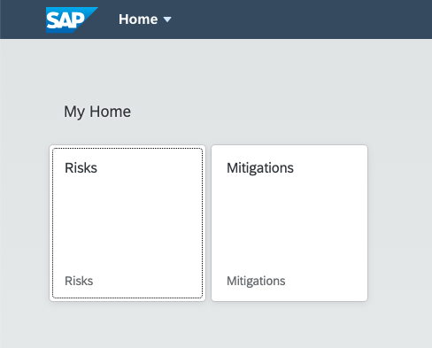

## Prerequisites
 - [Set Up Local Development using VS Code](btp-app-set-up-local-development)
 - [Create a Directory for Development](btp-app-create-directory)
 - [Create a CAP-Based Application](btp-app-create-cap-application)
 - [Create an SAP Fiori Elements-Based UI](btp-app-create-ui-fiori-elements)
 - [Add Business Logic to Your Application](btp-app-cap-business-logic)
 - [Create a UI Using Freestyle SAPUI5](btp-app-create-ui-freestyle-sapui5)

## Details
### You will learn
 - How to add more applications to the launch page


To continue with this tutorial you can find the result of the previous tutorial in the [`cap/freestyle-ui5-app`](https://github.com/SAP-samples/cloud-cap-risk-management/tree/cap/freestyle-ui5-app) branch.

---

[ACCORDION-BEGIN [Step 1: ](Introduction)]

Our risk application has been generated by the SAP Fiori Tools Generator in a way that it sits within a local launch page. This page looks like a real SAP Fiori launchpad, but is just a local copy of the otherwise centrally managed SAP Fiori launchpad. It comes with a limited version of the functionality of the original SAP Fiori launchpad. There's no option to add or remove apps via a configuration, user roles aren't at all taken into account, and end-user personalization is also not included. If you want these and other SAP Fiori launchpad functionalities included, you have got to set them up for your project. Find out how to do this in section [Add the SAP BTP Launchpad Service](btp-app-prepare-btp). You stick with the launch page for this section though.

In the current implementation, the launch page is sitting inside the application. You can find the launch page within your project at `app/risks/webapp/index.html`. If you now create a second application using the SAP Fiori elements generator within your project, it will be generated in the same way, again with its own separated launch page. Instead, you want to use one launch page for all the applications. The UI5 freestyle `mitigations` application that you created in the [Create a Freestyle UI5 Application](btp-app-create-ui-freestyle-sapui5) section doesn't have its own launch page. You can also add that app to the launch page SAP Fiori elements `risks` app. You just need to move the launch page from its original location in the SAP Fiori elements `risks` app and adjust it so it still works in the new location.

[DONE]
[ACCORDION-END]
---
[ACCORDION-BEGIN [Step 2: ](Implementation)]

1. In your file explorer, navigate to `app/risks/webapp`.

2. Move the file `index.html` two folders up to the `app` folder.

    As you have now moved up the file two folders, this needs to be reflected in the URL that points to the app in the launch page. In the next steps, you change the URL and also give the path to the application a more fitting name.

3. Open the file `index.html` in an editor and change the following lines:

```JavaScript[5,10,12-20]
    <script>
        window["sap-ushell-config"] = {
            defaultRenderer: "fiori2",
            applications: {
                "risks-app": {
                    title: "Risks",
                    description: "Risks",
                    additionalInformation: "SAPUI5.Component=ns.risks",
                    applicationType: "URL",
                    url: "./risks/webapp",
                    navigationMode: "embedded"
                },
                "mitigations-app": {
                    title: "Mitigations",
                    description: "Mitigations",
                    additionalInformation: "SAPUI5.Component=ns.mitigations",
                    applicationType: "URL",
                    url: "./mitigations/webapp",
                    navigationMode: "embedded"
                }
            }
        };
    </script>
```

4. Rename the file from `index.html` to `launchpage.html`.

    > Changing the name of `index.html`

    > We are changing the name of `index.html` because `cds watch` by default looks for an `index.html` file in the `app` folder. If `cds watch` finds such a file, it replaces the default page that also contains the links to the services with the one in the folder. While this makes sense in many cases, for development purposes we stick to the index page of CDS and give a different name to our index file.


5. With `cds watch` running, open the app in your browser at <http://localhost:4004/launchpage.html#Shell-home>.

6. You now see the `mitigations` app next to the `risks` app on the launch page.

    !

[VALIDATE_1]


The result of this tutorial can be found in the [`cap/launchpage`](https://github.com/SAP-samples/cloud-cap-risk-management/tree/cap/launchpage) branch.

[ACCORDION-END]
---