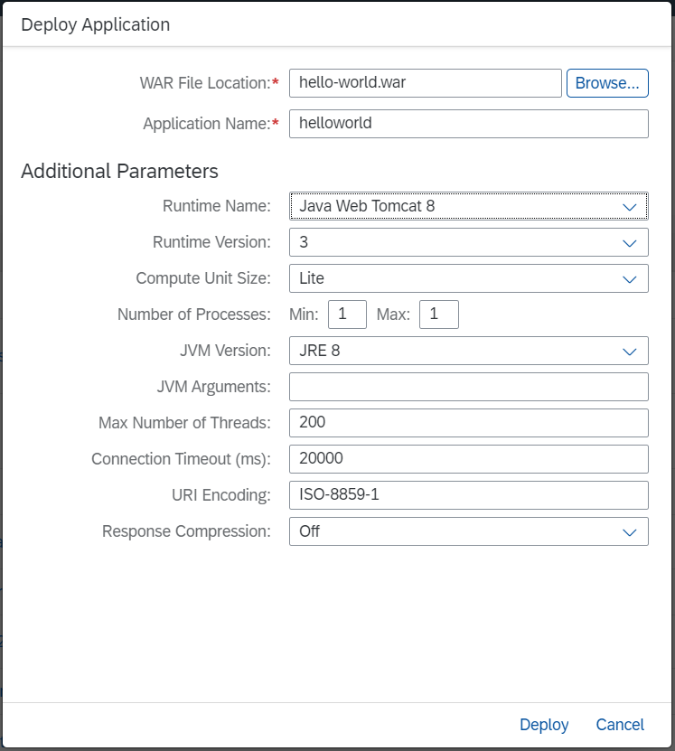
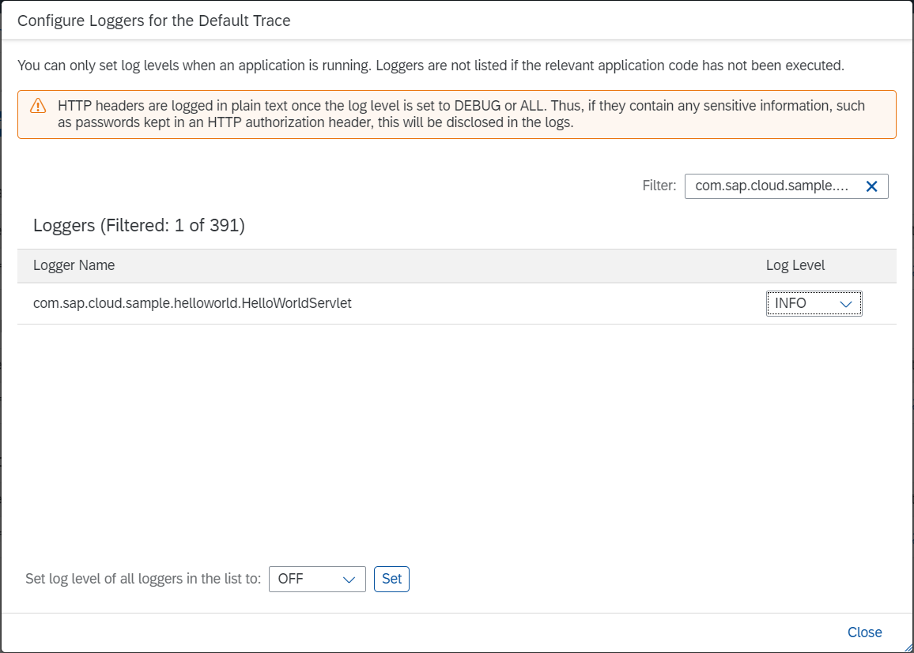
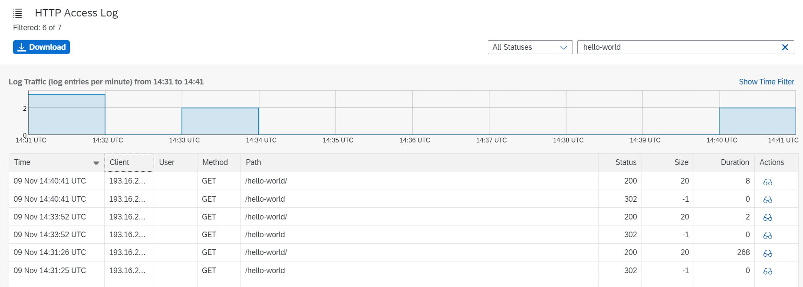
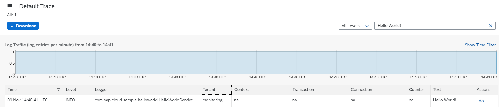

# Get Started with SAP Application Logging Service in the Neo Environment
<!-- description --> Configure logs and view them in the SAP BTP cockpit.

## Prerequisites
- **You have a productive global account and a subaccount.**
  For more information, see [Getting Started with a Customer Account in the Neo Environment](https://help.sap.com/viewer/ea72206b834e4ace9cd834feed6c0e09/Cloud/en-US/1b335bad21724350b0afca66b2db2ce6.html).
- Your user is assigned to the proper **Administrator** role to work with the SAP BTP cockpit.
You need this role in order to deploy an application and to configure loggers. For more information, see [Enable Application Providers to Access Your Subaccount](https://help.sap.com/viewer/ea72206b834e4ace9cd834feed6c0e09/Cloud/en-US/fa1bd9cf472e46d49472092ffedf7307.html).

## You will learn
- How to configure log messages and loggers

---

### Download the hello-world sample


See [Install the SAP BTP SDK for Neo Environment](https://help.sap.com/viewer/ea72206b834e4ace9cd834feed6c0e09/Cloud/en-US/7613843c711e1014839a8273b0e91070.html).
 For example, for Java Web Tomcat 8, download `neo-java-web-sdk-<version>.zip`.


### Configure logger message


Open the `src\com\sap\cloud\sample\helloworld\HelloWorldServlet.java` file in the `hello-world` sample and update the file with the following code:

```Java

package com.sap.cloud.sample.helloworld;

import java.io.IOException;

import javax.servlet.ServletException;
import javax.servlet.http.HttpServlet;
import javax.servlet.http.HttpServletRequest;
import javax.servlet.http.HttpServletResponse;

import org.slf4j.Logger;
import org.slf4j.LoggerFactory;

/**
 * Servlet implementing simplest possible hello world application for SAP BTP Neo Environment.
 */
public class HelloWorldServlet extends HttpServlet {
    private static final long serialVersionUID = 1L;
	 private static final Logger LOGGER = LoggerFactory.getLogger(HelloWorldServlet.class);

    /** {@inheritDoc} */
    @Override
    public void doGet(HttpServletRequest request, HttpServletResponse response) throws ServletException, IOException {
		LOGGER.info("Hello World!");
        response.getWriter().println("<p>Hello World!</p>");
    }
}
```

Now you can view information about configured loggers when requesting the `helloworld` application. This information is also logged in the default trace logs with the text `Hello World!` when you set a log with level INFO.


### Download and install Apache Maven


See [Welcome to Apache Maven](http://maven.apache.org/).


### Install SAP JVM


See [Install SAP JVM](https://help.sap.com/viewer/ea72206b834e4ace9cd834feed6c0e09/Cloud/en-US/76137f42711e1014839a8273b0e91070.html).


### Configure environment variables


Specify the `JAVA HOME` variable to the `jre` folder of the installed SAP JVM and the `Path` variable to the `bin` folder of the installed Apache Maven.


### Test and package the hello-world project


Go to the `<installed SDK>/samples/hello-world` folder in the command prompt and run the command `mvn clean install` to compile, test, and package the `hello-world` project.

You can now find your packaged WAR file in the `target` folder.

In the text area below, enter the command you used to compile, test, and package the `hello-world` project.


### Deploy the application


On the **Java Applications** page, deploy the WAR file and start the `helloworld` application. See [Deploy on the Cloud with the Cockpit](https://help.sap.com/viewer/ea72206b834e4ace9cd834feed6c0e09/Cloud/en-US/abded969628240259d486c4b29b3948c.html).




### Open the application


Choose the `helloworld` application link to open the application's **Overview** page and request the application by opening the application URL.

The application now displays the `Hello World!` message.

This operation guarantees that the logger is available.


### Configure Logger


1.   Go to the **Logging** page.

2.   Set the log level.

     Set the INFO log level of the `com.sap.cloud.sample.helloworld.HelloWorldServlet` logger that you added to `HelloWorldServlet.java`. See the **Configure Loggers** section in [Using Logs in the Cockpit for Java Applications](https://help.sap.com/viewer/f88a032109f0429caea276fc6e3a95f9/Cloud/en-US/2555df65182c4b09a25e56fa3b57b0a8.html).
     Furthermore, you can find information about the various log levels at [Implementing Logging for Java Applications](https://help.sap.com/viewer/f88a032109f0429caea276fc6e3a95f9/Cloud/en-US/e6e8ccd3bb571014b6afdc54744eef4d.html).

     

In the text area below, enter the logger that you set the log level for.


### Request the application


Go to the **Overview** page and choose the application URL.

The application now displays the `Hello World!` message.


### View the logs


1. Go back to the **Logging** page, display the HTTP access log in a log viewer and search for the path `hello-world` to see the `helloworld` application logs. For more information, see [Log Viewers for Java Applications](https://help.sap.com/viewer/f88a032109f0429caea276fc6e3a95f9/Cloud/en-US/b7225bc6f8db42c4b3819aff9f5b3041.html). 

2.  From the **Logging** page, display the default trace in a log viewer and search for text `Hello World!` to find the logs from the request operation. 

