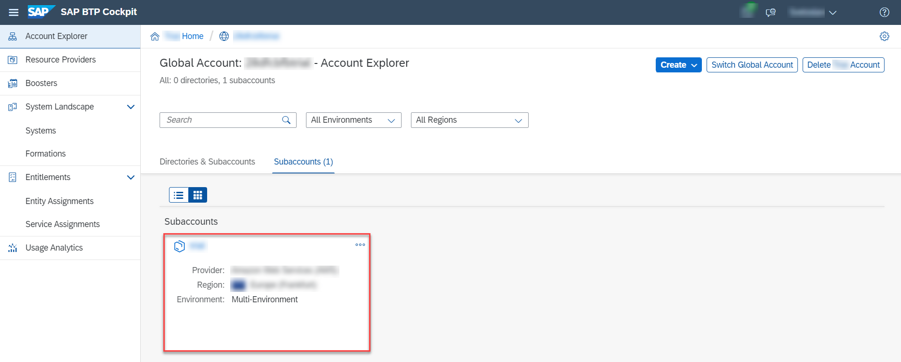

## Prerequisites
 - [Assign a Role Collection to a User](btp-app-role-assignment)

## Details
### You will learn
 - How to access logs from command line window and SAP BTP cockpit
 - How to analyze logs using Kibana dashboard
 - How to enable Logging Service for your CAP application
 - How to test the Logging Service

---

[ACCORDION-BEGIN [Step 1: ](Access logs from command line window)]
1. Display recent logs.

    ```Shell/Bash
    cf logs --recent <appname>
    ```

2. Follow logs live.

    ```Shell/Bash
    cf logs <appname>
    ```

> Choose <kbd>Ctrl</kbd> + <kbd>C</kbd> to quit.

[VALIDATE_1]
[ACCORDION-END]
---
[ACCORDION-BEGIN [Step 2: ](Access logs from SAP BTP cockpit)]
1. In [SAP BTP Cockpit](https://account.hana.ondemand.com/) enter your **Global Account**. If you are using a trial account, choose **Go To Your Trial Account**.

2. Choose **Account Explorer**.

3. In the **Subaccounts** tab, choose the subaccount where you have deployed your service and application.

    !

4. Choose **Cloud Foundry** &rarr; **Spaces**.

5. Choose your space.

6. Choose on the application whose logs you want to access.

7. Choose **Logs**.

    !

    > Only the recent logs are displayed.


[DONE]
[ACCORDION-END]
---
[ACCORDION-BEGIN [Step 3: ](Analyze logs using Kibana dashboard)]
1. In SAP BTP Cockpit, navigate to your **Subaccount**.

2. Choose **Cloud Foundry** &rarr; **Spaces**.

3. Choose your space.

4. Choose the application whose logs you want to access.

5. Choose **Logs**.

6. Choose **Open Kibana Dashboard**.

    > Kibana shows all logs.

    > Although the **Open Kibana Dashboard** link is placed on the logs view of a particular application, it will give you access to the logs of all spaces where you have the required permission.

[DONE]
[ACCORDION-END]
---
[ACCORDION-BEGIN [Step 4: ](Enable Logging Service)]
[OPTION BEGIN [Trial]]

Logs are only kept for a short period and won't be visible in Kibana without the Logging Service. By binding the Logging Service to your application, logs will be kept for longer and will be available for further analysis via Kibana.

It's suggested to enable the Logging Service for all applications, so that error analysis will be possible even some hours after the incident.

In our experience, the `development` plan wasn't sufficient for test scenarios. Probably, its okay for personal development spaces. However, this tutorial uses the `standard` plan to be on the safe side.

1. Add an instance for the logging service to the `resources` section of your `mta.yaml`.

    ```YAML[4-9]
    ...
    resources:
    ...
    - name: cpapp-logs
      type: org.cloudfoundry.managed-service
      parameters:
        service: application-logs
        service-plan: lite
    ```
2. Bind the logging service instance to the following `modules` of the `mta.yaml`.

    <!-- cpes-file mta.yaml:$.modules[?(@.name=="cpapp-srv")].requires[?(@.name=="cpapp-logs")] -->
    ```YAML[9-9]
    _schema-version: '3.1'
    ...
    modules:
      ...
      - name: cpapp-srv
        ...
        requires:
          ...
          - name: cpapp-logs
    ```

    <!-- cpes-file mta.yaml:$.modules[?(@.name=="cpapp-db-deployer")].requires[?(@.name=="cpapp-logs")] -->
    ```YAML[9-9]
    _schema-version: '3.1'
    ...
    modules:
      ...
      - name: cpapp-db-deployer
        ...
        requires:
          ...
          - name: cpapp-logs
    ```
[OPTION END]
[OPTION BEGIN [Live]]

Logs are only kept for a short period and won't be visible in Kibana without the Logging Service. By binding the Logging Service to your application, logs will be kept for longer and will be available for further analysis via Kibana.

It's suggested to enable the Logging Service for all applications, so that error analysis will be possible even some hours after the incident.

In our experience, the `development` plan wasn't sufficient for test scenarios. Probably, its okay for personal development spaces. However, this tutorial uses the `standard` plan to be on the safe side.

1. Add an instance for the logging service to the `resources` section of your `mta.yaml`.

    ```YAML[4-9]
    ...
    resources:
    ...
    - name: cpapp-logs
      type: org.cloudfoundry.managed-service
      parameters:
        service: application-logs
        service-plan: standard
    ```

2. Bind the logging service instance to the following `modules` of the `mta.yaml`.

    <!-- cpes-file mta.yaml:$.modules[?(@.name=="cpapp-srv")].requires[?(@.name=="cpapp-logs")] -->
    ```YAML[9-9]
    _schema-version: '3.1'
    ...
    modules:
      ...
      - name: cpapp-srv
        ...
        requires:
          ...
          - name: cpapp-logs
    ```

    <!-- cpes-file mta.yaml:$.modules[?(@.name=="cpapp-db-deployer")].requires[?(@.name=="cpapp-logs")] -->
    ```YAML[9-9]
    _schema-version: '3.1'
    ...
    modules:
      ...
      - name: cpapp-db-deployer
        ...
        requires:
          ...
          - name: cpapp-logs
    ```
[OPTION END]


[DONE]
[ACCORDION-END]
---
[ACCORDION-BEGIN [Step 5: ](Test it)]
1. Build the MTAR file and deploy it to your Cloud Foundry space:

    ```Shell/Bash
    mbt build -t ./
    cf deploy cpapp_1.0.0.mtar
    ```

2. Open Kibana after successful deployment. Your org should now be visible in the Kibana dashboard.

    !

3. Choose the ( &#x2B; ) icon to filter for it.

4. The filter is added to the filter bar on the top of the screen and gets applied on the dashboard.

5. You should see your newly applied applications.

    !

You can also browse all logs using the **Discover** button (compass icon) on the left navigation bar.
The available fields are displayed on the left side of the screen. You can add fields to the message display or quickly filter for any of the top values.

The time filter is on the right top of the screen. Don't forget to choose **Refresh**.

[DONE]
The result of this tutorial can be found in the [`logging`](https://github.com/SAP-samples/cloud-cap-risk-management/tree/logging) branch.


[ACCORDION-END]
---