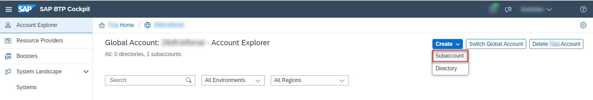

## Prerequisites
 - [Prepare Your Development Environment for CAP](btp-app-prepare-dev-environment-cap)
 - For this tutorial, you have two options:
    - Before you start with this tutorial, follow the instructions in **Step 16: Start from an example branch** of [Prepare Your Development Environment for CAP](btp-app-prepare-dev-environment-cap) to checkout the [`cap-roles`](https://github.com/SAP-samples/cloud-cap-risk-management/tree/cap-roles) branch.
    - Complete the group of tutorials [Create a CAP Application and SAP Fiori UI](group.btp-app-cap-create).

## Details
### You will learn
 - How to create an account for SAP BTP
 - How to configure Cloud Foundry in your SAP BTP subaccount
 - How to assign entitlements

---

[ACCORDION-BEGIN [Step 1: ](Overview)]
> ### To earn your badge for the whole mission, you will need to mark all steps in a tutorial as done, including any optional ones that you may have skipped because they are not relevant for you.

You need an SAP BTP account to deploy the services and applications.
In general, you have a choice of the following options:

**Trial:** *(recommended)* Use a trial account if you just want to try out things and don't want to use any of the parts of this tutorial productively. The usage is free of cost and all the services that you need for this tutorial get automatically assigned to your trial account.

> When running the tutorial with a trial account, please have in mind the following considerations:

> * Choose host region `cf-us10` when creating a new trial account. This will ensure that all services required throughout the tutorial are available to your account.
> * If you use an existing trial account, make sure the host region is different from `cf-ap21`. Otherwise, some services required throughout the tutorial might be missing from your account. To check the host region for your account, choose **About** from the dropdown under your user in the top right corner of the SAP BTP cockpit.

**Live:** There are multiple live landscapes available in different data centers around the globe. Live landscapes are intended for productive usage and development projects.


[DONE]
[ACCORDION-END]
---
[ACCORDION-BEGIN [Step 2: ](Create a Trial account)]
You can [register for a trial account](https://www.sap.com/cmp/td/sap-cloud-platform-trial.html) and have [access](https://cockpit.hanatrial.ondemand.com/cockpit#/home/trial).

A global account, a subaccount, a Cloud Foundry org, and space with some entitlements that are sufficient to do this tutorial are set up for you.

> In case you face a problem when creating a service instance or an application is missing for subscription later in the tutorial, please do the following:

> 1. Choose **Go To Your Trial Account**.
> 2. Choose **Account Explorer** and choose your **trial** subaccount in the **Subaccounts** tab.
> 2. Choose **Entitlements**.
> 3. Choose **Configure Entitlements**.
> 4. Choose **Add Service Plans**.
> 5. Search for the missing Service Plans and add it with **Add <x> Service Plans**.
> 6. Choose **Save**.

Continue with step [Log on from the Command Line](https://developers.sap.com/tutorials/btp-app-prepare-btp.html#dd63378d-1fc0-491e-9659-a597f6f670e7) at the end of this tutorial.

[DONE]
[ACCORDION-END]
---
[ACCORDION-BEGIN [Step 3: ](Create a Live Account)]
If you choose to create an account on Live, you have to select a number of services that you need to subscribe to, for example, an SAP HANA database. For each service, there are so-called `entitlements`, which are basically the service plans and the number of units that you want from each service. When you create an account, you need to provide these also.

The following services with their service plans and entitlements are required for the different modules of the tutorial and will be needed to create the global account and subaccount.

<!-- external version with reduced content according the external scenarios -->

| Service                           | Plan       | Amount | Unit         | Tutorial                                |
| --------------------------------- | ---------- | ------ | ------------ | --------------------------------------- |
| Cloud Foundry runtime             | `MEMORY`     | 4      | GB           | [Deploy Your Multi-Target Application (MTA)](btp-app-cap-mta-deployment)   |
| SAP Application Logging service   | `standard`   | 1      | instances    | [Deploy Your Multi-Target Application (MTA)](btp-app-cap-mta-deployment)   |
| SAP HANA Schemas & HDI Containers | `hdi-shared` | 1      | instances    | [Deploy Your Multi-Target Application (MTA)](btp-app-cap-mta-deployment)   |
| SAP HANA Cloud                    | `hana`       | 1      | instances    | [Set Up the SAP HANA Cloud Service](btp-app-hana-cloud-setup)     |
| Launchpad Service                 | `standard`   | 1      | active users | [Add the SAP Launchpad Service](btp-app-launchpad-service) |
| SAP Event Mesh                    | `default`    | 1      | instances    | [Set Up Your CAP Application for Eventing](btp-app-events-app-setup-s4hc) |

> The services mentioned below are Utility Services, no entitlement needed

| Service                          | Plan        | Amount | Unit         | Tutorial                                |
| -------------------------------- | ----------- | ------ | ------------ | --------------------------------------- |
| SAP HTML5 Application Repository service  | `app-host`    | 100    | MB        | [Add the SAP Launchpad Service](btp-app-launchpad-service)   |
| SAP Authorization and Trust Management service | `application` | 1      | instances    | [Deploy Your Multi-Target Application (MTA)](btp-app-cap-mta-deployment)   |


At least the services for the tutorials [Set Up the SAP HANA Cloud service](btp-app-hana-cloud-setup) and [Deploy Your Multi-Target Application (MTA)](btp-app-cap-mta-deployment) need to be entitled.


[VALIDATE_1]
[ACCORDION-END]
---
[ACCORDION-BEGIN [Step 4: ](Create a subaccount)]
1. Enter your **Global Account**. If you are using a trial account, choose **Go To Your Trial Account**.

2. Choose **Account Explorer** in the left navigation pane.

3. Choose **Create** &rarr; **Subaccount**.

    !

4. To fill the **New Subaccount** dialog, enter a **Display Name**.

    > Use a short name for your project and add the prefix for the landscape, for example: `<project name>-cf-us10`. Don't select the checkbox **Neo**!

5. Enter a subdomain.

    > Only valid HTTP domain characters are allowed.

6. Choose **Create**.

7. Wait for the completion of the subaccount creation.

8. Choose the tile with your new subaccount.

[DONE]
[ACCORDION-END]
---
[ACCORDION-BEGIN [Step 5: ](Configure Cloud Foundry in your subaccount)]
This creates a [Cloud Foundry (CF) Org](https://docs.cloudfoundry.org/concepts/roles.html#orgs) in your subaccount. There's always one Cloud Foundry org per subaccount. Later on, when you log on to Cloud Foundry, it asks you which Cloud Foundry org you want to log on to. For any development in you subaccount, you need to choose this org for your subaccount.

1. Choose **Enable Cloud Foundry**.

2. Enter a **Cloud Foundry Org Name** and choose **OK** (suggestion: use `SAP_` as prefix, for example: `SAP_<project name>`).

3. (Optional) In the left navigation pane under the section **Cloud Foundry**, choose **Org Members** and add users for your new account. Your own user should already be there. You can add other users if needed and assign a role to them.

4. On the left-hand pane under **Security**, choose **Administrators** and add the required security administrators. Again, your user should be-filled. You can add other users if needed.

[DONE]
[ACCORDION-END]
---
[ACCORDION-BEGIN [Step 6: ](Assign entitlements)]
In this section, you assign a portion of the entitlements that you've bought for your global account to the individual subaccounts. In this, you have only one subaccount. If you have 3 subaccounts, for example, and have bought 100 units of the HTML5 service, you could assign 50 units to the first subaccount, 20 to the second, and the remaining 30 to the third subaccount.

1. In your subaccount, choose **Entitlements** in the left-hand pane.

2. Choose **Configure Entitlements**.

3. Choose **Add Service Plans**.

4. Go through the Entitlements according to the table in the previous step **Create a Live Account** and add the required plans for each of them.

5. Choose the ( &#x2B; ) or ( &#8209; ) symbol to change the quota for the services according to the table in the previous step **Create a Live Account**.

6. Choose **Save**.

[DONE]
[ACCORDION-END]
---
[ACCORDION-BEGIN [Step 7: ](Create a Cloud Foundry space)]
Next to Cloud Foundry orgs there are also [Spaces](https://docs.cloudfoundry.org/concepts/roles.html#spaces). Each Cloud Foundry org can have 0 to n spaces, you create just one here.

1. Open the subaccount page in SAP BTP cockpit.

2. Choose **Spaces** in the left pane under the section **Cloud Foundry**.

3. Choose **Create Space**.

4. Enter a space name.

    > If different sub projects exist in the org, use `<sub project name>-<stage name>`, otherwise use `<stage name>`; where stage name is the release stage, for example: `dev`, `val`, `prod`.

5. Choose **Create**.

[DONE]
[ACCORDION-END]
---
[ACCORDION-BEGIN [Step 8: ](Assign users in the Cloud Foundry space)]
1. Open the **Spaces** overview in SAP BTP cockpit. You can just choose the tile for the space that was created.

2. Choose **Members** in the left navigation pane.

3. (Optional) Choose **Add Members** to add all required users, again your own user should already be part of the list.

4. (Optional) Add a distribution list of your `CFDeployment` technical user as Space Manager if you have one.

[DONE]
[ACCORDION-END]
---
[ACCORDION-BEGIN [Step 9: ](Log on from the command line)]
[OPTION BEGIN [Trial]]

Prepare for the next steps by logging on to Cloud Foundry and targeting your space in the account.


If you don't know whether you are logged on to Cloud Foundry or if you are wondering to which Cloud Foundry org and space are you logged on, you can always use `cf target` in a command line window to find out. If you aren't logged on already, go to your SAP BTP cockpit by using one of the following links, depending on the landscape you want to deploy to:

[https://cockpit.hanatrial.ondemand.com/](https://cockpit.hanatrial.ondemand.com/)

1. Enter your **Global Account**. If you are using a trial account, choose **Go To Your Trial Account**.

2. Choose **Account Explorer**.

3. In the **Subaccounts** tab, choose the subaccount to which you want to deploy your service and application.

    !

2. On the subaccount page, gather all the data to log in to Cloud Foundry (CF).

    - `API Endpoint`
    - `Org Name`
    - `Space Name`

    !


3. Open a command line window.

4. Set the Cloud Foundry API endpoint.

    ```Shell/Bash
    cf api <API Endpoint of your landscape>
    ```

5. Log in to your Cloud Foundry account, using your SAP BTP credentials.

    ```Shell/Bash
    cf login
    ```
[OPTION END]
[OPTION BEGIN [Live]]

Prepare for the next steps by logging on to Cloud Foundry and targeting your space in the account.


If you don't know whether you are logged on to Cloud Foundry or if you are wondering to which Cloud Foundry org and space are you logged on, you can always use `cf target` in a command line window to find out. If you aren't logged on already, go to your SAP BTP cockpit by using one of the following links, depending on the landscape you want to deploy to:

[https://account.hana.ondemand.com/](https://account.hana.ondemand.com/)


1. Enter your **Global Account**. If you are using a trial account, choose **Go To Your Trial Account**.

2. Choose **Account Explorer**.

3. In the **Subaccounts** tab, choose the subaccount to which you want to deploy your service and application.

    !

2. On the subaccount page, gather all the data to log in to Cloud Foundry (CF).

    - `API Endpoint`
    - `Org Name`
    - `Space Name`

    !


3. Open a command line window.

4. Set the Cloud Foundry API endpoint.

    ```Shell/Bash
    cf api <API Endpoint of your landscape>
    ```

5. Log in to your Cloud Foundry account, using your SAP BTP credentials.

    ```Shell/Bash
    cf login
    ```
[OPTION END]


[DONE]
[ACCORDION-END]
---
