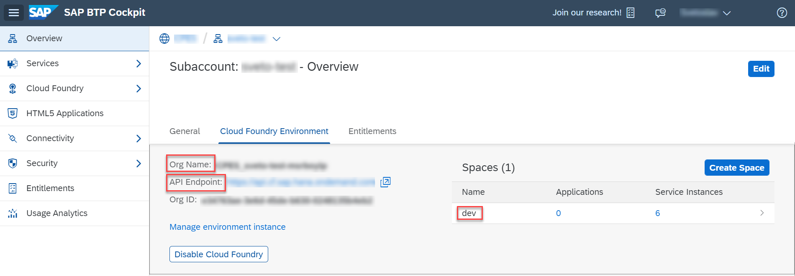

## Prerequisites
 - [Create a Directory for Development](btp-app-create-directory)
 - [Create a CAP-Based Application](btp-app-create-cap-application)
 - [Create an SAP Fiori Elements-Based UI](btp-app-create-ui-fiori-elements)
 - [Add Business Logic to Your Application](btp-app-cap-business-logic)
 - [Implement Roles and Authorization Checks in CAP](btp-app-cap-roles)
 - You have an SAP BTP global account, a subaccount, and a Cloud Foundry space with the required entitlements to deploy the application.

## Details
### You will learn
 - How to create an account for SAP BTP
 - How to configure Cloud Foundry in your SAP BTP subaccount
 - How to assign entitlements

### See Also
 - [Official SAP BTP Documentation](https://help.sap.com/viewer/product/BTP/Cloud)
 - [Getting Started in the Cloud Foundry Environment](https://help.sap.com/viewer/65de2977205c403bbc107264b8eccf4b/Cloud/en-US/b328cc89ea14484d9655b8cfb8efb508.html)


---

[ACCORDION-BEGIN [Step 1: ](Overview)]

[OPTION BEGIN [Trial]]

You need an SAP BTP account to deploy the services and applications. In general, you have a choice of the following options:

If you just want to try out things and don't want to use any of the parts of this tutorial productively, this is probably the best option for you. The usage is free of cost and many of the services that you need are created for you. For example, an SAP HANA instance is already created for you when you set up the trial account. So, there's the least work to do when you want to concentrate on developing the actual application. This comes with some drawbacks, however. Trial accounts have a limited usage time. After a while, you have to refresh the subscription and redo all the work. Also, there are a number of things that you can't do as opposed to a full account.


[OPTION END]
[OPTION BEGIN [Live]]

You need an SAP BTP account to deploy the services and applications. In general, you have a choice of the following options:

There are multiple live landscapes in different data centers around the globe. The live landscapes are intended for live customer usage, but also development projects by customers and partners.

[OPTION END]


[DONE]
[ACCORDION-END]
[ACCORDION-BEGIN [Step 2: ](Option 1: Create a Trial Account)]

You can [register for a trial account](https://www.sap.com/cmp/td/sap-cloud-platform-trial.html) and access it [here](https://cockpit.hanatrial.ondemand.com/cockpit#/home/trial).

A global account, a subaccount, a Cloud Foundry org, and space with some entitlements that are sufficient to do this tutorial are set up for you.

> _If you use an existing `trial` account then service entitlements may be missing. If you encounter such situation, we suggest to delete your `trial` account and create a new one._

> New service offerings are not added to existing `trial` accounts automatically.

> In case you face a problem when creating a service instance or an application is missing for subscription later in the tutorial, please do the following:

> 1. Go to your **trial** subaccount.
> 2. Choose **Entitlements**.
> 3. Choose **Configure Entitlements**.
> 4. Choose **Add Service Plans**.
> 5. Search for the missing Service Plans and add it with **Add <x> Service Plans**.
> 6. Choose **Save**.

Continue with [*Log On to Cloud Foundry*](#option-1-log-on-to-cloud-foundry-from-the-command-line) at the end of this page.

[DONE]
[ACCORDION-END]
[ACCORDION-BEGIN [Step 3: ](Option 2: Create a Live Account)]

If you choose to create an account on Live, you have to select a number of services that you need to subscribe to, for example, an SAP HANA database. For each service, there are so-called `entitlements`, which are basically the service plans and the number of units that you want from each service, when you create an account you need to provide these also.

The following services with their service plans and entitlements are required for the different modules of the tutorial and will be needed to create the global account and subaccount.

<!-- external version with reduced content according the external scenarios -->

| Service                           | Plan       | Amount | Unit         | Tutorial                                |
| --------------------------------- | ---------- | ------ | ------------ | --------------------------------------- |
| Application Runtime               | `MEMORY`     | 4      | GB           | [Deploy Your Multi-Target Application (MTA)](btp-app-cap-mta-deployment)   |
| Application Logging               | `standard`   | 1      | instances    | [Deploy Your Multi-Target Application (MTA)](btp-app-cap-mta-deployment)   |
| SAP HANA Schemas & HDI Containers | `hdi-shared` | 1      | instances    | [Deploy Your Multi-Target Application (MTA)](btp-app-cap-mta-deployment)   |
| SAP HANA Cloud                    | `hana`       | 1      | instances    | [Set Up the SAP HANA Cloud Service](btp-app-hana-cloud-setup)     |
| Launchpad Service                 | `standard`   | 1      | active users | [Add the SAP Launchpad Service](btp-app-launchpad-service) |


> _* - The services mentioned below are Utility Services, no entitlement needed_

| Service                          | Plan        | Amount | Unit         | Tutorial                                |
| -------------------------------- | ----------- | ------ | ------------ | --------------------------------------- |
| Launchpad Service                | `standard`    | 1      | active users | [Add the SAP Launchpad Service](btp-app-launchpad-service) |
| Authorization & Trust Management | `application` | 1 *    | instances    | [Deploy Your Multi-Target Application (MTA)](btp-app-cap-mta-deployment)   |

> _* - The following mentioned applications are available as Subscriptions, no entitlement needed_

| Application                     | Plan     | Amount | Unit | Tutorial |
| ------------------------------- | -------- | ------ | ---- | -------- |
| SAP Business Application Studio | `standard` | 1      | ?    | numerous |

At least the services for the tutorials [Set Up the SAP HANA Cloud Service](btp-app-hana-cloud-setup) and [Deploy Your Multi-Target Application (MTA)](btp-app-cap-mta-depolyment) need to be entitled.

[VALIDATE_1]

[ACCORDION-END]
[ACCORDION-BEGIN [Step 4: ](Create a Global Account)]

As the result of the previous steps there will be a Cloud Foundry space with required entitlement to deploy the service. This requires the creation of an SAP BTP global account, subaccount, space, and the assignment of the required entitlements.

1. Go to [SAP BTP Control Center](https://controlcenter.ondemand.com/index.html).

2. Choose the ( &#x2B; ) button in the upper right corner.

Enter *Account Info:*

1. Enter a global account name.
1. Enter a description.
1. (Optional) If you have a Service Inventory ID, choose the radio button **Yes** under the section "Service Provider Account" and enter it.

1. Choose **Next**.

Enter *Business Info:*

1. Enter the cost center number.
1. Read & check the disclaimer.
1. Choose **Next**.

*Assign Services:*

1. Select the services from the table **Set Entitlements** above.
1. Choose **Next**.

*Set Entitlements:*

1. Set the entitlements from the [Service Entitlements](#required-service-entitlements) table for the desired tutorial modules.
1. Choose the **Add** button for each of them.
1. Choose **Create Account**.

[DONE]
[ACCORDION-END]
[ACCORDION-BEGIN [Step 5: ](Create Subaccount)]

1. Go to [SAP BTP Control Center](https://controlcenter.ondemand.com/index.html).

2. Select your global account in the dropdown menu.

3. Choose **Open in Cockpit**.

    !

4. Choose **Subaccounts** in the left navigation pane.

5. Choose the **New Subaccount** button.

Fill **New Subaccount** dialog:

1. Enter a **Display Name** (suggestion: use short name for your project and add the prefix for the landscape, for example: `<project name>-cf-eu10`).

    > _Don't select the checkbox **Neo**!_

2. Enter a subdomain (only valid HTTP domain characters are allowed).
3. Choose **Create**.
4. Wait for the completion of the subaccount creation.
5. Choose the tile with your new subaccount.

[DONE]
[ACCORDION-END]
[ACCORDION-BEGIN [Step 6: ](Configure Cloud Foundry in Your Subaccount)]

This creates a [Cloud Foundry (CF) Org](https://docs.cloudfoundry.org/concepts/roles.html#orgs) in your subaccount. There's always one Cloud Foundry org per subaccount. Later on, when you log on to Cloud Foundry, it asks you which Cloud Foundry org you want to log on to. For any development in you subaccount, you need to choose this org for your subaccount.

1. Choose **Enable Cloud Foundry**.
1. Enter a **Cloud Foundry Org Name** and choose **OK** (suggestion: use `SAP_` as prefix, for example: `SAP_<project name>`).
1. (Optional) In the left navigation pane under the section **Cloud Foundry**, choose **Org Members** and add users for your new account. Your own user should already be there. You can add other users if needed and assign a role to them.
1. On the left-hand pane under **Security**, choose **Administrators** and add the required security administrators. Again, your user should be pre-filled. You can add other users if needed.

[DONE]
[ACCORDION-END]
[ACCORDION-BEGIN [Step 7: ](Assign Entitlements)]

In this section, you assign a portion of the entitlements that you've bought for your global account to the individual subaccounts. In this, you have only one subaccount. If you have 3 subaccounts, for example, and have bought 100 units of the HTML5 service, you could assign 50 units to the first subaccount, 20 to the second, and the remaining 30 to the third subaccount.

1. In your subaccount, choose **Entitlements** in the left-hand pane.
1. Choose **Configure Entitlements**.
1. Choose **Add Service Plans**.
1. Go through the Entitlements according to the [Service Entitlements](#required-service-entitlements) table and add the required plans for each of them.
1. Choose the + or - symbol to change the quota for the services according to the [Service Entitlements](#required-service-entitlements) table.
1. Choose *Save*.

[DONE]
[ACCORDION-END]
[ACCORDION-BEGIN [Step 8: ](Create a Cloud Foundry Space)]

Next to Cloud Foundry orgs there are also [Spaces](https://docs.cloudfoundry.org/concepts/roles.html#spaces). Each Cloud Foundry org can have 0 to n spaces, you create just one here.

1. Open the subaccount page in the SAP BTP cockpit.
1. Choose **Spaces** in the left pane under the section **Cloud Foundry**.
1. Choose **Create Space**.
1. Enter a space name (suggestion: If different sub projects exist in the org: `<sub project name>-<stage name>`, otherwise: `<stage name>`; where stage name is the release stage, for example: `dev`, `val`, `prod`)
1. Choose **Create**.

[DONE]
[ACCORDION-END]
[ACCORDION-BEGIN [Step 9: ](User Assignment in the Cloud Foundry Space)]

1. Open the space page in the SAP BTP cockpit (you can just choose the tile for the space that was created).
1. Choose **Members** in the left navigation pane.
1. (Optional) Choose **Add Members** to add all required users, again your own user should already be part of the list.
1. (Optional) Add a DL of your `CFDeployment` technical user as Space Manager if you have one.

[DONE]
[ACCORDION-END]
[ACCORDION-BEGIN [Step 10: ](Option 1: Log on from the Command Line)]

[OPTION BEGIN [Trial]]

Prepare for the next steps by logging on to Cloud Foundry and targeting your space in the account.


If you don't know whether you're logged on to Cloud Foundry or if you're wondering to which Cloud Foundry org and space are you logged on, you can always use `cf target` in a terminal to find out. If you aren't logged on already, go to your SAP BTP Cockpit by using one of the following links, depending on the landscape you want to deploy to:

[https://cockpit.hanatrial.ondemand.com/](https://cockpit.hanatrial.ondemand.com/)

1. Select your **Global Account** and then the **Subaccount** to which you want to deploy your service and application.

2. On the subaccount page, gather all the data to log in to Cloud Foundry (CF):

    - `API Endpoint`
    - `Org Name`
    - `Space Name`

    !


    For your convenience, this is the API endpoint for your landscape:

    [https://api.cf.eu10.hana.ondemand.com](https://api.cf.eu10.hana.ondemand.com)
3. Open a terminal.

4. Set the Cloud Foundry API endpoint:

    ```bash
    cf api <API Endpoint of your landscape>
    ```

5. Log in to your Cloud Foundry account, using your SAP BTP credentials:

    ```bash        
    cf login
    ```


[OPTION END]
[OPTION BEGIN [Live]]

Prepare for the next steps by logging on to Cloud Foundry and targeting your space in the account.


If you don't know whether you're logged on to Cloud Foundry or if you're wondering to which Cloud Foundry org and space are you logged on, you can always use `cf target` in a terminal to find out. If you aren't logged on already, go to your SAP BTP Cockpit by using one of the following links, depending on the landscape you want to deploy to:

[https://account.hana.ondemand.com/](https://account.hana.ondemand.com/)


1. Select your **Global Account** and then the **Subaccount** to which you want to deploy your service and application.

2. On the subaccount page, gather all the data to log in to Cloud Foundry (CF):

    - `API Endpoint`
    - `Org Name`
    - `Space Name`

    !


    For your convenience, this is the API endpoint for your landscape:

    [https://api.cf.eu10.hana.ondemand.com ](https://api.cf.eu10.hana.ondemand.com)


3. Open a terminal.

4. Set the Cloud Foundry API endpoint:

    ```bash
    cf api <API Endpoint of your landscape>
    ```

5. Log in to your Cloud Foundry account, using your SAP BTP credentials:

    ```bash        
    cf login
    ```


[OPTION END]


[DONE]
[ACCORDION-END]
[ACCORDION-BEGIN [Step 11: ](Option 2: Log on in SAP Business Application Studio)]

[OPTION BEGIN [Trial]]

Prepare for the next steps by logging on to Cloud Foundry.

1. Choose the icon for **Cloud Foundry: Targets** on the left navigation bar to select the **Cloud Foundry: Targets** panel.
2. Choose **Create new target Cloud Foundry** on the **Cloud Foundry: Targets** panel.

    !

3. Enter a name for the target, for example `cpapp`, in the popup and confirm with **Enter**.
4. Choose **`cpapp`** **&rarr;** **Services** **&rarr;** **Login Required** on the **Cloud Foundry: Targets** panel.
5. Enter the **Cloud Foundry** endpoint in the popup and confirm with **Enter**.

    For your convenience, these are the API Endpoints for the different landscapes:

    [https://api.cf.eu10.hana.ondemand.com](https://api.cf.eu10.hana.ondemand.com)
6. Enter your SAP BTP registered E-Mail address and confirm with **Enter**.
7. Enter your password and confirm with **Enter**.
8. Select the Cloud Foundry organization and confirm with **Enter**.
9. Select the Cloud Foundry space and confirm with **Enter**.
[OPTION END]
[OPTION BEGIN [Live]]

Prepare for the next steps by logging on to Cloud Foundry.

1. Choose the icon for **Cloud Foundry: Targets** on the left navigation bar to select the **Cloud Foundry: Targets** panel.
2. Choose **Create new target Cloud Foundry** on the **Cloud Foundry: Targets** panel.

    !

3. Enter a name for the target, for example `cpapp`, in the popup and confirm with **Enter**.
4. Choose **`cpapp`** **&rarr;** **Services** **&rarr;** **Login Required** on the **Cloud Foundry: Targets** panel.
5. Enter the **Cloud Foundry** endpoint in the popup and confirm with **Enter**.

    For your convenience, these are the API Endpoints for the different landscapes:

    [https://api.cf.eu10.hana.ondemand.com](https://api.cf.eu10.hana.ondemand.com)

6. Enter your SAP BTP registered E-Mail address and confirm with **Enter**.
7. Enter your password and confirm with **Enter**.
8. Select the Cloud Foundry organization and confirm with **Enter**.
9. Select the Cloud Foundry space and confirm with **Enter**.
[OPTION END]


[DONE]
[ACCORDION-END]
