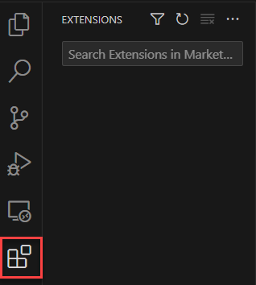
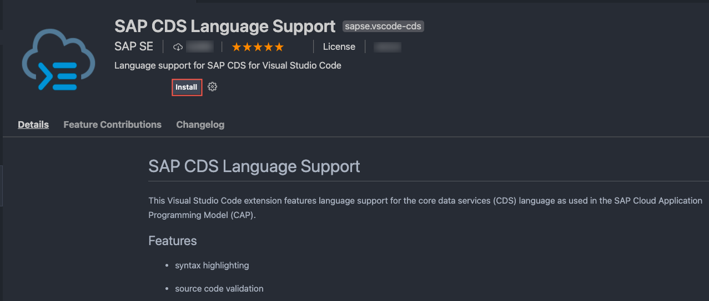
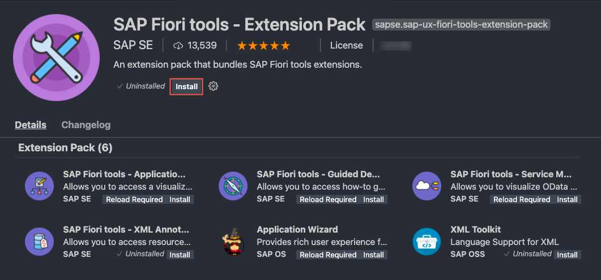
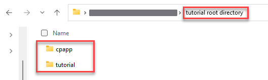

## Prerequisites
 - (For Windows) You have to install [SQLite](https://sqlite.org/download.html) tools for Windows. 
    - Open the [SQLite Download Page](https://sqlite.org/download.html), scroll down to section **Precompiled Binaries for Windows**, and download the bundle of command-line tools for managing SQLite database files `sqlite-tools-win32-x86-<xxxxxxx>.zip`(where `<xxxxxxx>` represents the number of SQLite's current version).
    - Create a folder `C:\sqlite` and unzip the downloaded archive in this folder.
    - Double-click the file `sqlite.exe`, a command line window opens in `C:\sqlite` with a message `Connected to a transient in-memory database.`
    - SQLite is installed and you can close the command line window. Checkout section [How Do I Install SQLite on Windows?](https://cap.cloud.sap/docs/advanced/troubleshooting#how-do-i-install-sqlite-on-windows) in the CAP documentation for more info.
 - (For macOS) You have to install Command-Line Tools for Xcode, because some node modules need binary modules (`node-gyp`). There are two options to install them:
    - Using the command line: `xcode-select --install`
    - Downloading [Xcode](https://developer.apple.com/xcode/) (a login with your Apple ID and password is required). Search for `Command Line Tools for Xcode`.

## Details

### You will learn
 - How to set up local development Using VS Code
    - How to set up your environment for application development
    - How to install extensions for VS Code
    - How to install all required tools for UI development
 - How to create a directory for development
 - How to start from an example branch

---

[ACCORDION-BEGIN [Step 1: ](Editors)]
> ### To earn your badge for the whole mission, you will need to mark all steps in a tutorial as done, including any optional ones that you may have skipped because they are not relevant for you.

This tutorial contains all the installation steps that you would have to do to get started. It's likely that you have some of the software already installed, so you can just skip those steps.

You can choose the editor to develop your CAP application. If you want to exactly go along with the following tutorials, we recommend using VS Code as an editor.

[DONE]
[ACCORDION-END]
---
[ACCORDION-BEGIN [Step 2: ](Command line interpreters)]
This tutorial contains a number of command line snippets that need to be pasted into a command line window (sometimes referred to as command line interface (CLI) or terminal). All snippets listed for macOS/Linux or without platform information can be executed in `bash` or `zsh`, which are the default command line interfaces (CLIs) for these platforms. The Windows snippets are for the Windows Command Prompt and not for the PowerShell. We suggest that Windows users use `Git BASH` instead, which is part of the Git for Windows installation and contains the `bash` CLI and other basic UNIX command line tools. In the `Git BASH`, use the macOS/Linux snippets of the tutorial. VS Code supports the use of the `Git BASH` for its integrated terminal (see [Terminal Basics](https://code.visualstudio.com/docs/terminal/basics) for more details) as well.

[DONE]
[ACCORDION-END]
---
[ACCORDION-BEGIN [Step 3: ](Install Git)]
Git is the version control system that you need to download the files of this tutorial but also to develop anything in collaboration with others.

1. To check whether you already have Git installed, open a command line window and execute the following command:

    ```Shell/Bash
    git version
    ```

    You should get an output like:

    ```Shell/Bash
    git version 2.x.x
    ```

2. If not, go to [Git downloads](https://git-scm.com/downloads), pick the installer appropriate for your operating system, and install it.

3. Check again whether you have Git installed.

    ```Shell/Bash
    git version
    ```

[DONE]
[ACCORDION-END]
---
[ACCORDION-BEGIN [Step 4: ](Install Node.js)]
Node.js is the JavaScript runtime that the CAP backend part of the application runs on. It is also needed for some of the tools involved to develop the application.

> Make sure you run the latest long-term support (LTS) version of Node.js with an even number like 18. Refrain from using odd versions, for which some modules with native parts will have no support and, thus, might even fail to install.

1. To check whether you have the right version (^18) of Node.js, open a command line window and execute the following command:

    ```Shell/Bash
    node -v
    ```

    You should get an output like:

    ```Shell/Bash
    v18.x.x
    ```

2. If you don't have the required version, go to [Node.js](https://nodejs.org/en/download/) download page and download the installer appropriate for your operating system.

3. Follow the default settings in the Node.js Setup Wizard, check the box for automatically installing the necessary tools at the last step, and install. 

> In case of problems, see the [Troubleshooting guide](https://cap.cloud.sap/docs/advanced/troubleshooting#node-version) for CAP for more details.

4. Restart your CLI and check again whether you have the right version (^18) of Node.js.

    ```Shell/Bash
    node -v
    ```

[DONE]
[ACCORDION-END]
---
[ACCORDION-BEGIN [Step 5: ](Install the SAPUI5 command line interface)]
1. Check in a command line window whether you already have the UI5 CLI installed.

    ```Shell/Bash
    ui5 --version
    ```

2. If you don't get a version number, install the UI5 CLI.

    ```Shell/Bash
    npm install --global @ui5/cli
    ```

3. Verify that the installation was successful by running the version command again.

    ```Shell/Bash
    ui5 --version
    ```

See [SAPUI5 CLI](https://sap.github.io/ui5-tooling/pages/CLI/) for more details.

[DONE]
[ACCORDION-END]
---
[ACCORDION-BEGIN [Step 6: ](Install the Cloud Foundry command line interface)]
[OPTION BEGIN [macOS]]

If you don't intend to deploy the service and apps to SAP Business Technology Platform (BTP), you can skip this installation step.

You need the [Cloud Foundry command line interface (CF CLI)](https://docs.cloudfoundry.org/cf-cli/install-go-cli.html) if you want to use the services and applications that you create in this tutorial on SAP BTP. In this case, you need the CF CLI to deploy the services and applications to the SAP BTP.

1. Check whether the package manager `brew` is installed on your machine.

    ```Shell/Bash
    brew --version
    ```
      If there's an output of a version of `brew`, you got brew and it's best if you install the CF CLI.

    ```Shell/Bash
    brew install cloudfoundry/tap/cf-cli
    ```

      If you don't have `brew`, you might want to consider installing [brew](https://brew.sh/), because it lets you install many software packages easily even outside the context of this tutorial.
      If you don't have `brew`, you have to download a binary installer as described [here](https://github.com/cloudfoundry/cli#installers-and-compressed-binaries).

2. In either case, after the installation, check whether you get the output of a version indicating the installation succeeded.

    ```Shell/Bash
    cf --version
    ```


[OPTION END]
[OPTION BEGIN [Windows]]

If you don't intend to deploy the service and apps to SAP Business Technology Platform (BTP), you can skip this installation step.

You need the [Cloud Foundry command line interface (CF CLI)](https://docs.cloudfoundry.org/cf-cli/install-go-cli.html) if you want to use the services and applications that you create in this tutorial on SAP BTP. In this case, you need the CF CLI to deploy the services and applications to the SAP BTP.

We recommend installing v8 of the CF CLI because all new features, enhancements, and fixes are made on this version. Follow the instructions below to install.

1. Download the [CF CLI Windows installer archive](https://packages.cloudfoundry.org/stable?release=windows64&version=v8&source=github).
2. Extract the contents of the archive and run the `cf8_installer.exe` file.
3. Keep the default settings in the installation wizard to complete the installation of the CF CLI v8.


[OPTION END]
[OPTION BEGIN [Linux]]

If you don't intend to deploy the service and apps to SAP Business Technology Platform (BTP), you can skip this installation step.

You need the [Cloud Foundry command line interface (CF CLI)](https://docs.cloudfoundry.org/cf-cli/install-go-cli.html) if you want to use the services and applications that you create in this tutorial on SAP BTP. In this case, you need the CF CLI to deploy the services and applications to the SAP BTP.

Select the right version for your system from the table in [Installers and compressed binaries](https://github.com/cloudfoundry/cli/wiki/V8-CLI-Installation-Guide#installers-and-compressed-binaries) and install.

[OPTION END]


[DONE]
[ACCORDION-END]
---
[ACCORDION-BEGIN [Step 7: ](Add CAP tooling)]
CAP provides you with all the tools to create your data model with entities and your services. It helps you tremendously to get these services running locally during development with an incredible speed. It also creates the connection to both local databases and databases in the cloud (SAP HANA). It comes with different tooling that is used in this tutorial. You can see the details in the [CAP documentation](https://cap.cloud.sap/docs/get-started/in-a-nutshell).

1. Install CDS development kit globally in a command line window.

    ```Shell/Bash
    npm install --global @sap/cds-dk
    ```

    This process takes some minutes installing the `cds` command that you will use in the next steps.

    If there's an older `@sap/cds` package already installed on your machine, you have to remove it first. You'll be instructed to do so. If you run into problems, see the [Troubleshooting guide](https://cap.cloud.sap/docs/advanced/troubleshooting#npm-installation) in the CAP documentation for more details.

2. To verify that the installation was successful, run `cds` without arguments.

    ```Shell/Bash
    cds
    ```

    This lists the available `cds` commands.

3. Check what versions of the CDS libraries have been installed.

    ```Shell/Bash
    cds --version
    ```

    To quickly find out what is the latest version of the CAP tooling, see the [Changelog](https://cap.cloud.sap/docs/releases/changelog/) page of the CAP documentation.

[DONE]
[ACCORDION-END]
---
[ACCORDION-BEGIN [Step 8: ](Install Visual Studio Code)]
[OPTION BEGIN [macOS]]

Visual Studio (VS) Code is used to edit the code of the application project and it comes with a couple of so-called extensions from SAP (CAP and SAP Fiori tools) that are also used here.

You can search for Visual Studio Code in your apps/programs folder to check if you already have it installed. 

In case you don't have it, go to the [Visual Studio Code](https://code.visualstudio.com/) homepage and find the version appropriate for your operating system.

1. Download the package for macOS.

1. Move VS Code from your **Download** folder to the **Applications** folder.

2. In VS Code, invoke the Command Palette ( **View** &rarr; **Command Palette** or **⇧⌘P**) and type `shell command` to find the Shell Command: `Install 'code' command in PATH`.

    

3. Restart VS Code for the new `$PATH` value to take effect.

You can find more details in [Visual Studio Code on macOS](hhttps://code.visualstudio.com/docs/setup/mac).


[OPTION END]
[OPTION BEGIN [Windows]]

Visual Studio (VS) Code is used to edit the code of the application project and it comes with a couple of so-called extensions from SAP (CAP and SAP Fiori tools) that are also used here.

You can search for Visual Studio Code in your apps/programs folder to check if you already have it installed. 

In case you don't have it, go to the [Visual Studio Code](https://code.visualstudio.com/) homepage and find the version appropriate for your operating system.

Download the installer suitable for your Windows version and follow the instructions in the installation wizard.


[OPTION END]
[OPTION BEGIN [Linux]]

Visual Studio (VS) Code is used to edit the code of the application project and it comes with a couple of so-called extensions from SAP (CAP and SAP Fiori tools) that are also used here.

You can search for Visual Studio Code in your apps/programs folder to check if you already have it installed. 

In case you don't have it, go to the [Visual Studio Code](https://code.visualstudio.com/) homepage and find the version appropriate for your operating system.

Download the package for your Linux distribution and install.

[OPTION END]


[DONE]
[ACCORDION-END]
---
[ACCORDION-BEGIN [Step 9: ](Install VS Code extensions)]
You need to install the [**SAP Language Support**](https://marketplace.visualstudio.com/items?itemName=SAPSE.vscode-cds) extensions for VS Code:

1. Open VS Code.

2. Choose the **Extensions** icon in the left pane.

    

3. Type **SAP CDS** in the search field and choose **SAP CDS Language Support** from the search results.


    

4. Choose **Install**.

5. Restart VS Code after the installation.

Now, the extension is installed in VS Code. If the extension is already installed and enabled in VS Code, it is updated automatically. The VS Code extension comes with a welcome page, which shows latest release notes of CAP. It starts automatically whenever an update arrives for the extension. Later, you can open the page through the **Command Palette** in VS Code `CDS: Show CAP Release Notes`.

> Learn more about SAP CDS Language Support Extension:

> - short [demo](https://www.youtube.com/watch?v=eY7BTzch8w0)
> - [features and commands](https://cap.cloud.sap/docs/get-started/tools#cds-editor)

[DONE]
[ACCORDION-END]
---
[ACCORDION-BEGIN [Step 10: ](Install SAP Fiori tools Extension Pack)]
SAP Fiori tools are a number of extensions for VS Code. They mainly support you in developing SAP Fiori elements apps. In this tutorial, you use the so-called SAP Fiori application generator to create an SAP Fiori elements app, you need this for the tutorial [Create an SAP Fiori Elements-Based UI](btp-app-create-ui-fiori-elements).

> Additional Documentation:

> [SAP Fiori Tools](https://help.sap.com/viewer/product/SAP_FIORI_tools/Latest/en-US)

> For macOS you need to install the `code` command in PATH as described in the previous step on how to **Install VS Code**.

You need to install the [**SAP Fiori tools - Extension Pack**](https://marketplace.visualstudio.com/items?itemName=SAPSE.sap-ux-fiori-tools-extension-pack)  extensions for VS Code:

1. Open VS Code.

2. Choose the **Extensions** icon in the left pane.

    

3. Type **SAP Fiori tools** in the search field and choose **SAP Fiori tools - Extension Pack** from the search results.

    

4. Choose **Install**.

5. Restart VS Code after the installation.

After a restart of VS Code, you can check for the tools by invoking **View** &rarr; **Extensions** and then scrolling through the list of **Enabled** extensions. They all start with **SAP Fiori tools**. If the extension is already installed and enabled in VS Code, it's updated automatically.

[VALIDATE_1]
[ACCORDION-END]
---
[ACCORDION-BEGIN [Step 11: ](Install Yeoman)]
[Yeoman](https://yeoman.io/) is a tool for scaffolding web apps. You'll need it if you want to carry out the tutorial [Prepare SAP Build Work Zone, Standard Edition Setup](btp-app-work-zone-setup).

1. Check in a terminal whether you already have Yeoman installed:

    ```Shell/Bash
    yo --version
    ```

2. If you don't get a version number, install Yeoman:

    ```Shell/Bash
    npm install --global yo
    ```

[DONE]
[ACCORDION-END]
---
[ACCORDION-BEGIN [Step 12: ](Create a tutorial root directory)]
If a tutorial has prerequisites, they're listed at the beginning of the tutorial.

For the tutorial, you need one tutorial root directory that holds both the directory to develop the app (`cpapp`) and the tutorial directory (`tutorial`) that lets you access the template files. See the table below:

| Directory | Contents |
|-|-|
| tutorial root directory | the directory containing `cpapp` and `tutorial` |
| `tutorial` | the directory containing the clone of the tutorial repository |
| `tutorial/templates` | templates provided by the tutorial repository |
| `cpapp` | the directory that will contain your application |

You only need to create the tutorial root directory manually and the `tutorial` and `cpapp` directories will be created automatically when you run the commands in the next steps of the tutorial.

Here's an example how this will look in your file explorer:

!

[DONE]
[ACCORDION-END]
---
[ACCORDION-BEGIN [Step 13: ](Download the tutorial)]
Downloading the tutorial gives you easy access to template files that are required for some tutorials.

1. Open a command line window.

2. Navigate to the previously decided tutorial root directory.

    ```Shell/Bash
    cd <tutorial root directory>
    ```

3. Clone the tutorial.

    ```Shell/Bash
    git clone https://github.com/SAP-samples/cloud-cap-risk-management tutorial
    ```

Go to your tutorial root directory. You should see there the newly created `tutorial` directory that also includes the template files under `tutorial/templates`.

[DONE]
[ACCORDION-END]
---
[ACCORDION-BEGIN [Step 14: ]((Optional) Create a GitHub repository for your project)]
**Note that this step is optional. You have to execute it only if you're planning to continue with the [CI/CD](btp-app-ci-cd-btp) tutorial after you complete the current mission. If this is not the case, you can skip this step altogether. Just make sure you mark it as completed, so you can earn your badge for completing the mission.** 

To be able to perform the steps for [CI/CD](btp-app-ci-cd-btp), you will need a public repository. Currently, SAP Continuous Integration and Delivery supports [GitHub](https://github.com/) and [Bitbucket](https://bitbucket.org/) repositories.

We recommend creating a public [GitHub](https://github.com) repository to save your tutorial application because this is what the tutorial uses. This way, if you have issues with your tutorial application, you can refer to it.

For real application development, you need to consider the right place for your repository, of course.

Go to [GitHub](https://github.com/) and create a new GitHub repository.

> Info about branches

> For the sake of simplicity, don't create additional branches in your repository. When initially created, your repository has only one branch - the **`main`** branch. This is the only branch you need to complete the tutorial.

[DONE]
[ACCORDION-END]
---
[ACCORDION-BEGIN [Step 15: ]((Optional) Clone your GitHub repository)]
**Note that this step is optional. You have to execute it only if you're planning to continue with the [CI/CD](btp-app-ci-cd-btp) tutorial after you complete the current mission. If this is not the case, you can skip this step altogether. Just make sure you mark it as completed, so you can earn your badge for completing the mission.** 


1. Copy the repository's URL you have created before.

2. Open a command line window.

3. Navigate to the tutorial root directory.

    ```Shell/Bash
    cd <tutorial root directory>
    ```

4. Clone your new repository.

    ```Shell/Bash
    git clone <git-repository-url> cpapp
    ```

    > Replace `<git-repository-url>` with your GitHub repository's URL.


[DONE]
[ACCORDION-END]
---
[ACCORDION-BEGIN [Step 16: ]((Optional) Start from an example branch)]
**Note that this step is optional. You have to execute it only if you're looking to start from a more advanced stage in the mission. If this is not the case and you're starting from scratch, you can skip this step altogether. Just make sure you mark it as completed, so you can earn your badge for completing the mission.** 


> ### To earn your badge for the whole mission, you will need to mark all steps in a tutorial as done, including any optional ones that you may have skipped because they are not relevant for you.

If you don't want to start from scratch, but from a specific example of the tutorial, you can copy the required files in your project. Alternatively, you can fork the project and work on the fork.

> The name of the prerequisite branch is given on the top of each tutorial that requires code changes.

1. Look-up the branch in the tutorial.

2. Open a command line window.

3. Navigate to the tutorial root directory.

    ```Shell/Bash
    cd <tutorial root directory>
    ```

4. Check out the example's branch.

    ```Shell/Bash
    cd tutorial
    git checkout <branch>
    ```

    > Replace `<branch>` with the name of the branch of the example that you want to start with.

5. Copy all files from the example to a local directory `<project-dir>`, except the `.git` directory.

    ```Shell/Bash
    cp -r .gitignore $(ls -1A | grep -v .git) ../cpapp
    ```

    > If you get an error, make sure you are not using PowerShell to execute the command. Checkout `Step 2: Command Line Interpreters` above to see the recommended command line interpreters for this tutorial.

6. Check out the `master` branch to get access to the template files again.

    ```Shell/Bash
    git checkout master
    ```

7. Switch to your app directory.

    ```Shell/Bash
    cd ../cpapp
    ```

8. Install required Node.js modules in your app directory.

    ```Shell/Bash
    npm install
    ```

[DONE]
[ACCORDION-END]
---