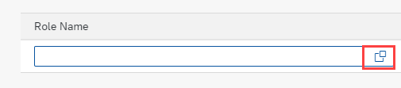
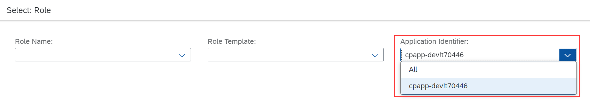

## Prerequisites
 - [Subscribe to the SAP Build Work Zone, Standard Edition](btp-app-work-zone-subscribe)

## Details
### You will learn
 - How to assign roles to users

---

[ACCORDION-BEGIN [Step 1: ](Assign roles)]
To be able to access the application, your user needs to be assigned to a role collection that provides the required scopes.

1. Open **SAP BTP Cockpit**.

2. Go to the **Subaccount** where you have deployed your service and application.

3. Choose **Security** &rarr; **Role Collections** on the left.

4. Select `RiskManager-<your space>` in the list of role collections.

5. Choose **Edit**.

5. Enter the **E-Mail Address** of your user.

6. Choose **Save**.

> The name of the role collection includes the name of your space

> The role collections are created automatically using the `xs-security.json` file. Hence, the name of the role collection includes the name of your space where you have deployed your service and application. For example, if the space name is `dev`, then the name of the role collection will be `RiskManager-dev`.

Your user now appears in the list of the role collection's users.

[VALIDATE_1]
[ACCORDION-END]
---
[ACCORDION-BEGIN [Step 2: ](Test it)]
Go to the application and choose the tile `Risks`. You should be able to create entries in the `Risks` application.

If not, probably you have signed in before adding the role collection to your user. Sign out and sign in again to get the added roles in your login ticket.

> Why there's no data in the `Risks` application?

> As explained in section [Exclude CSV files from deployment](btp-app-cap-mta-deployment), test files should never be deployed to an SAP HANA database as table data. For this reason, we've excluded the test files from the deployment archive before deployment.

[DONE]
[ACCORDION-END]
---
[ACCORDION-BEGIN [Step 3: ]((Optional) Create a role collection manually)]
Instead of creating the role collection automatically using the `xs-security.json`, it's also possible to create a role collection manually. For example:

1. Open **SAP BTP Cockpit**.

2. Go to the **Subaccount**.

3. Choose **Security** &rarr; **Role Collections** on the left.

4. Choose the ( &#x2B; ) icon to create a new role collection.

5. Enter **Name** `RiskManager`.

6. Choose **Create**.

The new role collection appears now in the list, but it doesn't contain any roles. To add a role:

1. Choose the **`RiskManager`** role collection.

2. Choose **Edit**.

3. Open the value help for **Role Name**.

    !

4. Select `cpapp-...!...` in **Application Identifier** dropdown.

    !

    > The **App Identifier** is the **XSAPPID** of your application. It consists of the **XSAPPNAME** that's been used to create the XSUAA service followed by an exclamation mark (`!`) and a landscape-wide unique ID.

5. Select `RiskManager` in list of roles.

6. Choose **Add**.

7. Choose **Save**.

[DONE]
[ACCORDION-END]
---