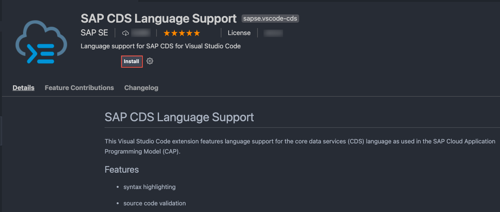
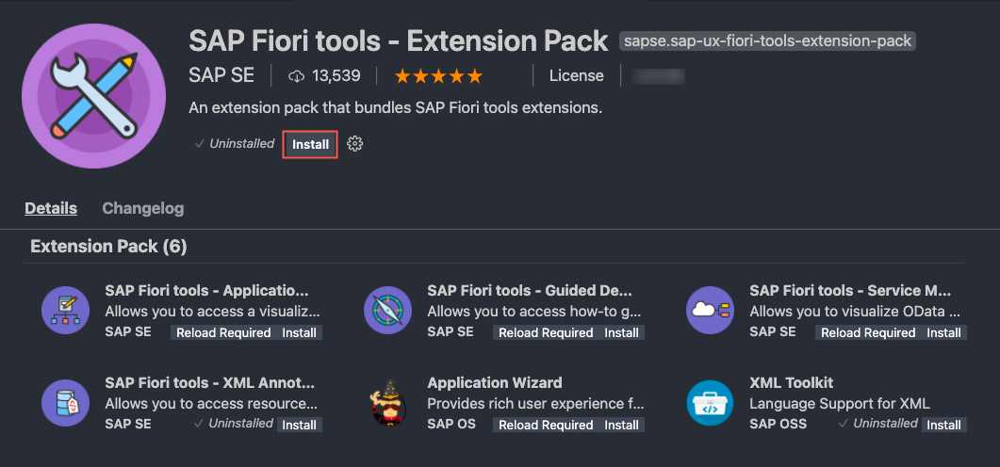
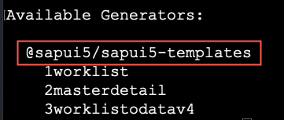

## Prerequisites
 - (For Windows) You have to install [SQLite](https://sqlite.org/download.html) tools for Windows. Find the steps how to install it in the CAP documentation in section [How Do I Install SQLite](https://cap.cloud.sap/docs/advanced/troubleshooting#how-do-i-install-sqlite-on-windows).
 - (For macOS) You have to install Command-Line Tools for Xcode, cause some node modules need binary modules (`node-gyp`). There are two options to install them:
    - Using the command line: `xcode-select --install`
    - Downloading [Xcode](https://developer.apple.com/xcode/) (a login with your Apple ID and password is required). Search for `Command Line Tools for Xcode`.
 - You have to install the [CF CLI](https://docs.cloudfoundry.org/cf-cli/install-go-cli.html)   

## Details

### You will learn
 - How to set up your environment for application development
 - How to install extensions for VS Code
 - How to install all required tools for UI development

---

[ACCORDION-BEGIN [Step 1: ](Editors)]

This tutorial contains all the installations steps that you would have to get started. It's likely that you have some of the software already installed, so you can just skip those steps.

You can choose the editor to develop your end-to-end CAP application. You can use VS Code or set up SAP Business Application Studio. When using SAP Business Application Studio you benefit from not having to install additional extensions, but you need an SAP BTP account.

> If you want to exactly go along with the following tutorials choose VS Code as an editor.


[DONE]
[ACCORDION-END]
---
[ACCORDION-BEGIN [Step 2: ](Command line interpreters)]

This tutorial contains a number of command line snippets that need to be pasted into a terminal. All snippets listed for macOS/Linux or without platform information can be executed in the `bash` or `zsh`, which are the default shells for these platforms. The Windows snippets are for the Windows Command Line and not for the PowerShell. Windows users are suggested to use the `Git BASH` instead, which is part of the Git for Windows installation and contains the basic UNIX command line tools. In the `Git BASH`, use the *macOS/Linux* snippets of the tutorial. VS Code supports the use of the `Git BASH` for the integrated terminal as well.

[DONE]
[ACCORDION-END]
---
[ACCORDION-BEGIN [Step 3: ](Install Git)]

Git is the version control system that you need to download the files of this tutorial but also to develop anything in collaboration with others really.

Check whether you already have Git installed by opening a terminal and execute:

```Shell/Bash
git version
```

You should get an output like:

```Shell/Bash
git version 2.x.x
```

If not, go to [Git downloads](https://git-scm.com/downloads), pick the installer appropriate for your operating system and install it.

[DONE]
[ACCORDION-END]
---
[ACCORDION-BEGIN [Step 4: ](Install Node.js)]

Node.js is the JavaScript runtime the CAP backend part of the application runs on and that is needed for some of the tools involved to develop the application.

In case you don't know whether you have Node.js installed and whether it has the right version (>=14), open a terminal and execute:

```Shell/Bash
node -v
```

Make sure you run the latest long-term support (LTS) version of Node.js with an even number like 14. Refrain from using odd versions, for which some modules with native parts will have no support and thus might even fail to install. You should get an output like:

```Shell/Bash
v14.x.x
```

> If you don't see the required version, go to [Node.js](https://nodejs.org/en/download/) download page, pick the installer appropriate for your operating system, and install it. In case of problems, see the [Troubleshooting guide](https://cap.cloud.sap/docs/advanced/troubleshooting#node-version) for CAP for more details.


[DONE]
[ACCORDION-END]
---
[ACCORDION-BEGIN [Step 5: ](Install the SAPUI5 command line interface)]

A Node.js version 14 or higher is required to install the SAPUI5 CLI. See [SAPUI5 CLI](https://sap.github.io/ui5-tooling/pages/CLI/) for more details.

1. Check in a terminal whether you already have the UI5 CLI installed:

    ```Shell/Bash
    ui5 --version
    ```

2. If you don't get a version number, install the UI5 CLI:

    ```Shell/Bash
    npm install --global @ui5/cli
    ```

3. Verify that the installation was successful by running the version command again:

    ```Shell/Bash
    ui5 --version
    ```

[DONE]
[ACCORDION-END]
---
[ACCORDION-BEGIN [Step 6: ](Install the Cloud Foundry command line interface)]

[OPTION BEGIN [macOS]]

This is needed if you want to use the services and applications that you create in this tutorial on SAP BTP. In this case, you need the Cloud Foundry Command Line Interface (CF CLI) to deploy the services and apps to the platform. If you don't intend to deploy the service and apps to SAP BTP, you can skip this installation.

1. Check whether the package manager `brew` is installed on your machine:

    ```Shell/Bash
    brew --version
    ```
      If there's an output of a version of `brew`, you got brew and it's best if you install the CF CLI:

    ```Shell/Bash
    brew install cloudfoundry/tap/cf-cli
    ```

      If you don't have `brew`, you might want to consider installing [brew](https://brew.sh/), because it lets you install many software packages easily even outside the context of this tutorial.
      If you don't have `brew`, you have to download a binary installer as described [here](https://github.com/cloudfoundry/cli#installers-and-compressed-binaries).

2. In either case, after the installation, check whether you get the output of a version indicating the installation succeeded:

    ```Shell/Bash
    cf --version
    ```


[OPTION END]
[OPTION BEGIN [Windows]]

This is needed if you want to use the services and applications that you create in this tutorial on SAP BTP. In this case, you need the Cloud Foundry Command Line Interface (CF CLI) to deploy the services and apps to the platform. If you don't intend to deploy the service and apps to SAP BTP, you can skip this installation.

Download a binary installer as described [here](https://github.com/cloudfoundry/cli#installers-and-compressed-binaries).


[OPTION END]
[OPTION BEGIN [Linux]]

This is needed if you want to use the services and applications that you create in this tutorial on SAP BTP. In this case, you need the Cloud Foundry Command Line Interface (CF CLI) to deploy the services and apps to the platform. If you don't intend to deploy the service and apps to SAP BTP, you can skip this installation.

Follow the steps described [here](https://docs.cloudfoundry.org/cf-cli/install-go-cli.html#pkg-linux).

[OPTION END]


[DONE]
[ACCORDION-END]
---
[ACCORDION-BEGIN [Step 7: ](Add CAP tooling)]

CAP provides you with all the tools to create your data model with entities and your services. It helps you tremendously to get these services running locally during development with an incredible speed. It also creates the connection to both local databases and databases in the cloud (SAP HANA). It comes with different tooling that is used in this tutorial. You can see the details in the [CAP documentation](https://cap.cloud.sap/docs/get-started/in-a-nutshell).

1. Install CDS development kit globally in a terminal:

    ```Shell/Bash
    npm i -g @sap/cds-dk
    ```

    This process takes some minutes installing the `cds` command that you'll use in the next steps. On macOS/Linux, you need to follow the steps as described [here](https://docs.npmjs.com/resolving-eacces-permissions-errors-when-installing-packages-globally).

    If there's an older `@sap/cds` package already installed on your machine, you have to remove it first. You'll be instructed to do so. If you run into problems, see the [Troubleshooting guide](https://cap.cloud.sap/docs/advanced/troubleshooting#npm-installation) in the CAP documentation for more details.

2. To verify that the installation was successful, run `cds` without arguments.

    This lists the available `cds` commands. 

3. Check what versions of the CDS libraries have been installed:

    ```Shell/Bash
    cds v
    ```

    To know what is the latest version of the CAP tooling, see the [Release Notes](https://cap.cloud.sap/docs/releases/) for CAP.

[DONE]
[ACCORDION-END]
---
[ACCORDION-BEGIN [Step 8: ](Install VS Code)]

[OPTION BEGIN [macOS]]

VS Code is used to edit the code of the application project and it comes with a couple of so-called extensions from SAP (CAP and SAP Fiori tools) that are also used here.

In case you don't have it, go to the [Visual Studio Code](https://code.visualstudio.com/) homepage and find the version appropriate for your operating system.

Download the package for macOS and perform the following steps as described [here](https://stackoverflow.com/questions/29955500/code-not-working-in-command-line-for-visual-studio-code-on-osx-mac). To start it like any other application and to start it from the terminal on MacOS, follow these steps:

1. Move VS Code from your **Download** folder to the **Applications** folder.

2. Use **command** + **shift** + **P** keys to open the command palette.

3. Type **`Install 'code' command in PATH`** and choose **Enter**.


[OPTION END]
[OPTION BEGIN [Windows]]

VS Code is used to edit the code of the application project and it comes with a couple of so-called extensions from SAP (CAP and SAP Fiori tools) that are also used here.

In case you don't have it, go to the [Visual Studio Code](https://code.visualstudio.com/) homepage and find the version appropriate for your operating system.

Download the installer suitable for your Windows version and follow the instructions in the installation wizard.


[OPTION END]
[OPTION BEGIN [Linux]]

VS Code is used to edit the code of the application project and it comes with a couple of so-called extensions from SAP (CAP and SAP Fiori tools) that are also used here.

In case you don't have it, go to the [Visual Studio Code](https://code.visualstudio.com/) homepage and find the version appropriate for your operating system.

Download the package for your Linux distribution and install.

[OPTION END]


[DONE]
[ACCORDION-END]
---
[ACCORDION-BEGIN [Step 9: ](Install VS Code extensions)]

You need to install the [**SAP Language Support**](https://marketplace.visualstudio.com/items?itemName=SAPSE.vscode-cds) extensions for VS Code:

1. Open VS Code.

2. Choose the **Extensions** icon in the left pane.

3. Type **SAP CDS** in the search field and choose **SAP Language Support** from the search results.


    

4. Choose **Install**.

5. Restart VS Code after the installation.

Now, the extension is installed in VS Code. If the extension is already installed and enabled in VS Code, it is updated automatically. The VS Code extension comes with a welcome page, which shows latest release notes of CAP. It starts automatically whenever an update arrives for the extension. Later, you can open the page through the **Command Palette** in VS Code `CDS: Show CAP Release Notes`.

> Learn more about SAP CDS Language Support Extension:

> - short [demo](https://www.youtube.com/watch?v=eY7BTzch8w0)
> - [features and commands](https://cap.cloud.sap/docs/get-started/tools#cds-editor)

[DONE]
[ACCORDION-END]
---
[ACCORDION-BEGIN [Step 10: ](Install SAP Fiori tools Extension Pack)]

SAP Fiori tools are a number of extensions for VS Code. They mainly support you in developing SAP Fiori elements apps. In this tutorial, we use the so-called SAP Fiori application generator to create an SAP Fiori elements app, you need this for the tutorial [Create an SAP Fiori Elements-Based UI](btp-app-create-ui-fiori-elements).

> Additional Documentation:

> [SAP Fiori Tools](https://help.sap.com/viewer/product/SAP_FIORI_tools/Latest/en-US)

For macOS you need to install the `code` command in PATH:

1. In VS Code, invoke the Command Palette ( **View** **&rarr;** **Command Palette** or **⇧⌘P**) and type `shell command` to find the Shell Command: `Install 'code' command in PATH`.

      

2. Restart the terminal for the new `$PATH` value to take effect.

You need to install the [**SAP Fiori tools - Extension Pack**](https://marketplace.visualstudio.com/items?itemName=SAPSE.sap-ux-fiori-tools-extension-pack)  extensions for VS Code:

1. Open VS Code.

2. Choose the **Extensions** icon in the left pane.

3. Type **SAP Fiori tools** in the search field and choose **SAP Fiori tools - Extension Pack** from the search results.

    

4. Choose **Install**.

5. Restart VS Code after the installation.

After a restart of VS Code, you can check for the tools by invoking **View** **&rarr;** **Extensions** and then scrolling through the list of **Enabled** extensions. They all start with **SAP Fiori tools**. If the extension is already installed and enabled in VS Code, it's updated automatically.

[VALIDATE_1]

[ACCORDION-END]
---
[ACCORDION-BEGIN [Step 11: ](Install SAPUI5 freestyle app templates using Yeoman)]

SAPUI5 comes with templates that kick start your development for SAPUI5 freestyle app development. You need these if you want to carry out the tutorial [Create a UI Using Freestyle SAPUI5](btp-app-create-ui-freestyle-sapui5).
SAPUI5 templates are based on [Yeoman](https://yeoman.io/), a tool for scaffolding web apps. You need to install it first.

1. Check in a terminal whether you already have Yeoman installed:

    ```Shell/Bash
    yo --version
    ```

2. If you don't get a version number, install Yeoman:

    ```Shell/Bash
    npm install -g yo
    ```

3. Now, you can go ahead and install the [SAPUI5 templates](https://www.npmjs.com/package/@sapui5/generator-sapui5-templates):

    ```Shell/Bash
    npm install -g yo @sapui5/generator-sapui5-templates
    ```

4. Test whether everything works:

    ```Shell/Bash
    yo --generators
    ```

If the **@sapui5/sapui5-templates** generator is listed in the terminal, you're ready to go.



[DONE]
[ACCORDION-END]
---