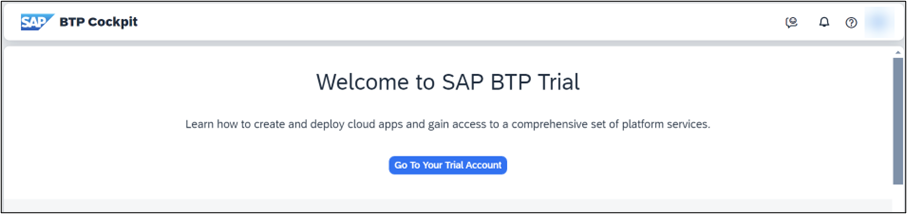
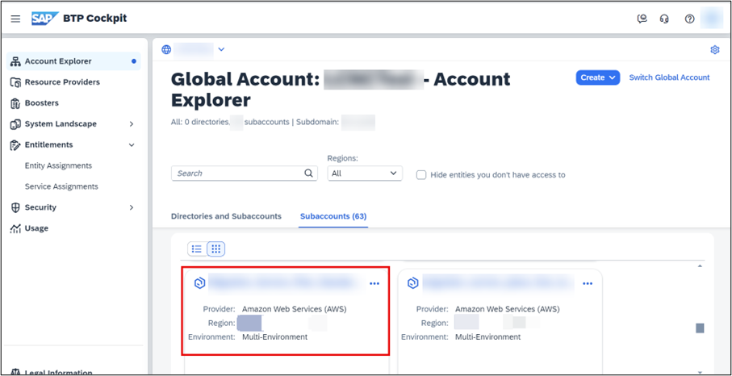
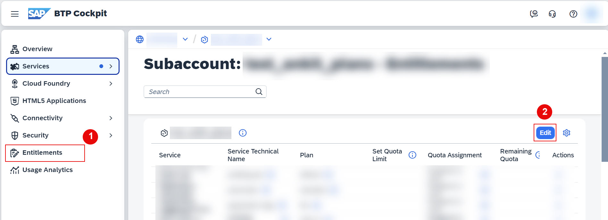
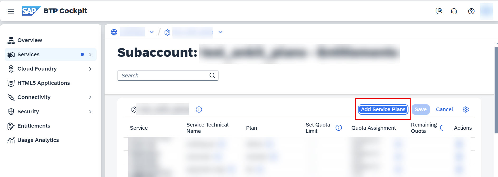
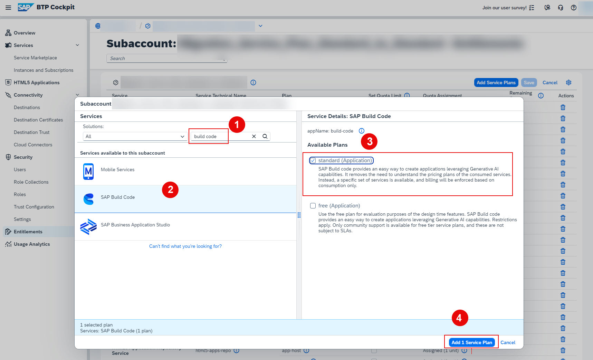

# Add SAP Build Code standard (Application) plan
<!-- description --> In this tutorial, you'll learn how to add service plans to your subaccounts. We will add the SAP Build Code standard (Application) service plan to your subaccount.

## Prerequisites
 - You have an SAP BTP trial account. For more information, see [Get an Account on SAP BTP Trial](hcp-create-trial-account)
 - You have purchased SAP Build Code

## You will learn
 - How to access SAP BTP trial account
 - How to add SAP Build Code standard (Application) plan to your subaccount
 - How to add service plans to your subaccount

## Intro
   SAP Build Code offers an AI-powered cloud development environment specifically tailored for SAP Cloud Application Programming Model (CAP), SAP Fiori, mobile, and SAPUI5 developers.

   By seamlessly integrating coding, testing, and application management, it streamlines the application development process on SAP BTP. SAP Build Code combines SAP Business Application Studio with the most essential services and SDKs on SAP BTP.

   If you're looking to enhance your current service plan by transitioning to the build-code service plan, you're making a great choice to leverage pro-code capabilities for the accelerated development of your business applications. This upgrade will provide you with advanced tools and resources that can significantly streamline your development process. 
 
   To successfully complete this upgrade, follow the steps outlined in this mission. By doing so, you can unlock new features that will improve efficiency and transform the way you create and deploy applications for your business.

### Access the SAP BTP cockpit

   On the welcome screen of the SAP BTP Cockpit. Click on [Go To Your Trial Account](https://account.hanatrial.ondemand.com/trial/#/home/trial) to navigate to your global account.

  <!-- border --> 

### Access your subaccount

Click the tile of your Cloud Foundry subaccount to proceed.

  <!-- border --> 

### Add SAP Build Code standard plan

 1. Navigate to **Entitlements**, choose **Edit**.

    <!-- border --> 

 2. Choose **Add service Plans**.
 
    <!-- border --> 
 
 3. On the new pop-up window, under **Services** search for *`build code`* or *`SAP Build Code`*: Select **SAP Build Code** > under **Available Plans**, select **standard (Application)** plan > choose **Add 1 Service Plan**.
 
    <!-- border --> 
  
 4. Choose **Save**.

### Test yourself