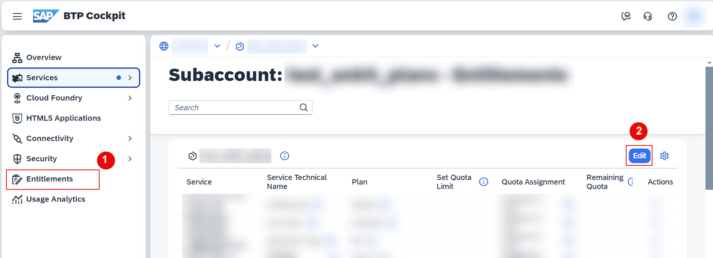
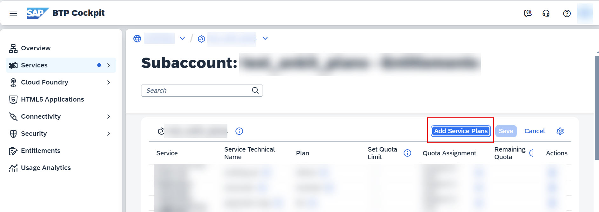
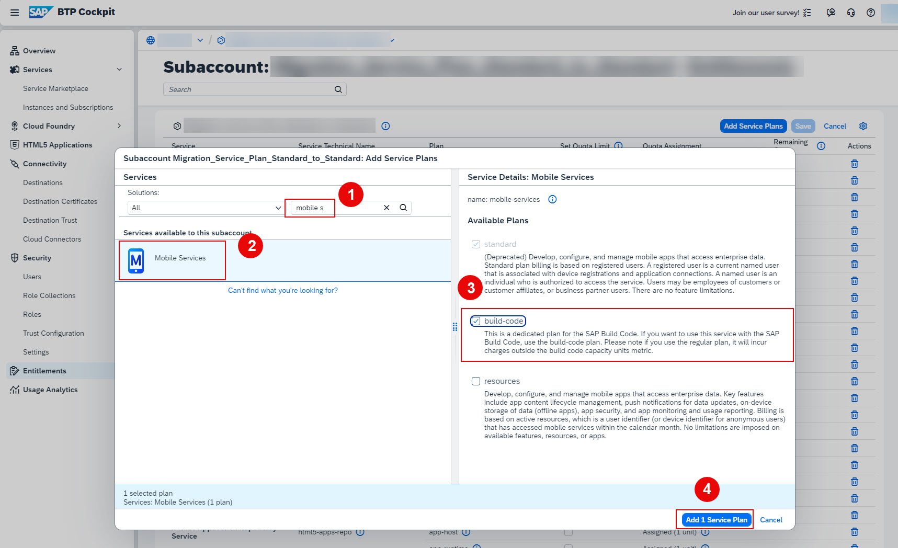

# Add build-code service plan
<!-- description --> In this tutorial, you will learn how to add a build-code service plan to your service. We will use SAP Mobile Services as an example.

## Prerequisites
 - You have an SAP BTP trial account. For more information, see [Get an Account on SAP BTP Trial](hcp-create-trial-account)
 - You have added an SAP Build Code service plan to your subaccount
 - You have created a subscription for SAP Build Code
 - You have subscribed to SAP Mobile Services. For more information, see [Access SAP Mobile Services](fiori-ios-hcpms-setup.html)

## You will learn
 - How to create subscriptions for other services
 - How to access the Service Marketplace
 - How to access and verify your instances and subscriptions
 - Where you can find your services

### Add build-code service plan

 1. Navigate to your subaccount.
   
 2. Navigate to **Entitlements**, choose **Edit**.

    <!-- border --> 

 3. Choose **Add service Plans**.
 
    <!-- border --> 
 
 4. On the new pop-up window, under Services search for **Mobile Services**: Select **SAP Mobile Services** > under **Available Plans**, select **build-code** plan > choose **Add 1 Service Plan**.
 
     <!-- border --> 

 5. Choose **Save**.
   
    You have successfully added a **build-code** service plan for SAP Mobile Service.

### Test yourself