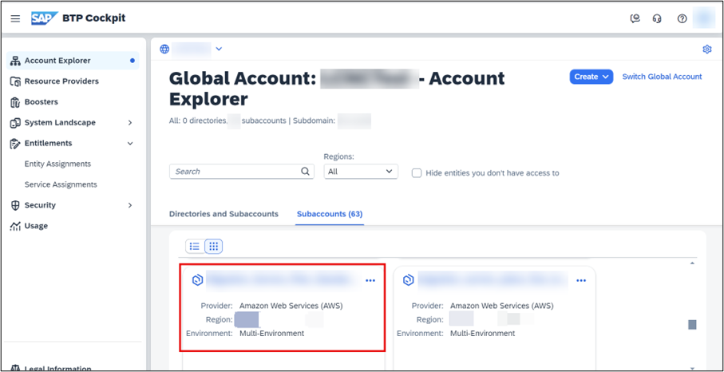
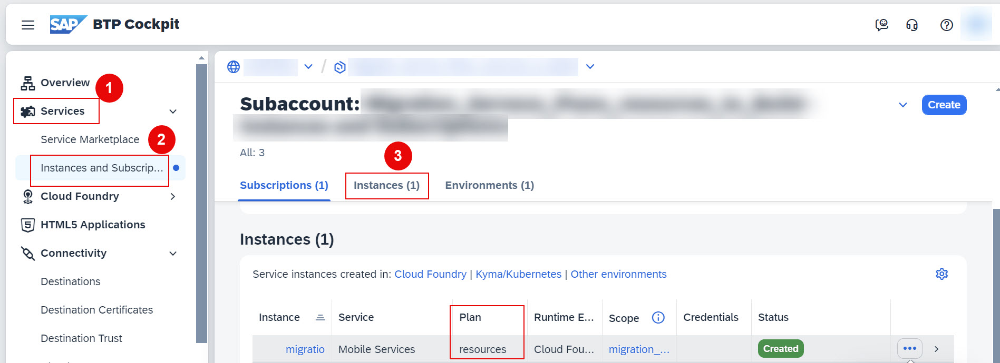
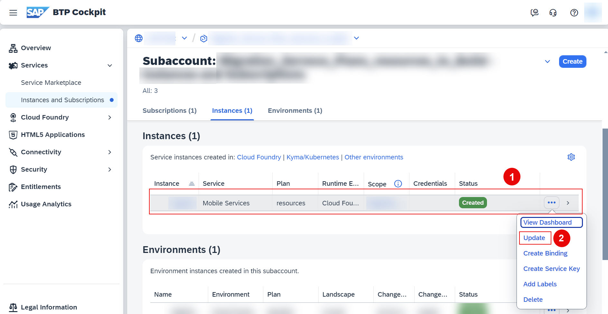
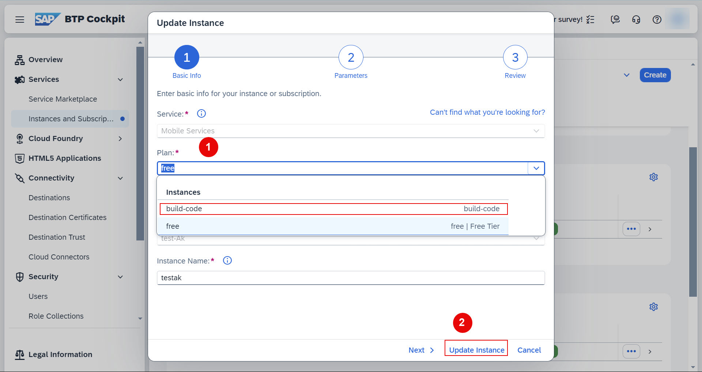
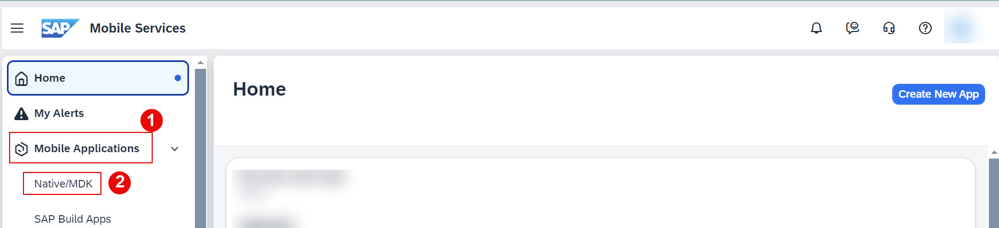
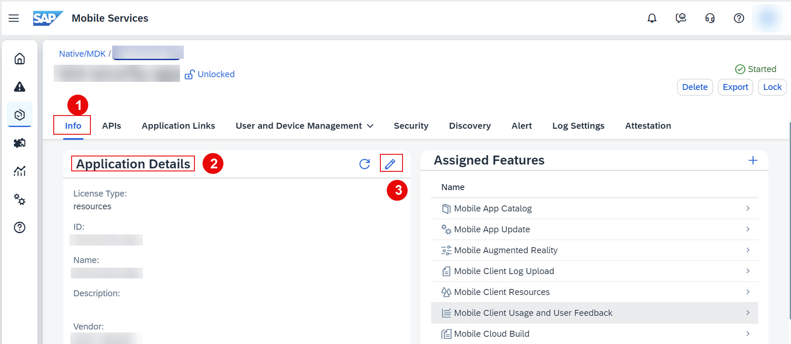
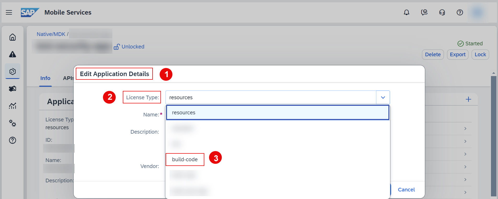

# Update Service Plan
<!-- description --> In this tutorial, you will learn how to update your service plans for your BTP Services and from the SAP Mobile Services Administration UI.

## Prerequisites
 - You have an SAP BTP trial account. For more information, see [Get an Account on SAP BTP Trial](hcp-create-trial-account)
 - You have access to SAP Mobile Services. For more information, see [Access SAP Mobile Services](fiori-ios-hcpms-setup.html)
 - You have added an SAP Build Code service plan to your subaccount
 - You have added a build-code service plan for your service
 - You have subscribed to SAP Mobile Services. For more information, see [Access SAP Mobile Services](fiori-ios-hcpms-setup.html)

## You will learn
 - How to access Instances and Subscriptions
 - How to access and verify your subscriptions
 - How to update service plans for your BTP Services
 - How to access SAP Mobile Services in your BTP account
 - How to update service plan from SAP Mobile Services

---

### Access your subaccount

Click on the tile of your Cloud Foundry subaccount.

  <!-- border --> 

### Update License

[OPTION BEGIN [Update license from SAP BTP cockpit]]

  1. Navigate to **Services** > **Instances and Subscriptions** > **Instances**
 
    <!-- border --> 

    > If you notice in above screenshot, we took example of SAP Mobile Services, here current plan is **resources**.

  2. Choose **Mobile Services** row > choose ellipsis at the end of the instances row, and from the menu, click **Update**.
 
    <!-- border --> 

  3. On the **Update Instance** wizard, select the **build-code** plan, and click **Update Instance**.
 
    <!-- border --> 

    Now, plan is successfully updated to **build-code**.

   For more information, see [Changing Service Plans](https://help.sap.com/docs/build_code/d0d8f5bfc3d640478854e6f4e7c7584a/d501fb669447478cbcd07a0b7b7ca4c0.html?version=SHIP)

[OPTION END]

[OPTION BEGIN [Update license from SAP Mobile Services]]

  1. In Mobile Services cockpit, select **Mobile Applications** > **Native/MDK**
 
    <!-- border --> 

  2. Select an application, navigate to **Info** tab > **Application Details** section, click **Edit** to make modifications.
   
    > You cannot edit the application when it is locked.
   
    <!-- border --> 
   
  3. In **Edit Application Details** wizard > locate the **License Type** field > select the target license i.e. **build-code** from the **License Type** dropdown list.
    
    <!-- border --> 
   
  4. Choose **Save**.
 
    Now, plan is successfully updated to **build-code**.

   For more information, see [Changing Service Plans at the App Level](https://help.sap.com/docs/mobile-services/mobile-services-cloud-foundry/changing-service-plans-at-app-level)

[OPTION END]

### Supported Service Plan Upgrades

| Service             | Current Plan | Target Plan |
|---------------------|--------------|-------------|
| SAP Mobile Services | free     | build-code  |
| SAP Mobile Services | resources     | build-code  |
| SAP Mobile Services (Changing the service plan to a deprecated plan is not recommended.) | standard (deprecated plan)     | build-code  |
| SAP Mobile Services | b2c (deprecated plan)     | build-code  |
| SAP Mobile Services | build-code     | standard (deprecated plan)  |
| SAP Mobile Services | build-code     | resources |

For more information, see [Changing Service Plans](https://help.sap.com/docs/build_code/d0d8f5bfc3d640478854e6f4e7c7584a/d501fb669447478cbcd07a0b7b7ca4c0.html?version=SHIP)

### Test yourself