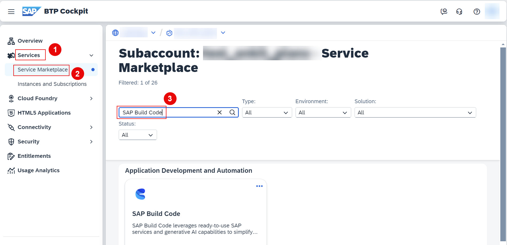
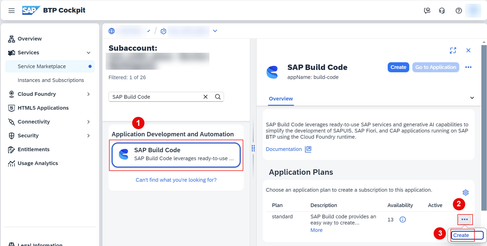
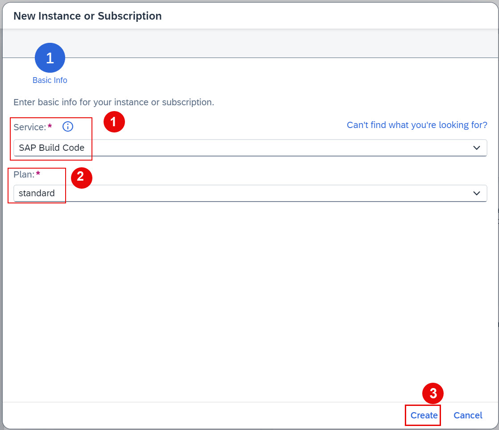
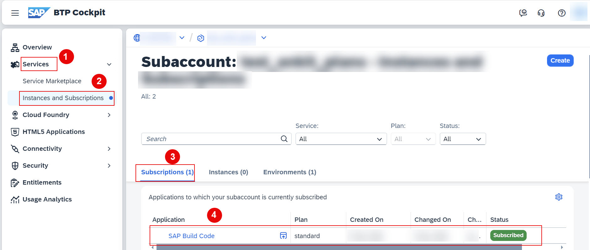

# Create an SAP Build Code Standard (Application) Subscription
<!-- description --> In this tutorial, you'll learn how to create subscriptions for the SAP Build Code Standard (Application) Plan for your subaccounts.

## Prerequisites
 - You have an SAP BTP trial account. For more information, see [Get an Account on SAP BTP Trial](hcp-create-trial-account)
 - You have added an SAP Build Code service plan to your subaccount

## You will learn
 - How to create subscription for SAP Build Code standard (Application) plan for your subaccount
 - How to create subscriptions for other services
 - How to access Service Marketplace
 - How to access and verify your subscriptions

### Access Service Marketplace
 1. Navigate to your subaccount.
   
 2. In the navigation area, choose **Services** > **Service Marketplace** and search for **SAP Build Code**.
 
  <!-- border --> 

### Subscribe to SAP Build Code

 1. Under **Application Development and Automation** section, choose **SAP Build Code** > click the ellipsis in the line for the **standard** plan, and click **Create**.
 
    <!-- border --> 

 2. On **New Instance or Subscription** wizard choose **Service** and **Plan** from the drop down and choose **Create**.
 
    <!-- border --> 

 3. To verify the successful creation of subscription for SAP Build Code standard plan, navigate to **Services** > **Instances and Subscriptions**, under   **Subscriptions** section, you will find your subscriptions.
 
    <!-- border --> 

### Test yourself