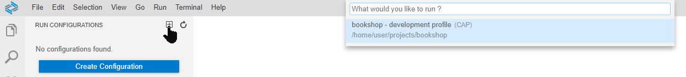
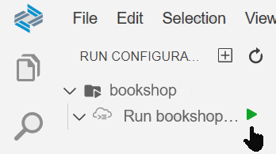
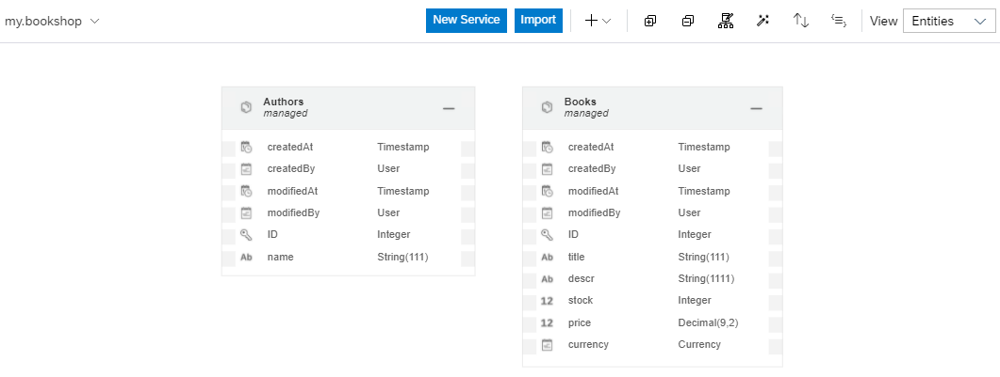
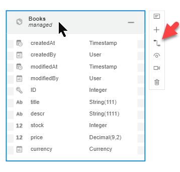
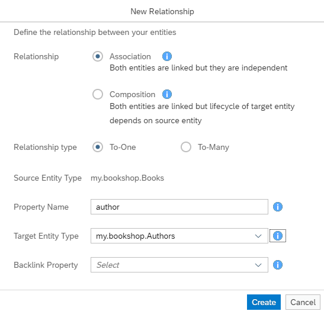
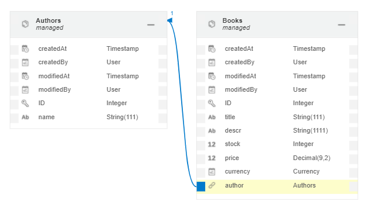
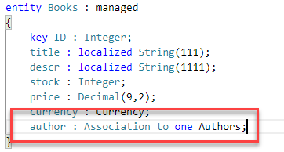
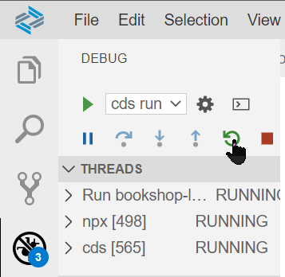
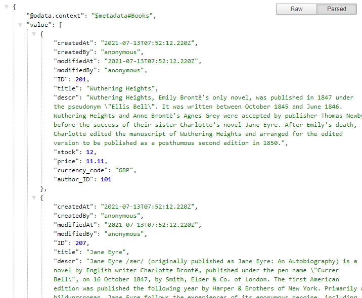

# Create a CAP Project with SAP Business Application Studio
<!-- description --> Quickly create an OData service by creating a CAP project in SAP Business Application Studio.

## Prerequisites
- You've access to the SAP Business Application Studio in a trial account on SAP BTP, see [Set Up SAP Business Application Studio for Development](appstudio-onboarding)
- You've created a Full Stack Cloud Application dev space in the SAP Business Application Studio.

## You will learn
  - How to create a project in the SAP Business Application Studio using the project wizard.
  - How to use the run configurations.
  - How to expose a port for your application.
  - How to use the graphical modeling tools, the code editor and the CDS command-line-interface.
  - How easy it is to use a database with your CAP service.

---

### Open SAP Business Application Studio


As mentioned in the prerequisites of this tutorial, we assume that you've already set up your SAP Business Application Studio and created the needed Full Stack Cloud Application dev space.

If the dev space is not running, you need to start it and enter the SAP Business Application Studio.


### Create project


The project wizard helps you create a CAP project.

1. Run the wizard by going to **File > New Project from Template** and follow the steps.

1. Select **CAP Project** and **Start** the wizard.

1. Enter `bookshop` as the project name and select **Minimal Sample**. Leave the rest as is.

1. Click **Finish**.

    This opens your new project in a new workspace if you kept the defaults.

You've just created a **runnable** CAP project. Nothing more is needed, it just works. Let's see it in action in the next step.

>If you want to work on your project with others or be able to share your project for any other reason, [initialize your project as a Git project](https://github.com/git-guides/git-init). For an introduction to Git have a look at the [tutorials based on SAP Web IDE](group.webide-github), which is the predecessor of SAP Business Application Studio. It explains the basics nicely.


### Run project


In the previous step you've created an already runnable application. To demo that it's runnable and to see what's already available, create a run configuration and run the project.

> A run configuration is a collection of settings and files to run/debug your application.

1. Go to **Terminal > New Terminal** and from the terminal, execute `npm install`.

   This installs all dependencies from your `package.json`.

1. Go to the **Run Configurations** panel and select **Create Configuration**.

1. Choose `bookshop - development profile (CAP)`.

    <!-- border -->

1. Name your run configuration `Run bookshop-local`.

1. Choose **Run Module** on `Run bookshop-local`.

    <!-- border -->


Open the URL and look at the application, including the sample data for the `Books` entity (select **Books**) that is being served. This is your first, full-fledged OData service created with CAP.

>The path (`/catalog`) your service is served on, is derived from the name of the service. [Learn here, how to override the default.](https://cap.cloud.sap/docs/cds/cdl#service-definitions)


### Enhance project


Now, let's start to enhance your project, to have a good basis for the upcoming tutorials.

In this step you will add a little more complexity to your data model. Replace the code in `db/data-model.cds` with the following code:

```CDS
using { Currency, managed, sap, cuid } from '@sap/cds/common';
namespace my.bookshop;

entity Books : managed {
  key ID : Integer;
  title  : localized String(111);
  descr  : localized String(1111);
  stock  : Integer;
  price  : Decimal(9,2);
  currency : Currency;
}

entity Authors : managed {
  key ID : Integer;
  name   : String(111);
}
```

> ### What is going on?
Besides defining the namespace, you see the `using` directive at the beginning of your file. This is your way to easily use capabilities and content from other modules or from within your project. Have a look at the [documentation for the `using` directive to learn more.](https://cap.cloud.sap/docs/cds/cdl#using)

As books are written by authors you want to add that relationship to your model. You could establish that relationship by adding CDS code to your files. Here you use the graphical modeler inside the studio for that.

Open the context menu on `db/data-model.cds` and select **Open With > CDS Graphical Modeler**.

<!-- border -->

Select the **Books** entity and add a relationship.

<!-- border -->

Switch **Direction** to **Unidirectional** and then stick with the defaults, which means using `authors` as property name and `my.bookshop.Authors` as target entity.

<!-- border -->

Remember to save the file and see the visualization of your modelled association.

<!-- border -->

As stated before, you could've done it in the code editor as well. So have a look in the code editor what has been changed.

<!-- border -->

You need a second OData service. This additional service is meant for administrators, so that an administrator can see and edit all books and all authors. Here's how you do it.

Create a file called `admin-service.cds` in the `srv` folder and copy this service definition into the file. Remember to save your changes.

```CDS
using { my.bookshop as my } from '../db/data-model';
service AdminService @(requires:'admin') {
  entity Books as projection on my.Books;
  entity Authors as projection on my.Authors;
}

```
> Here you expose the `Authors` entity. The `Authors` entity is part of your domain model (`data-model.cds`) but isn't exposed through the `CatalogService` (`cat-service.cds`). Whereas the `Books` entity is exposed in both services.


### Use databases


Until now you used the in-memory database automatically when you ran the application. It reflects all changes you do to your data model and sample data on the fly. But it also means data is reset to the initial `.csv` content with every restart.

The next step is to have a file-based persistence of your data. And it's just one command you need to execute and your application is configured to use a database. That gives you persistent data even though you're restarting your application. To use persistence also means you explicitly deploy the changes you make, to see them in your application.

Open a terminal by going to **Terminal > New Terminal**.

1. Deploy your data to a file-based SQLite3 database.

    ```Shell/Bash
    cds deploy --to sqlite
    ```

    This creates a file called `sqlite.db` and deploys the data into this file. It also modifies your `package.json` file. We will have a look at that in the next tutorial when you deploy to SAP HANA Cloud.

1. Restart your application in debug mode by going to **View > Debug**.

    <!-- border -->

1. Refresh the browser tab of your application and navigate to the `Books` entity in the `CatalogService`.

The data you see is now served from the file `sqlite.db` and is located in the root of your folder. The next step includes a proof that the file-based persistence is used.


### Add sample data


To have some sample data for the data model you've just created, create the following files and copy `csv` content over.

1. Open `my.bookshop-Books.csv` in the `db/data` folder and replace the content.

    >The filename is important to make use of a default to [pick up sample data](https://cap.cloud.sap/docs/guides/databases#providing-initial-data).

    ```CSV
    ID;title;descr;authors_ID;stock;price;currency_code
201;Wuthering Heights;"Wuthering Heights, Emily Brontë's only novel, was published in 1847 under the pseudonym ""Ellis Bell"". It was written between October 1845 and June 1846. Wuthering Heights and Anne Brontë's Agnes Grey were accepted by publisher Thomas Newby before the success of their sister Charlotte's novel Jane Eyre. After Emily's death, Charlotte edited the manuscript of Wuthering Heights and arranged for the edited version to be published as a posthumous second edition in 1850.";101;12;11.11;GBP
207;Jane Eyre;"Jane Eyre /ɛər/ (originally published as Jane Eyre: An Autobiography) is a novel by English writer Charlotte Brontë, published under the pen name ""Currer Bell"", on 16 October 1847, by Smith, Elder & Co. of London. The first American edition was published the following year by Harper & Brothers of New York. Primarily a bildungsroman, Jane Eyre follows the experiences of its eponymous heroine, including her growth to adulthood and her love for Mr. Rochester, the brooding master of Thornfield Hall. The novel revolutionised prose fiction in that the focus on Jane's moral and spiritual development is told through an intimate, first-person narrative, where actions and events are coloured by a psychological intensity. The book contains elements of social criticism, with a strong sense of Christian morality at its core and is considered by many to be ahead of its time because of Jane's individualistic character and how the novel approaches the topics of class, sexuality, religion and feminism.";107;11;12.34;GBP
251;The Raven;"""The Raven"" is a narrative poem by American writer Edgar Allan Poe. First published in January 1845, the poem is often noted for its musicality, stylized language, and supernatural atmosphere. It tells of a talking raven's mysterious visit to a distraught lover, tracing the man's slow fall into madness. The lover, often identified as being a student, is lamenting the loss of his love, Lenore. Sitting on a bust of Pallas, the raven seems to further distress the protagonist with its constant repetition of the word ""Nevermore"". The poem makes use of folk, mythological, religious, and classical references.";150;333;13.13;USD
252;Eleonora;"""Eleonora"" is a short story by Edgar Allan Poe, first published in 1842 in Philadelphia in the literary annual The Gift. It is often regarded as somewhat autobiographical and has a relatively ""happy"" ending.";150;555;14;USD
271;Catweazle;Catweazle is a British fantasy television series, starring Geoffrey Bayldon in the title role, and created by Richard Carpenter for London Weekend Television. The first series, produced and directed by Quentin Lawrence, was screened in the UK on ITV in 1970. The second series, directed by David Reid and David Lane, was shown in 1971. Each series had thirteen episodes, most but not all written by Carpenter, who also published two books based on the scripts.;170;22;150;JPY
    ```

1. Create the `my.bookshop-Authors.csv` file in the `db/data` folder.

    ```CSV
    ID;name
    101;Emily Brontë
    107;Charlotte Brontë
    150;Edgar Allen Poe
    170;Richard Carpenter
    ```

    In the previous step we switched to a file-based persistence. That means you can't see your sample data in your application without deployment. And as we didn't deploy the sample data until now, you can restart your running application and still see the initial sample data.

    To see your recent changes, you need to deploy your data using `cds deploy --to sqlite`.

1. Go to the debug panel with **View > Debug** and restart the app.

    <!-- border -->

    >There is a convenient shortcut that removes the need to restart the app with every change: Execute `cds watch` in the terminal. Call `cds help watch` in the terminal for more information.

1. Open the application and refresh or select *Open in New Tab* from the prompt in the bottom right corner of the UI.

1. Select `Books` and see that the newly changed model and its sample data is served as part of your `CatalogService` service.

    <!-- border -->

    > The JSON displayed here, is formatted by a browser extension.

    The `CatalogService` defined in the `cat-service.cds` file in the `srv` folder remains unchanged.

You're set up with a basic CAP project showing some important features that make the CAP model so valuable. And you got in touch on some of the nice SAP Business Application Studio features. The next tutorial of this series gives you more details and encourages you to play around with those CAP and studio features.


---
