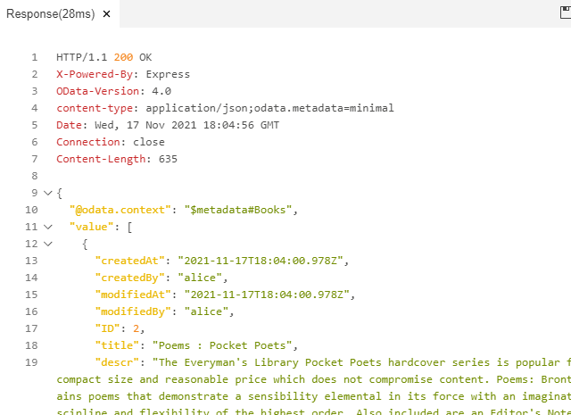
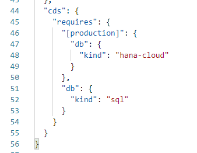
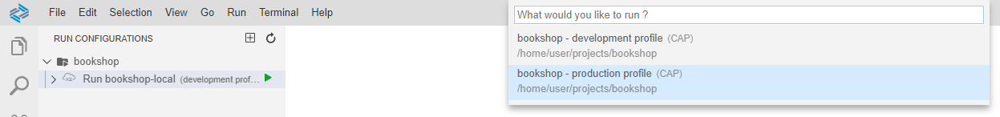

# Learn About Selected CAP Conventions
<!-- description --> CAP comes with a set of defaults to support a "convention over configuration" paradigm. These defaults are designed to ease your start with any CAP project and let you focus on your business domain.

## Prerequisites
 - You've finished [Create a CAP Project with SAP Business Application Studio](btp-cap-beginner-bas-wizard)


## You will learn
- The defaults CAP provides and how that speeds up development
- Why these defaults are built-in and make your life easier
- How to reuse content
- How to model relationships
- How to use CAP and SAP HANA Cloud

## Intro
> If you haven't set up your SAP HANA Cloud yet, follow this quick tutorial (Step 3) to set it up: [Help Thomas Get Started with SAP HANA](hana-trial-advanced-analytics)

> Your SAP HANA Cloud instance requires a couple of minutes to start. You'll need it later on and starting the instance now saves you some time as it can start in the background.

---

### Services as endpoints


Essentially every active thing in CAP is a service and lets you define services as endpoints to underlying capabilities. Application services usually expose projections / views on domain model entities. In that case services are layers over the underlying data. As CAP promotes to build services specific for use cases, services expose different aspects of the domain model tailored to those use cases.


### Events and handlers


Everything happening at runtime is in response to events. Hence, all service implementations take place in event handlers.

CAP comes with basic implementations (generic handlers) that enable you to serve and interact with your service without adding custom implementations to your project. The list of generic handlers comprises:

+ standard CRUD requests
+ deep READ, INSERT, UPDATE, DELETE
+ INSERT, UPDATE, DELETE with Associations

[Learn more about generic handlers in CAP](https://cap.cloud.sap/docs/guides/generic)

Let's see it in action and go to your project.

Start your service from the **Run Configurations** panel.

Create a file called `tests.http` in the root of your project and copy the following OData queries in it. This file can be used with the [REST client](https://marketplace.visualstudio.com/items?itemName=humao.rest-client) that is available in the SAP Business Application Studio to make requests against your service. The generic handlers CAP provides sent the responses to your requests.

```HTTP
# Browse Books as any user
GET http://localhost:4004/odata/v4/catalog/Books?
  # &$select=title,stock
  # &$expand=currency
  # &sap-locale=de
```

Click on **Send Request** inside the `tests.http` file, to execute requests against your service.

<!-- border -->

The REST client gives you the response of your service and you see immediately if the request was successful.

<!-- border -->

>Curious what the OData queries, disabled by the '#', do? Not all of them work right now, they are relevant later in this tutorial. Nevertheless, you can try it out, remove the '#' one line at a time and send the request. More learning content about OData is available in [Learn about OData Fundamentals](odata-01-intro-origins).

Those requests all work, just using the generic handlers CAP provides. So the need to add custom handlers is minimized.

If you want to know more about custom handlers, our [Getting Started in a Nutshell](https://cap.cloud.sap/docs/get-started/in-a-nutshell#adding-custom-logic) is a good starting point.


### Conceptual modeling with CAP


CAP comes with a set of reuse content that we recommend to use. You benefit from several features by using `@sap/cds/common`:

* **Concise** and **comprehensible** models
* **Foster interoperability** between all applications
* **Proven best practices** captured from real applications
* **Streamlined** data models with **minimal entry barriers**
* **Optimized** implementations and runtime performance
* **Automatic** support for localized code lists and value helps
* **Extensibility** using Aspects


#### Conceptual modeling: Aspects


Aspects give you shortcuts, for concise and comprehensible models, interoperability and out-of-the-box runtime features connected to them.

The aspect [managed](https://cap.cloud.sap/docs/cds/common#aspect-managed) is defined in `@sap/cds/common` as follows:

<!-- border -->

Use `managed`, to add four elements to capture `created by/at` and latest `modified by/at` management information for records.

The following examples are equivalent:
```CDS
entity Foo : managed {...}
```
```CDS
entity Foo {
  createdAt  : Timestamp @cds.on.insert : $now;
  createdBy  : User      @cds.on.insert : $user;
  modifiedAt : Timestamp @cds.on.insert : $now  @cds.on.update : $now;
  modifiedBy : User      @cds.on.insert : $user @cds.on.update : $user;
  ...
}
```

> `modifiedAt` and `modifiedBy` are set whenever the respective row was modified, that means, also during `CREATE` operations.

> The annotations `@cds.on.insert/update` are handled in generic service providers to fill-in those fields automatically.

Let's see it in action.

This aspect is also [used](https://cap.cloud.sap/docs/cds/cdl#using) in your project and you've seen the effect, for example, when you fetched all books. The response contained those fields, even though they are not explicitly part of your entity definition in the `data-model.cds` file.

<!-- border -->

There are other common reuse aspects. Have a look at the [documentation for `cuid`](https://cap.cloud.sap/docs/cds/common#aspect-cuid) and [ for `temporal`](https://cap.cloud.sap/docs/cds/common#aspect-temporal).


#### Conceptual modeling: Types


Types are standard definitions of often needed entities. Using and reusing them fosters interoperability between applications but lets you enhance those definitions at the same time.

The reuse type [`Currency`](https://cap.cloud.sap/docs/cds/common#type-currency) is defined in `@sap/cds/common` as a simple managed association to the [entity `sap.common.Currencies`](https://cap.cloud.sap/docs/cds/common#entity-sapcommoncurrencies) as follows:

```CDS
type Currency : Association to sap.common.Currencies;
```

The entity `sap.common.Currencies` uses the aspect `CodeList` defined in `@sap/cds/common` and adds the fields `code` and `symbol` to the ones already defined in `Codelist`.

<!-- border -->

<!-- border -->

Here's an example of how you [used](https://cap.cloud.sap/docs/cds/cdl#using) that reuse type in your project already:
```CDS
using { Currency } from '@sap/cds/common';

entity Books : managed
{
    key ID : Integer;
    title : localized String(111);
    descr : localized String(1111);
    stock : Integer;
    price : Decimal(9,2);
    currency : Currency; //> using the reuse type
    author : Association to one Authors;
}
```

> The element `currency` follows the recommended rule for writing regular elements in camel case. The type `Currency`, on the other hand, is defined in pascal case.

To see the effect in your application add sample data to your project.

Create the file `sap.common-Currencies.csv` in your `db/data` folder and add the following data:

```CSV
code;symbol;name;descr
USD;$;US Dollar;United States Dollar
GBP;£;British Pound;Great Britain Pound
JPY;¥;Yen;Japanese Yen
```

>The naming of the file is related to the name of the entity `Currencies` and not to the reuse type `Currency` used in your data model.

Use the `GET` request on the catalog service you've included previously in your `tests.http` file. Enable the expand part of the query:

<!-- border -->

See the effect:

<!-- border -->

There are also the reuse types [`Country`](https://cap.cloud.sap/docs/cds/common#type-country) and [`Language`](https://cap.cloud.sap/docs/cds/common#type-language) that follow the same principle as `Currency`.

You can adapt aspects and types to your needs. Learn more in the [CAP documentation](https://cap.cloud.sap/docs/cds/common#adapting-to-your-needs)


### Modeling relationships: Associations


Associations help you capture your intent when modeling your data. As associations in CAP act like forward-declared JOINs, you can focus on what you want to express, instead of capturing relationships using foreign keys and the respective JOINs in each query. Queries just use them much like forward-declared table aliases. There's no need to repeat the respective JOINs and ON conditions all over the place.

Let's see it in action.

You've already used it in your project and defined a simple [_managed association_](https://cap.cloud.sap/docs/guides/domain-models#managed-associations) from the `Books` entity to the `Authors` entity in your `data-model.cds` file:

```CDS
entity Books : managed { ...
  author : Association to Authors;
}
```

Now add an association from the `Authors` entity to the `Books` entity and use again the graphical modeler to do so.

Open the `data-model.cds` file in the graphical modeler and add a new relationship to the **Authors** entity.

Stick with the defaults, which means using `books` as property name, `my.bookshop.Books` as target entity and `authors` as backlink property.

<!-- border -->

This is how your data model looks now in the graphical modeler.

<!-- border -->

This is a [_one-to-many_ association](https://cap.cloud.sap/docs/guides/domain-models#one--to-many-associations). Such an association always needs `on` conditions (backlink property) referring to some reverse association on the target side. Basically this expresses, that in your model **one book has exactly one author** and at the same time **one author can have many books**. If you defined your service accordingly, as in the `AdminService`, you can find all books of an author if you navigate the `Author` entity (`/admin/Authors?$expand=books`). Use `Alice` without a password to access the service. You'll learn more about it later in this tutorial.

> You can even deep read associated entities: `/admin/Authors?$expand=books($expand=currency)`


### Modeling relationships: Composition


Compositions are used to model document structures through "contained-in" relationships.

Compositions get a special treatment and [runtime support out-of-the-box](https://cap.cloud.sap/docs/guides/domain-models#compositions-capture-contained-in-relationships). This is done using our generic service providers. If you don't have special needs, no custom coding is necessary.

Let's see it in action.

Assume that you want to enable customers to buy books from your bookshop. For this add a new entity `Orders` and a new service `BuyService` to your project.

Open the `db/data-model.cds` file and add the following definitions of your `Orders` and `OrderItems` entity.

```CDS
entity Orders : cuid, managed {
  OrderNo  : String @title:'Order Number'; //> readable key
  Items    : Composition of many OrderItems on Items.parent=$self;
}

entity OrderItems {
  key parent : Association to Orders;
  key book   : Association to Books;
  amount     : Integer;
}
```

Previously aspects were introduced. Here the aspects `cuid` and `managed` are used.

>An order consists of many order items. The order items on the other hand, are fully dependent on the order, they can't exist without an order.

Create the file `srv/buy-service.cds` file and add the `BuyService` as follows:

```CDS
using my.bookshop as my from '../db/data-model';

service BuyService {
  entity Orders as projection on my.Orders;
}
```
This service exposes your `Orders` entity and you can place orders using this service.

> Using a new file for that service follows the recommendation [to have services built per use case.](https://cap.cloud.sap/docs/guides/providing-services#prefer-single-purposed-services)

To test this, restart your application from the debug panel and add a new request to your `tests.http` file.

```HTTP
###
# Submit Order
#

POST http://localhost:4004/odata/v4/buy/Orders
Content-Type: application/json;IEEE754Compatible=true

{ "Items":[{"book_ID":201, "amount":5}]  }
```
> To keep it simple in this tutorial, we kept the payload of the request to a minimum.

Execute the request and you see a success message.

<!-- border -->

With the `POST` request, you sent an order that contained the items. Those can be `many` order items, and each order item consists of `book_ID` and `amount`. `book_ID` is the foreign key, as we use an association to the `Books` entity in the `OrderItems` entity's key `book` and the `Books` key is `ID`.

> If you wonder where `book_ID` originates: It's created on the persistence layer, implicitly defined by the managed association used in the `OrderItems` entity in the key elements `books`.

```CDS
entity Books : managed {
  key ID : Integer;
  ...
}
[...]
entity OrderItems {
  ...
  key book   : Association to Books;
  ...
}
```


### Authentication and Authorization

For a use case like authentication and authorization, you just need to enrich models with additional metadata. Use [Annotations](https://cap.cloud.sap/docs/cds/annotations), it's as simple as that. In CAP annotations can serve several purposes. Those can be general purposes like defining the title or description, or more specific purposes like [input validation](https://cap.cloud.sap/docs/cds/annotations#input-validation), [persistence](https://cap.cloud.sap/docs/cds/annotations#persistence), [UIs](https://cap.cloud.sap/docs/advanced/fiori), or [authentication and authorization](https://cap.cloud.sap/docs/guides/authorization).

For the `AdminService` you need to be a user with the admin role. That restriction is introduced by the annotation `@(requires:'admin')`. This requires you to authenticate and have the proper authorization (`admin`). In the following request, you add the authentication to the request header.

> `alice` is an admin user delivered with our [default configuration for authentication](https://cap.cloud.sap/docs/node.js/authentication#-default-configuration), so you can just use it here.

Create an entry for a new book, using the `AdminService`. Copy the request into your `tests.http` file and send the request.

```HTTP[5]
### ------------------------------------------------------------------------
# Create book
POST http://localhost:4004/odata/v4/admin/Books
Content-Type: application/json;IEEE754Compatible=true
Authorization: Basic alice:

{
  "ID": 2,
  "title": "Poems : Pocket Poets",
  "descr": "The Everyman's Library Pocket Poets hardcover series is popular for its compact size and reasonable price which does not compromise content. Poems: Bronte contains poems that demonstrate a sensibility elemental in its force with an imaginative discipline and flexibility of the highest order. Also included are an Editor's Note and an index of first lines.",
  "author": { "ID": 101 },
  "stock": 5,
  "price": "12.05",
  "currency_code": "USD"
}
```

You get a success message. You've successfully used `alice` as an admin persona to create a book.

<!-- border -->

Now try to get exactly the book you've just created.

```HTTP
### -------------------------------------------------------------------------
# Browse Books as any user
GET http://localhost:4004/odata/v4/catalog/Books?
   &$filter=ID eq 2
```

<!-- border -->

> For diving deeper into security topics, read [our Cookbook Authorization](https://cap.cloud.sap/docs/guides/authorization)

Now you have access to a service exposing all books that are available and for everyone open to read (`CatalogService`). And you have a service for administrators, who can do all the basic Create Read Update Delete (CRUD) operations on the `Authors` as well as the `Books` entity (`AdminService`).


### Localization

CAP offers convenient workflows for localized texts (i18n) and localized data.

#### i18n

When you plan to internationalize your application and provide translation for your target markets, you can either externalize your texts into `.properties` files or into CSV-based text bundles. There are default locations for your text bundles. If you stick to these defaults, CAP saves you some efforts and does the routing for you.

Text bundles can be placed in and are fetched from folders named `_i18n`, `i18n`, or `assets/i18n`. These folders are placed next to the model files or in a parent folder.

How different layers of texts in your application or coming from reuse bundles are merged, is described in the [CAP documentation](https://cap.cloud.sap/docs/guides/i18n#merging-algorithm). This deep dive into this topic is not covered here.

#### Localized data

To offer localized data you have prepared the localized data as described in the "i18n" chapter.

To model entities and define what is localized, you use the `localized` modifier.

```CDS
...

entity Books : managed {
  key ID : Integer;
  title  : localized String(111);
  descr  : localized String(1111);
  ...
}
...
```

During the build process the corresponding files are generated for you. Generic handlers make sure your users see the data in their preferred language.

Let's see it in action.

Create the file `db/data/my.bookshop-Books_texts.csv` and add the following content:

```CSV
ID;locale;title;descr
201;de;Sturmhöhe;Sturmhöhe (Originaltitel: Wuthering Heights) ist der einzige Roman der englischen Schriftstellerin Emily Brontë (1818–1848). Der 1847 unter dem Pseudonym Ellis Bell veröffentlichte Roman wurde vom viktorianischen Publikum weitgehend abgelehnt, heute gilt er als ein Klassiker der britischen Romanliteratur des 19. Jahrhunderts.
201;fr;Les Hauts de Hurlevent;Les Hauts de Hurlevent (titre original : Wuthering Heights), parfois orthographié Les Hauts de Hurle-Vent, est l'unique roman d'Emily Brontë, publié pour la première fois en 1847 sous le pseudonyme d'Ellis Bell. Loin d'être un récit moralisateur, Emily Brontë achève néanmoins le roman dans une atmosphère sereine, suggérant le triomphe de la paix et du Bien sur la vengeance et le Mal.
207;de;Jane Eyre;Jane Eyre. Eine Autobiographie (Originaltitel: Jane Eyre. An Autobiography), erstmals erschienen im Jahr 1847 unter dem Pseudonym Currer Bell, ist der erste veröffentlichte Roman der britischen Autorin Charlotte Brontë und ein Klassiker der viktorianischen Romanliteratur des 19. Jahrhunderts. Der Roman erzählt in Form einer Ich-Erzählung die Lebensgeschichte von Jane Eyre (ausgesprochen /ˌdʒeɪn ˈɛə/), die nach einer schweren Kindheit eine Stelle als Gouvernante annimmt und sich in ihren Arbeitgeber verliebt, jedoch immer wieder um ihre Freiheit und Selbstbestimmung kämpfen muss. Als klein, dünn, blass, stets schlicht dunkel gekleidet und mit strengem Mittelscheitel beschrieben, gilt die Heldin des Romans Jane Eyre nicht zuletzt aufgrund der Kino- und Fernsehversionen der melodramatischen Romanvorlage als die bekannteste englische Gouvernante der Literaturgeschichte
252;de;Eleonora;Eleonora ist eine Erzählung von Edgar Allan Poe. Sie wurde 1841 erstveröffentlicht. In ihr geht es um das Paradox der Treue in der Treulosigkeit.
```

Deploy the localized data from the terminal: `cds deploy --to sqlite`

Restart your application from the debug panel.

Open the `tests.http` file and uncomment the `sap-locale` part of the GET request on the `catalog` service:

```HTTP
# Browse Books as any user
GET http://localhost:4004/odata/v4/catalog/Books?
  # &$select=title,stock
  # &$expand=currency
  &sap-locale=de
```

Execute the request and see the localized data for title and description:

<!-- border -->

_If you'd like to learn more about serving localized data, have a look at our [Cookbook | Localized Data](https://cap.cloud.sap/docs/guides/localized-data#serving-localized-data)_


### Using Databases

When deploying to databases, be it SQLite or SAP HANA, there are some defaults that you can stick to.

#### Use the `db` folder

If you keep all your database related artifacts in the `db` folder, the build process, that generates the database-specific artifacts out of your data model, doesn't need additional configuration.

[Initial or sample data](https://cap.cloud.sap/docs/guides/databases#providing-initial-data) is picked up automatically if you comply with the following convention. The folder is one of `db/data`, `db/csv`, or `db/src/csv` and the filename follows the pattern `<namespace>-<entity>.csv`.


#### Use configuration profiles

There are two profiles available out of the box: development and production. By default all tasks are performed for the development profile. This means with regard to our database, that we are targeting SQLite, to have results quickly. The production profile in the default case targets SAP HANA. You can also create your custom profiles and configure them according to your needs.

Let's switch from our SQLite to the SAP HANA Cloud database.

1. Add SAP HANA configuration to your project from the terminal: `cds add hana --for production`

    > ### What's going on?
    In the project template, you had the option to add SAP HANA configuration. We skipped that, as [CAP promotes a grow as you go paradigm](https://cap.cloud.sap/docs/get-started/grow-as-you-go), allowing you to add facets when you need them. This reduces complexity right from the start and just gets you going.


    This creates everything you need to connect to your SAP HANA Cloud instance from the studio. It also adapts your project, so you can use the profiles that we will introduce in the next step. When you started to deploy to SQLite, the `cds.requires` section in your `package.json` was modified accordingly. See what's been added/changed now:

    <!-- border -->

    > ### What's going on?
    You've added the configuration to use SAP HANA Cloud under the `[production]` profile. Using the development profile, `db.kind=sql` evaluates to `sqlite`. This is a default when using configuration profiles, so the development profile is not mentioned here explicitly. You can also [set both configurations explicitly](https://cap.cloud.sap/docs/node.js/cds-env#profiles), if you wish to deviate from or enhance the defaults.

1. From the terminal execute `npm install`.

    This installs all dependencies from your `package.json`.

1. Press **F1** and type `login` to login to your Cloud Foundry space.

    <!-- border -->

1. Deploy to SAP HANA Cloud: `cds deploy --to hana --production`

    Besides all necessary steps around the deployment, this also creates a service key and saves it into the `.cdsrc-private.json` file for [hybrid testing](https://cap.cloud.sap/docs/advanced/hybrid-testing).

1. Create a run configuration for the _production_ profile and name it `bookshop-hybrid`.

    <!-- border -->

    The name *hybrid* describes that you are using SAP HANA Cloud on SAP BTP and at the same time have your services running in the application studio without deployment to SAP BTP.

1. Open the context menu on `Run bookshop-hybrid` and select _Show in File_.

1. In the `args` section of the `Run bookshop-hybrid` configuration add `"--port"` and `"4005"`.

    > ### What's going on?
    This is to avoid clashes with other running applications. Your other run configuration ( `Run bookshop-local` ) uses port `4004`.

    <!-- border -->

    > Now you have a run configuration for the development profile, using the SQLite file-based database and one for the production profile connecting to SAP HANA Cloud. At the same , with both run configurations, your services run in the application studio.

1. Again, open the context menu on `Run bookshop-hybrid` and select _Configure Environment_.

1. Add the following line to the `.env` file and save the file:

    ```INI
    cds_requires_auth_kind=mocked-auth
    ```

    > ### What's going on?
    As you're using the production profile in your run configuration, this automatically requests the JWT authentication strategy. To become not too complex at this point, this environment configuration here, overrides the default (JWT) strategy and uses again mocked authentication strategy.

1. Enable the binding to your SAP HANA service instance from the run configurations panel.

    <!-- border -->

1. Run your project with the `Run bookshop-hybrid` configuration.

    You see in the console log, that your SAP HANA Cloud instance is used.

    ```Shell/Bash[7]
    ...
    [cds] - model loaded from 4 file(s):
    db/data-model.cds
    srv/admin-service.cds
    srv/cat-service.cds
    node_modules/@sap/cds/common.cds
    : [cds] - connect to db > hana {certificate: '...', driver: 'com.sap.db.jdbc.Driver', hdi_password: '...', hdi_user: '...', host: '...', …}
    [cds] - launched in: 1208.56298828125ms
    [cds] - launched in: 1.209s
    : [cds] - serving AdminService {at: '/admin'}
    ...
    ```


> ### What you achieved
Congratulations! You've finished an introduction to CAP and some important defaults. You also broadened your knowledge of the SAP Business Application Studio with it's run configuration which you configured for the development profile and the production profile.

>Enjoy your next steps with CAP and leave us your feedback.


---
