# Extend SAP S/4HANA Cloud on SAP BTP, Cloud Foundry Environment
<!-- description --> Extend SAP S/4HANA Cloud with an extension application running on SAP BTP, Cloud Foundry environment using automated integration configuration.

## Prerequisites
 - Tools:
    - [JDK 8](https://www.oracle.com/java/technologies/javase/8all-relnotes.html) or later
    - [Maven 3.0.x](http://maven.apache.org/docs/3.0.5/release-notes.html) or later
    - [Cloud Foundry Command Line Interface (cf CLI)](https://help.sap.com/viewer/65de2977205c403bbc107264b8eccf4b/Cloud/en-US/4ef907afb1254e8286882a2bdef0edf4.html?q=cf%20CLI)
    - [git](https://git-scm.com/download/)
 - On SAP BTP side:
    - You have a [global account](https://help.sap.com/docs/BTP/65de2977205c403bbc107264b8eccf4b/d61c2819034b48e68145c45c36acba6e.html#loiod61c2819034b48e68145c45c36acba6e) in SAP BTP.
    - You have an S-user or P-user. See [User and Member Management](https://help.sap.com/viewer/65de2977205c403bbc107264b8eccf4b/Cloud/en-US/cc1c676b43904066abb2a4838cbd0c37.html?q=user).
    - You are an administrator of the global account where you want to register your SAP S/4HANA Cloud system.
    - You have enabled the Cloud Foundry capabilities for your subaccount in SAP BTP.
 - On SAP S/4HANA Cloud side:
    - You have a dedicated SAP S/4HANA Cloud tenant with an Identity Authentication tenant configured. You need to use the same Identity Authentication tenant for your subaccount in SAP BTP.
    - To configure the integration on the SAP S/4HANA Cloud system side, you need a business user with the roles:
        - `SAP_BR_ADMINISTRATOR` that contains the Business Catalog `SAP_CORE_BC_COM` necessary to access and administer the SAP S/4HANA Cloud tenant.
        - `SAP_BR_BPC_EXPERT` to be able to maintain the event topics in the SAP S/4HANA Cloud tenant.
    You can check whether your user has the required roles via the Maintain Business Users application in your SAP S/4HANA Cloud tenant. See [Maintain Business Roles](https://help.sap.com/viewer/55a7cb346519450cb9e6d21c1ecd6ec1/2102.500/en-US/8980ad05330b4585ab96a8e09cef4688.html).

## You will learn
- How to extend the functionality of your SAP S/4HANA Cloud system to manage business partners

## Intro
You can extend the functionality of your SAP S/4HANA Cloud system with an extension application deployed in a subaccount in SAP Business Technology Platform (SAP BTP) and at the same time fully integrated in your SAP S/4HANA Cloud system.

In this tutorial, you use the **business partner sample application for SAP S/4HANA Cloud** is to learn some best practices when building SAP S/4HANA Cloud extension applications on SAP BTP. We recommend to use this sample application only as a proof of concept and a starting point for implementing extensions.

Using this application, you can:

  - View a list of all your business partners
  - Add new business partners

  The following diagram shows the technical components that take part in this scenario.

  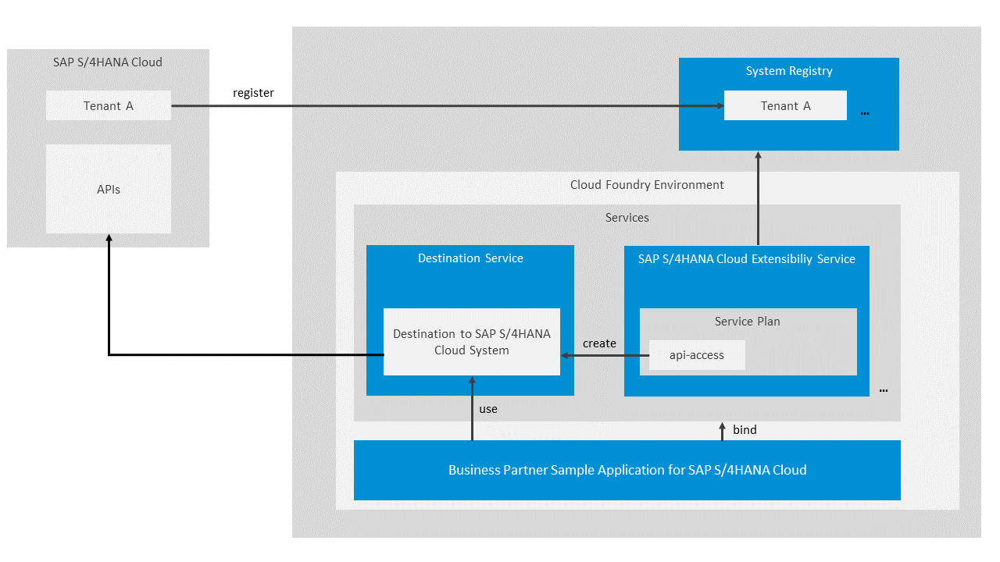


---

### Connect SAP S/4HANA Cloud to SAP BTP


To do that, you must register your SAP S/4HANA Cloud system in your global account in SAP BTP. During this process, an integration token is created and then used by the SAP S/4HANA Cloud system tenant administrator to configure the integration on the SAP S/4HANA Cloud system side.

1. In the SAP BTP cockpit, navigate to your global account, and then choose **System Landscape**.

2. In the **Systems** tab, choose **Add System**.

    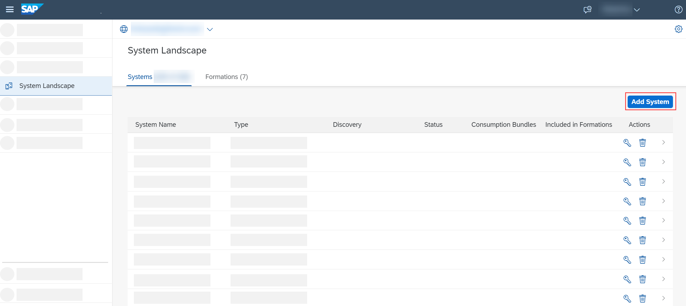

3. In the **Add System** dialog box:

    - Enter a name for the system you want to register.

        >Use only printable ASCII characters.

        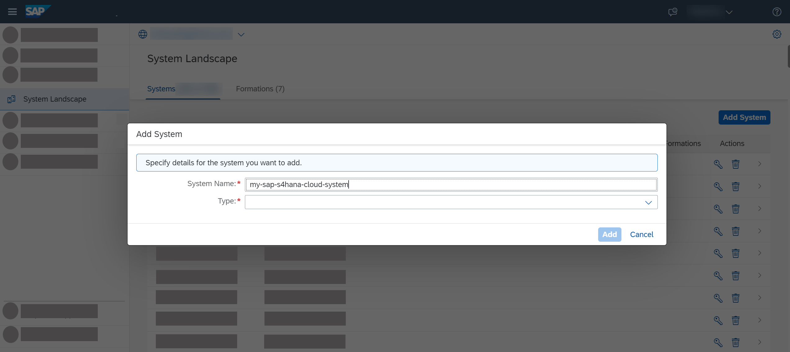

    - In the **Type** dropdown list, select the system type.

        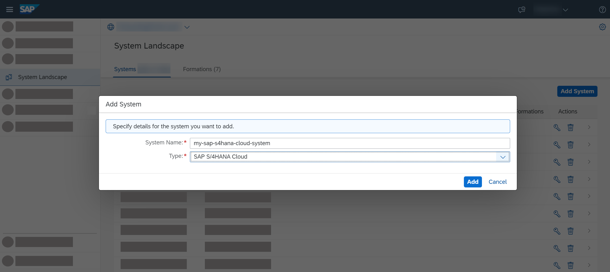

    - Choose **Add**.

        > SAP BTP generates an integration token that the tenant administrator of the extended SAP S/4HANA Cloud system uses when configuring the integration between your SAP S/4HANA Cloud system and the cloud platform on the respective SAP S/4HANA Cloud system side.

4. To get a token to register this system with global account, choose **Get Token**. You need it for configuring the integration on the extended SAP S/4HANA Cloud system side.

5. Copy the registration token and close the dialog box.

    > The SAP S/4HANA Cloud system appears in the list of added systems. Its status is **Pending** because the registration process is not yet completed.


### Trigger registration in SAP S/4HANA Cloud tenant


1. Log on to the SAP S/4HANA Cloud tenant, go to the **Home** > **Communication Management** tab page, and then choose the **Maintain Extensions on SAP BTP** tile.

2. On the **Maintain Extensions on SAP BTP** screen, choose **New** in the **Integrations** section.

3. In the **Integration Token** field, enter the content of the integration token you have copied in the SAP BTP cockpit.

    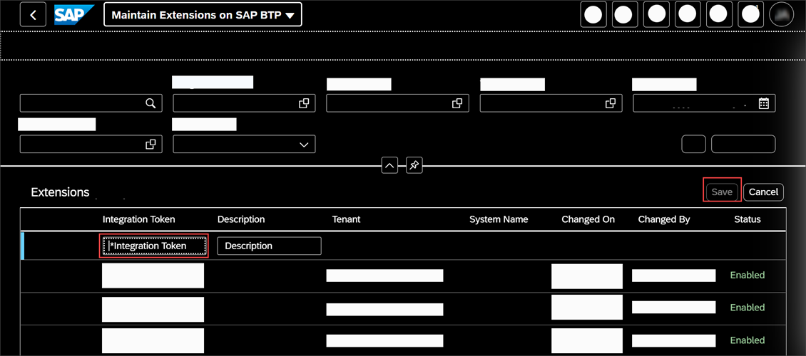

4. Choose **Save**.

    > A new entry with status **Enabling** appears in the table.

5. After the integration has finished successfully, you can refresh the table.

    > The status of the integration should have changed to **Enabled**.

6. In the SAP BTP cockpit, check the status of the registration process. To do so, navigate to your global account, and on the **System Landscape** page, check if the status of the SAP system has changed to **Registered**.

    > If you are already on the **System Landscape** page, refresh the page to check if the status has changed.

    > You can register a system only once with the same name per global account.

    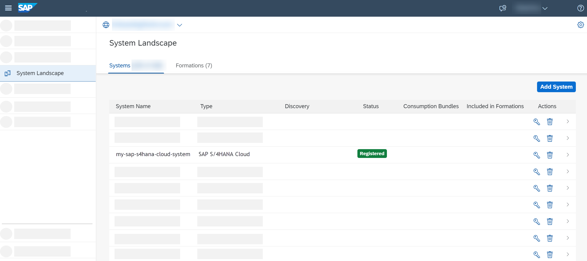


### Make SAP S/4HANA Cloud system accessible in your subaccount


You need to configure the entitlements for the subaccount where the **business partner sample application for SAP S/4HANA Cloud** will be deployed and assign the *api-access* service plan for the SAP S/4HANA Cloud Extensibility service instance to the system you registered in the previous step.

1. In the SAP BTP cockpit, navigate to your global account.

2. In the navigation area, choose **Entitlements** > **Entity Assignments**.

3. Select your subaccount from the **Select Entities:** drop down menu, and then choose **Go**.

    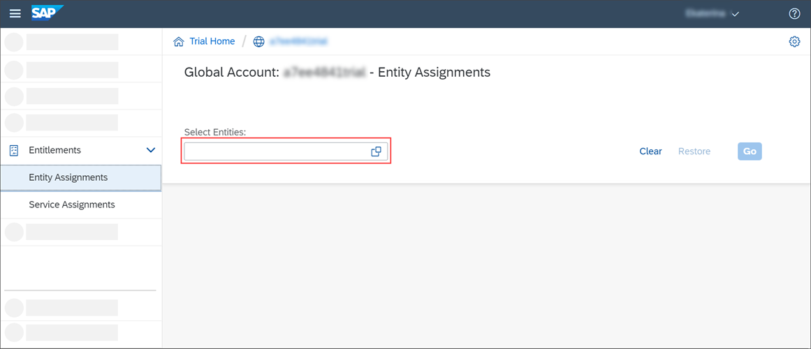

4. Choose **Configure Entitlements**.

    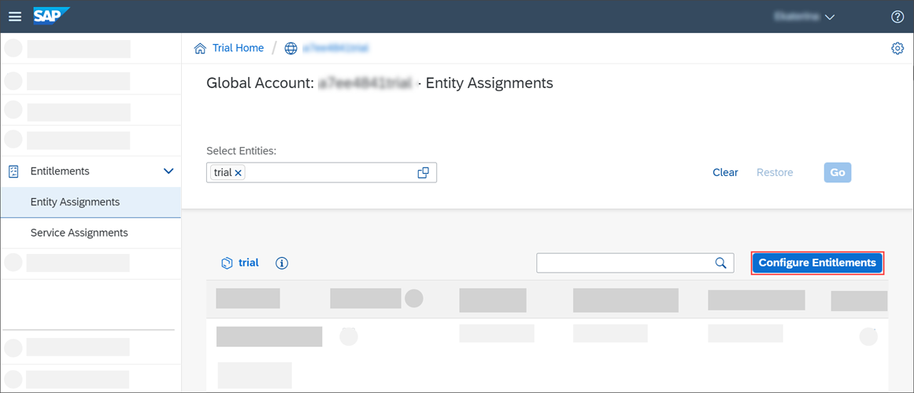

5. Choose **Add Service Plans**, and then select the **SAP S/4HANA Cloud Extensibility** service.

    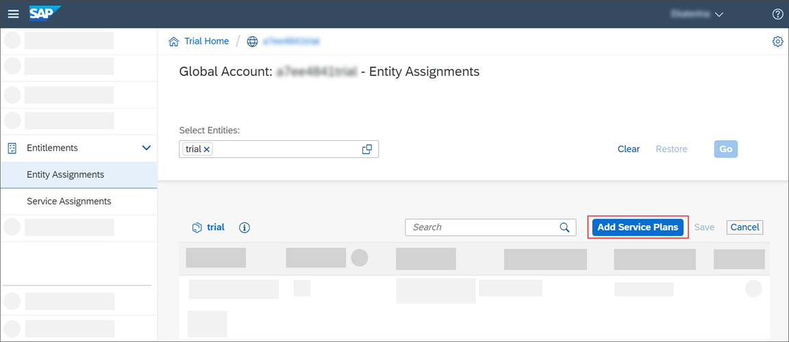

6. In the **Available Service Plans** area, select the system you have registered and the **api-access** service plan, and then choose **Add Service Plan**.

    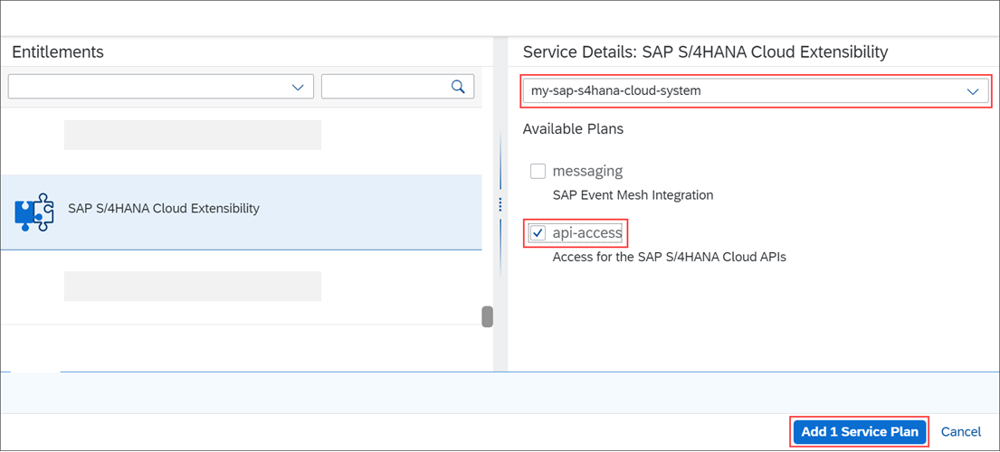

7. Save the changes.


### Configure entitlements for SAP BTP, Cloud Foundry runtime


1. Make sure you are logged on to SAP BTP cockpit as a Cloud Foundry administrator.

2. In your trial global account, choose **Entitlements** > **Entity Assignments**.

3. If there is no entry for the Cloud Foundry runtime, choose **Configure Entitlements**, and then **Add Service Plans**.

4. In the popup, proceed as follows:

    - Choose **Cloud Foundry Runtime**.

    - Under **Available Service Plans**, select the **MEMORY** checkbox.

    - Choose **Add 1 Service Plan**.

    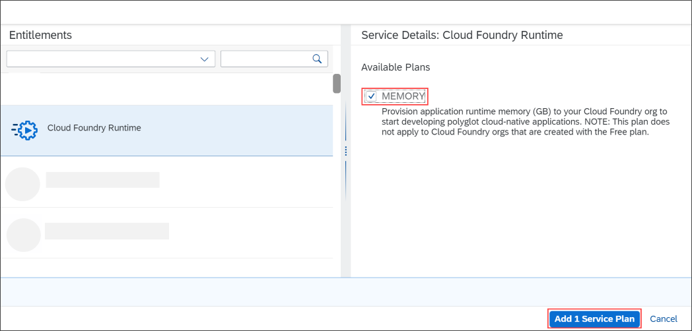

5. On the **Entity Assignments** screen, choose **+** on the **SAP S/4HANA Cloud Extensibility** service row to add at least 1 quota to the subaccount, and then choose **Save**.


### Clone sample application from GitHub


1. Clone the GitHub repository:

    ```Git
    git clone https://github.com/SAP/business-partner-sample-app-s4hana-cloud
    ```

2. In the root of the project, locate the **s4-hana-cloud.json** file, and replace the values of the following parameters:

    - `systemName`

    Enter the name of the system you registered in step 1.

    - `communicationArrangementName`

    Enter a name for the communication arrangement. The name you specify here will be the same name of the communication arrangement that is going to be automatically created in your SAP S/4HANA Cloud tenant.

3. In the root of the project locate the **vars.yml** file and replace the values of the following parameters:

    - `ID`.

    Enter your user in SAP BTP. It is either an S-user, a P-user, or a trial user.

    - `REGION_HOST`.

    Enter **`eu10.hana.ondemand.com`** for the trial global account in SAP BTP. To check the `<region_host>`, go to the SAP BTP cockpit, navigate to the subaccount, go to **Overview** and copy the API endpoint from the **Cloud Foundry** section, and remove the `https://api.cf.`

4. Open a console and navigate to the root folder of the project that is created on you local file system after cloning the GitHub repository.

    ```Shell
    cd <root folder of the project>
    ```

5. Build the application. To do so, use the following command:

    ```Shell
    mvn clean install
    ```


### Create Destination service instance


To connect the **business partner sample application for SAP S/4HANA Cloud** to your SAP S/4HANA Cloud tenant, you use a destination. For that, you first need to create a Destination service instance using the *lite* service plan.

[OPTION BEGIN [SAP BTP Cockpit]]

1. In the cockpit, navigate to your subaccount, choose **Service Marketplace**, and on the **Service Marketplace** screen, search for the **Destination service**.

2. From the **Destination** service tile, choose **Create** and follow the steps in the wizard to create the instance.

    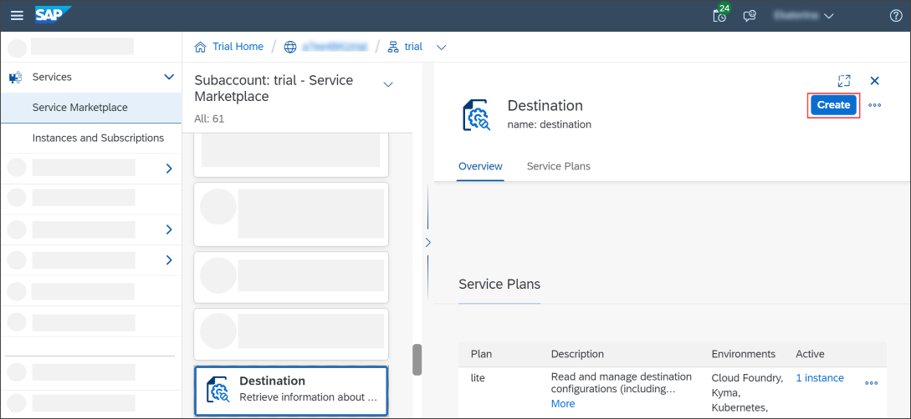

3. On the **Basic Info** step:

    - Make sure to select the **lite** service plan.

    - In the **Runtime Environment** field, choose **`Cloud Foundry`**.

    - In the **Space** field, select the space you are working with.

    - In the **Instance Name** field, enter **`destination`**.

    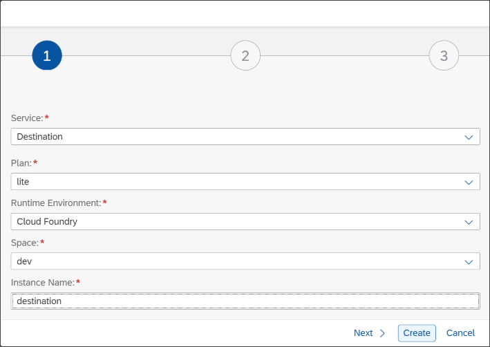

4. On the **Parameters** step, leave the **JSON** field empty.

5. Choose **Create**.

[OPTION END]

[OPTION BEGIN [cf CLI]]

1. Log on to the cf CLI, using this command:

    ```cf CLI
    cf login -a https://api.cf.eu10.hana.ondemand.com
    ```

    The string `https://api.cf.eu10.hana.ondemand.com` represents the \<api_endpoint\> of the trial global account in SAP BTP. To check the \<api_endpoint\>, open the SAP BTP cockpit, navigate to the subaccount, go to **Overview** and copy the API endpoint from the **Cloud Foundry** section.

2. Navigate to your Org by typing in the console the number that corresponds to your Org in the list with Orgs that is displayed after you log on to cf CLI.

3. If you have more than one space, navigate to your space, by typing in the console the number that corresponds to your space in the list with spaces.

    >If you have only one space, you will be redirected to it right after you specify your Org.

4. Create the Destination service instance, use this command:

    ```cf CLI
    cf create-service destination lite destination
    ```

[OPTION END]


### Create SAP S/4HANA Cloud Extensibility service instance


To consume the SAP S/4HANA Cloud APIs, you create an SAP S/4HANA Cloud Extensibility service instance using the *api-access* service plan.

During the service instance creation, an HTTP destination on a subaccount level is automatically generated in this subaccount. You use this destination to establish connection to your SAP S/4HANA Cloud system. When creating the service instance, you configure the communication arrangement and the authentication type for the connection in a JSON file.

[OPTION BEGIN [SAP BTP Cockpit]]

1. In the cockpit, navigate to your subaccount, choose **Service Marketplace**, and on the **Service Marketplace** screen, search for the **SAP S/4HANA Cloud Extensibility** service.

2. From the **SAP S/4HANA Cloud Extensibility** service tile, choose **Create** and follow the steps in the wizard to create the service instance.

    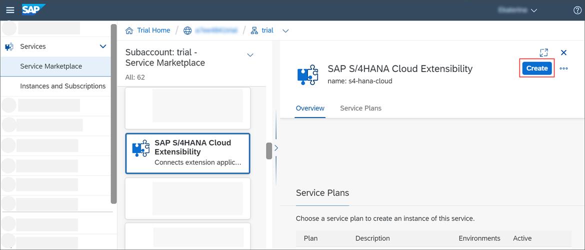

3. On the **Basic Info** step:

    - Make sure to select the **api-access** service plan.

    - In the **Runtime Environment** field, choose **`Cloud Foundry`**.

    - In the **Space** field, select the space you are working with.

    - In the **System Name** field, select your registered SAP S/4HANA Cloud system.

    - In the **Instance Name** field, enter **`s4-hana-cloud`**.

    

4. On the **Parameters** step, upload the `s4-hana-cloud.json` file.

    

5. Choose **Create**.

[OPTION END]

[OPTION BEGIN [cf CLI]]

1. Log on to the cf CLI, using this command:

    ```cf CLI
    cf login -a https://api.cf.eu10.hana.ondemand.com
    ```

    The string `https://api.cf.eu10.hana.ondemand.com` represents the \<api_endpoint\> of the trial global account in SAP BTP. To check the \<api_endpoint\>, open the SAP BTP cockpit, navigate to the subaccount, go to **Overview** and copy the API endpoint from the **Cloud Foundry** section.

2. Navigate to your Org by typing in the console the number that corresponds to your Org in the list with Orgs that is displayed after you log on to cf CLI.

3. If you have more than one space, navigate to your space, by typing in the console the number that corresponds to your space in the list with spaces.

    >If you have only one space, you will be redirected to it right after you specify your Org.

4. Create the SAP SuccessFactors Extensibility service instance, use this command:

    ```cf CLI
    cf create-service s4-hana-cloud api-access s4-hana-cloud -c s4-hana-cloud.json
    ```

[OPTION END]


### Create SAP Authorization & Trust Management service instance


To configure the **business partner sample application for SAP S/4HANA Cloud** authentication, you create an Authorization and Trust management service instance with **application** service plan.

[OPTION BEGIN [SAP BTP Cockpit]]

1.  In the cockpit, navigate to your subaccount, choose **Service Marketplace**, and on the **Service Marketplace** screen, search for the **Authorization & Trust Management** service.

2. From the **Authorization & Trust Management** service tile, choose **Create** and follow the steps in the wizard to create the service instance.

    <!-- border -->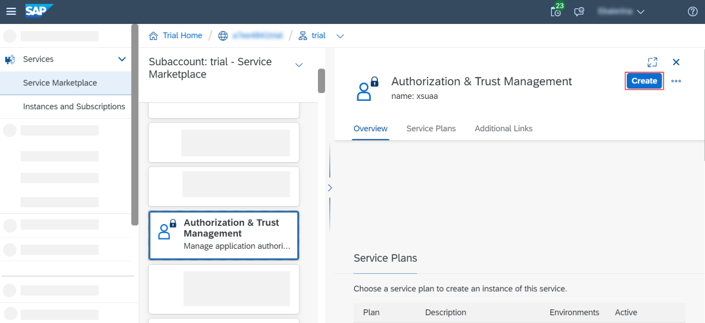

3. On the **Basic Info** step:

    - Make sure to select the **application** service plan.

    - In the **Runtime Environment** field, choose **`Cloud Foundry`**.

    - In the **Space** field, select the space you are working with.

    - In the **Instance Name** field, enter **`xsuaa`**.

    <!-- border -->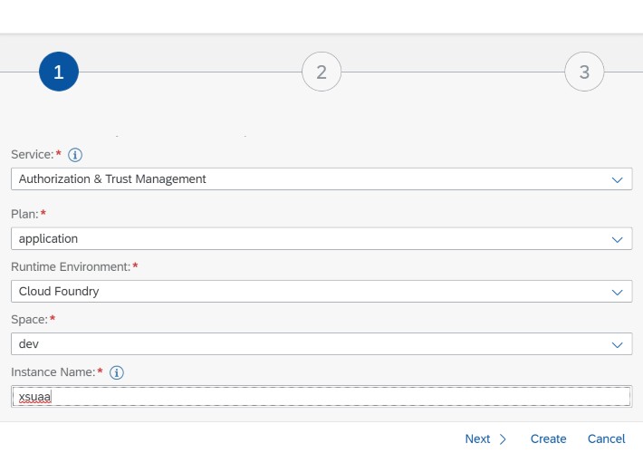

4. On the **Parameters** step, upload the `xsuaa.json` file located in the root folder of the `s4hana-cloud-ext-business-partner` project.

    <!-- border -->

[OPTION END]

[OPTION BEGIN [cf CLI]]

1. Log on to the cf CLI, using this command:

    ```cf CLI
    cf login -a https://api.cf.eu10.hana.ondemand.com
    ```

    The string `https://api.cf.eu10.hana.ondemand.com` represents the \<api_endpoint\> of the trial global account in SAP BTP. To check the \<api_endpoint\>, open the SAP BTP cockpit, navigate to the subaccount, go to **Overview** and copy the API endpoint from the **Cloud Foundry** section.

2. Navigate to your Org by typing in the console the number that corresponds to your Org in the list with Orgs that is displayed after you log on to cf CLI.

3. If you have more than one space, navigate to your space, by typing in the console the number that corresponds to your space in the list with spaces.

    >If you have only one space, you will be redirected to it right after you specify your Org.

4. Create the Authorization & Trust Management service instance, use this command:

    ```cf CLI
    cf create-service xsuaa application xsuaa -c xsuaa.json
    ```

[OPTION END]


### Deploy and run sample application


 You use Cloud Foundry Command Line Interface (cf CLI) to deploy and run the **business partner sample application for SAP S/4HANA Cloud**.

1. Log on to the cf CLI, using the following command:

    ```cf CLI
    cf login -a <api_endpoint>
    ```

    For the `<api_endpoint>`, go to the SAP BTP cockpit, navigate to the subaccount, go to the **Overview** page and copy the API endpoint from the Cloud Foundry section. For example `https://api.cf.eu10.hana.ondemand.com` is the \<api_endpoint\> of the trial global account in SAP BTP.


2. Navigate to your Org by typing in the console the number that corresponds to your Org in the list with Orgs that is displayed after you log on to cf CLI.

3. If you have more than one space, navigate to your space, by typing in the console the number that corresponds to your space in the list with spaces.

    >If you have only one space, you will be redirected to it right after you specify your Org.

4. In the cf CLI, push the **vars.yml** file using the following command:

    ```cf CLI
    cf push --vars-file vars.yml
    ```


### Test sample application


1. In the SAP BTP cockpit, navigate to **<your_Cloud Foundry_space>** > **Applications**, and then choose the **approuter-business-partners** link to go to the **Overview** page for the application.

2. On the **approuter-business-partners - Overview** page, choose the URL in the **Application Routes** screen area to open the application in your browser.

3. The **Business Partner Center** page opens in your browser and a list of business partners is displayed.


---
