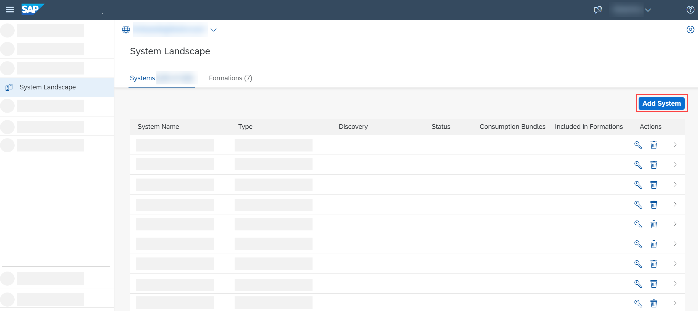
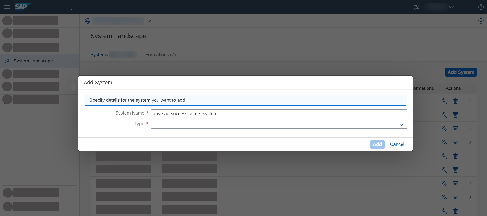
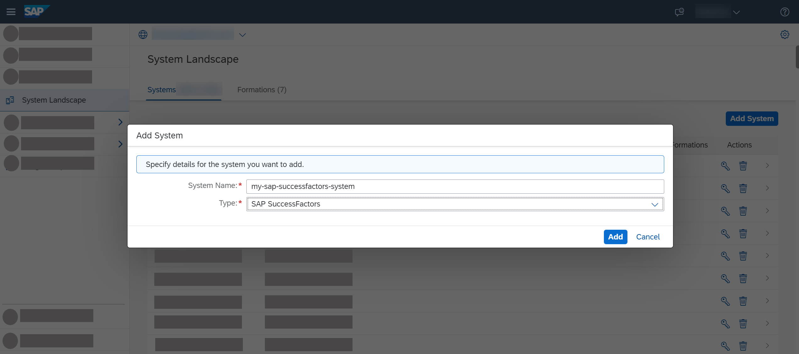
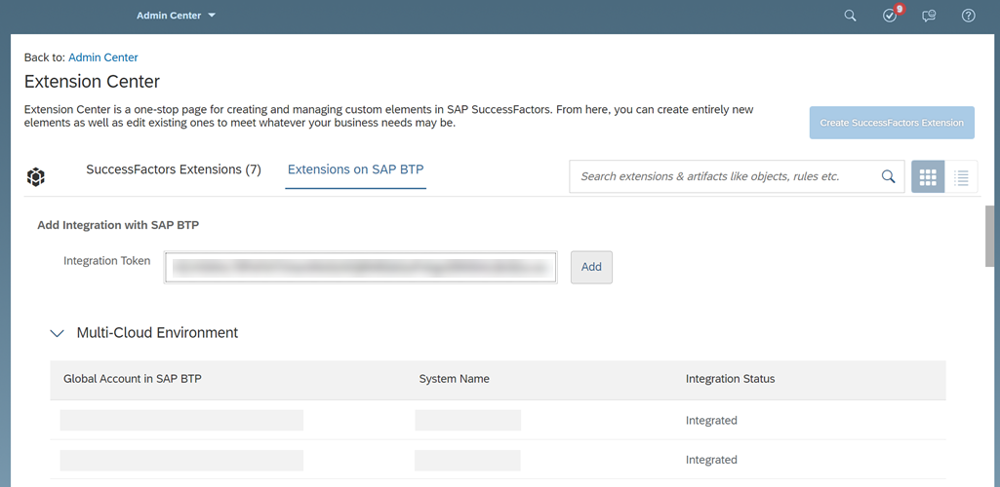
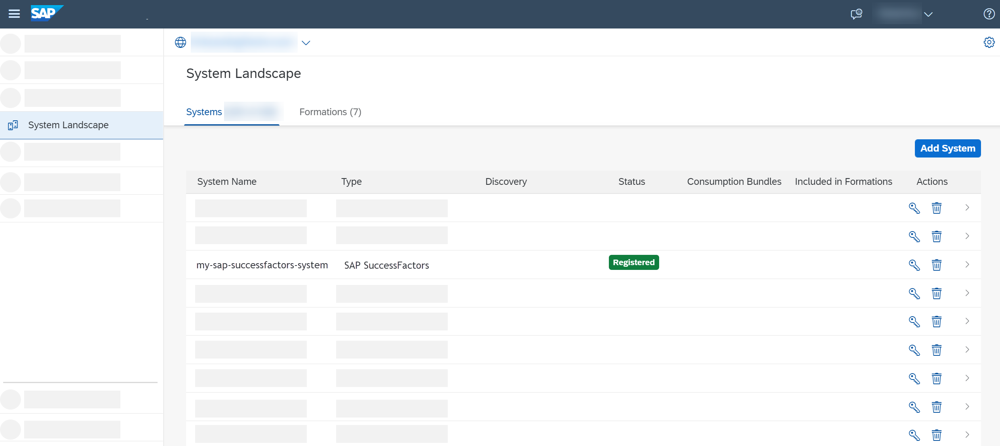

# Extend SAP SuccessFactors on SAP BTP, Cloud Foundry Environment
<!-- description --> Extend SAP SuccessFactors with the task management sample application for SAP SuccessFactors solutions running on SAP BTP, Cloud Foundry environment using automated integration configuration.

## Prerequisites
 - Tools:
    - [JDK 8](https://www.oracle.com/java/technologies/javase/8all-relnotes.html) or later versions up to JDK 15
    - [Maven 3.0.x](http://maven.apache.org/docs/3.0.5/release-notes.html) or later
    - [Cloud Foundry Command Line Interface (cf CLI)](https://help.sap.com/viewer/65de2977205c403bbc107264b8eccf4b/Cloud/en-US/4ef907afb1254e8286882a2bdef0edf4.html?q=cf%20CLI)
    - [git](https://git-scm.com/download/)
 - On SAP BTP side:
    - You have a [global account](https://help.sap.com/docs/BTP/65de2977205c403bbc107264b8eccf4b/d61c2819034b48e68145c45c36acba6e.html#loiod61c2819034b48e68145c45c36acba6e) in SAP BTP.
    - You have an S-user or P-user. See [User and Member Management](https://help.sap.com/viewer/65de2977205c403bbc107264b8eccf4b/Cloud/en-US/cc1c676b43904066abb2a4838cbd0c37.html?q=user).
    - You are an administrator of the global account where you want to register your SAP SuccessFactors system.
    - You have enabled the Cloud Foundry capabilities for your subaccount in SAP BTP.
 - On SAP SuccessFactors side:
    - You have a dedicated SAP SuccessFactors company instance.
    - You have a user with permissions to access Extension Center in SAP SuccessFactors Admin Center that include the Manage Extensions on SAP BTP permissions. See the **Prerequisites** section at [Register an SAP SuccessFactors System in a Global Account in SAP BTP](https://help.sap.com/products/BTP/65de2977205c403bbc107264b8eccf4b/e956ba209f30447cb55140e38c15e345.html)

## You will learn
- How to extend the functionality of your SAP SuccessFactors system to manage different HR tasks
- How to integrate an SAP SuccessFactors system to a global account in SAP BTP using automated configurations
- How to adjust the single sign-on between the subaccount in SAP BTP and the SAP SuccessFactors system using a SAML identity provider to ensure the required security for accessing the extension application

## Intro
You can extend the functionality of your SAP SuccessFactors system with an extension application deployed in a subaccount in SAP Business Technology Platform (SAP BTP) and at the same time fully integrated in your SAP SuccessFactors system.

In this tutorial, you use the **task management sample application for SAP SuccessFactors solutions** is to learn some best practices when building SAP SuccessFactors extension applications on SAP BTP. We recommend to use this sample application only as a proof of concept and a starting point for implementing extensions.

Using this application, you can:

 - Manage different tasks related to human resources (HR), and send them for approval to your colleagues
 - Move the employees in your company from one job title to another.
 - Approve the transfer of employees between positions and departments.
 - Hire new colleagues.

 The following diagram shows the technical components that take part in this scenario.

 

---

### Connect SAP SuccessFactors to SAP BTP


To do that, you must register your SAP SuccessFactors system in your global account in SAP BTP. During this process, an integration token is created and then used by the SAP SuccessFactors system tenant administrator to configure the integration on the SAP SuccessFactors system side.

1. In the SAP BTP cockpit, navigate to your global account, and then choose **System Landscape**.

2. In the **Systems** tab, choose **Add System**.

    

3. In the **Add System** dialog box:

    - Enter a name for the system you want to register.

        > Use only printable ASCII characters.

        

    - In the **Type** dropdown list, select the system type.

        

    - Choose **Add**.
    > SAP BTP generates an integration token that the tenant administrator of the extended SAP SuccessFactors system uses on the respective SAP SuccessFactors system side when configuring the integration between your SAP SuccessFactors system and the global account in SAP BTP.

4. To get a token to register this system with global account, choose **Get Token**. You need it for configuring the integration on the extended SAP SuccessFactors system side.

5. Copy the registration token and close the dialog box.

> The SAP SuccessFactors system appears in the list of added systems. Its status is **Pending** because the registration process is not yet completed.


### Trigger registration in SAP SuccessFactors company


1. In **SAP SuccessFactors Admin Center**, navigate to **Extension Center**.

>If you do not have permissions to access the Extension Center for the corresponding SAP SuccessFactors system, you need to send the integration token to a user with such permissions who will configure the integration on the SAP SuccessFactors system side.

2. On the **Extensions on SAP BTP** tab page, navigate to the **Add Integration with SAP BTP** screen area, and paste the integration token in the **Integration Token** input field.

    

3. Choose **Add**.

>The system appears in the integration list in the **Multi-Cloud Environment** screen area, and the status of the integration is displayed in the **Integration Status** column. To refresh the status of the process, choose the **Check Status** icon. Wait for the integration to finish.

6. In the SAP BTP cockpit, check the status of the registration process. To do so, navigate to your global account, and on the **System Landscape** page, check if the status of the SAP system has changed to **Registered**.

> If you are already on the **System Landscape** page, refresh the page to check if the status has changed.

> You can register a system only once with the same name per global account.




### Make SAP SuccessFactors accessible in your subaccount


You need to configure the entitlements for the subaccount where the **task management sample application for SAP SuccessFactors solutions** will be deployed and assign the *api-access* and the *sso-configuration* service plans for the SAP SuccessFactors Extensibility service instance to the system you registered in the previous step.

1. In the SAP BTP cockpit, navigate to your global account.

2. In the navigation area, choose **Entitlements** > **Entity Assignments**.

3. Select your subaccount from the **Select Entities:** drop down menu, and then choose **Go**.

    

4. Choose **Configure Entitlements**.

    

5. Choose **Add Service Plans**, and then select the **SAP SuccessFactors Extensibility** service.

    

6. In the **Available Service Plans** area, select the system you have registered. Then, select  **api-access** and **sso-configuration** service plans, and choose **Add 2 Service Plans**.

7. Save the changes.


### Configure entitlements for SAP BTP, Cloud Foundry runtime


1. Make sure you are logged on to SAP BTP cockpit as a Cloud Foundry administrator.

2. In your trial global account, choose **Entitlements** > **Entity Assignments**.

3. If there is no entry for the Cloud Foundry runtime, choose **Configure Entitlements**, and then **Add Service Plans**.

4. In the popup, proceed as follows:

    - Choose **Cloud Foundry Runtime**.

    - Under **Available Service Plans**, select the **MEMORY** checkbox.

    - Choose **Add 1 Service Plan**.

    

5. On the **Entity Assignments** screen, choose **+** on the **Cloud Foundry Runtime** service row to add at least 1 quota to the subaccount, and then choose **Save**.


### Clone extension application from GitHub


1. Clone the GitHub repository:

    ```Git
    git clone https://github.com/SAP/task-management-sample-app-sfsf-solutions
    ```

2. Configure the details of the SAP SuccessFactors system to which you will connect.

    To do so, in the root of the project locate the `sap-successfactors-extensibility.json` file and replace the value of the `systemName` parameter with the system name of the system you registered in **Step&nbsp;1**.

3. In the root of the project locate the `vars.yml` file and replace the values of the following parameters:

    - `ID`. Enter your user in SAP BTP. It is either an S-user, a P-user, or a trial user.

    - `REGION_HOST`. Enter **`eu10.hana.ondemand.com`**. To check the `<region_host>`, go to the SAP BTP cockpit, navigate to the subaccount, go to **Overview** and copy the API endpoint from the **Cloud Foundry** section, and remove the `https://api.cf.`

4. Open a console and navigate to the root folder of the project that is created on you local file system after cloning the GitHub repository.

    `cd <root folder of the project>`

5. Build the application. To do so, use the following command:

    `mvn clean install`


### Create Destination service instance


To connect the **task management sample application for SAP SuccessFactors solutions** to your SAP SuccessFactors company, you use a destination. For that, you first need to create a   Destination service instance using the *lite* service plan.

[OPTION BEGIN [SAP BTP Cockpit]]

1. In the cockpit, navigate to your subaccount, choose **Services** > **Service Marketplace**, and on the **Service Marketplace** screen, search for the **Destination** service.

2. From the **Destination** service tile, choose **Create** and follow the steps in the wizard to create the instance.

    

3. On the **Basic Info** step:

    - Make sure to select the **lite** service plan.

    - In the **Runtime Environment** field, choose **`Cloud Foundry`**.

    - In the **Space** field, select the space you are working with.

    - In the **Instance Name** field, enter **`destination`**.

4. On the **Parameters** step, leave the **JSON** field empty.

5. Choose **Create**.

    

[OPTION END]

[OPTION BEGIN [cf CLI]]

1. Log on to the cf CLI, using this command:

    ```
    cf login -a https://api.cf.eu10.hana.ondemand.com
    ```

    The string `https://api.cf.eu10.hana.ondemand.com` represents the \<api_endpoint\>. To check it, open the SAP BTP cockpit, navigate to the subaccount, go to **Overview** and copy the API endpoint from the **Cloud Foundry** section.

2. Navigate to your Org by typing in the console the number that corresponds to your Org in the list with Orgs that is displayed after you log on to cf CLI.

3. If you have more than one space, navigate to your space, by typing in the console the number that corresponds to your space in the list with spaces.

    >If you have only one space, you will be redirected to it right after you specify your Org.

4. Create the Destination service instance, use this command:

    `cf create-service destination lite destination`

[OPTION END]


### Create SAP SuccessFactors Extensibility service instance


To consume the SAP SuccessFactors APIs, you create an SAP SuccessFactors Extensibility service instance using the *api-access* service plan.

During the service instance creation, an HTTP destination on a subaccount level is automatically generated in this subaccount. You use this destination to establish connection to your SAP SuccessFactors system.

[OPTION BEGIN [SAP BTP Cockpit]]

1. In the cockpit, navigate to your subaccount, choose **Services** > **Service Marketplace**, and on the **Service Marketplace** screen, search for the **SAP SuccessFactors Extensibility** service.

2. From the **SAP SuccessFactors Extensibility** service tile, choose **Create** and follow the steps in the wizard to create the service instance.

    

3. On the **Basic Info** step:

    - Make sure to select the **api-access** service plan.

    - In the **Runtime Environment** field, choose **`Cloud Foundry`**.

    - In the **Space** field, select the space you are working with.

    - In the **System Name** field, select your registered SAP SuccessFactors system.

    - In the **Instance Name** field, enter **`sap-successfactors-extensibility`**.

    

4. On the **Parameters** step, the JSON file is preconfigured. Choose **Next.**

    

5. Choose **Create**.

[OPTION END]

[OPTION BEGIN [cf CLI]]

1. Log on to the cf CLI, using this command:

    ```
    cf login -a https://api.cf.eu10.hana.ondemand.com
    ```

    The string `https://api.cf.eu10.hana.ondemand.com` is the \<api_endpoint\>. To check it, open the SAP BTP cockpit, navigate to the subaccount, go to **Overview** and copy the API endpoint from the **Cloud Foundry** section.

2. Navigate to your Org by typing in the console the number that corresponds to your Org in the list with Orgs that is displayed after you log on to cf CLI.

3. If you have more than one space, navigate to your space, by typing in the console the number that corresponds to your space in the list with spaces.

    >If you have only one space, you will be redirected to it right after you specify your Org.

4. Create the SAP SuccessFactors Extensibility service instance, use this command:

    `cf create-service sap-successfactors-extensibility api-access sap-successfactors-extensibility -c sap-successfactors-extensibility.json`

[OPTION END]


### Create SAP Authorization & Trust Management service instance


To configure the authentication for the **task management sample application for SAP SuccessFactors solutions**, you create an Authorization and Trust management service instance with **application** service plan.

[OPTION BEGIN [SAP BTP Cockpit]]

1.  In the cockpit, navigate to your subaccount, choose **Services** > **Service Marketplace**, and on the **Service Marketplace** screen, search for the **Authorization & Trust Management** service.

2. From the **Authorization & Trust Management** service tile, choose **Create** and follow the steps in the wizard to create the service instance.

    

3. On the **Basic Info** step:

    - Make sure to select the **application** service plan.

    - In the **Runtime Environment** field, choose **`Cloud Foundry`**.

    - In the **Space** field, select the space you are working with.

    - In the **Instance Name** field, enter **`xsuaa`**.

    

4. On the **Parameters** step, upload the `xsuaa.json` file.

    

5. Choose **Create**.

[OPTION END]

[OPTION BEGIN [cf CLI]]

1. Log on to the cf CLI, using this command:

    ```
    cf login -a https://api.cf.eu10.hana.ondemand.com
    ```

    The string `https://api.cf.eu10.hana.ondemand.com` represents the \<api_endpoint\>. To check it, open the SAP BTP cockpit, navigate to the subaccount, go to **Overview** and copy the API endpoint from the **Cloud Foundry** section.

2. Navigate to your Org by typing in the console the number that corresponds to your Org in the list with Orgs that is displayed after you log on to cf CLI.

3. If you have more than one space, navigate to your space, by typing in the console the number that corresponds to your space in the list with spaces.

    >If you have only one space, you will be redirected to it right after you specify your Org.

4. Create the Authorization & Trust Management service instance, use this command:

    `cf create-service xsuaa application xsuaa -c xsuaa.json`

[OPTION END]


### Deploy and run the extension application


You have to use **Cloud Foundry Command Line Interface (cf CLI)** to deploy and run the **task management sample application for SAP SuccessFactors solutions**.

1. Open a console and navigate to the root folder of the project in local file system.

    `cd <root folder of the project>`

2. Log on to the cf CLI, using this command:

    ```Git
    cf login -a https://api.cf.eu10.hana.ondemand.com
    ```

    The value `https://api.cf.eu10.hana.ondemand.com` represents the \<api_endpoint\>. To check it, go to the SAP BTP cockpit, navigate to the subaccount, go to **Overview** and copy the API endpoint from the **Cloud Foundry** section. See [Log On to the Cloud Foundry Environment Using the Cloud Foundry Command Line Interface](https://help.sap.com/viewer/65de2977205c403bbc107264b8eccf4b/Cloud/en-US/7a37d66c2e7d401db4980db0cd74aa6b.html).

3. Navigate to your Org by typing in the console the number that corresponds to your Org in the list with Orgs that is displayed after you log on to cf CLI.  

4. If you have more than one space, navigate to your space, by typing in the console the number that corresponds to your space in the list with spaces.

    >If you have only one space, you will be redirected to it right after you specify your Org.

5. In the cf CLI push the `vars.yml` file using this command:

    `cf push --vars-file vars.yml`


### Establish trust between SAP SuccessFactors and SAP BTP


To ensure the required security for accessing the applications, you need to configure the single sign-on between the subaccount in SAP BTP and the SAP SuccessFactors system using a SAML identity provider. The single sign-on requires both solutions to be configured as trusted SAML service providers for the identity provider, and at the same time, the identity provider to be configured as trusted identity provider for the two solutions.

1. Download SAML metadata from the SAP SuccessFactors system.

    - Go to `https://<sap_successfactors_system>/idp/samlmetadata?company=<company_id>&cert=sha2` where:

	    - `<sap_successfactors_system>` is the hostname of your SAP SuccessFactors system

	    - `<company_id>` is the ID of your SAP SuccessFactors company

    - When you are prompted, save the file on your local file system and change its extension to `.xml`.

2. Register the SAP SuccessFactors identity provider in the SAP BTP cockpit.

    - Open the cockpit and navigate to your subaccount.

    - Choose **Security** > **Trust Configuration**.

    - Choose **New Trust Configuration**.

        

    - To upload the SAML metadata you downloaded in step 1, choose **Upload**. Browse to the XML file you saved and select it. Some of the fields are automatically filled in.

        

    - In the **Name** field, enter a meaningful name for the trust configuration.

    - Save the changes.

3. Make the trust configuration to the SAP SuccessFactors identity provider the only configuration that is available for user logon. To do that, edit all other configurations and unselect the **Available for User Logon** checkbox. Save the change.

    

See [Establish Trust Between SAP SuccessFactors and SAP BTP](https://help.sap.com/viewer/65de2977205c403bbc107264b8eccf4b/Cloud/en-US/80a3fd16d144454fbe08377d284e3c37.html).


### Configure the subaccount as a trusted service provider in SAP SuccessFactors


To configure the subaccount as a trusted service provider in SAP SuccessFactors, you have to create an **SAP SuccessFactors Extensibility** service instance using the **sso-configuration** service plan.

1. In the SAP BTP cockpit, navigate to the subaccount in which you want to configure as a trusted service provider in SAP SuccessFactors.

2. In the navigation area, choose **Services** > **Service Marketplace**, and on the **Service Marketplace** screen, search for the **SAP SuccessFactors Extensibility** service.

3. In the **SAP SuccessFactors Extensibility** page, choose **Create**.

4. In the **New Instance or Subscription** wizard:

  * In the **Service** dropdown list, ensure you have selected the **SAP SuccessFactors Extensibility** service.
  * In the **Plan** dropdown list, select the **sso-configuration** service plan.
  * In the **Runtime Environment** dropdown list, select **Other**.
  * In the **Instance Name** field, enter a name for your instance, for example **sso-to-successfactors**. Choose **Next**.
  * To configure the assertion consumer service of the subaccount, specify the system name in the JSON file:
    `{"systemName": "my-sap-successfactors-system"}`


    For more information about the structure of the JSON file, see [Single Sign-On Configuration JSON File](https://help.sap.com/docs/BTP/65de2977205c403bbc107264b8eccf4b/5ec1e970eb0d417c969f1693da31388f.html).

  * Choose **Next**.

  * Choose **Create**.

You have an assertion consumer service for the subaccount created in SAP SuccessFactors and have the SSO between your subaccount in SAP BTP and your SAP SuccessFactors system.

See [Configure the Subaccount as a Trusted Service Provider in SAP SuccessFactors](https://help.sap.com/docs/BTP/65de2977205c403bbc107264b8eccf4b/9efe2a1d84c2458fb7b68d4df1bd13ee.html).


### Test the extension application


1. In the SAP BTP cockpit, navigate to your subaccount and then to your space.

    Choose **Applications**, and then choose the **approuter-task-management** link to go to the **Overview** page of the application.

2. On the **approuter-task-management - Overview** page, choose the URL in the **Application Routes** screen area to open the application in your browser.

To finish the tutorial, copy the application URL you just opened and paste it in the validation box below:


