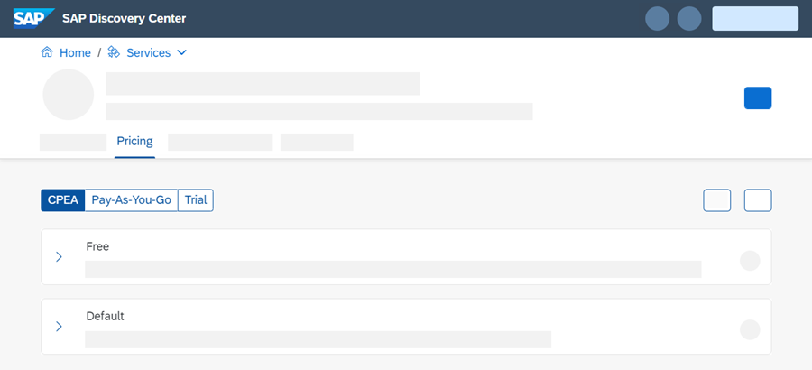

# Manage Entitlements Using the Cockpit
<!-- description --> Configure entitlements and quota using the cockpit. (Free Tier ready)

## Prerequisites
- You have one of the following:
    - **SAP BTP trial account:** You must have registered for a trial account on SAP Business Technology Platform: [Get a Free Trial Account on SAP BTP](hcp-create-trial-account).
    - **SAP BTP consumption based enterprise account:** You have a subaccount for which you want to manage entitlements. If you need help setting up your subaccount, have a look at [Managing Subaccounts Using the Cockpit](https://help.sap.com/viewer/65de2977205c403bbc107264b8eccf4b/Cloud/en-US/55d0b6d8b96846b8ae93b85194df0944.html).

## You will learn
- How to add entitlements to a subaccount

## Intro
You can do this tutorial with trial accounts or enterprise accounts with a global account using cloud management tools feature set B.

If you are in a global account using cloud management tools feature set A, you can also do this tutorial but be aware that some UI elements might be called differently. For more information on the two feature sets, see [Cloud Management Tools — Feature Set Overview](https://help.sap.com/viewer/65de2977205c403bbc107264b8eccf4b/Cloud/en-US/caf4e4e23aef4666ad8f125af393dfb2.html).

If you are in a global account using the consumption-based commercial model, you can even try out services for free. To do that, you have to assign the entitlements using the **free** plan if it is available. Not sure what the consumption-based commercial model is and how it's different from a subscription account? In our documentation, you can find a lot of information on that! Have a look at [Commercial Models](https://help.sap.com/viewer/65de2977205c403bbc107264b8eccf4b/Cloud/en-US/263d40009a5a4237a62e8f5c05ee641e.html).

Every service has its own available plans:

1. Go to [SAP Discovery Center](https://discovery-center.cloud.sap/) to obtain information on which plans are available. To do so, search for the name of the service you are interested in.

2. Select the tile of the service you are interested in.

3. From the available tabs, select **Pricing**. You can now see all Service Plans available (such as **Free**, **Default** / **Standard** or **Trial** service plans). As an example, see the screenshot below.

<!-- border -->

---

### Understanding entitlements and quota

Before you get started, you should understand the difference between entitlements and quota, because you'll encounter these two terms quite often.

- **Entitlements** are your right to provision and consume a resource. They refer to **what** you're entitled to use (for example, which services and service plans).

- **Quota** is the numeric quantity that defines the maximum allowed consumption of that resource. In other words, **how much** of a service plan you're entitled to use.

Entitlements and quota are managed at the global account and directory levels, distributed to directories and subaccounts, and consumed by the subaccounts. See also [Entitlements and Quotas](https://help.sap.com/viewer/65de2977205c403bbc107264b8eccf4b/Cloud/en-US/00aa2c23479d42568b18882b1ca90d79.html).

### Assign entitlements

1. In your global account, navigate to **Entitlements** > **Entity Assignments**.
2. In the **Select Entities** selection, choose the directory or subaccount that you want to assign entitlements to.
3. Select **Go**.

    You'll see a table for the directory/ subaccount with all entitlements it already has.
4. Select **Configure Entitlements** > **Add Service Plans**.

    A popover appears with all entitlements available for your directory/subaccount.

    <!-- border -->

5. Select the service and then the plan you want to entitle.

    > If you are in a global account using the consumption-based commercial model, you can select the service plan called **Free** here to test out the service without any costs.

6. Select the amount of quota you need.
7. Select **Add Service Plans** to exit the popover.
8. Select **Save**.

  **Congrats! You have now successfully configured entitlements.**

---
