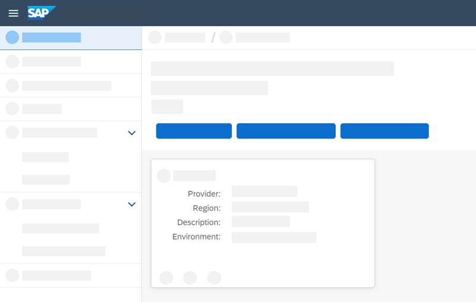
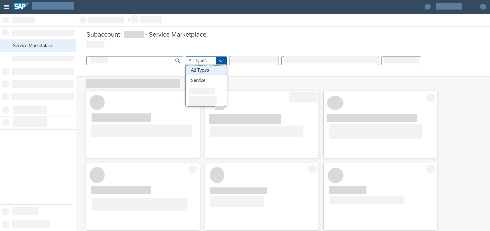
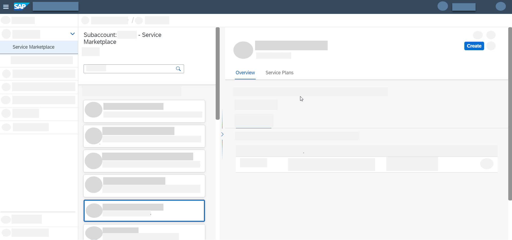

# Create a Service Instance in SAP BTP
<!-- description --> Create a service instance for services, environments and applications in SAP Business Technology Platform.

## Prerequisites
 - If you use a **trial account**, complete the following set-up tutorials first:
    - [Get a Free Account on SAP BTP Trial](hcp-create-trial-account)
    - [Manage Entitlements](cp-trial-entitlements)
 - If you use an **enterprise account**, complete the following set-up tutorials first:
    - [Manage Entitlements](cp-trial-entitlements)

## You will learn
  - How to create a service instance, environment instance, or a subscription in a multi-environment subaccount  

 These three types of entities relate to the three types of SAP BTP offerings:

## Intro
- If you want to consume a **service**, you create a service instance.
- If you want to use an **environment**, you create an environment instance.
- If you want to consume an **application**, you create a subscription to that application.

 The creation process involves a wizard which you start from the **Service Marketplace** page in the SAP BTP cockpit.

 The location from which you access the marketplace is always a subaccount for environment instances and subscriptions and a subaccount or Cloud Foundry space for service instances.

 In this tutorial, we'll demonstrate how to create an instance from a subaccount.

 The main difference between the subaccount and the Cloud Foundry space is that on the subaccount level, the services offered to you aren't those that are only available for the Cloud Foundry environment.

For more information about these SAP BTP entities, see:

- [Creating Service Instances](https://help.sap.com/viewer/09cc82baadc542a688176dce601398de/Cloud/en-US/fad874a99a434ae58c59d7340a528bdc.html)
- [Working with Environment Instances](https://help.sap.com/viewer/09cc82baadc542a688176dce601398de/Cloud/en-US/1d6897d22f90443c8a3f9f6c8bb41bb8.html)
- [Subscribe to Multitenant Applications Using the Cockpit](https://help.sap.com/viewer/65de2977205c403bbc107264b8eccf4b/Cloud/en-US/7a3e39622be14413b2a4df7c02ca1170.html)

---

### Navigate to Service Marketplace

1. Starting from your global account, go to the **subaccount** in which you want to create a service instance.

      <!-- border -->

2. Select **Services** > **Service Marketplace** from the left-hand navigation bar.

### Find the service you want to consume

All offerings that are available for consumption in your subaccount are shown as tiles.

Select **Services** from the filter to get only the service tiles and find the service you want to consume:

<!-- border -->

### Create a service instance

1. You can get information about the selected service and the available plans. Click on the tile. The page expands to show instance details, such as its overview, available documentation, and service plans.

2. Click on **Create** in the upper-right corner.

    <!-- border -->

3. A wizard opens, offering you to configure your new instance.

    > **Make sure to assign the correct plan to avoid creating (additional) costs.** 

    Enter the following information:

    |  Parameter      | Description
    |  :------------- | :-------------
    |  **Service**    | This is where you select the **name** of the respective service with which you want to work. 
&nbsp;
The Services list displays all three types of offerings: services, environments, and applications from the service marketplace.
&nbsp;
The technical name for each item is displayed on the right side of the list. This is how services, environments, or applications are referred to when using the supported APIs or commands for the [SAP BTP Command Line Interface (CLI)](cp-sapcp-getstarted). If an offering can be consumed as both a service and an application, you'll see two technical names next to its commercial name.
&nbsp;
Since you've already selected the service, this field is populated with the desired value.
    |  **Plan**          | Select a **service plan**.
&nbsp;
 Every service has its own available plans. Aside from the information about the plans you get from the service overview page in the SAP BTP cockpit, you can also get more detailed information by performing the following actions:
<ol><li>Go to [SAP Discovery Center](https://discovery-center.cloud.sap/) to obtain information on which plans are available. To do so, search for the name of the product you are interested in.</li><li>Select the tile of the product you are interested in.</li><li>From the available tabs, select **Pricing**. You can now see all Service Plans available (such as **Free**, **Default** / **Standard** or **Trial** service plans). 
&nbsp;
 **Important:** If you want to experience SAP BTP without generating cost, make sure to only enable services with **Free** service plans.</li></ol>As an example, see the screenshot below.

    <!-- border -->

4. Depending on the service and the plan you've selected, you will be asked to add information on the **runtime environment**, **spaces**, and the **instance name**.

5. You can either select **Create** or proceed to step 2 of the wizard.
&nbsp;
Some services provide additional configuration parameters to define in that step. Open the additional info next to **Configure instance parameters** to get more information about the available parameters.

6. Select **Create**. If the creation was successful, the table will be updated accordingly. Once the status bar has jumped from **Processing** to **Subscribed**, you've successfully created a service instance.
&nbsp;
This process might take a moment or two.

### Go to Instances and Subscriptions page

After you've successfully created your service instance, you can proceed by clicking on **Services** > **Instances and Subscriptions** from the left-hand navigation bar.

This opens an overview page on which you can see all the existing instances and subscriptions in your subaccount.

Clicking on the instance row opens an instance overview page to the right.

There, you can find more information about your instance.

<!-- border -->

---
