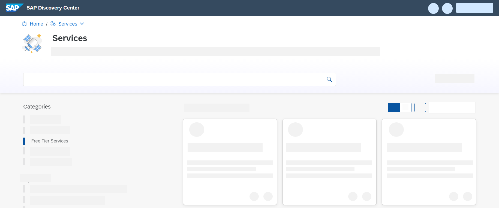

 master
---
title: Get an SAP BTP Account for Tutorials
description: Set up an SAP Business Technology Platform account so you can do the tutorials involving SAP BTP services and applications (trial or free-tier).
time: 5
tags: [ tutorial>beginner, products>sap-business-technology-platform, tutorial>type>free-tier]
primary_tag: products>sap-business-technology-platform
---

## Details
### You will learn
  - How to setup an SAP BTP account for doing the Tutorials

---

[ACCORDION-BEGIN [Step 1: ](Free Trial vs. Free Tier)]

There are a couple of ways to do SAP BTP tutorials and to try out SAP BTP services and applications:

- A **free trial account** for SAP BTP essentially provides you (as an individual) an isolated account and subaccount, with pre-allocated service entitlements for a limited amount of days.

- **Free tier** is not an account but a set of entitlement plans within a consumption-based global account for activating certain services for free. So, say, you want to try out the SAP Launchpad tutorials, but in your company's existing global account -- you can create a new subaccount, activate the SAP Launchpad service in this subaccount using the free plan, create a service instance, and do the tutorials.

    If you activate free tier plans only, you can try out our platform for free, without time limits. You can then easily upgrade to a paid plan without losing your data or work. Creating an instance using a paid plan will incur costs, however.

    A plan limits the quantity of the service that's available.  Maybe you need a lot of some service in a production subaccount, and maybe you need less for development or testing.  When you assign an entitlement to a subaccount, you also select the plan for use in that subaccount as well.

    Many tutorials may require services that are not yet on our list of available free tier service plans. If you want to know which services currently offer free tier service plans, visit the [SAP Discovery Center](https://discovery-center.cloud.sap/#/serviceCatalog?provider=all&regions=all&category=freetierservices) and explore our offerings under **Free Tier Services**.

    !

    >**IMPORTANT** Free tier service plans are not designed for productive use. SAP provides no  associated with free tier services plans either.  If you think you have encountered a runtime issue with a plan, you can ask a question on the [SAP Community Q&A site](https://answers.sap.com/index.html) and tag the appropriate service as part of your question.  SAP product folks monitor these forums, so your request should get proper attention quickly.

      For more information, check out the blog [Exploring BTP's New Free Tier Plans](https://blogs.sap.com/2021/07/01/exploring-btps-new-free-tier-plans) by [Riley Rainey](https://people.sap.com/riley.rainey). And check out more posts and announcements on the [SAP BTP topic page](https://community.sap.com/topics/business-technology-platform) -- there's a quick link there to post your questions, too.

[DONE]
[ACCORDION-END]

[ACCORDION-BEGIN [Step 2: ](Which to choose?)]

Some services are available to try out for free in both free-tier and a trial account, some are available free only in free trial, and some are only available with a paid license.

- If a service is available in both free tier and free trial, which should you choose? The decision may come down to whether your focus is on personal learning (free trial) or a more formal company-sponsored project (free tier).  Both approaches are available to you, and most existing SAP enablement content and code samples will run on both, too.

- For tutorials with services not yet on free tier, you can still use a free trial account.

[DONE]
[ACCORDION-END]

[ACCORDION-BEGIN [Step 2: ](How to set up an account)]

Choose one of the following steps:

- **Free Trial:** If you do not have an account of any type yet and you want to try out services for a limited amount of time, follow the instructions on the tutorial [Get a Free Account on SAP BTP Trial](hcp-create-trial-account).

- **Free Tier:** If you want to explore SAP BTP without time limits, go to [Get an Account on SAP BTP to Try Out Free Tier Service Plans](btp-free-tier-account).

    If your company has an existing consumption-based BTP Global Account, you can explore free tier services there. In such accounts, free tier plans will appear alongside paid service plans in the service marketplace.
    > Note: You will want to consider isolating your tutorial work from normal development and production activity in that global account, and isolating yourself is fairly easy: create a new subaccount. Then add appropriate free service plan entitlements to that subaccount, enable the services, and execute the tutorials there.

Depending on your company's administration policies, you might need to have an authorized BTP administrator perform those tasks for you. In any event, instructions for these tasks are described here:

- [Manage Entitlements Using the Cockpit](btp-cockpit-entitlements)

- [Create a Service Instance for SAP BTP](btp-cockpit-instances)

[DONE]
[ACCORDION-END]

---
=======
---
title: Get an SAP BTP Account for Tutorials
description: Set up an SAP Business Technology Platform account so you can do the tutorials involving SAP BTP services and applications (trial or free-tier).
time: 5
tags: [ tutorial>beginner, products>sap-business-technology-platform, tutorial>type>free-tier]
primary_tag: products>sap-business-technology-platform
---

## Details
### You will learn
  - How to setup an SAP BTP account for doing the Tutorials

---

[ACCORDION-BEGIN [Step 1: ](Free Trial vs. Free Tier)]

There are a couple of ways to do SAP BTP tutorials and to try out SAP BTP services and applications:

- A **free trial account** for SAP BTP essentially provides you (as an individual) an isolated account and subaccount, with pre-allocated service entitlements for a limited amount of days.

- **Free tier** is not an account but a set of entitlement plans within a consumption-based global account for activating certain services for free. So, say, you want to try out the SAP Launchpad tutorials, but in your company's existing global account -- you can create a new subaccount, activate the SAP Launchpad service in this subaccount using the free plan, create a service instance, and do the tutorials.

    If you activate free tier plans only, you can try out our platform for free, without time limits. You can then easily upgrade to a paid plan without losing your data or work. Creating an instance using a paid plan will incur costs, however.

    A plan limits the quantity of the service that's available.  Maybe you need a lot of some service in a production subaccount, and maybe you need less for development or testing.  When you assign an entitlement to a subaccount, you also select the plan for use in that subaccount as well.

    Many tutorials may require services that are not yet on our list of available free tier service plans. If you want to know which services currently offer free tier service plans, visit the [SAP Discovery Center](https://discovery-center.cloud.sap/#/serviceCatalog?provider=all&regions=all&category=freetierservices) and explore our offerings under **Free Tier Services**.

    !

    >**IMPORTANT:**

    >Free tier service plans are not designed for productive use. SAP provides no associated support with free tier services plans either.  If you think you have encountered a runtime issue with a plan, you can ask a question on the [SAP Community Q&A site](https://answers.sap.com/index.html) and tag the appropriate service as part of your question.  SAP product folks monitor these forums, so your request should get proper attention quickly.

    For more information, check out the blog [Exploring BTP's New Free Tier Plans](https://blogs.sap.com/2021/07/01/exploring-btps-new-free-tier-plans) by [Riley Rainey](https://people.sap.com/riley.rainey). And check out more posts and announcements on the [SAP BTP topic page](https://community.sap.com/topics/business-technology-platform) -- there's a quick link there to post your questions, too.

[DONE]
[ACCORDION-END]

[ACCORDION-BEGIN [Step 2: ](Which to choose?)]

Some services are available to try out for free in both free-tier and a trial account, some are available free only in free trial, and some are only available with a paid license.

- If a service is available in both free tier and free trial, which should you choose? The decision may come down to whether your focus is on personal learning (free trial) or a more formal company-sponsored project (free tier).  Both approaches are available to you, and most existing SAP enablement content and code samples will run on both, too.

- For tutorials with services not yet on free tier, you can still use a free trial account.

[DONE]
[ACCORDION-END]

[ACCORDION-BEGIN [Step 2: ](How to set up an account)]

Choose one of the following steps:

- **Free Trial:** If you do not have an account of any type yet and you want to try out services for a limited amount of time, follow the instructions on the tutorial [Get a Free Account on SAP BTP Trial](hcp-create-trial-account).

- **Free Tier:** If you want to explore SAP BTP without time limits, go to [Get an Account on SAP BTP to Try Out Free Tier Service Plans](btp-free-tier-account).

    If your company has an existing consumption-based BTP Global Account, you can explore free tier services there. In such accounts, free tier plans will appear alongside paid service plans in the service marketplace.

    > You will want to consider isolating your tutorial work from normal development and production activity in that global account, and isolating yourself is fairly easy: create a new subaccount. Then add appropriate free service plan entitlements to that subaccount, enable the services, and execute the tutorials there.

Depending on your company's administration policies, you might need to have an authorized BTP administrator perform those tasks for you. In any event, instructions for these tasks are described here:

- [Manage Entitlements Using the Cockpit](btp-cockpit-entitlements)

- [Create a Service Instance for SAP BTP](btp-cockpit-instances)

[DONE]
[ACCORDION-END]

---
master
