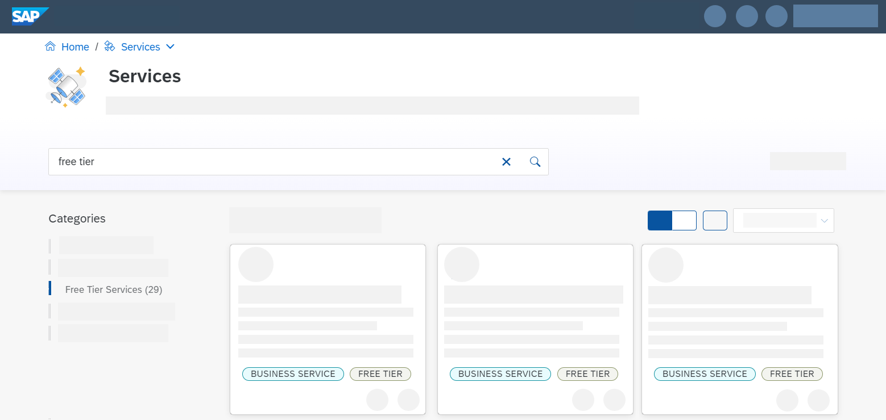

# Get an SAP BTP Account for Tutorials
<!-- description --> Learn which account model on SAP Business Technology Platform is best suited for your purposes so you can do the tutorials involving SAP BTP services and applications (trial or free tier).

## You will learn
  - How to decide which account model on SAP Business Technology Platform is suited for you

---

### Understanding Trial vs. Free Tier

There are a couple of ways to do SAP Business Technology Platform (BTP) tutorials and to try out SAP BTP services and applications:

- A **trial account** for SAP BTP essentially provides you (as an individual) an isolated account and subaccount, with pre-allocated service entitlements for a limited number of days.

- **Free tier** is not an account but a set of [entitlements](https://help.sap.com/viewer/65de2977205c403bbc107264b8eccf4b/Cloud/en-US/00aa2c23479d42568b18882b1ca90d79.html) within a [consumption-based] (https://help.sap.com/viewer/65de2977205c403bbc107264b8eccf4b/Cloud/en-US/7047eb4a15a84ac7be3c8612179e6d1f.html?q=consumption%20based) global account for activating certain services with the help of free service plans. So, say, you want to try out the SAP Launchpad tutorials, but in your company's existing  CPEA or Pay-as-you go global account, you can create a new subaccount, activate the SAP Launchpad service in this subaccount using the free plan, create a [service instance](https://help.sap.com/viewer/65de2977205c403bbc107264b8eccf4b/Cloud/en-US/d1d0fc8e78474494a59caad02259ec7e.html), and do the tutorials.

    If you activate free tier plans only, you can try out our platform for free, without your account being automatically deleted after some time. You can then easily upgrade to a paid plan without losing your data or work. Creating an instance using a paid plan or updating an instance to a paid service plan will incur costs, however.

    A plan limits the quantity of the service that's available.  Maybe you need a lot of some service in a production subaccount, and maybe you need less for development or testing.  When you assign an entitlement to a subaccount, you also select the plan for use in that subaccount as well.

    For more information, see:

    - [Trial Accounts and Free Tier](https://help.sap.com/viewer/65de2977205c403bbc107264b8eccf4b/Cloud/en-US/046f127f2a614438b616ccfc575fdb16.html?q=free%20tier) on SAP Help Portal,
    - the blog [Exploring BTP's New Free Tier Plans](https://blogs.sap.com/2021/07/01/exploring-btps-new-free-tier-plans) by [Riley Rainey](https://people.sap.com/riley.rainey),
    - posts and announcements on the [SAP BTP topic page](https://community.sap.com/topics/business-technology-platform) -- there's a quick link there to post your questions, too.

### Which to choose?

Some services are available to try out for free in both free tier and a trial account, some are available free only in trial, and some are only available with a paid license.

If you want to know which services currently offer which service plans, visit [SAP Discovery Center](https://discovery-center.cloud.sap/#/serviceCatalog?provider=all&regions=all&category=freetierservices) and explore our offerings. You find free tier service plans under **Free Tier Services**.

 <!-- border -->

>**IMPORTANT:** Free tier service plans are not designed for productive use. SAP provides no associated support with free tier services plans either.  If you think you have encountered a runtime issue with a plan, you can ask a question on the [SAP Community Q&A site](https://answers.sap.com/index.html) and tag the appropriate service as part of your question.  SAP product folks monitor these forums, so your request should get proper attention quickly.

### How to set up an account

Choose one of the following missions:

- **Free Tier:** If you want to explore SAP BTP without time limits, see [Get an SAP BTP Account for Tutorials](btp-cockpit-setup).

    Also, if your company already has an existing consumption-based SAP BTP global account, you can explore the free tier model there. In such accounts, free tier service plans will appear alongside paid service plans in the service marketplace.

    > You will want to consider isolating your tutorial work from normal development and production activity in that global account, and isolating yourself is fairly easy: create a new subaccount. Then add appropriate free service plan entitlements to that subaccount, enable the services, and execute the tutorials there.

    Depending on your company's administration policies, you might need to have an authorized BTP administrator perform those tasks for you. In any event, instructions for these tasks are described here:

    - [Manage Entitlements Using the Cockpit](btp-cockpit-entitlements)
    - [Create a Service Instance for SAP BTP](btp-cockpit-instances)

- **Trial:** If you do not have an account of any type yet and you want to try out services for a limited amount of time, follow the instructions in [Get a Free Account on SAP BTP Trial](hcp-create-trial-account).

---
