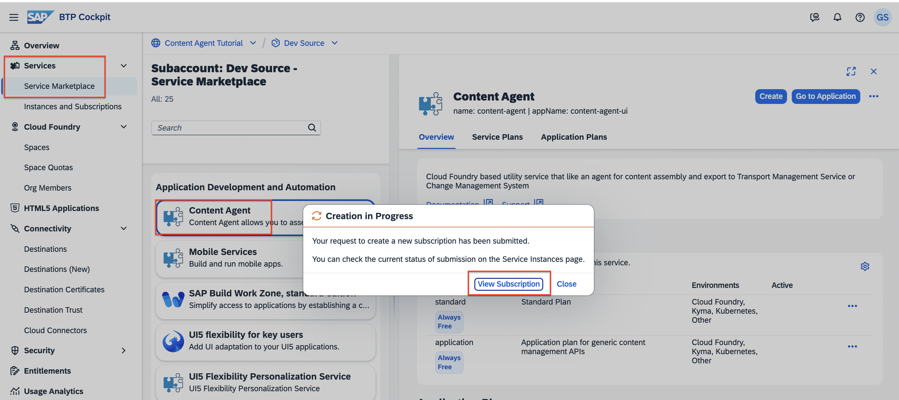

# Transport Mobile apps using SAP Content Agent Service
<!-- description --> Learn how to use SAP Content Agent UI to explore apps, select and transport to SAP Cloud Transport Management Service in an SAP BTP Trial account, or in an existing SAP BTP subaccount. 

## Prerequisites

 - If you do not have an SAP BTP account, follow the tutorial [Get an Account on SAP BTP Trial](hcp-create-trial-account).
 - If you are new SAP Mobile service, follow the tutorial [Create Your First MDK Application](https://developers.sap.com/mission.mobile-dev-kit-get-started.html)
 - You have configured MDK apps in the Mobile Services admin UI in the source account that you want to transport.
 - You have configured Cloud Transport Management service in a central subaccount, follow turtorial [Get Started with SAP Cloud Transport Management Service](https://developers-qa-blue.wcms-nonprod.c.eu-de-2.cloud.sap/tutorials/btp-transport-management-getting-started.html)

## You will learn
   - How to subscribe to SAP Content Agent service
   - How to set up role collections required for SAP Content Agent service
   - How to configure the destination targeted to SAP Cloud Transport Management by creating service instance and a service key 
   - How to configure the target node destination node to deploy service used in SAP Cloud Transport Management
   - How to create the transport request using export wizard in a SAP Content Agent service

## Intro

SAP Content Agent service acts as a local agent in SAP BTP account that helps to standardize content management operation for various BTP services.
For more information about SAP Content Agent Service, see the SAP Help Portal at [SAP Content Agent Service](https://help.sap.com/docs/content-agent-service).

### Open the SAP BTP cockpit

1. To access SAP BTP Cockpit of your enterprise account, choose [https://cockpit.btp.cloud.sap](https://cockpit.btp.cloud.sap).
   Depending on your own geo location, this URL will redirect you to the closest regional SAP BTP Cockpit URL.

2. In your global account, navigate to the subaccount in which you want to use to transport Mobile apps. You might also want to create a new subaccount for this tutorial, if you have the necessary authorizations.

     <!-- border -->! [global-Subaccount](screenshots/global-account.png)

---

### Subscribe to SAP Content Agent service

To enable the usage of the user interface of SAP Content Agent service, subscribe to the free plan.

[OPTION BEGIN [Trial Account]]

1. In your subaccount, go to **Services > Service Marketplace**.

2. Use the *Search* field to filter for *content agent*.

3. The *SAP Content Agent* tile is displayed.    

    <!-- border -->! 

4. Select the three dots (...) on the tile, and choose **Create**.

    

5. On the **New Instance or Subscription** dialog, from the **Plan** dropdown box, select **free** and choose **Create**.

    

6. The subscription is in progress. Choose **View Subscription**.

    

7. You've subscribed to the application. 

    

> See also on SAP Help Portal: [Initial Setup](https://help.sap.com/docs/content-agent-service/user-guide/subscribe-to-content-agent-service)

---

### Set Up Role Collections

After successful subscription, you need to configure user access to the application.  You can create role collections and assign roles to the role collections based on the application templates. Afterwards, you assign the role collections to users or user groups. 

1.  To use the delivered role collections, choose **Security > Role Collections** from the navigation on the left. Filter for role collections called *content agent*. The role collections are displayed. 

    

2. To assign users to the desired role collection, choose **Content Agent Admin**, from the list. In the details of the role collection, choose **Edit**.

    

3. You can add individual users or user groups to the role collection. In the tutorial, add an individual user. To do this, select the identity provider (here: **Default identity provider**). In the ID field, enter an existing e-mail address and choose `Enter`. The **E-Mail** field is automatically filled with the selected e-mail address. Save your changes.

    

Repeat the steps, if you want to add users other role collections for other tasks, such as the **Content Agent Import Operator** for import tasks. 

See also on SAP Help Portal: [Setting Up Role Collections](https://help.sap.com/docs/content-agent-service/user-guide/assign-user-roles-and-permissions?locale=en-US)

---

### Verify access to Content Agent service

You should now be able to access the user interface of SAP Content Agent service. 

1. To check this, in your subaccount, choose **Services > Instances and Subscriptions**. In the **Subscriptions** section, choose the **Content Agent** link or the *Go to Application* icon to the right of it.

    

2. In a new tab, you should now see the **Overview** page of your SAP Content Agent service. Currently, the Activities Performed tile is empty as expected from a new instance. 	

    

2. Navigate to *Content Types* tile and check the status of *SAP Mobile Services*. 

    This concludes the tutorial. Congratulations!
