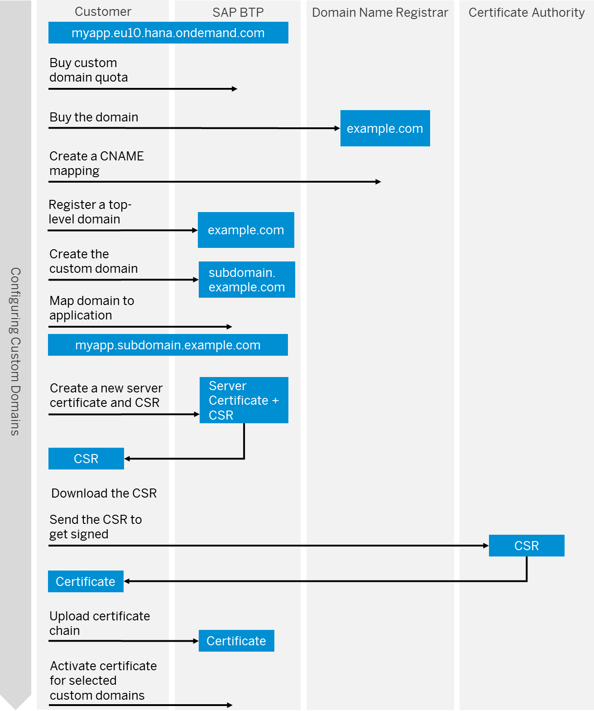
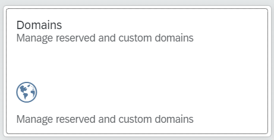
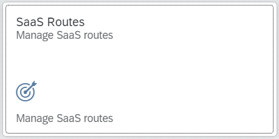
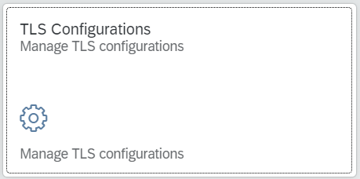
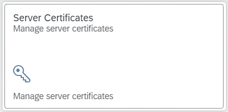

# Get Started with the Custom Domain Manager
<!-- description --> Use the Custom Domain Manager to create and manage custom domains in the SAP BTP, Cloud Foundry environment.

## Prerequisites
- You have [Entitled the Custom Domain Manager to your subaccount](btp-cockpit-entitlements). Follow the instructions to make sure that the **Custom Domain Manager** is entitled to your subaccount.
- You have subscribed to the **Custom Domain Manager** by using the SAP BTP cockpit. See [Initial Setup](https://help.sap.com/viewer/6f35a23466ee4df0b19085c9c52f9c29/Cloud/en-US/1deab96e7aec447fbf8b683ba91a42e0.html).
- You have acquired the domain names to be used by your applications. Have a look at the [Prerequisites](https://help.sap.com/viewer/6f35a23466ee4df0b19085c9c52f9c29/Cloud/en-US/b791984a063a48169b9e0b9af802f67e.html).

## You will learn
- What is the Custom Domain Manager
- How to configure custom domains
- Where to find documentation

---

### What is the Custom Domain Manager?

The SAP Custom Domain service lets you configure your own custom domain to publicly expose your application, instead of using the default subdomain. You can use the Custom Domain Manager to create and manage custom domains in the SAP BTP, Cloud Foundry environment.

In addition to the mentioned prerequisites, to manage private domains within your Cloud Foundry organization, you need to have the necessary authorizations.

Ensure that you have the `CustomDomainAdmin` or `CustomDomainViewer` roles to manage or view your custom domains, respectively.

Learn more about roles and permissions in the [Cloud Foundry environment documentation](https://docs.cloudfoundry.org/concepts/roles.html#roles).

### Obtain custom domain certificate

To make sure that your domain is trusted by way of activated server certificates and that all application data is protected, you must set up secure TLS/SSL communication. Then, make your application reachable via your custom domain and route traffic to it.

The following graphic illustrates the process of obtaining a custom domain certificate.

### Manage reserved and custom domains

To make your applications reachable and secure under your own domain, use the Custom Domain Manager to create and manage your reserved and custom domains. A reserved domain is a domain name that you can reserve inside a number of Cloud Foundry landscapes.

1. Log on to the Custom Domain Manager by entering your credentials.

2. Choose the **Domains** tile.

    

3. Choose **Add Reserved Domain** to add a domain name that you want to reserve for this and associated extension landscapes.

4. Enter the domain name and choose **Add**. It is now displayed in the list of **Reserved Domains**.

5. Switch to the **Custom Domains** tab.

    - If you're a PaaS customer with your own Cloud Foundry organization, choose **Create Custom Domain** and select **for your Subaccount's CF Organization**. The wizard first displays the landscape or region corresponding to your Cloud Foundry organization.

        - Choose **Next Step**.

        - Select the desired domain from the list of reserved domains and choose **Next Step**.

        - Enter a subdomain name to be created as your custom domain and choose **Finish**. Alternatively, leave the text field empty to use your own reserved domain as the custom domain.

    - If you're a SaaS customer who subscribes to a `Saas` application, choose **Create Custom Domain** and select **for your Subaccount's SaaS Subscription**. The wizard first displays your subscribed applications, in their corresponding landscapes.

        - Select the desired SaaS application and choose **Next Step**.

        - Select the desired domain from the list of reserved domains and choose **Next Step**.

        - Enter a subdomain name and choose **Finish**. Alternatively, leave the text field empty to use your own reserved domain as the custom domain.

The custom domains are created and displayed in a list, along with their corresponding landscape and status.

### Manage SaaS routes

The next step is to select your existing SaaS subscriptions and create custom routes for them, in addition to their standard routes.

Make sure that you've already set up TLS/SSL server authentication.

- For PaaS: Create and deploy an application within the Cloud Foundry environment. For more information on deploying an app, see [Deploy Business Applications in the Cloud Foundry Environment](https://help.sap.com/viewer/65de2977205c403bbc107264b8eccf4b/Cloud/en-US/4946ea5421374924963ce8575a5f3d05.html).

- For SaaS: Subscribe to a SaaS application and write down the default URL of the SaaS application.

Also, note the following:

- Be an administrator in your global account.

- Be an administrator in the subaccount that has subscribed to the SaaS application.

- Be a security administrator in the subaccount that has subscribed to the SaaS application.

- Only for the Cloud Foundry environment: Be a space developer in the subaccount that has subscribed to the SaaS application.

Now, you can map the application to your custom domain.

1. Choose the **SaaS Routes** tile.

    

2. Choose **Create Custom Route** to map a route to your application.

3. Select the SaaS subscription for which you want to map a route and choose **Next Step**.

    - For PaaS users who have created and deployed their application within the Cloud Foundry environment, the subscription will be in the list of subscribed applications.

    - If you want to manually enter a standard route because for example, you have multiple subaccounts in the landscape, select the **Select to enter a standard route if your subscribed application is not listed** check box.

4. Select the desired custom domain from the list and choose **Next Step**.

5. If required, set a hostname and choose **Finish**. This field can be left empty too.

The custom routes are created and displayed in a list.

### Manage TLS configurations

Now, create new TLS configurations that can be used for one or multiple server certificate activations.

1. Choose the **TLS Configurations** tile.

    

2. Choose **Add** to use the wizard to create each required configuration.

3. Enter a name and choose **Next Step**.

    The Client Authentication (`mTLS`) mode is displayed as disabled by default. Therefore, a user name and password are required for authentication.

4. Choose **Next Step**.

5. The summary information displays the entered configuration name and the status of the `mTLS` mode again. Choose **Finish** to exit the wizard and manage the created configuration.

6. Switch to the **Trust List** tab and choose **Add Trust List** to upload your list of trusted certificates and assign it to your custom domains.

    On adding the trust list, client authentication is enabled.

7. Copy your trusted certificates list into the **`Add PEM`** text box and choose **Submit**.

    The list of trusted certificates added are displayed and as long as they aren't in use yet, can be viewed again or deleted by using the **Show** or **Delete** icons, respectively. Certificates that are in use can only be viewed, not deleted.

### Manage server certificates

Create a new server certificate and a certificate signing request (CSR) to obtain a certificate for your custom domains from a trusted certificate authority (CA).

1. Choose the **Server Certificates** tile.

    

    - If you're a PaaS user, choose **Create** and select **for your (wildcard) Custom Domains**. The wizard first displays the **General Information** section.

        - Enter the desired alias and key size and choose **Next**.

        - Set the Subject Alternative Names (SANs) that you want to add to the CSR and choose **Next**.

        - In the **Set Subject** section, you can enter other additional information. Only the Common Name (CN) parameter is required; the other parameters are optional.

        - Choose **Finish**.

    - If you're a SaaS user, choose **Create** and select **for your Custom Domain SaaS Routes**. The wizard first displays the **General Information** section.

        - Enter the desired alias and key size and choose **Next**.

        - Select the desired SaaS application that you want to add to the CSR and choose **Next**.

        - In the **Set Subject** section, you can enter other additional information. Only the Common Name (CN) parameter is required; the other parameters are optional, as in the case of PaaS users.

        - Choose **Finish**.

2. Select the server certificate that you created to expand the details section. To order and install your new server certificate, you have to first create the certificate signing request. You have to send this file to a trusted certificate authority of your choice to get it signed.

3. Choose **Get Certificate Signing Request** to copy the content and create the `.pem` file. You can also paste the content into a web page of your CA, if available.

4. On receiving the new server certificate and full certificate chain (including the root CA), choose **Upload Full Certificate Chain** to upload them.

    - In the Add **Certificate** section, insert the certificate chain into the text field and choose **Next**.

    - Check the certificate and choose **Next**.

    - Confirm that the certificate is correct and click **Finish**.

5. Finally, you have to activate your new server certificate.

    This activation has to be done for one or more of the certificate's SANs and the TLS configuration of your choice. The activation can be modified or removed at any time and will take a few minutes until it is effective in the landscape load balancer. Any corresponding SaaS routes are also automatically activated.

    - In the detail pane, choose **Activate**.

    - Select the SANs you want to activate and choose **Next**.

    - Select the desired certificate and status and choose **Next**.

    - Confirm the TLS configuration and choose **Finish**.

The list of server certificates created are displayed and as long as they are active, cannot be deleted. Inactive certificates can be deleted by using the **Delete** button.

### Test the custom domain

To test your custom domain and make sure it's reachable and secured by a certificate, open your application under its custom domain in a browser.

The address has the following scheme: `https://<Application Hostname>.<Custom Domain>`

### Certificate lifecycle management

To make sure that a secure connection to your applications is maintained, use a certificate lifecycle management tool to monitor your certificates. You won't receive a warning from SAP BTP or the Custom Domain service if one of your certificates is about to expire.

For more information, refer to the [Custom Domain Manager documentation.](https://help.sap.com/viewer/6f35a23466ee4df0b19085c9c52f9c29/Cloud/en-US/4f4c3ff62fd2413089dce8a973620167.html)

