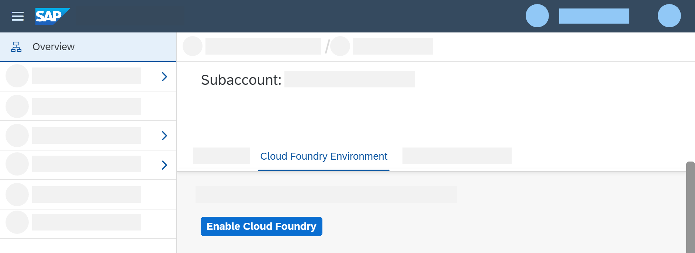

# Get an Account on SAP BTP to Try Out Free Tier Service Plans
<!-- description --> Sign up for a productive account on SAP Business Technology Platform and try out SAP's services with free tier service plans.

## Prerequisites
This tutorial helps you to sign an **enterprise account** with SAP that includes services with free service plans. If you are acting as an individual and just want to learn and explore SAP Business Technology Platform, start your journey by creating a [SAP BTP trial account](https://www.sap.com/registration/trial.908cb719-0e03-421c-a091-daca045f0acc.html), which allows you to try out SAP BTP services in a separate environment. Note that the trial landscape offers different service plans than the free tier model for SAP TP, see: [Get an SAP BTP Account for Tutorials](btp-cockpit-setup). To see which services are currently available in trial, go to [SAP Discovery Center](https://discovery-center.cloud.sap), select the service you are interested in and explore our offerings under **Pricing** and **Trial**.

## How does free tier work?
The global account you will create in this tutorial gives you access to a productive environment with both free and paid plans. If you activate **free tier** plans only, you can try out our platform for free, without time limits. You can then easily upgrade to a paid plan without losing your data or work. Creating an instance using a paid plan will incur costs, however. For more information, see [Enterprise Accounts](https://help.sap.com/products/BTP/65de2977205c403bbc107264b8eccf4b/171511cc425c4e079d0684936486eee6.html?locale=en-US&version=Cloud) and [Using Free Service Plans](https://help.sap.com/products/BTP/65de2977205c403bbc107264b8eccf4b/524e1081d8dc4b0f9d055a6bec383ec3.html?locale=en-US&version=Cloud).

## You will learn
  - How to start your SAP journey
  - How to sign up for the most convenient BTP plan
  

## Intro
  If you want to know which services currently offer free tier service plans, visit the [SAP Discovery Center](https://discovery-center.cloud.sap/#/serviceCatalog?provider=all&regions=all&category=freetierservices) and explore our offerings under **Free Tier Services**.

  <!-- border -->

  If you're interested in further information about Free Tier, or if you want to exchange information with other users, explore the [BTP Community Topic page](https://community.sap.com/topics/business-technology-platform).

---

### Visit SAP.com 

Start your SAP BTP journey on the "Try and Buy" page on SAP.com and choose the option that works best for you. 

1. Visit the ["Try and Buy"](https://www.sap.com/products/technology-platform/pricing.html#pricing-options) page on SAP.com.

2. Explore the pricing options.

3. Choose the most convenient plan: Either **Sign Up for Pay-As-You-Go for SAP Business Technology Platform** or **Buy Cloud Platform Enterprise Agreement**. 

### Log On In SAP Store 

**For existing users**: If you already have an SAP account (for example, a P, S, C, D or I number or an SAP Universal ID), you can enter your account details or the associated e-mail address along with your password. Choose **Continue**. 

**For new users**: Choose **Register** and fill in the required fields, set a password, and activate your account. You will receive an e-mail asking you to activate your account.

### Add details

If you've created a new account, you are now asked to add details.

> If there is already a company or organization associated with your account, you will be forwarded directly to Step 4.

1. Select **Select a Company/Organization** to create a global account on SAP BTP with free tier service plans.

    <!-- border -->

2. Next, fill out the address form and provide the following details: **Country**, **Company/Organization Name**, **Address**, **City**, **State**, and **Postal Code** as well as **Industry**. This information is necessary for billing purposes for when you upgrade your account from free tier service plans to paid service plans. Confirm with **Continue**.

### Configure solution

The following page offers to configure your solution. Select:

- **Duration**: 3 Months (default)
- **Start Date**: Now (you can configure the start date if required). The account renews itself automatically. You will also see the end date.
- **Initial Cost**: EUR 0.00

  <!-- border -->

Proceed by selecting **Check Out**.

### Add payment details

Carefully review your contact details. Then, you are now asked to enter your payment details. Your free tier service plans are for free. However, we need this information for authentication purposes and for billing if you decide to use standard service plans.

Proceed by selecting **Continue to Checkout Review**.

> After you have signed up for an account, your credit card balance might show a reservation (for example, 1€ or 1$, depending on your currency) from SAP. However, this reservation will disappear after a couple of days and you won't be charged for creating an account.

### Check order details

You can now review your order details. If you are happy with the result, proceed by clicking **Place Order**.

If your registration was successful, your screen will show you a success message "Thank You for Your Order." Also, an order summary will be sent to the e-mail address you supplied during the registration process.

> Your account is now being set up in the background. In times of high traffic, this process can take up to 2 hours. Thank you for your patience.

### Welcome to SAP BTP

Your order is now being processed in the background. You are ready to go, after you have received the following 3 e-mails:

- **Welcome to SAP BTP**: This e-mail welcomes you to SAP BTP, informing you that the provisioning of your account is currently under way.

- **Access Information**: This e-mail summarizes your provided contact details and informs you that the set-up of your system has been completed.

- **Your Personal Key**: This e-mail provides you with your S-user which you've been assigned. Click the link in the e-mail to activate your account, set a password, and enter your global account.

> **If you have not received all your e-mails, check your spam folder.**

Once you've set up your account, use your S-user to log in to [SAP For Me](https://me.sap.com/) to see your contract and consumption information.

### Create a subaccount

You are now in your global account, to be more precise in your **Account Explorer**. To access the free tier service plans, you first need to create a subaccount in your global account.

1. Select **Create** in the upper right corner.

2. Choose **Subaccount**.

    <!-- border -->

3. A window opens. In the wizard, fill out the following information for your subaccount:

    - **Display Name**: Choose a meaningful and unique name to identify your subaccount.
    > Consider naming your subaccount *'Free'*. This way, you'll know exactly which services are free to use.

    - **Subdomain**: Added automatically. The subdomain will become part of the URL for accessing applications that you subscribe to from this subaccount. The subdomain can contain only letters, digits, and hyphens (not allowed at the beginning or at the end), and must be unique across all subaccounts in the same region.
    - **Region**: Select the region closest to you. You can use the service catalogue in [SAP Discovery Center](https://discovery-center.cloud.sap/viewServices) to see which services with free tier service plans are available in each region.
    > **Caution:** Unfortunately, Cloud Foundry Runtime is currently not available for cf-eu10 (Europe Frankfurt, Amazon Web Services).

    - **Description** (optional): Add an additional description to identify your subaccount.

4. Select **Create**.
> The creation of your subaccount might take a couple of moments. Wait until the orange loading board "Onboarding" has disappeared.

### Assign entitlements for Cloud Foundry environment

In your global account, you now need to assign entitlements before you can enable Cloud Foundry

1. In your global account, navigate to **Entitlements** > **Entity Assignments.**
2. In the **Select Entities** selection, choose the directory or subaccount that you want to assign entitlements to.
3. Click **Go**. You'll see a table for the directory/ subaccount with all entitlements it already has.
4. Click **Configure Entitlements**, then select **Add Service Plans**. A popover appears with all entitlements available for your directory/ subaccount.
5. Select the service and then the plan you want to entitle. In the search, type in **Cloud Foundry Runtime**.
6. Select the plan called **Free** here to use the service without any costs.
7. Click **Add Service Plans** to exit the popover.
8. Click **Save**.

### Enable Cloud Foundry environment

You now need to activate Cloud Foundry environment.

1. Go back to your subaccount by clicking on **Subaccount** in the navigation bar.

2. Select **Cloud Foundry Environment**.

3. Click on **Enable Cloud Foundry**.

    <!-- border -->

4. In the opening wizard, select **free** as plan - any other configuration will generate costs. Keep the rest of settings as they are and proceed by clicking **Create**.

    <!-- border -->

> Enabling Cloud Foundry environment might take a couple of moments. Thank you for patience.

### Create a space

As a last step, you now need to create a space to develop in.

1. In your subaccount, stay with **Overview** > **Cloud Foundry Environment**.

2. Select **Create Space**.

    <!-- border -->

3. In the opening wizard, enter a meaningful name for your space. The other fields are pre-populated.

4. Select **Create**.

You will receive a success message "Space created successfully."

**Congratulations! You have successfully set up your global account. Continue with [Manage Entitlements Using the Cockpit](btp-cockpit-entitlements) and learn how to add entitlements to your newly created subaccount.**

---
